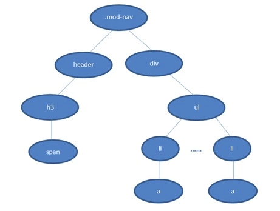

# 面试宝典

## 基础知识

### 前端基础

#### 对象

##### 对象使用和属性

`JavaScript`中所有的变量都可以当作对象使用，除了两个例外`null`和`undefined`

```javascript
false.toString(); // 'false'
[1,2,3].toString(); // '1,2,3'
function Foo(){};
Foo.bar = 1;
Foo.bar; // 1
```

点操作符解析为浮点数字面值的一部分。

```javascript
2.toString(); // 出错：SyntaxError
```

有很多变通方法可以让数字的字面值看起来像对象

```javascript
(2).toString(); // 可以被正常解析
```

###### 对象作为数据类型

`JavaScript`的对象可以作为[哈希表](http://en.wikipedia.org/wiki/Hashmap)使用，主要用来保存命名的键与值得对象关系。

`{}`-可以创建一个简单对象。这个新创建的对象从`Object.prototype`[继承](http://bonsaiden.github.io/JavaScript-Garden/zh/#object.prototype)下面，没有任何[自定义属性](http://bonsaiden.github.io/JavaScript-Garden/zh/#object.hasownproperty)

    var foo = {}; // 一个空对象
    
    // 一个新对象，拥有一个值为12的自定义属性'test'
    var bar = {test: 12};
111

###### 访问属性

有两种方式来访问对象的属性，点操作符或者中括号操作符。

```js
    var foo = {name: 'kitten'}
    foo.name; // kitten
    foo['name']; // kitten

    var get = 'name';
    foo[get]; // kitten

    foo.1234; // SyntaxError
    foo['1234']; // works
```

两种语法是等价的，但是中括号操作符在下面两种情况下依然有效

- 动态设置属性
- 译者注：比如属性名中包含空格，或者属性名是JS的关键词

译者注：在  [JSLint](http://www.jslint.com/) 语法检测工具中，点操作符是推荐做法。

###### 删除属性

`delete`操作符；设置属性为`undefined`或者`null`并不能正在的删除属性，而仅仅是移除了属性和值的关联。

```javascript
var obj = {
  bar: 1,
  foo: 2,
  baz: 3,
};
obj.bar = undefined;
obj.foo = null;
delete obj.baz;

for (var i in obj) {
  if (obj.hasOwnProperty(i)) {
    console.log(i, "" + obj[i]);
  }
}
```

输出为：`bar undefined` 和  `foo null` 

##### 原型

`prototype`

虽然这经常被当作是`JavaScript`的缺点被提及，其实基于原型的继承模型比传统的类继承还要强大。 实现传统的类继承模型是很简单，但是实现 JavaScript 中的原型继承则要困难的多。 (It is for example fairly trivial to build a classic model on top of it, while the other way around is a far more difficult task.)

由于`JavaScript`是唯一一个被广泛使用的基于原型继承的语言，所以理解两种继承模式的差异是需要一定时间的。

原型链的继承方式

注意：简单的使用`Bar.prototype = Foo.prototype`将会导致两个对象共享相同的原型。因此，改变任意一个对象的原型都会影响到另一个对象的原型，在大多数情况下这不是希望的结果。

```javascript
function Foo() {
  this.value = 42
}

Foo.prototype = {
  method: function () {},
}

function Bar() {}

// 设置Bar的prototype属性为Foo的实例对象, 这样bar就能继承Foo,但是如果编辑Bar的原型也不会影响到Foo的原型对象
Bar.prototype = new Foo()
const barObj = new Bar()

console.log(barObj.value)
console.log(barObj.method)
```

```
// 原型链
test [Bar的实例]
    Bar.prototype [Foo的实例]
        { foo: 'Hello World' }
        Foo.prototype
            {method: ...};
            Object.prototype
                {toString: ... /* etc. */};
```

test` 对象从  `Bar.prototype` 和  `Foo.prototype` 继承下来；因此， 它能访问  `Foo` 的原型方法  `method`。同时，它也能够访问那个定义在原型上的  `Foo` 实例属性  `value`。 需要注意的是  `new Bar()` 不会创造出一个新的  `Foo` 实例，而是 重复使用它原型上的那个实例；因此，所有的  `Bar` 实例都会共享相同的  `value`注意: 不要使用`Bar.prototype = Foo`，因为这不会执行  `Foo` 的原型，而是指向函数  `Foo`。 因此原型链将会回溯到`Function.prototype` 而不是`Foo.prototype`，因此`method

###### 属性查找

向上遍历原型链，直到找到给定名称的属性为止。

`Object.prototype`但是依然没有找到指定的属性，就会返回`undefined`

###### 原型属性

任何类型的值赋给它（prototype）。 然而将原子类型赋给 prototype 的操作将会被忽略。

```javascript
function Foo() {}
Foo.prototype = 1; // 无效
```

而将对象赋值给 prototype，正如上面的例子所示，将会动态的创建原型链。

###### 性能

如果一个属性在原型链的上端，则对于查找时间带来不利影响。特别的，试图获取一个不存在的属性将会遍历整个原型链。

并且，当使用[for in](http://bonsaiden.github.io/JavaScript-Garden/zh/#object.forinloop)循环遍历对象的属性时，原型链上的所有属性都将被访问。

###### 扩展内置类型的原型

`Object.prototype`

这种技术被称之为[monkey patching](http://en.wikipedia.org/wiki/Monkey_patch)并且会破环封装。虽然它被广泛的应用到一些JavaScript类库比如[Prototype](http://prototypejs.org/)，但是仍然不认为为内置类型添加一些非标准的函数是个好主意。

唯一理由是为了和新的 JavaScript 保持一致，比如  [Array.forEach](https://developer.mozilla.org/en/JavaScript/Reference/Global_Objects/Array/forEach)。

译者注：这是编程领域常用的一种方式，称之为  [Backport](http://en.wikipedia.org/wiki/Backport)，也就是将新的补丁添加到老版本中。

###### [总结](https://www.mianshibook.com/cat/basic/review.html#总结)

必修的功课。 要提防原型链过长带来的性能问题，并知道如何通过缩短原型链来提高性能。 更进一步，绝对不要扩展内置类型的原型，除非是为了和新的 JavaScript 引擎兼容。

##### hasOwnProperty

自定义属性而不是  [原型链](http://bonsaiden.github.io/JavaScript-Garden/zh/#object.prototype)上的属性， 我们需要使用继承自  `Object.prototype` 的  `hasOwnProperty`注意: 通过判断一个属性是否`undefined` 是不够的。 因为一个属性可能确实存在，只不过它的值被设置为`undefined`。`hasOwnProperty` 是 JavaScript 中唯一一个处理属性但是不查找原型链的函数。

```javascript
// 修改Object.prototype
Object.prototype.bar = 1;
var foo = { goo: undefined };

foo.bar; // 1
"bar" in foo; // true

foo.hasOwnProperty("bar"); // false
foo.hasOwnProperty("goo"); // true
```

`hasOwnProperty` 可以给出正确和期望的结果，这在遍历对象的属性时会很有用。 没有其它方法可以用来排除原型链上的属性，而不是定义在对象自身上的属性。

###### hasOwnProperty

不会保护  `hasOwnProperty` 被非法占用，因此如果一个对象碰巧存在这个属性， 就需要使用外部的  `hasOwnProperty`

```javascript
var foo = {
  hasOwnProperty: function () {
    return false;
  },
  bar: "Here be dragons",
};

foo.hasOwnProperty("bar"); // 总是返回 false

// 使用其它对象的 hasOwnProperty，并将其上下文设置为foo
({}).hasOwnProperty.call(foo, "bar"); // true
```

###### [结论](https://www.mianshibook.com/cat/basic/review.html#结论)

`hasOwnProperty` 是唯一可用的方法。 同时在使用  `[for in](http://bonsaiden.github.io/JavaScript-Garden/zh/#object.forinloop)` 遍历对象时，推荐总是使用  `hasOwnProperty` 方法， 这将会避免  [原型](http://bonsaiden.github.io/JavaScript-Garden/zh/#object.prototype)对象扩展带来的干扰。

##### for in

`in`操作符一样，`for in`注意：`for in`循环不会遍历那些`enumerable`设置为`false`的属性；比如数组的`length`

```javascript
// 修改 Object.prototype
Object.prototype.bar = 1;

var foo = { moo: 2 };
for (var i in foo) {
  console.log(i); // 输出两个属性：bar 和 moo
}
```

`for in` 自身的行为，因此有必要过滤出那些不希望出现在循环体中的属性， 这可以通过  `Object.prototype` 原型上的  [hasOwnProperty](http://bonsaiden.github.io/JavaScript-Garden/zh/#object.hasownproperty) 函数来完成。

###### 总结

总是使用  `hasOwnProperty`。不要对代码运行的环境做任何假设，不要假设原生对象是否已经被扩展了

#### 函数

##### 函数声明与表达式

匿名函数作为回调函数传递到异步函数中。

###### 函数声明

```javascript
function foo() {}
```

上面的方法会在执行前被  [解析(hoisted)](http://bonsaiden.github.io/JavaScript-Garden/zh/#function.scopes)，因此它存在于当前上下文的任意一个地方， 即使在函数定义体的上面被调用也是对的。

```javascript
foo(); // 正常运行，因为foo在代码运行前已经被创建
function foo() {}
```

###### 函数赋值表达式

```javascript
var foo = function () {};
```

匿名的函数复制给变量

```javascript
foo; // 'undefined'
foo(); // 出错：TypeError
var foo = function () {};
```

`var` 定义了一个声明语句，对变量  `foo` 的解析是在代码运行之前，因此`foo``foo` 的值缺省为  [undefined](http://bonsaiden.github.io/JavaScript-Garden/zh/#core.undefined)。

###### 命名函数的赋值表达式

另外一个特殊的情况是将命名函数赋值给一个变量。

```javascript
var foo = function bar() {
  bar(); // 正常运行
};
bar(); // 出错：ReferenceError
```

bar` 函数声明外是不可见的，这是因为我们已经把函数赋值给了  `foo`； 然而在  `bar` 内部依然可见。这是由于 JavaScript 的  [命名处理](http://bonsaiden.github.io/JavaScript-Garden/zh/#function.scopes) 所致， 函数名在函数内总是可见的。注意:在 IE8 及 IE8 以下版本浏览器 bar 在外部也是可见的，是因为浏览器对命名函数赋值表达式进行了错误的解析， 解析成两个函数  `foo` 和  `bar

##### argument

转化为数组

- 方法一：慢，性能不好

  ```javascript
  Array.prototype.slice.call(arguments);
  ```

- 方法二

  ```javascript
  Array.from(arguments);
  ```

  

```javascript
function Foo() {}

Foo.prototype.method = function (a, b, c) {
  console.log(this, a, b, c);
};

// 创建一个解绑定的 "method"
// 输入参数为: this, arg1, arg2...argN
Foo.method = function () {
  // 结果: Foo.prototype.method.call(this, arg1, arg2... argN)
  Function.call.apply(Foo.prototype.method, arguments);
  // 相当于：Foo.prototype.method.call(arg[0], otherArg)
  // apply把call的this指向了第一个参数，然后再掺入剩余的参数调用call
};
```

##### 构造函数

关键字`new`的流程

```javascript
// 手写new关键词，传入一个函数和函数需要的参数
function myNew(Fn, ...args){
  // 第一步，创建一个新对象
  const obj = {}
  // 第二部指定原型
  obj.__proto__ = Fn.prototype
  // 修改this
  const res = Fn.apply(obj, args)
  // 判断构造函数的返回值
  if(res instanceof Object) return res
  return obj
}
```

**注意：**

```javascript
function Bar() {
  return new Number(2);
}
new Bar().constructor === Number;
```

##### 作用域与命名空间

函数作用域

```javascript
function test() {
  // 一个作用域
  for (var i = 0; i < 10; i++) {
    // 不是一个作用域
    // count
  }
  console.log(i); // 10
}
```

变量声明提升

```javascript
bar();
var bar = function () {};
var someValue = 42;

test();
function test(data) {
  if (false) {
    goo = 1;
  } else {
    var goo = 2;
  }
  for (var i = 0; i < 100; i++) {
    var e = data[i];
  }
}
```

`var`表达式和`function`声明提升到当前作用域的顶部。

```javascript
// var 表达式被移动到这里
var bar, someValue; // 缺省值是 'undefined'

// 函数声明也会提升
function test(data) {
  var goo, i, e; // 没有块级作用域，这些变量被移动到函数顶部
  if (false) {
    goo = 1;
  } else {
    goo = 2;
  }
  for (i = 0; i < 100; i++) {
    e = data[i];
  }
}

bar(); // 出错：TypeError，因为 bar 依然是 'undefined'
someValue = 42; // 赋值语句不会被提升规则（hoisting）影响
bar = function () {};

test();
```

`var`表达式被从循环内移到外部，而且使一些`if`表达式更难得看懂。`if`表达式看起来修改了全局变量`goo`，实际上在提示规则被应用后，却是在修改局部变量。`ReferenceE rror`。

```javascript
// 检查 SomeImportantThing 是否已经被初始化
if (!SomeImportantThing) {
  var SomeImportantThing = {};
}
```

`var`表达式会被提升到全局作用域的顶部。

```javascript
var SomeImportantThing;

// 其它一些代码，可能会初始化 SomeImportantThing，也可能不会

// 检查是否已经被初始化
if (!SomeImportantThing) {
  SomeImpor tantThing = {};
}
```

译者注：在 Nettuts+ 网站有一篇介绍 hoisting 的  [文章](http://net.tutsplus.com/tutorials/javascript-ajax/quick-tip-javascript-hoisting-explained/)，其中的代码很有启发性。

```javascript
// 译者注：来自 Nettuts+ 的一段代码，生动的阐述了 JavaScript 中变量声明提升规则
var myvar = "my value";

(function () {
  alert(myvar); // undefined
  var myvar = "local value";
})();
```

**名称解析顺序**

全局作用域，都有一个特别的名称  [this](http://bonsaiden.github.io/JavaScript-Garden/zh/#function.this)  指向当前对象。 函数作用域内也有默认的变量  [arguments](http://bonsaiden.github.io/JavaScript-Garden/zh/#function.arguments)，其中包含了传递到函数中的参数。`foo var foo foo foo`

注意: 自定义  `arguments` 参数将会阻止原生的  `arguments`对象的创建。

匿名包装器

js

```
(function () {
  // 函数创建一个命名空间

  window.foo = function () {
    // 对外公开的函数，创建了闭包
  };
})(); // 立即执行此匿名函数
```

匿名函数被认为是  [表达式](http://bonsaiden.github.io/JavaScript-Garden/zh/#function)；因此为了可调用性，它们首先会被执行。

js

```
// 小括号内的函数首先被执行
(function () {})(); // 并且返回函数对象 // 调用上面的执行结果，也就是函数对象
```

有一些其他的调用函数表达式的方法，比如下面的两种方式语法不同，但是效果一模一样。

js

```
// 另外两种方式
+(function () {})();
(function () {})();
```

###### 结论

匿名包装器（译者注：也就是自执行的匿名函数）来创建命名空间。这样不仅可以防止命名冲突， 而且有利于程序的模块化。

不好的习惯。这样的代码容易产生错误并且维护成本较高。

#### 数组

##### 数组遍历与属性

虽然在JavaScript中数组是对象，但是没有好的理由去使用`for in`遍历数组。相反，有一些好的理由不去使用`for in`遍历数组

由于 for in 循环会枚举原型链上的所有属性，唯一过滤这些属性的方式是使用 hasOwnProperty 函数， 因此会比普通的 for 循环慢上好多倍。

注意: JavaScript 中数组不是关联数组。 JavaScript 中只有  [对象](http://bonsaiden.github.io/JavaScript-Garden/zh/#object.general) 来管理键值的对应关系。但是关联数组是保持顺序的，而对象不是。

`for in` 循环会枚举原型链上的所有属性，唯一过滤这些属性的方式是使用  `hasOwnProperty` 函数。

遍历

为了达到遍历数组的最佳性能，推荐使用经典的 for 循环。

```javascript
var list = [1, 2, 3, 4, 5, ...... 100000000];
for(var i = 0, l = list.length; i < l; i++) {
    console.log(list[i]);
}
```

上面代码有一个处理，就是通过 l = list.length 来缓存数组的长度。

虽然 length 是数组的一个属性，但是在每次循环中访问它还是有性能开销。 可能最新的 JavaScript 引擎在这点上做了优化，但是我们没法保证自己的代码是否运行在这些最近的引擎之上。

实际上，不使用缓存数组长度的方式比缓存版本要慢很多。

```javascript
const length = 110000000
const arr = new Array(length)

// 生成数组
console.time('生成数组')
for (let i = 0; i < length; i++) {
  arr[i] = i + 1
}
// console.log(arr) // 输出从 1 到 100000000 的数组
console.timeEnd('生成数组')

// for遍历数据
console.time('for遍历数组')
for (var i = 0, l = length; i < l; i++) {}
console.timeEnd('for遍历数组') // for遍历数组: 196.135986328125 ms

// forEach遍历数组
console.time('forEach遍历数组')
arr.forEach(element => {})
console.timeEnd('forEach遍历数组') // forEach遍历数组: 893.3720703125 ms

```

`length` 属性的  getter 方式会简单的返回数组的长度，而  setter 方式会截断数组。

```javascript
var foo = [1, 2, 3, 4, 5, 6];
foo.length = 3;
foo; // [1, 2, 3]

foo.length = 6;
foo; // [1, 2, 3]
```

译者注： 在 Firebug 中查看此时  `foo` 的值是： `[1, 2, 3, undefined, undefined, undefined]` 但是这个结果并不准确，如果你在 Chrome 的控制台查看  `foo` 的结果，你会发现是这样的： `[1, 2, 3]` 因为在 JavaScript 中`undefined`是一个变量，注意是变量不是关键字，因此上面两个结果的意义是完全不相同的。

```javascript
// 译者注：为了验证，我们来执行下面代码，看序号 5 是否存在于 foo 中。
5 in foo; // 不管在 Firebug 或者 Chrome 都返回 false
foo[5] = undefined;
5 in foo; // 不管在 Firebug 或者 Chrome 都返回 true

```

`length` 设置一个更小的值会截断数组，但是增大  `length`属性值不会对数组产生影响。

###### 结论

为了更好的性能，推荐使用普通的 for 循环并缓存数组的 length 属性。 使用 for in 遍历数组被认为是不好的代码习惯并倾向于产生错误和导致性能问题。

##### Array

`Array`的构造函数在如何处理参数时有点模棱两可，因此总是推荐使用数组的字面语法-`[]`

```javascript
[1, 2, 3]; // 结果: [1, 2, 3]
new Array(1, 2, 3); // 结果: [1, 2, 3]

[3]; // 结果: [3]
new Array(3); // 结果: []
new Array("3"); // 结果: ['3']

// 译者注：因此下面的代码将会使人很迷惑
new Array(3, 4, 5); // 结果: [3, 4, 5]
new Array(3); // 结果: []，此数组长度为 3
```

译者注：这里的模棱两可指的是数组的  [两种构造函数语法](https://developer.mozilla.org/en/JavaScript/Reference/Global_Objects/Array)

`new Array(3)`；这种调用方式，并且这个参数是数字，构造函数会返回一个`length`属性被设置为此参数的空数组。需要特别注意的是，此时只有`length`

注：在 Firebug 中，你会看到  `[undefined, undefined, undefined]`，这其实是不对的。在上一节有详细的分析。

```javascript
var arr = new Array(3);
arr[1]; // undefined
1 in arr; // false, 数组还没有生成
```

注： `new Array(3).join('#')` 将会返回  `##`

###### 结论

应该尽量避免使用数组构造函数创建新数组。推荐使用数组的字面语法。它们更加短小和简洁，因此增加了代码的可读性。

#### 类型

##### 相等与比较

`JavaScript`有两种方式判断两个值是否相等。

- 等于操作符

`==`

弱类型语言，这就意味着，等于操作符会为了比较两个值而进行强制类型转换。

```javascript
"" == "0"; // false
0 == ""; // => 0 == 0 true
0 == "0"; // 0 == 0 true
false == "false"; // 0 == NaN false
false == "0"; // 0 == 0 true
false == undefined; // false
false == null; // false
null == undefined; // true
" \t\r\n" == 0; // ' ' == 0 => 0 == 0 true
```

总结：

1. 数据类型相同直接比较
2. 如果有`null`或者`undefined`，则另外一个也必须为`null`或者`undefined`，否则为`false`
3. 如果其中一个操作数是对象，另一个是基本类型，按此顺序使用对象的 [`@@toPrimitive()`](https://developer.mozilla.org/zh-CN/docs/Web/JavaScript/Reference/Global_Objects/Symbol/toPrimitive)（以 `"default"` 作为提示），[`valueOf()`](https://developer.mozilla.org/zh-CN/docs/Web/JavaScript/Reference/Global_Objects/Object/valueOf) 和 [`toString()`](https://developer.mozilla.org/zh-CN/docs/Web/JavaScript/Reference/Global_Objects/Object/toString) 方法将对象转换为基本类型。（这个基本类型转换与[相加](https://developer.mozilla.org/zh-CN/docs/Web/JavaScript/Reference/Operators/Addition)中使用的转换相同。）
4. 有`Boolean`则需要调用`Number()`转换为数字在进行比较
5. 有数字则转换为数字进行对比
6. 有`Bigint`则转换为`Bigint`
7. 有`Sbymbol`则为`false`

- 严格等于符号

三个等号组成：`===`

不会进行强制类型转换

```javascript
"" === "0"; // false
0 === ""; // false
0 === "0"; // false
false === "false"; // false
false === "0"; // false
false === undefined; // false
false === null; // false
null === undefined; // false
" \t\r\n" === 0; // false
```

上面的结果更加清晰并有利于代码的分析。如果两个操作数类型不同就肯定不相等也有助于性能的提升。

##### typeof

`typeof` 操作符（和 `instanceof` 一起）或许是 `JavaScript` 中最大的设计缺陷， 因为几乎不可能从它们那里得到想要的结果。

尽管`instanceof`还有一些极少数的应用场景，`typeof `只有一个实际的应用（**译者注：**这个实际应用是用来检测一个对象是否已经定义或者是否已经赋值）， 而这个应用却不是用来检查对象的类型。

**JavaScript 类型表格**

```javascript
Value               Class      Type
-------------------------------------
"foo"               String     string
new String("foo")   String     object
1.2                 Number     number
new Number(1.2)     Number     object
true                Boolean    boolean
new Boolean(true)   Boolean    object
new Date()          Date       object
new Error()         Error      object
[1,2,3]             Array      object
new Array(1, 2, 3)  Array      object
new Function("")    Function   function
/abc/g              RegExp     object (function in Nitro/V8)
new RegExp("meow")  RegExp     object (function in Nitro/V8)
{}                  Object     object
new Object()        Object     object
```

**注意：**由于 typeof 也可以像函数的语法被调用，比如 typeof(obj)，但这并不是一个函数调用。 那两个小括号只是用来计算一个表达式的值，这个返回值会作为 typeof 操作符的一个操作数。 实际上不存在名为 typeof 的函数。

上面表格中，`type`一列`typeof`操作符的运算结果。可以看到，这个值在大多数情况下都返回`object`。

Class 一列表示对象的内部属性 [[Class]] 的值。

为了获取对象的 [[Class]]，我们需要使用定义在 Object.prototype 上的方法 toString。

**JavaScript 标准文档中定义：**[[Class]] 的值只可能是下面字符串中的一个： Arguments, Array, Boolean, Date, Error, Function, JSON, Math, Number, Object, RegExp, String.

**对象的类定义**

JavaScript 标准文档只给出了一种获取 [[Class]] 值的方法，那就是使用 Object.prototype.toString。

```js
function is(type, obj) {
    var clas = Object.prototype.toString.call(obj).slice(8, -1);
    return obj !== undefined && obj !== null && clas === type;
}

is('String', 'test'); // true
is('String', new String('test')); // true
```

上面例子中，Object.prototype.toString 方法被调用，this 被设置为了需要获取 [[Class]] 值的对象。

**译者注：**Object.prototype.toString 返回一种标准格式字符串，所以上例可以通过 slice 截取指定位置的字符串，如下所示：

```js
Object.prototype.toString.call([])    // "[object Array]"
Object.prototype.toString.call({})    // "[object Object]"
Object.prototype.toString.call(2)    // "[object Number]"
```

**译者注：**这种变化可以从 IE8 和 Firefox 4 中看出区别，如下所示：

**ES5 提示：**在ECMAScript5中，为了方便，对`null`和`undefined`调用Object.prototype.toString方法， 其返回值由 Object 变成了 Null 和 Undefined。

```javascript
// IE8
Object.prototype.toString.call(null)    // "[object Object]"
Object.prototype.toString.call(undefined)    // "[object Object]"

// Firefox 4
Object.prototype.toString.call(null)    // "[object Null]"
Object.prototype.toString.call(undefined)    // "[object Undefined]
```

###### 测试为定义变量

```js
typeof foo !== 'undefined'
```

上面代码会检测foo是否已经定义；如果没有定义而直接使用会导致`ReferenceError`的异常。这是`typeof`唯一有用的地方。

###### 结论

为了检测一个对象的类型，强烈推荐使用 Object.prototype.toString 方法； 因为这是唯一一个可依赖的方式。正如上面表格所示，typeof 的一些返回值在标准文档中并未定义， 因此不同的引擎实现可能不同。

除非为了检测一个变量是否已经定义，我们应尽量避免使用 typeof 操作符。

##### instanceof

`instanceof` 操作符应该仅仅用来比较来自同一个 JavaScript 上下文的自定义对象。 正如  [`typeof`](http://bonsaiden.github.io/JavaScript-Garden/zh/#types.typeof) 操作符一样，任何其它的用法都应该是避免的。

##### 类型转换

弱类型语言，所以会在任何可能的情况下应用强制类型转换。

```javascript
// 下面的比较结果是：true
new Number(10) == 10; // Number.toString() 返回的字符串被再次转换为数字

10 == "10"; // 字符串被转换为数字
10 == "+10 "; // 同上
10 == "010"; // 同上
isNaN(null) == false; // null 被转换为数字 0
// 0 当然不是一个 NaN（译者注：否定之否定）

// 下面的比较结果是：false
10 == 010;
10 == "-10";
```

ES5 提示: 以  `0` 开头的数字字面值会被作为八进制数字解析。 而在 ECMAScript 5 严格模式下，这个特性被移除了。

强烈推荐使用  [严格的等于操作符](http://bonsaiden.github.io/JavaScript-Garden/zh/#types.equality)。 虽然这可以避免大部分的问题，但 JavaScript 的弱类型系统仍然会导致一些其它问题。

###### 内置类型的构造函数

```
Number` 和  `String`）的构造函数在被调用时，使用或者不使用  `new
```

```javascript
new Number(10) === 10; // False, 对象与数字的比较
Number(10) === 10; // True, 数字与数字的比较
new Number(10) + 0 === 10; // True, 由于隐式的类型转换
```

`Number` 作为构造函数将会创建一个新的  `Number` 对象， 而在不使用  `new` 关键字的  `Number`

另外，在比较中引入对象的字面值将会导致更加复杂的强制类型转换。

显式的转换为三种可能的类型之一。

###### 转换为字符串

```javascript
"" + 10 === "10"; // true
```

将一个值加上空字符串可以轻松转换为字符串类型。

###### 转换为数字

```javascript
+"10" === 10; // true
```

一元的加号操作符，可以把字符串转换为数字。

译者注：字符串转换为数字的常用方法：

```javascript
+"010" === 10;
Number("010") === 10;
(parseInt("010", 10) ===
  10 + // 用来转换为整数
    "010.2") ===
  10.2;
Number("010.2") === 10.2;
parseInt("010.2", 10) === 10;
```

###### 转换为布尔值

否

```javascript
!!"foo"; // true
!!""; // false
!!"0"; // true
!!"1"; // true
!!"-1"; // true
!!{}; // true
!!true; // true
```

#### 核心

##### eval

```javascript
    var foo = 1;
    function test() {
        var foo = 2;
        eval（'foo = 3');
        return foo;
    }
    test(); // 3
    foo; // 1
```

`eval`只在被直接调用并且调用函数就是`eval`

```javascript
var foo = 1;
function test() {
  var foo = 2;
  var bar = eval;
  bar("foo = 3");
  return foo;
}
test(); // 2
foo; // 3
```

译者注：上面的代码等价于在全局作用域中调用  `eval`，和下面两种写法效果一样：

```javascript
// 写法一：直接调用全局作用域下的 foo 变量
var foo = 1;
function test() {
  var foo = 2;
  window.foo = 3;
  return foo;
}
test(); // 2
foo; // 3

// 写法二：使用 call 函数修改 eval 执行的上下文为全局作用域
var foo = 1;
function test() {
  var foo = 2;
  eval.call(window, "foo = 3");
  return foo;
}
test(); // 2
foo; // 3
```

伪装的eval

定时函数 setTimeout和setInterval都可以接受字符串作为它们的第一个参数。 这个字符串总是在全局作用域中执行，因此eval在这种情况下没有被直接调用。

安全问题

eval也存在安全问题，因为它会执行任意传给它的代码， 在代码字符串未知或者是来自一个不信任的源时，绝对不要使用eval函数。

结论

绝对不要使用eval，任何使用它的代码都会在它的工作方式，性能和安全性方面受到质疑。 如果一些情况必须使用到 eval才能正常工作，首先它的设计会受到质疑，这不应该是首选的解决方案， 一个更好的不使用 eval的解决方案应该得到充分考虑并优先采用。

##### undefined和null

###### undefined

undefined是一个值为undefined的类型

这个语言也定义了一个全局变量，它的值是 undefined，这个变量也被称为 undefined。 但是这个变量不是一个常量，也不是一个关键字。这意味着它的值可以轻易被覆盖。

**ES5 提示: 在 ECMAScript 5 的严格模式下，undefined 不再是可写的了。 但是它的名称仍然可以被隐藏，比如定义一个函数名为undefined。**

```javascript
var undefined = 123
console.log(undefined) // undefined
```

下面的情况会返回 undefined 值：

1. 访问未修改的全局变量 undefined。

2. 由于没有定义 return 表达式的函数隐式返回。

3. return 表达式没有显式的返回任何内容。

4. 访问不存在的属性。

5. 函数参数没有被显式的传递值。

6. 任何被设置为 undefined 值的变量。

处理 undefined 值的改变

由于全局变量 undefined 只是保存了 undefined 类型实际值的副本， **因此对它赋新值不会改变类型 undefined 的值。**

然而，为了方便其它变量和 `undefined`做比较，我们需要事先获取类型 `undefined`的值。

为了避免可能对 `undefined` 值的改变，一个常用的技巧是使用一个传递到匿名包装器的额外参数。 在调用时，这个参数不会获取任何值。

```javascript
var undefined = 123
;(function (arg1, arg2, arg3) {
  console.log('arg1', arg1) // hello world
  console.log('arg2', arg2) // 18
  console.log('arg3', arg3) // undefined
})('hello world', 18)
```

另外一种达到相同目的方法是在函数内使用变量声明。

```javascript
var undefined = 123
;(function (arg1, arg2) {
  var arg3
  console.log('arg1', arg1) // hello world
  console.log('arg2', arg2) // 18
  console.log('arg3', arg3) // undefined
})('hello world', 18)
```

这里唯一的区别是，在压缩后并且函数内没有其它需要使用 var 声明变量的情况下，这个版本的代码会多出 4 个字节的代码。

注意：这里有点绕口，其实很简单。如果此函数内没有其它需要声明的变量，那么 var总共 4 个字符（包含一个空白字符） 就是专门为 undefined变量准备的，相比上个例子多出了 4 个字节。

###### null 的用处

`JavaScript`中的`undefined`的使用常见类似于其他语言中的`null`，实际上`JavaScript`中的`null`，实际上`JavaScript`中的`null`是另外一种数据类型

它在 JavaScript 内部有一些使用场景（比如声明原型链的终结 Foo.prototype = null），但是大多数情况下都可以使用 undefined 来代替。

##### 自动分号插入

不强制要求在代码中使用分号，实际上可以省略它们

不强制要求在代码中使用分号，实际上可以省略它们。

自动在源代码中插入分号。

js

```
var foo = function () {}; // 解析错误，分号丢失
test();
```

自动插入分号，解析器重新解析。

js

```
var foo = function () {}; // 没有错误，解析继续
test();
```

最大的设计缺陷之一，因为它能改变代码的行为。

###### 工作原理

下面的代码没有分号，因此解析器需要自己判断需要在哪些地方插入分号。

```javascript
    (function(window, undefined) {
        function test(options) {
            log('testing!')

            (options.list || []).forEach(function(i) {

            })

            options.value.test(
                'long string to pass here',
                'and another long string to pass'
            )

            return
            {
                foo: function() {}
            }
        }
        window.test = test

    })(window)

    (function(window) {
        window.someLibrary = {}
    })(window)
```

下面是解析器"猜测"的结果。

```javascript
    (function(window, undefined) {
        function test(options) {

            // 没有插入分号，两行被合并为一行
            log('testing!')(options.list || []).forEach(function(i) {

            }); // <- 插入分号

            options.value.test(
                'long string to pass here',
                'and another long string to pass'
            ); // <- 插入分号

            return; // <- 插入分号, 改变了 return 表达式的行为
            { // 作为一个代码段处理
                foo: function() {}
            }; // <- 插入分号
        }
        window.test = test; // <- 插入分号

    // 两行又被合并了
    })(window)(function(window) {
        window.someLibrary = {}; // <- 插入分号
    })(window); //<- 插入分号
```

注意: JavaScript 不能正确的处理  `return`

错误的处理。

###### 前置括号

不会自动插入分号。

```javascript
log("testing!")(options.list || []).forEach(function (i) {});
```

上面代码被解析器转换为一行。

```javascript
log("testing!")(options.list || []).forEach(function (i) {});
```

`log` 函数的执行结果极大可能不是函数；这种情况下就会出现  `TypeError` 的错误，详细错误信息可能是  `undefined is not a function`。

###### 结论

绝对不要省略分号，同时也提倡将花括号和相应的表达式放在一行， 对于只有一行代码的  `if` 或者  `else`

#### 其他

##### `setTimeout`和`setInterval`

注意：定时处理不是ECMAScript的标准，它们在  [DOM (文档对象模型)](http://en.wikipedia.org/wiki/Document_Object_Model) 被实现。

```javascript
function foo() {}
var id = setTimeout(foo, 1000); // 返回一个大于零的数字
```

`setTimeout` 被调用时，它会返回一个 ID 标识并且计划在将来大约  1000 毫秒后调用  `foo` 函数。 `foo` 函数只会被执行一次。没法确保函数会在  `setTimeout`全局作用域中执行，因此函数内的  [`this`](http://bonsaiden.github.io/JavaScript-Garden/zh/#function.this) 将会指向这个全局对象。

```javascript
function Foo() {
  this.value = 42;
  this.method = function () {
    // this 指向全局对象
    console.log(this.value); // 输出：undefined
  };
  setTimeout(this.method, 500);
}
new Foo();
```

注意：`setTimeout`的第一个参数是函数对象，一个常犯的错误是这样的`setTimeout(foo(), 1000)`，这里回调函数就是`foo`的返回值，而不是`foo`的返回值，而不是`foo`本身。大部分情况下，这是一个潜在的错误，因为如果函数返回`undefined`，`setTimeout`也不会报错

###### setInterval

`setTimeout` 只会执行回调函数一次，不过 `setInterval` - 正如名字建议的 - 会每隔 `X` 毫秒执行函数一次。 但是却不鼓励使用这个函数。

```javascript
function foo(){
  // 阻塞执行 1 秒
}
setInterval(foo, 100);

```

 上面代码中，`foo`会执行一次随后被阻塞了一秒钟。

在`foo`被阻塞的时候，`setInterval`仍然在组织将来对回调函数的调用。因此，当第一次`foo`函数调用结束时，已经有10次函数调用在等待执行。

###### 处理可能的阻塞调用

最简单也是最容易控制的方案，是在回调函数内部使用`setTimeout`函数。

```javascript
function foo(){
  // 阻塞执行 1 秒
  setTimeout(foo, 100);
}
foo();
```

这样不仅封装了`setTimeout`回调函数，而且阻止了调用指令的堆积，可以有更多的控制。`foo`函数现在可以控制是否继续执行还是终止执行。

###### 手工清空定时器 

可以通过将定时时产生的ID标识传递给`clearTimeout`或者`clearInterval`函数来清除定时，至于使用哪个函数取决于调用的时候使用的是`setTimeout`还是`clearInterval`

```javascript
var id = setTimeout(foo, 1000);
clearTimeout(id);
```

###### 清除所有定时器

由于没有内置的清除所有定时器的方法

```javascript
// 清空"所有"的定时器
for(var i = 1; i < 1000; i++) {
  clearTimeout(i);
}
```

可能还有些定时器不会在上面代码中被清除（如果定时器调用时返回的 ID 值大于 100，因此我们可以事先保存所有的定时器 ID，然后一把清除。

`setTimeout` 和 `setInterval` 也接受第一个参数为字符串的情况。 这个特性**绝对**不要使用，因为它在内部使用了 `eval`。

**注意**：由于定时器函数不是`ECMAScript`的标准，如何解析字符串参数在不同的`JavaScript`引擎中可能不同。事实上，微软的 JScript 会使用 `Function` 构造函数来代替 `eval` 的使用。

```javascript
function foo() {
  // 将会被调用
}

function bar() {
  function foo() {
    // 不会被调用
  }
  setTimeout('foo()', 1000);
}
bar();
```

由于 `eval` 在这种情况下不是被直接调用，因此传递到 `setTimeout` 的字符串会自*全局作用域*中执行； 因此，上面的回调函数使用的不是定义在 `bar` 作用域中的局部变量 `foo`。

建议**不要**在调用定时器函数时，为了向回调函数传递参数而使用字符串的形式。

```javascript
function foo(a, b, c) {}

// 不要这样做
setTimeout('foo(1,2, 3)', 1000)

// 可以使用匿名函数完成相同功能
setTimeout(function() {
  foo(1, 2, 3);
}, 1000)
```

**注意:** 虽然也可以使用这样的语法 `setTimeout(foo, 1000, 1, 2, 3)`， 但是不推荐这么做，因为在使用对象的属性方法时可能会出错。

###### 结论

**绝对不要**使用字符串作为 `setTimeout` 或者 `setInterval` 的第一个参数， 这么写的代码明显质量很差。当需要向回调函数传递参数时，可以创建一个*匿名函数*，在函数内执行真实的回调函数。

另外，应该避免使用 `setInterval`，因为它的定时执行不会被 JavaScript 阻塞。

## 设计模式

### 工厂模式

工厂模式是用来创建对象的一种最常见的设计模式。我们不暴露创建对象的具体逻辑，而是将逻辑封装在一个函数中，那么这个函数就可以被视为一个工厂。工厂模式根据抽象程度的不同可以简单分为：`简单工厂`，`工厂方法`和`抽象工厂`

 #### 简单工厂模式

`简单工厂模式`又叫`静态工厂模式`，由一个工厂对象决定创建某一个产品对象的实例。主要用来创建同一类对象。

在实际的项目中，我们常常需要根据用户的权限来渲染不同的页面，高级权限的用户所拥有的页面有些事无法被低级的用户所查看。所以我们可以在不同权限等级用户的构造函数中，保存该用户能够看到的页面。在根据权限实例化用户。使用ES6重写简单工厂模式时，我们不再使用构造函数创建对象，而是使用class的新语法，并使用static关键字将简单工厂封装到`User`类的静态方法中.代码如下：

```javascript
/ User类
class User {
  // 构造器
  constructor(opt) {
    this.name = opt.name
    this.viewPage = opt.viewPage
  }
  // 静态方法 自己调用自己创建实例
  static getInstance(role) {
    switch (role) {
      case 'superAdmin':
        return new User({ name: '超级管理员', viewPage: ['首页', '通讯录', '发现页', '应用数据', '权限管理'] })
        break
      case 'admin':
        return new User({ name: '管理员', viewPage: ['首页', '通讯录', '发现页', '应用数据'] })
        break
      case 'user':
        return new User({ name: '普通用户', viewPage: ['首页', '通讯录', '发现页'] })
        break
      default:
        throw new Error('参数错误, 可选参数:superAdmin、admin、user')
    }
  }
}

// 调用
const super1Admin = User1.getInstance('superAdmin')
const admin1 = User1.getInstance('admin')
const user1 = User1.getInstance('user')
```

`User`就是一个简单工厂，在该函数中有3个实例中分别对应不同的权限的用户。当我们调用工厂函数时，只需要传递`superAdmin`, `admin`, `user`这三个可选参数中的一个获取对应的实例对象。

简单工厂的有点在于吗，你只需要一个正确的参数，就可以获取到你看所需要的对象，而无需知道其创建的集体细节。但是在函数内包含了所有对象的创建逻辑和判断逻辑的代码，，每增加新的构造函数还需要修改判断逻辑代码。当我们的对象不是上面的3个而是30个或更多时，这个函数会成为一个庞大的超级函数，便得难以维护。**所以，简单工厂只能作用于创建的对象数量较少，对象的创建逻辑不复杂时使用**。

#### 工厂方法模式

工厂方法模式的本意是将**实际创建对象的工作推迟到子类**中，这样核心就变成了抽象类。但是在`JavaScript`中很难像传统面向对象那样去实现创建抽象类。所以在`JavaScript`中我们只需要参考它的核心思想即可。我们可以将工厂方法看作是一个实例化对象的工程类。虽然ES6也没有实现`abstract`，但是我们可以使用`new.target`来模拟出抽象类。`new.target`指向直接被`new`执行的构造函数，我们对`new.target`进行判断，如果指向了该类则抛出错误来使得该类成为抽象类。

在简单工厂模式中，我们每添加一个构造函数需要修改两处代码。现在我们使用工厂方法模式改造上面的代码，刚才提到，工厂方法我们只把它看作是一个实例化对象的工厂，它只做实例化对象这一件事情！

 ```javascript
 // 工厂方法模式 只做实例化对象这一件事
 class User2 {
   constructor(name = '', viewPage = []) {
     console.log(new.target)
     if (new.target === User2) {
       throw new Error('抽象类不能实例化!')
     }
     this.name = name
     this.viewPage = viewPage
   }
 }
 //
 class UserFactory extends User2 {
   constructor(name, viewPage) {
     super(name, viewPage)
   }
 
   // 实例方法
   create(role) {
     switch (role) {
       case 'superAdmin':
         return new UserFactory('超级管理员', ['首页', '通讯录', '发现页', '应用数据', '权限管理'])
         break
       case 'admin':
         return new UserFactory('普通用户', ['首页', '通讯录', '发现页'])
         break
       case 'user':
         return new UserFactory('普通用户', ['首页', '通讯录', '发现页'])
         break
       default:
         throw new Error('参数错误, 可选参数:superAdmin、admin、user')
     }
   }
 }
 // 创建一个工厂方法实例对象
 const userFactory = new UserFactory()
 // 超级管理员,通过这个工厂实例的实例方法来进行
 const super2Admin = userFactory.create('superAdmin')
 const admin2 = userFactory.create('admin')
 const user2 = userFactory.create('user')
 ```

#### 抽象工厂模式

抽象工厂模式并不直接生成实例， 而是用于`对产品类簇`的创建。

上面例子中的`superAdmin`，`admin`，`user`三种用户角色，其中user可能是使用不同的社交媒体账户进行注册的，例如：`wechat，qq，weibo`。那么这三类社交媒体账户就是对应的类簇。在抽象工厂中，类簇一般用父类定义，并在父类中定义一些抽象方法，再通过抽象工厂让子类继承父类。所以，**抽象工厂其实是实现子类继承父类的方法**。

上面提到的抽象方法是指声明但不能使用的方法。在其他传统面向对象的语言中常用`abstract`进行声明，但是在JavaScript中，`abstract`是属于保留字，但是我们可以通过在类的方法中抛出错误来模拟抽象类。

```javascript
class User {
  constructor(type) {
    if (new.target === User) {
      throw new Error('抽象类不能实例化!')
    }
    this.type = type;
  }
}

class UserOfWechat extends User {
  constructor(name) {
    super('wechat');
    this.name = name;
    this.viewPage = ['首页', '通讯录', '发现页']
  }
}

class UserOfQq extends User {
  constructor(name) {
    super('qq');
    this.name = name;
    this.viewPage = ['首页', '通讯录', '发现页']
  }
}

class UserOfWeibo extends User {
  constructor(name) {
    super('weibo');
    this.name = name;
    this.viewPage = ['首页', '通讯录', '发现页']
  }
}

function getAbstractUserFactory(type) {
  switch (type) {
    case 'wechat':
      return UserOfWechat;
      break;
    case 'qq':
      return UserOfQq;
      break;
    case 'weibo':
      return UserOfWeibo;
      break;
    default:
      throw new Error('参数错误, 可选参数:superAdmin、admin、user')
  }
}

let WechatUserClass = getAbstractUserFactory('wechat');
let QqUserClass = getAbstractUserFactory('qq');
let WeiboUserClass = getAbstractUserFactory('weibo');

let wechatUser = new WechatUserClass('微信小李');
let qqUser = new QqUserClass('QQ小李');
let weiboUser = new WeiboUserClass('微博小李');
```

### 单例模式

单例模式很常见，比如全局缓存、全局状态管理等等这些只需要一个对象，就可以使用单例模式。

单例模式的核心就是保证全局只有一个对象可以访问。因为JS是门无类的语言，所以别的语言实现单例的方式并不能套入JS中，我们只需要用一个变量确保实例只创建一次就行，以下是如何实现单例模式的例子

```javascript
// 单例模式 ES6之前写法,用到
function Singleton1(name, age) {
  this.name = name
  this.age = age
}

Singleton1.prototype.getUser = function () {
  return {
    name: this.name,
    age: this.age,
  }
}

// 获取实例
Singleton1.getInstance = function (name, age) {
  // 判断是否创建
  if (!this.instance) {
    // 如果没有创建一个新的,并且赋值给 this.instance
    this.instance = new Singleton1(name, age)
  }
  // 如果已经创建,则需要直接返回
  return this.instance
}

const s1 = Singleton1.getInstance('jeff', 18)
const s2 = Singleton1.getInstance('jinjie', 19)

console.log(s1 === s2) // true
```

可以看到，我无论调用多少次 `getInstance`，它第一次创建的实例都不会有所变化。这就是单例模式中的**限制类的实例化次数并且只能实例化一次，一个类只能存在一个实例** 从而也解决了对象覆盖的问题。

但是简单单例依旧存在问题，就是不够透明。我们需要调用 `getInstance` 来创建单例，导致创建的过程太过复杂。而我们需要通过 `new` 的方法来创建实例，把过程进一步简单化。

#### 透明单例

```javascript
// 透明单例, 使用匿名自调用函数,将标识作为私有变量
const Singleton = (function () {
  // 定义一个表示
  let instance

  return function (name, age) {
    this.name = name
    this.age = age
    // 判断标识,如果第一次执行,则将this赋值给instance
    if (!instance) {
      instance = this
    }
    // 如果
    return instance
  }
})()

const s1 = new Singleton('jeff', 18)
const s2 = new Singleton('jeff111', 18)

console.log(s1 === s2) // true
```

透明单例解决了简单版单例的创建实例的过程复杂度，并可以直接使用 `new` 操作符来直接创建实例。

但是透明单例依旧没有解决代码的耦合性，创建实例和管控实例代码糅杂在一起，不符合设计模式中的 "单一职责原则"。

#### 代理单例

通过”代理“的形式,意图解决：将管理单例操作，与对象创建操作进行拆分，实现更小的粒度划分，和服”单一职责原则“

```javascript
// 透明单例, 使用匿名自调用函数,将标识作为私有变量
const Singleton = (function () {
  // 定义一个表示
  let instance

  // 将创建拆分出来
  // const User = function (name, age) {
  //   this.name = name
  //   this.age = age
  // }

  // 将获取拆分出来
  // User.prototype.getName = function () {
  //   return this.name
  // }

  class User {
    constructor(name, age) {
      this.name = name
      this.age = age
    }
    getName() {
      return this.name
    }
  }

  // return function (name, age) {
  //   // 判断标识,如果第一次执行,则将this赋值给instance
  //   if (!instance) {
  //     instance = new User(name, age)
  //   }
  //   // 如果已经创建过,则直接返回旧的
  //   return instance
  // }
  return class {
    constructor(name, age) {
      if (!instance) {
        instance = new User(name, age)
      }
      // 如果已经创建过,则直接返回旧的
      return instance
    }
  }
})()

const s1 = new Singleton('jeff', 18)

console.log(s1.getName())
```

#### 惰性单例

惰性单例，意图解决：需要时才创建类实例对象。在考虑优化场景的时候，我们往往会去想到懒加载解决方案，从而去实现 “按需加载”，而惰性单例也是解决这种优化场景的问题。

```javascript
const GetSingleton = function (fn) {
  let instance
  return function () {
    if (!instance) {
      instance = fn.apply(this, arguments)
    }
    return instance
  }
}

// 创建一个alert
var createMessageAlert = function (message) {
  var alertBox = document.createElement('div')
  alertBox.innerHTML = message
  alertBox.style.display = 'none'
  alertBox.className = 'login-alert'
  document.body.appendChild(alertBox)
  return alertBox
}

// 创建单例
var createMessageAlert = GetSingleton(createMessageAlert)

const handleClick = function () {
  // 点击多次只会产生一个弹窗
  var alertMessage = createMessageAlert('欢迎回来')
  console.log('alertMessage', alertMessage)
  alertMessage.style.display = 'block'
}
```

#### 场景应用

单例模式可以解决维护一个全局实例实例对象，避免这个对象被其他代码覆盖。

- 引用第三方库 ( 如 JQuery )
- 弹窗
- 全局状态管理器 `store` ( Vuex / Redux )

项目中引入第三方库时，重复多次加载库文件时，全局只会实例化一个库对象，如 `jQuery`，`lodash`，`moment`。。。，其实它们的实现理念也是单例模式应用的一种：

```js
// 引入代码库 libs(库别名）
if (window.libs != null) {
  return window.libs;    // 直接返回
} else {
  window.libs = '...';   // 初始化
}
```

Vuex 中实例创建

```js
if (!Vue && typeof window !== 'undefined' && window.Vue) {
  install(window.Vue)
}

function install (_Vue) {
  if (Vue && _Vue === Vue) {
    console.error('[vuex] already installed. Vue.use(Vuex) should be called only once.')
    return
  }
  Vue = _Vue
}
```

#### 总结

单例模式是创建型模式其中之一，这种模式可以让一个对象成为系统中的唯一实例，并且自身可以去自行创建。如果当这个实例创建完成，只能把这个实例作为它的唯一实例，当你去多次调用创建实例的过程中，他会“阻止”你想要再次生成的实例。而使得这个实例成为系统中的静态方法（类方法），所以你多次调用创建实例，会让这个过程变得毫无意义。

### 适配器模式

适配器用来解决两个接口不兼容的情况，不需要改变已有的接口，通过包装一层的方式实现两个接口的正常协作。

以下是如何实现适配器模式的例子 

```javascript
class Plug {
  getName() {
    return "港版插头";
  }
}

class Target {
  constructor() {
    this.plug = new Plug();
  }
  getName() {
    return this.plug.getName() + " 适配器转二脚插头";
  }
}

let target = new Target();
target.getName(); // 港版插头 适配器转二脚插头
```

 地图适配器模式示例

```javascript
// 地图接口之间的适配
const googleMap = {
  show() {
    // 方法是show
    console.log('show 开始渲染谷歌地图')
  },
}

const baiduMap = {
  display() {
    // 方法是display
    console.log('display 开始渲染百度地图')
  },
}

// 通过baiduMapAdapter来适配baiduMap的display方法
const baiduMapAdapter = {
  show() {
    // 适配器也改为show,使用的是baiduMap的display
    return baiduMap.display()
  },
}

// 渲染地图的方法,传入地图对象
const renderMap = function (map) {
  // 传入地图对象
  // 判断
  if (map.show instanceof Function) {
    // 地图对象的show方法
    // 在传入baiduMapAdapter对象的是时候,调用show方法,返回的实际是baiduMap的display方法.
    map.show()
  }
}

renderMap(googleMap)
renderMap(baiduMapAdapter)
```

### 装饰模式

装饰模式不需要改变已有的接口，作用是给对象添加功能。就像我们经常需要给手机戴个保护壳防摔一样，不改变手机自身，给手机添加了保护套提供防摔功能。

`JavaScript`的装饰器可以看作是一个函数，这个函数将目标函数的`target`、`name`以及`descriptor`作为他的参数。

- **target**

  `target`是指目标构造函数。例如，如果装饰器在`class`的构造函数中，`target`指向`class` 的构造函数。如果装饰器在`class`的方法中，`target`指向这个方法。 

- **name**

  `name`就是指向方法的`method`。`class`构造函数的装饰器没有`name`。

- **descriptor**

  `descriptor`描述的是数据和访问器。如果你曾经使用过`Object.defineProperty()`

  - #### writable 特性

    当`writable`特性设置为`false`时，该属性被称为”不可写的“。它不能被重新赋值。尝试对一个不可泄的属性进行写入不会改变它 

  - #### enumerable 

    `enumerable` 特性定义了属性是否可以被 [`Object.assign()`](https://developer.mozilla.org/zh-CN/docs/Web/JavaScript/Reference/Global_Objects/Object/assign) 或[展开运算符](https://developer.mozilla.org/zh-CN/docs/Web/JavaScript/Reference/Operators/Spread_syntax)所考虑。对于非 [`Symbol`](https://developer.mozilla.org/zh-CN/docs/Web/JavaScript/Reference/Global_Objects/Symbol) 属性，它还定义了属性是否会在 [`for...in`](https://developer.mozilla.org/zh-CN/docs/Web/JavaScript/Reference/Statements/for...in) 循环和 [`Object.keys()`](https://developer.mozilla.org/zh-CN/docs/Web/JavaScript/Reference/Global_Objects/Object/keys) 中显示。更多信息，请参见[属性的枚举性和所有权](https://developer.mozilla.org/zh-CN/docs/Web/JavaScript/Enumerability_and_ownership_of_properties)。

  - #### configurable 特性

    `configurable` 特性控制属性是否可以从对象中删除以及其特性（除了 `value` 和 `writable`）是否可以更改。

一个使用数据descriptor来修改属性的例子：

```javascript
Object.defineProperty(obj, 'key', {
  enumerable: false,
  configurable: false,
  writable: false,
  value: 'static'
});
```

#### 只读的装饰器

在这个例子中，装饰器使得方法只读，这意味着我们不能修改这个方法。我们要做的就是设置`writable`描述符属性为`false`。

```javascript
function readonly(target, name, descriptor) {
  descriptor.writable = false;
  return descriptor;
}
```

只读装饰器的使用：

```javascript
class Robot {
  @readonly
  destroyHumans() {
    return `Destroying humans.`;
  }
}

const robot = new Robot();
console.log(robot.destroyHumans());
// "Destroying humans."

robot.destroyHumans = () => { return false; };
// TypeError: Cannot assign to read only property 'destroyHumans' of [object Object]
```

现在没有办法组织robots毁灭人类了。

#### 日志装饰器

装饰器一种很方便的用法就是快速为方法添加记录日志的行为。下面这个例子中，我们实现了一个日志装饰器，函数被调用时会记录函数名。这个装饰器也可以自定义日志消息。请注意，如果我们要为装饰器提供参数，我们需要返回一个函数。

```text
function log(target, name, descriptor) {
  let message = `LOG: Calling \`${name}\` function.`;

  if (typeof target === 'string') {
    message = target;

    return (target, name, descriptor) => {
      console.log(`LOG: ${message}`, name);
      return descriptor;
    };
  } else {
    console.log(message);
    return descriptor;
  }
}
```

日志装饰器的使用：

```text
class Robot {
  @log
  destroyHumans() {
    return `Destroying humans.`;
  }
}

const robot = new Robot();
console.log(robot.destroyHumans());
// LOG: Calling `destroyHumans` function.
// "Destroying humans."
```

日志装饰器自定义日志消息：

```text
class Robot {
  @log('Invoking the function `%s`')
  destroyHumans() {
    return `Destroying humans.`;
  }
}

const robot = new Robot();
console.log(robot.destroyHumans());
// LOG: Invoking the function `destroyHumans`
// "Destroying humans."
```

当robots攻击人类的时候，现在会有日志信息。

#### 装饰的装饰器

装饰器能用于包装其他方法。这里是一个简单的装饰装饰器。

```text
function decorate(fn) {
  return (target, name, descriptor) => {
    return {
      configurable: true,
      enumerable: false,
      value: () => {
        return fn(descriptor.value);
      }
    }
  };
}
```

在这个例子中，我们用[memoize](https://link.zhihu.com/?target=https%3A//en.wikipedia.org/wiki/Memoization)方法包装我们的方法，并且返回缓存的值，或者值被缓存：

```text
function memoize(fn) {
  const cached = memoize.cache[fn];

  if (cached) {
    console.log('Cache hit!');
    return cached;
  }

  const value = fn();
  memoize.cache[fn] = value;

  console.log('Cache miss.');
  return value;
}

memoize.cache = {};

class Robot {
  @decorate(memoize)
  destroyHumans() {
    return 'Humans destroyed.';
  }
}

const robot = new Robot();
console.log(robot.destroyHumans());
// Cache miss.
// Humans destroyed.
console.log(robot.destroyHumans());
// Cache hit!
// Humans destroyed.
```

记忆化在计算量大的时候是很有用的。

#### 混合装饰器

利用混合装饰器，我们可以为class添加或混合更多的行为。我将使用混合的对象，扩展class的原型；来包含对象：

```text
function mixin(...mixins) {
  return (target, name, descriptor) => {
    mixins.forEach((obj) => {
      for (const key in obj) {
        const desc = Object.getOwnPropertyDescriptor(obj, key);

        Object.defineProperty(target.prototype, key, desc);
      }
    });

    return descriptor;
  };
}
```

混合装饰器的使用：

```text
const BrainMixin = {
  think() {
    return 'Today is sunny.';
  }
};

const PhilosophyMixin = {
  ponder() {
    return 'What is the meaning of life?';
  }
};

@mixin(BrainMixin, PhilosophyMixin)
class Robot {
  destroyHumans() {
    return 'Humans destroyed.';
  }
}

const robot = new Robot();
console.log(robot.destroyHumans()); // "Humans destroyed."
console.log(robot.think()); // "Today is sunny."
console.log(robot.ponder()); // "What is the meaning of life?"
```

robots现在是哲学家。

### 代理模式

所谓的的代理模式就是为一个对象找一个替代对象，以便对原对象进行访问。

使用代理的原因是我们不愿意或者不想对原对象进行直接操作，我们使用代理就是让它帮原对象进行一系列的操作，等这些东西做完后告诉原对象就行了。就像我们生活的那些明星的助理经纪人一样。

```javascript
// 定义一个鞋子类
      const Shoes = function (name) {
        this.name = name
      }

      // 获取鞋子的名称
      Shoes.prototype.getName = function () {
        return this.name
      }

      // 定义一个明星对象
      const star = {
        buyShoes: function (name) {
          console.log(`买到了一双鞋: ${name}`)
        },
      }

      // 定义一个助手对象
      const assistant = {
        buyShoes: function (shoes) {
          star.buyShoes(shoes.getName())
        },
      }

      // 明星自己买鞋
      star.buyShoes(new Shoes('鸿星尔克').getName()) // 买到了一双鞋: 鸿星尔克

      // 助理给明星卖钱
      assistant.buyShoes(new Shoes('耐克')) // 买到了一双鞋: 耐克
```

怎么样，代理就是这么简单，可能到这里有的同学会比较疑惑，代理的实现结果不是和不使用一样吗？是的，一样的实现结果是必须的，但是，值用代理并不是我们看到的那样将简单的事情复杂化了，代理的使用场景当然不是这种简单的场景，而是针对一些比较复杂或特殊的情况使用，这里只是为了举例说明代理的实现。下面就介绍一些使用场景。

#### 代理使用场景

继续上面的明星买鞋子的问题。在生活中我们会遇到商店在营业时间，而你在工作时间，由于要挣钱同时又要花钱，所以，会找一个代理；就像春节快到了，你没时间或者抢不到票，就会找票贩子一样；像现在的代购，则是你不能出国，或者对国外不了解，就找能出国，对国外了解的人帮你买东西一样。我们知道每家商店都有自己的营业时间和休息时间，这里我们用（8:00~20:00）算作营业时间。

```javascript
// 定义一个鞋子类
var Shoes = function(name){
	this.name = name;
};

Shoes.prototype.getName = function() {
	return this.name;
};
// 添加了一个business方法，通过当前的时间来判断是否能买到鞋子。
Shoes.prototype.business = function() {
	var curTime = new Date().getHours();
	return  curTime >= 8 && curTime <= 20 ? that.getName() : '"非营业时间！"';
	
}

// 定义一个助理对象
var assistant = {
	buyShoes: function(shoes) {
		star.buyShoes(shoes.getName())
	}
};

// 定义一个明星对象
var star = {
	buyShoes: function(name) {
		console.log('买到了一双' + name);
	}
};

assistant.buyShoes(new Shoes('高跟鞋')); // "买到了一双高跟鞋"
```

#### 保护代理

助理作为明星的代理，不仅可以帮助明星买东西，同时还有帮助明星过滤的东西的职责，比如说，有粉丝要送明星花（不是什么样的花都收的），有人要找明星代言广告（不是什么样的广告都代言的）。

```javascript
// 保护代理
// 定义一个广告类
const Ad = function (price) {
  this.price = price
}

Ad.prototype.getPrice = function () {
  return this.price
}

// 定义一个助理对象
var assistant = {
  // 定义一个init函数,对广告价格进行初始化, 传入一个广告实例
  init: function (ad) {
    // 获取广告价格
    const money = ad.getPrice()
    // 判断广告价格
    if (money > 300) {
      this.receivedAd(money)
    } else {
      this.rejectAd()
    }
  },
  // 接受广告
  receivedAd(price) {
    star.receivedAd(price)
  },
  // 拒绝广告
  rejectAd: function () {
    star.rejectAd()
  },
}

// 定义一个明星对象
var star = {
  receivedAd: function (price) {
    console.log('广告费' + price + '万元')
  },
  rejectAd: function () {
    console.log('拒绝小制作！')
  },
}

assistant.init(new Ad(5)) // 拒绝小制作！
assistant.init(new Ad(400)) // 广告费400万元
```

像这种明星向助理授权，如：什么样价位的广告可以接，什么样的鲜花可以接等等。这样将一些业务的处理交给助理或者经纪人处理，而自己则位于幕后，无疑给自己减少了不必要的麻烦，这样明星就处于一种保护状态。在现实生活中的例子比比皆是，同样在我们的程序语言开发中也是比较常见，尤其是网络和进程这方面，相信做过nodjs开发的同学或多或少会遇到。

#### 虚拟代理

在开发中，我们往往将`new Ad(5)`这个对象的实例化操作，放到函数内部执行，这样的操作会减少不必要的实例化对象的开销，造成资源的浪费，这种使用的情况我们将之称为虚拟代理。

下面就介绍一个常见的虚拟代理——图片的预加载。

图片预加载是一种常见的前端技术，由于图片过大或者网络不佳，我们不会直接给某个`img`标签节点设置`src`属性，而是使用一张`loading`图片作为占位符，然后用异步的方式来加载图片，等到图片加载完毕，我们再把它填充到`img`的节点中

```javascript
const loadingGif = 'https://img.zcool.cn/community/01427857bbf6c40000018c1bd3430f.gif'
// 定义一个预加载，也就是loading
const preImage = (function(){
  // 创建一个image
  const imgNode = document.createElement("img")
  // 将这个节点导插入body中
  document.body.appendChild(imgNode)
  // 创建一个新的img用来判断
  const img = new Image()
  // 监听img的load事件，当触发的时候替换掉src
  img.onLoad = function(){
    imgNode.src = img.src
  }
  return{
    setSrc: function(src){ 
      imgNode.src = loadingGif
      // 将src赋值给img,只有当img图片下载才会触发onLoad
      img.src = src
    }
  }
})()
preImage.setSrc('https://cn.bing.com/sa/simg/hpb/LaDigue_EN-CA1115245085_1920x1080.jpg')
```

到这里，图片的预加载功能已经实现，但是往往体现一段代码的是否优秀，是看你的代码是否易于维护，特别是对于海量的代码。第一点，这段代码不符合单一职责，我们把负责图片预加载的功能，对img元素的处理放在一个函数体内，尤其是没有将代码变化的部分和为变化的部分分开；第二点，就是将我们的网速非常好，我们不用在担心由于网络不佳而造成的显示鲜果问题，那么关于图片预加载的功能就要关掉。

我们可以尝试使用代理来实现，代理如下：

```javascript
// 控制imgNode,使用匿名自定义函数能够区分作用域
const myImage = (function () {
  const imgNode = document.createElement('img')
  document.body.appendChild(imgNode)
  return {
    setSrc(src) {
      imgNode.src = src
    },
  }
})()

const preImg = (function () {
  const img = new Image()
  img.onload = function () {
    myImage.setSrc(img.src)
  }
  return {
    setSrc(src) {
      myImage.setSrc('https://img.zcool.cn/community/01427857bbf6c40000018c1bd3430f.gif')
      img.src = src
    },
  }
})()

preImg.setSrc('https://cn.bing.com/sa/simg/hpb/LaDigue_EN-CA1115245085_1920x1080.jpg')
```

这样我们就将图片预加载和为`img`元素节点设置`src`分开来。

#### 代理和被代理对象的一致性

因为代理要实现和被代理对象实际处理一样的效果，所以，在实现代理对象时，原对象有的方法，代理对象一样有，这样可以保证，用户在操作代理对象时就像在操作原对象一样。

#### 缓存代理

缓存代理就是将代理加缓存，下面是一个求和的例子：

```javascript
// 求和
const multAdd = function () {
  let res = 0
  for (let i = 0; i < arguments.length; i++) {
    res += arguments[i]
  }
  return res
}

const proxyAdd = (function () {
  const cache = {}
  return function () {
    // 此处将类数组元素转换为数组
    const args = Array.from(arguments)
    // 控制缓存
    if (args in cache) {
      console.log('cache', cache)
      return cache[args]
    }
    console.log('cache', cache)
    return (cache[args] = multAdd.apply(this, args))
  }
})()

// 定义
proxyAdd(1, 2, 3) // 6
proxyAdd(1, 2, 3) // 6
```

我们不用代理当然也能实现缓存求和，但是为了达到单一职责，我们可以让`multAdd`实现求和，而缓存则放在代理中来实现。

当然，还有其他的分类代理，比如，智能代理，远程代理。但是在JavaScript中我们使用最多，也最常见的就是虚拟代理和缓存代理。

### 发布-订阅模式

#### 一、什么是发布-订阅模式

##### 定义

发布-订阅模式其实是一种对象间一对多的依赖关系，当一个对象的状态发送改变时，所有依赖于它的对象都将得到状态改变的通知。

订阅者（`Subscriber`）把自己想订阅的事件注册（`Subscribe`）到调度中心（`Event Channel`），当发布者（`Publisher`）发布该事件（`Publish Event`）到调度中心，也就是该事件触发时，由调度中心统一调度（`Fire Event`）订阅者注册到调度中心的处理代码。

##### 例子

比如我们很喜欢看某个公众号号的文章，但是我们不知道什么时候发布新文章，要不定时的去翻阅；这时候，我们可以关注该公众号，当有文章推送时，会有消息及时通知我们文章更新了。

上面一个看似简单的操作，其实是一个典型的发布订阅模式，公众号属于发布者，用户属于订阅者；用户将订阅公众号的事件注册到调度中心，公众号作为发布者，当有新文章发布时，公众号发布该事件到调度中心，调度中心会及时发消息告知用户。

#### 二、如何实现发布-订阅模式

#####  1. 实现思路

- 创建一个对象
- 在该对象上创建一个缓存列表（调度中心）
- `on`方法用来把函数`fn`都加到缓存列表中（订阅者注册事件到调度中心）
- `emit`方法取到`arguments`里第一个当作`event`，根据`event`值去执行对应缓存列表中的函数（发布者发布事件到调度中心，调度中心处理代码）
- `off`方法可以根据`event`值取消订阅（取消订阅）
- `once`方法只监听一次，调用完毕后删除缓存函数（订阅一次）

##### 2. demo1

```html
<!DOCTYPE html>
<html lang="en">
  <head>
    <meta charset="UTF-8" />
    <meta name="viewport" content="width=device-width, initial-scale=1.0" />
    <title>06_发布-订阅模式</title>
  </head>

  <body>
    <button onclick="eventEmitter.on('user', user1)">订阅</button>
    <button onclick="eventEmitter.once('user', user1)">订阅一次</button>
    <button onclick="eventEmitter.off('user', user1)">取关</button>
    <button onclick="eventEmitter.off('user')">全部取关</button>
    <button onclick="eventEmitter.emit('user', 'JavaScript发布-订阅模式', 2)">发布</button>
    <script lang="ts">
      /*

          */
      // 公众号对象
      const eventEmitter = {
        // 事件回调函数缓存列表
        eventObj: {},

        // 订阅
        on(event, fn) {
          // 保存this
          let _this = this
          const fns = _this.eventObj[event] ?? (_this.eventObj[event] = [])
          // 如果对象中没有对应的 event 值,也就是说明没有被订阅过,就给 event创建一个缓存列表
          if (fns.includes(fn)) {
            alert('该事件已经订阅')
          } else {
            fns.push(fn)
          }
          return _this
        },

        // 一次性订阅
        once(event, fn) {
          const _this = this
          // 获取该事件的回调函数
          const fns = _this.eventObj[event] ?? []
          const ifFlag = fns.some(item => item.fn === fn)
          // 判断是否已经绑定
          if (ifFlag) return alert('该事件已经订阅')
          // 额外创建一个函数,用于绑定,当发布的时候删除这个订阅
          function on() {
            _this.off(event, on)
            // 调用on
            fn.apply(this, arguments)
          }
          // 如果是一次性的事件,则回调函数的函数会有fn属性
          on.fn = fn
          _this.on(event, on)
        },

        // 发布
        emit(event, ...args) {
          // 保存this
          const _this = this
          // 第一个参数是对应的event(订阅的事件名)值,直接 用数组的shift方法取出
          const fns = [...(_this.eventObj[event] ?? [])]
          // 如果缓存列表里面没有回调函数就返回false
          if (!fns?.length) return alert(`${event}事件未订阅`)
          // 遍历event值对应的缓存列表,依次执行fn
          fns.forEach(fn => {
            fn.apply(_this, args)
          })
          return _this
        },

        // 定义取消订阅模式
        off(event, fn) {
          // 保存this
          const _this = this
          // 如果fn为空,清除所有的事件的回调
          if (!fn) {
            return delete _this.eventObj[event]
          }
          // 取出该事件的所有回调函数
          const fns = _this.eventObj[event]
          // 如果fn中没有参数,则直接退出
          if (!fns?.length) {
            return false
          }
          // 如果
          _this.eventObj[event] = fns.filter(item => item !== fn && item.fn !== fn)
        },
      }

      function user1(content) {
        console.log(`用户1订阅了: ${content}`)
      }
      function user2(content) {
        console.log(`用户2订阅了: ${content}`)
      }
    </script>
  </body>
</html>

```

#### 三、Vue中的实现

有了发布-订阅模式的知识后，我们来看下 Vue 中怎么实现 `$on` 和 `$emit` 的方法，直接看源码：

```javascript
function eventsMixin (Vue) {
  var hookRE = /^hook:/;
  Vue.prototype.$on = function (event, fn) {
    var this$1 = this;

    var vm = this;
    // event 为数组时，循环执行 $on
    if (Array.isArray(event)) {
      for (var i = 0, l = event.length; i < l; i++) {
        this$1.$on(event[i], fn);
      }
    } else {
      (vm._events[event] || (vm._events[event] = [])).push(fn);
      // optimize hook:event cost by using a boolean flag marked at registration 
      // instead of a hash lookup
      if (hookRE.test(event)) {
        vm._hasHookEvent = true;
      }
    }
    return vm
  };

  Vue.prototype.$once = function (event, fn) {
    var vm = this;
    // 先绑定，后删除
    function on () {
      vm.$off(event, on);
      fn.apply(vm, arguments);
    }
    on.fn = fn;
    vm.$on(event, on);
    return vm
  };

  Vue.prototype.$off = function (event, fn) {
    var this$1 = this;

    var vm = this;
    // all，若没有传参数，清空所有订阅
    if (!arguments.length) {
      vm._events = Object.create(null);
      return vm
    }
    // array of events，events 为数组时，循环执行 $off
    if (Array.isArray(event)) {
      for (var i = 0, l = event.length; i < l; i++) {
        this$1.$off(event[i], fn);
      }
      return vm
    }
    // specific event
    var cbs = vm._events[event];
    if (!cbs) {
      // 没有 cbs 直接 return this
      return vm
    }
    if (!fn) {
      // 若没有 handler，清空 event 对应的缓存列表
      vm._events[event] = null;
      return vm
    }
    if (fn) {
      // specific handler，删除相应的 handler
      var cb;
      var i$1 = cbs.length;
      while (i$1--) {
        cb = cbs[i$1];
        if (cb === fn || cb.fn === fn) {
          cbs.splice(i$1, 1);
          break
        }
      }
    }
    return vm
  };

  Vue.prototype.$emit = function (event) {
    var vm = this;
    {
      // 传入的 event 区分大小写，若不一致，有提示
      var lowerCaseEvent = event.toLowerCase();
      if (lowerCaseEvent !== event && vm._events[lowerCaseEvent]) {
        tip(
          "Event \"" + lowerCaseEvent + "\" is emitted in component " +
          (formatComponentName(vm)) + " but the handler is registered for \"" + event + "\". " +
          "Note that HTML attributes are case-insensitive and you cannot use " +
          "v-on to listen to camelCase events when using in-DOM templates. " +
          "You should probably use \"" + (hyphenate(event)) + "\" instead of \"" + event + "\"."
        );
      }
    }
    var cbs = vm._events[event];
    if (cbs) {
      cbs = cbs.length > 1 ? toArray(cbs) : cbs;
      // 只取回调函数，不取 event
      var args = toArray(arguments, 1);
      for (var i = 0, l = cbs.length; i < l; i++) {
        try {
          cbs[i].apply(vm, args);
        } catch (e) {
          handleError(e, vm, ("event handler for \"" + event + "\""));
        }
      }
    }
    return vm
  };
}

/***
   * Convert an Array-like object to a real Array.
   */
function toArray (list, start) {
  start = start || 0;
  var i = list.length - start;
  var ret = new Array(i);
  while (i--) {
    ret[i] = list[i + start];
  }
  return ret
}
```

实现思路大体相同，如上第二点中的第一条：实现思路。Vue 中实现的方法支持订阅数组事件。

#### 四、总结

##### 1. 优点

- 对象之间解耦
- 异步编程中，可以更松耦合的代码编写

##### 2. 缺点

- 创建订阅者本身要消耗一定的时间和内存
- 虽然可以弱化对象之间的联系，多个发布者和订阅者嵌套一起的时候，程序难以跟踪维护


#### 五、 扩展（发布-订阅模式与观察者模式的区别）

很多地方都说发布-订阅模式是观察者模式的别名，但是他们真的一样吗？是不一样的。

直接上图：


**`观察者模式`**：观察者（Observer）直接订阅（Subscribe）主题（Subject），而当主题被激活的时候，会触发（Fire Event）观察者里的事件。

**`发布订阅模式`**：订阅者（Subscriber）把自己想订阅的事件注册（Subscribe）到调度中心（Event Channel），当发布者（Publisher）发布该事件（Publish Event）到调度中心，也就是该事件触发时，由调度中心统一调度（Fire Event）订阅者注册到调度中心的处理代码。

**`差异`**：

- 在观察者模式中，观察者是知道 `Subject` 的，`Subject` 一直保持对观察者进行记录。然而，在发布订阅模式中，发布者和订阅者不知道对方的存在。它们只有通过消息代理进行通信。
- 在发布订阅模式中，组件是松散耦合的，正好和观察者模式相反。
- 观察者模式大多数时候是同步的，比如当事件触发，`Subject` 就会去调用观察者的方法。而发布-订阅模式大多数时候是异步的（使用消息队列）。
- 观察者模式需要在单个应用程序地址空间中实现，而发布-订阅更像交叉应用模式。

### 观察者模式

#### 介绍

观察者模式中通常有两个模型，一个是观察者（`observer`）和一个被观察者（`Observed`）。从字面意思上理解，即被观察者发生某些行为或者变化时，会通知观察者，观察者根据此行为或者变化做出处理。那么具体如何操作呢，接下来我们就用`JavaScript`代理实现一个下图👇所示的观察者模式。

 

#### 实现

```javascript
;(function () {
  let observer_ids = 0
  let observed_ids = 0

  // 定义一个观察者类
  class Observer {
    constructor() {
      this.id = observer_ids++
    }
    update(ob) {
      console.log(`观察者${this.id}-检测到被观察者${ob.id}变化`)
    }
  }

  // 被观察者对象
  class Observed {
    constructor() {
      this.observers = []
      this.id = observed_ids++
    }

    // 添加观察者
    addObserver(observer) {
      this.observers.push(observer)
    }

    // 删除观察者
    removeObserver(observer) {
      this.observers = this.observers.filter(o => {
        return o.id != observer.id
      })
    }

    // 通知所有的观察者
    notify() {
      this.observers.forEach(observer => {
        observer.update(this)
      })
    }
  }

  let mObserved = new Observed()
  let mObserver1 = new Observer()
  let mObserver2 = new Observer()

  mObserved.addObserver(mObserver1)
  mObserved.addObserver(mObserver2)

  // 通知所有的观察者
  mObserved.notify()
})()
```

### 发布-订阅模式与观察者模式的区别

#### 一、定性区别

首先，观察者是经典软件设计模式中的一种，但发布订阅只是软件架构中的一种`消息范式`。所以不要在被”观察者模式和发布订阅模式xxx“这样的问题误导。

#### 二、组成区别

其次，就是实现二者所需的角色数量有着明显的区别。观察者模式本身只需要`2个`角色便可成型，即`观察者`和`被观察者`，其中`被观察者`是重点。而发布订阅需要至少`3个`角色来组成，包括`发布者`、`订阅者`和`发布订阅中心`，其中`发布订阅中心`是重点。

| 观察者模式     | 发布订阅           |
| -------------- | ------------------ |
| 2个角色        | 3个角色            |
| 重点是被观察者 | 重点是发布订阅中心 |

#### 三、各自实现

##### 1. 观察者模式实现

观察者模式一般至少有一个可被观察的对象 Subject ，可以有多个`观察者`去观察这个对象。二者的关系是通过`被观察者主动`建立的，`被观察者`至少要有三个方法——添加观察者、移除观察者、通知观察者。

当被观察者将某个观察者添加到自己的`观察者列表`后，观察者与被观察者的关联就建立起来了。此后只要被观察者在某种时机触发`通知观察者`方法时，观察者即可接收到来自被观察者的消息。


上图重点表示出了`被观察者`通知`观察者`的动作，省略了`观察者`是如何被添加到`被观察者`的列表内以及接收到被观察者后是具体如何拿到通知消息的。接下来我们使用 JavaScript 来实现一版，以具体展示这部分细节。

###### 1）被观察者对象

```javascript
// 被观察者对象
class Subject {
  constructor() {
    // 定义一个观察者列表
    this.observerList = []
  }

  // 定义一个添加观察者
  addObserver(observer) {
    // 将观察者推入观察者列表
    this.observerList.push(observer)
  }

  // 移除观察者
  removeObserver(observer) {
    this.observerList = this.observerList.filter(item => item.id !== observer.id)
  }

  // 通知观察者
  notifyObserver(message) {
    this.observerList.forEach(item => {
      item.notified(message)
    })
  }
}

// 观察者
class Observer {
  constructor(name) {
    this.id = new Date().toString(16)
    this.name = name
  }
  notified(message) {
    console.log(this.name, 'got message', message)
  }
}

// 生成一个被观察者对象
const subject = new Subject()

// 生成一个观察者对象
const observer1 = new Observer('观察者1')
const observer2 = new Observer('观察者2')

// 添加观察
subject.addObserver(observer1)
subject.addObserver(observer2)

// 通知所有的观察者
subject.notifyObserver('通知')
```

###### 2）观察者

```javascript
class Observer {

  constructor(name, subject) {
    this.name = name;
    if (subject) {
      subject.addObserver(this);
    }
  }

  notified(message) {
    console.log(this.name, 'got message', message);
  }
}
```

###### 3）使用

```javascript
const subject = new Subject();
const observerA = new Observer('observerA', subject);
const observerB = new Observer('observerB');
subject.addObserver(observerB);
subject.notifyObservers('Hello from subject');
subject.removeObserver(observerA);
subject.notifyObservers('Hello again');
```

###### 4）解析

上面的代码分别实现了观察者和被观察者的逻辑，其中二者的关联方式有两种：

1. 观察者主动申请加入被观察者的列表
2. 被观察者主动将观察者加入列表

前者会在观察者对象创建之初显式声明被加入到被观察者的`通知列表`内，后者则是再观察者创建实例后由被观察者主动将其添加进列表。

##### 2. 发布订阅

与`观察者模式`相比，发布订阅核心基于一个中心来建立整个体系。其中`发布者`和`订阅者`不直接进行通讯，而是发布者将要发布的消息交由中心管理，订阅者也是根据自己的情况，按需订阅中心中的消息。


让我们来想象一下`邮件系统`，你可以作为`订阅者`订阅某个网站的通知，邮件系统在其中充当发布订阅中心的角色，而`发布者`则是你订阅的网站。

整个链路是从你的`订阅`开始，虽然在你订阅之前，别人可能已经订阅过某些网站并不断接收来自网站更新所发出的消息。你的订阅动作是在某个你想订阅的网站填入自己的邮箱，如果这一步以邮件系统为中心，那么则是在的邮箱内记录这个网站信息，后续当网站有内容更新时，邮件系统会及时接收到并向你发送邮件，以达到通知你这个订阅者的目的。

###### 1）降级为观察者模式

这里说的是以邮件系统为中心，假如以网站为中心，那么你对于网站就相当于一个`观察者`，你希望`观察`网站的一举一动，即网站内容的更新。那么订阅动作本身便成了你让网站将你的邮箱加入网站维护的`观察者列表`。这样当网站有内容更新后，便会通知所有观察者，也就是订阅者，这时发布订阅模型则退化成了观察者模式。

###### 2）升级为发布订阅

可以看出，此时网站和用户间其实是有`耦合`的，也就是网站除了要维护自身功能外，还需要维护订阅者列表，并且在内容更新后完成通知工作。这样在用户和网站之间有一部分关系是维护在网站内部的。如果网站想把这部分任务抽离出来，自然便恢复至发布订阅模型，即建立单独的`消息中心`来管理发布者和订阅者之间的关系以及接收变化和通知消息的工作。

> 经过这样的对比，我们可以知道为什么要区分观察者模式和发布订阅，以及它们之间的差别。

###### 3）与观察者模式的关联

但是发布订阅真的和观察者模式是割裂开来的吗？并不是

其实发布订阅的实现内部利用了`观察者模式`，让我们回顾一下观察者模式的核心，观察者模式由观察者和被观察者组成，其中被观察者是重点。二者的关联可以是在创建`被观察者`后，调用其`添加观察者`方法主动建立和某个`观察者`的关系，或是在创建`观察者`时即声明要观察的对象，即`被观察者`。其中观察者和被观察者一般为一对多关系，即一个被观察者可以被多个观察者观察。

那么分析发布订阅模型即可发现，其中`订阅者`和`发布订阅中心`的关系类似`观察者`和`被观察者`的关系。注意只是`类似`，因为虽然其中`订阅者`和`观察者`都是消费的一方，期待能够即时接收到其他方的变化。

但区别在于`观察者模式`中的`被观察者`需要在每次自身改变后都绑定式地触发对`观察者`的通知，因为这是`观察者模式`这一模式所要实现的核心，也就是类似事件处理系统的机制，被观察者有义务针对自身的变化给出响应式的反馈到观察者们，这就是为什么说`观察者模式`是松耦合的，因为`被观察者`的功能不纯粹，要包含一部分`观察者`和自身关系的逻辑。

而`发布订阅`与之的区别在于，因为`发布者`把消息通知的权限交由`发布订阅中心`管理，`发布者`只需关心自身的`发布`逻辑，而不会直接和其所发布内容的`订阅者`直接通信。`订阅者`也如此，其只关心向`发布订阅中心`注册自己想要接收通知的栏目，并实现自己在接收到通知后的逻辑，而无需关心消息来自何方，发布者是谁。因此`发布者`和`订阅者`由于`发布订阅中心`的出现而完全解耦。

由于`发布订阅中心`这一中间层的出现，对于生产方和消费方的通信管理变得更加的可管理和可拓展。比如这样同样可以实现通过观察者模式实现的事件机制，即消息中心在接收到新的消息发布后即时通知到该类目下的所有订阅者，只不过此时的`发布者`与`消息中心`的关系为`一对一`，并且`消息中心`与`订阅者`为`一对多`，消息中心只相当于发布者的一层代理。


###### 4）发布订阅实现

发布订阅中心

```javascript
class PubSub {
  constructor() {
    this.messages = {};
    this.listeners = {};
  }
  publish(type, content) {
    const existContent = this.messages[type];
    if (!existContent) {
      this.messages[type] = [];
    }
    this.messages[type].push(content);
  }
  subscribe(type, cb) {
    const existListener = this.listeners[type];
    if (!existListener) {
      this.listeners[type] = [];
    }
    this.listeners[type].push(cb);
  }
  notify(type) {
    const messages = this.messages[type];
    const subscribers = this.listeners[type] || [];
    subscribers.forEach((cb) => cb(messages));
  }
}
```

**发布者**

```javascript
class Publisher {
  constructor(name, context) {
    this.name = name;
    this.context = context;
  }
  publish(type, content) {
    this.context.publish(type, content);
  }
}
```

**订阅者**

```javascript
class Subscriber {
  constructor(name, context) {
    this.name = name;
    this.context = context;
  }
  subscribe(type, cb) {
    this.context.subscribe(type, cb);
  }
}
```

###### 5）使用

```javascript
// 使用
const TYPE_A = 'music'
const TYPE_B = 'movie'
const TYPE_C = 'novel'

// 生成一个发布订阅中心
const pubSub = new PubSub()

// 生成一个发布者
const publisherA = new Publisher('publisherA', pubSub)
const publisherB = new Publisher('publisherB', pubSub)

// 生成一个订阅者
const subscriberA = new Subscriber('subscriberA', pubSub)
const subscriberB = new Subscriber('subscriberB', pubSub)

// 发布到发布订阅中心 订阅 消息中心含有TYPE_A
publisherA.publish(TYPE_A, 'we are young1')
publisherA.publish(TYPE_B, 'we are young2')

// 订阅
subscriberA.subscribe(TYPE_A, message => {
  console.log(`我接受到 ${TYPE_A} 的 ${message} 订阅了`)
})
subscriberA.subscribe(TYPE_B, message => {
  console.log(`我接受到 ${TYPE_B} 的 ${message} 订阅了`)
})

pubSub.notify(TYPE_A)
pubSub.notify(TYPE_B)
```

###### 6）解析

以上`发布订阅中心`、`发布者`和`订阅者`三者有各自的实现，其中`发布者`和`订阅者`实现比较简单，只需完成各自`发布`、`订阅`的任务即可。其中`订阅者`可以在接收到消息后做后续处理。重点在于二者需要确保在与同一个`发布订阅中心`进行关联，否则两者之间的通信无从关联。

发布者的发布动作和订阅者的订阅动作相互独立，无需关注对方，消息派发由发布订阅中心负责。

#### 四、实际应用

在实际应用中，对于以上二者的实现可能会更加的复杂，同时也会根据各自的场景进行变形，所以大可不必拘泥于二者的标准实现。因为不论是设计模式还是技术模型大多都只是前人根据经验总结而成的编程思想，知道它们可能会对某些复杂问题的解决有启发性的帮助，进而借助这类思想巧妙地解决特定场景的问题。

至于具体应用实例我能想到的有如下实践，欢迎补充。

- Node.js中自带的EventEmiter模块
- Vue.js中数据响应式的实现

其他比如你在代码中发现有`watch、watcher、observe、observer、listen、listener、dispatch、trigger、emit、on、event、eventbus、EventEmitter`这类单词出现的地方，很有可能是在使用`观察者模式`或`发布订阅`的思想。等下次你发现有这些词的时候，不妨点进它的源码实现看看其他coder在实现`观察者模式`或`发布订阅`时有哪些巧妙的细节。

## 浏览器与新技术

### 常见的浏览器内核有哪些？

| 浏览器/RunTime |         内核（渲染引擎）         |    JavaScript 引擎     |
| :------------: | :------------------------------: | :--------------------: |
|     Chrome     | Blink（28~） Webkit（Chrome 27） |           V8           |
|    FireFox     |              Gecko               |      SpiderMonkey      |
|     Safari     |              Webkit              |     JavaScriptCore     |
|      Edge      |             EdgeHTML             | Chakra(for JavaScript) |
|       IE       |             Trident              |  Chakra(for JScript)   |
|   PhantomJS    |              Webkit              |     JavaScriptCore     |
|    Node.js     |                -                 |           V8           |

### 浏览器的主要组成部分是什么？

1. **用户界面** - 包括地址栏、前进/后退按钮、书签菜单等。除了浏览器主窗口显示的您请求的页面外，其他显示的各个部分都属于用户界面。
2. **浏览器引擎** - 在用户界面和呈现引擎之间传送指令。
3. **呈现引擎** - 负责显示请求的内容。如果请求的内容是 HTML，它就负责解析 HTML 和 CSS 内容，并将解析后的内容显示在屏幕上。
4. **网络** - 用于网络调用，比如 HTTP 请求。其接口与平台无关，并为所有平台提供底层实现。
5. **用户界面后端** - 用于绘制基本的窗口小部件，比如组合框和窗口。其公开了与平台无关的通用接口，而在底层使用操作系统的用户界面方法。
6. **JavaScript 解释器**。用于解析和执行 JavaScript 代码。
7. **数据存储**。这是持久层。浏览器需要在硬盘上保存各种数据，例如 Cookie。新的 HTML 规范 (HTML5) 定义了“网络数据库”，这是一个完整（但是轻便）的浏览器内数据库。

值得注意的是，和大多数浏览器不同，Chrome 浏览器的每个标签页都分别对应一个呈现引擎实例。每个标签页都是一个独立的进程。

### 浏览器是如何渲染UI的？

1. 浏览器获取`html`文件，然后对文件进行解析，形成DOM tree
2. 与此同时，进行css解析，生成Style Rules
3. 接着将DOM Tree 与 Style Rules 合成 Render
4. 接着进入布局（Layout）阶段，也就是为每个节点分配一个应出现再屏幕上的确切坐标
5. 随后调用GPU进行绘制（Paint），遍历Render Tree的节点，并将元素呈现出来

### 浏览器如何解析css选择器

浏览器会『从右往左』解析 CSS 选择器。

我们知道 DOM Tree 与 Style Rules 合成为 Render Tree，实际上是需要将*Style Rules*附着到 DOM Tree 上，因此需要根据选择器提供的信息对 DOM Tree 进行遍历，才能将样式附着到对应的 DOM 元素上。

以下这段 css 为例

```css
.mod-nav h3 span {
  font-size: 16px;
}
```

我们对应的 DOM Tree 如下



若从左到右的匹配，过程是：

1. 从.mod-nav开始，遍历子节点 header 和子节点 div
2. 然后各自向子节点遍历。在右侧div的分支中
3. 最后遍历到叶子节点a，发现不符合规则，需要回溯到ul节点，再遍历下一个li-a，一颗DOM数的系欸但动不动上千，这种效率很低

如果从右至左的匹配：

1. 先找到所有的最右节点 span，对于每一个 span，向上寻找节点 h3
2. 由 h3 再向上寻找 class=mod-nav 的节点
3. 最后找到根元素 html 则结束这个分支的遍历。

后者匹配性能更好，是因为从右向左的匹配在第一步就筛选掉了大量的不符合条件的最右节点（叶子节点）；而从左向右的匹配规则的性能都浪费在了失败的查找上面。

### DOM tree是如果构建的

1. 转码：浏览器将接收到的二进制数据指定编码格式转换为 HTML 字符串
2. 生成Tokens：之后开始 parser，浏览器会将HTML字符串解析成 Tokens
3. 构建 Nodes：对Node添加特定的属性，通过指针确定Node的父、子、兄弟关系和所属treeScope
4. 生成 DOM Tree: 通过 node 包含的指针确定的关系构建出 DOM Tree


### 浏览器重绘与重排的区别？

- 重排：部分渲染树（或者整个渲染树）需要重新分析并且节点尺寸需要重新计算，表现为重新生成布局，重新排列元素。
- 重绘: 由于节点的几何属性发生改变或者由于样式发生改变，例如改变元素背景色时，屏幕上的部分内容需要更新，表现为某些元素的外观被改变

单单改变元素的外观，肯定不会引起网页重新生成布局，但当浏览器完成重排之后，将重新绘制收到此次重排影响的部分

重排和重绘代价是高昂的，它们会破环用户体验，并且让UI展示非常迟缓，而相比之下重排的性能影响最大，在两者无法避免的情况下，一般我们宁可选择代价更小的重绘。

『重绘』不一定会出现『重排』，『重排』必然会出现『重绘』。

### 如何触发重排和重绘？

任何改变用来构建渲染树的信息都会导致一次重排和重绘：

- 添加、删除、更新 DOM 节点
- 通过 display: none 隐藏一个 DOM 节点-触发重排和重绘
- 通过 visibility: hidden 隐藏一个 DOM 节点-只触发重绘，因为没有几何变化
- 移动或者给页面中的 DOM 节点添加动画
- 添加一个样式表，调整样式属性
- 用户行为，例如调整窗口大小，改变字号，或者滚动。

### 如何避免重绘或者重排

#### 集中改变样式

我们往往通过改变 class 的方式来集中改变样式

```javascript
// 判断是否是黑色系样式
const theme = isDark ? "dark" : "light";

// 根据判断来设置不同的class
ele.setAttribute("className", theme);
```

#### 使用 DocumentFragment

我们可以通过`createDocumentFragment`创建一个游离于DOM树之外的节点，然后再此节点上批量操作，最后插入DOM树中，因此只触发一次重排

```javascript
// 生成一个fragment
const fragment = document.createDocumentFragment()
// 将多个标签加入fragment
for (let i = 0; i < 10; i++) {
  // 生成一个p标签
  const pNode = document.createElement('p')
  // innerHTML包含html标签,innerText只包含内容,去掉html标签
  pNode.innerHTML = i
  // 将节点添加入fragment
  fragment.appendChild(pNode)
}

const createDom = function () {
  console.log('fragment', fragment)
  document.body.appendChild(fragment)
}
```


#### 提升为合成层

将元素提升为合成层有以下优点：

- 合成层的位图，会交由GPU合成，比CPU处理要快
- 当需要repaint 时，只需要 repaint 本省，不会影响到其他的层
- 对于 tansform 和 opacity 效果，不会触发layout和paint

提升合成层的最好方式是使用 CSS 的 will-change 属性：

css

```
#target {
  will-change: transform;
}
```

> 关于合成层的详解请移步[无线性能优化：Composite](http://taobaofed.org/blog/2016/04/25/performance-composite/)

### 前端如何实现即时通讯

#### 短轮询

短轮询的原理很简单，每隔一段时间客户端就发出一个请求，去获取服务器最新的数据，一定程度上模拟实现了即时通讯。

- 优点：兼容性强，实现非常简单
- 缺点：延迟性高，非常消耗请求资源，影响性能。

#### comet

 omet 有两种主要实现手段，一种是基于 AJAX 的长轮询（long-polling）方式，另一种是基于 Iframe 及 htmlfile 的流（streaming）方式，通常被叫做长连接。

> 具体两种手段的操作方法请移步[Comet 技术详解：基于 HTTP 长连接的 Web 端实时通信技术](http://www.52im.net/thread-334-1-1.html)

长轮询优缺点：

- 优点：兼容性好，资源浪费较小
- 缺点：服务器 hold 连接会消耗资源，返回数据顺序无保证，难于管理维护

长连接优缺点：

- 优点：兼容性好，消息即时到达，不发无用请求
- 缺点：服务器维护长连接消耗资源

#### SSE

> 使用指南请看[Server-Sent Events 教程](https://www.ruanyifeng.com/blog/2017/05/server-sent_events.html)

SSE（Server-Sent Event，服务端推送事件）是一种允许服务端向客户端推送新数据的 HTML5 技术。

- 优点：基于 HTTP 而生，因此不需要太多改造就能使用，使用方便，而 websocket 非常复杂，必须借助成熟的库或框架
- 缺点：基于文本传输效率没有 websocket 高，不是严格的双向通信，客户端向服务端发送请求无法复用之前的连接，需要重新发出独立的请求


##### 客户端API

SSE的客户端API部署再`EventSource`对象上。下面的代码可以检测浏览器是否支持SSE

```javascript
if('EventSource' in window){
  // ...
}
```

使用SSE时，浏览器首先生成一个`EventSource`实例，向服务器发起连接

```javascript
var eventSource = new EventSurce(url)
```

上面的`url`可以与当前网址同源，也可以跨域。跨域时，可以指定第二个参数，打开`withCredentials`属性，表示是否一起发送`Cookie`。

```javascript
var eventSource = new EventSurce(url, { withCredentials: true })
```

`EventSource`实例的`readyState`属性，表明连接的当前状态。该属性只读，可以取以下值。

- 0：相当于常量EventSource.CONNECTING，表示连接还未建立，或者断线正在重连。
- 1：相当于常量EventSource.OPEN，表示连接已经建立，可以接受数据。
- 2：相当于常量EventSource.CLOSED，表示连接已断，且不会重连。

##### 基本用法

连接一旦建立，就会触发`open`事件，可以在`onopen`属性定义回调函数。

> ```javascript
> source.onopen = function (event) {
>   // ...
> };
> 
> // 另一种写法
> source.addEventListener('open', function (event) {
>   // ...
> }, false);
> ```

客户端收到服务器发来的数据，就会触发`message`事件，可以在`onmessage`属性的回调函数。

> ```javascript
> source.onmessage = function (event) {
>   var data = event.data;
>   // handle message
> };
> 
> // 另一种写法
> source.addEventListener('message', function (event) {
>   var data = event.data;
>   // handle message
> }, false);
> ```

上面代码中，事件对象的`data`属性就是服务器端传回的数据（文本格式）。

如果发生通信错误（比如连接中断），就会触发`error`事件，可以在`onerror`属性定义回调函数。

> ```javascript
> source.onerror = function (event) {
>   // handle error event
> };
> 
> // 另一种写法
> source.addEventListener('error', function (event) {
>   // handle error event
> }, false);
> ```

`close`方法用于关闭 SSE 连接。

> ```javascript
> source.close();
> ```

##### Node服务器实例

```javascript
const http = require('http')

// 创建服务器
const server = http.createServer((req, res) => {
  if (req.url.includes('/test')) {
    // 设置响应头
    res.writeHead(200, { 'Content-Type': 'text/plain', 'Access-Control-Allow-Origin': '*' })

    // 判断服务
    // 发送响应内容
    setTimeout(() => {
      res.end(req.url + ': Hello, World!\n')
    }, 1000)
  }

  // SSE
  // 设置响应头
  if (req.url.includes('/sse')) {
    res.writeHead(200, {
      'Content-Type': 'text/event-stream', // 设置响应类型为 text/event-stream
      'Cache-Control': 'no-cache', // 禁用缓存
      Connection: 'keep-alive', // 保持连接
      'Access-Control-Allow-Origin': '*', // 跨域
    })

    // 向客户端发送数据
    const interval = setInterval(() => {
      const data = new Date().toLocaleString()
      res.write(`data: ${data}\n\n`) // 每次发送的数据都以 "data: " 开头，最后以两个换行符结束
    }, 1000) // 每秒钟发送一次数据
    req.addListener(
      'close',
      function () {
        console.log('服务器收到关闭请求')
        clearInterval(interval)
      },
      false,
    )
  }
})

// 监听端口
const host = '127.0.0.1'
const port = 3000
server.listen(port, host, () => {
  console.log(`Server running at http://${host}:${port}/`)
})

```

##### 前端使用  

```html
<!DOCTYPE html>
<html lang="zh">
  <head>
    <meta charset="UTF-8" />
    <meta http-equiv="X-UA-Compatible" content="IE=edge" />
    <meta name="viewport" content="width=device-width, initial-scale=1.0" />
    <title>Document</title>
  </head>
  <body>
    <button onclick="sendRequest()">发送一次请求</button>
    <button onclick="requestPolling()">发送轮询请求</button>

    <button onclick="handleSSE()">连接SSE</button>
    <button onclick="closeSSE()">关闭SSE</button>
    <script>
      // 封装自己的ajax
      function ajax(type, url, data) {
        return new Promise((resolve, reject) => {
          // xhr
          var xhr = new XMLHttpRequest()
          xhr.open(type, 'http://127.0.0.1:3000' + url, false)
          xhr.onreadystatechange = function () {
            if (xhr.readyState === 4 && xhr.status === 200) {
              resolve(xhr.responseText)
            }
          }
          xhr.send()
        })
      }

      const sendRequest = async function () {
        const res = await ajax('get', '/test', true)
        console.log('res', res)
      }

      const requestPolling = function () {
        const fn = async function () {
          const res = await ajax('get', '/test', true)
          console.log('res', res)
          setTimeout(fn, 1000)
        }

        setTimeout(fn, 1000)
      }
      let sseSource = undefined
      // SSE
      const handleSSE = function () {
        // 首先判断浏览器是否支持 EventSource
        if (!'EventSource' in Window) return
        const eventSource = new EventSource('http://127.0.0.1:3000/sse')
        sseSource = eventSource
        // readyState 0 1 2
        if (eventSource.readyState === 0) {
          console.log('建立连接')
        }
        eventSource.onopen = function (event) {
          console.log('已成功建立连接')
        }
        eventSource.onerror = function (event) {
          console.log('连接出错')
        }
        eventSource.onmessage = function (event) {
          console.log('Received message:', event.data)
        }
      }
      const closeSSE = function () {
        if (!sseSource) return
        sseSource.close()
        if (sseSource.readyState === 2) {
          console.log('连接已关闭')
        }
      }

      // websocket
    </script>
  </body>
</html>

```


#### Websocket

> 使用指南请看[WebSocket 教程](http://www.ruanyifeng.com/blog/2017/05/websocket.html)

Websocket 是一个全新的、独立的协议，基于 TCP 协议，与 http 协议兼容、却不会融入 http 协议，仅仅作为 html5 的一部分，其作用就是在服务器和客户端之间建立实时的双向通信。

- 优点：真正意义上的实时双向通信，性能好，低延迟
- 缺点：独立与 http 的协议，因此需要额外的项目改造，使用复杂度高，必须引入成熟的库，无法兼容低版本浏览器


其他特点包括：

（1）建立在 TCP 协议之上，服务器端的实现比较容易。

（2）与 HTTP 协议有着良好的兼容性。默认端口也是80和443，并且握手阶段采用 HTTP 协议，因此握手时不容易屏蔽，能通过各种 HTTP 代理服务器。

（3）数据格式比较轻量，性能开销小，通信高效。

（4）可以发送文本，也可以发送二进制数据。

（5）没有同源限制，客户端可以与任意服务器通信。

（6）协议标识符是`ws`（如果加密，则为`wss`），服务器网址就是 URL。

> ```markup
> ws://example.com:80/some/path
> ```


简单展示

```javascript
var ws = new WebSocket("wss://echo.websocket.org");

ws.onopen = function(evt) { 
  console.log("Connection open ..."); 
  ws.send("Hello WebSockets!");
};

ws.onmessage = function(evt) {
  console.log( "Received Message: " + evt.data);
  ws.close();
};

ws.onclose = function(evt) {
  console.log("Connection closed.");
}
```


#### Web Worker

> 后面性能优化部分会用到，先做了解

Web Worker 的作用，就是为 JavaScript 创造多线程环境，允许主线程创建 Worker 线程，将一些任务分配给后者运行

> [Web Worker 教程](http://www.ruanyifeng.com/blog/2018/07/web-worker.html)

#### Service workers

> 后面性能优化部分会用到，先做了解

Service workers 本质上充当 Web 应用程序与浏览器之间的代理服务器，也可以在网络可用时作为浏览器和网络间的代理，创建有效的离线体验。

> [Service workers 教程](https://developer.mozilla.org/zh-CN/docs/Web/API/Service_Worker_API)
