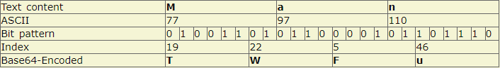

## 01、http常见的状态码有哪些

- 1xx 表示消息
- 2xx 表示成功
- 3xx 表示重定向
- 4xx 表示客户端错误
- 5xx 表示服务器错误

### 常见的状态码

- 101

  > 升级协议，如从http升级到ws，此时需要反向代理支持
  >
- 200

  > 最喜欢见到的状态码，表示请求成功
  >
- 301

  > 永久重定向：搜索引擎在抓取新的内容的是同也会将旧的网址替换为重定向之后的网址
  >
- 302

  > 临时重定向：搜索引擎会抓取新的内容而保留旧的地址，因为服务器返回302，所以搜索引擎认为新的地址是暂时的
  >
- 303

  > 与302一样，只是它希望使用GET方法重定向到新的URL上
  >
- 304

  > 发送附带条件的请求时，条件不满足时返回，与重定向无关。例如：浏览器缓存中，服务器资源未改变，可直接使用客户端未过期的资源
  >
- 400

> 错误的请求：一般指的是 `4xx`其他状态码没有更合适的情况下使用，毕竟客户端出错类型很多，无法准确把情况都定义好

- 401

  > 未被授权，需要身份验证，例如 `token`信息等
  >
- 403

  > 请求被拒绝
  >
- 404

  > 资源缺失，接口不存在，或请求的文件不存在等等
  >
- 500

  > 服务器未知错误
  >
- 502

  > 网关错误
  >
- 503

  > 服务器暂时无法使用
  >
- 肯定会遇到：101/200/301/302/304/400/401/403/404/500/502

### 101 Switch Protocol

升级协议，如从 http 到 ws，此时需要反向代理支持，如 Nginx，在 Nginx 配置 websockt 如下:

```
location / {  proxy_http_version 1.1;  proxy_set_header Upgrade $http_upgrade;  proxy_set_header Connection  $connection_upgrade;}
```

示例:


### 200 Ok

表示资源请求成功，也是最常见到的状态码

示例:

```
$ curl https://shanyue.tech --headHTTP/2 200
```

### 201 Created

资源创建成功，多用于 POST 请求

### 204 No Content

响应不会返回 Body，一般由以下两种情况

1. 与 Options/Delete 请求搭配
2. 打点类

示例一: 掘金为 Options 请求的状态码设置为 204


示例二: 知乎为 Delete 请求的状态码设置为 204，以下请求为取消关注


示例三: 当你在知乎看段子时，不妨打开控制台，会发现一个是 204 的状态码

```
curl 'https://www.zhihu.com/sc-profiler' \  -H 'content-type: application/json' \  --data-binary '[["i","production.heifetz.main.desktop.v1.Collector.screen.1536_960.count",1,1]]' \  --compressed -vvv< HTTP/2 204< server: CLOUD ELB 1.0.0< date: Thu, 22 Oct 2020 07:46:30 GMT< content-type: text/html< vary: Accept-Encoding< x-backend-response: 0.002< cache-control: no-cache, no-store, must-revalidate, private, max-age=0
```

### 206 Partial Content

当请求多媒体数据数据较大时，会进行分片传输。当你在B站观看视频，打开开发者工具，会发现许多 206 状态码以及响应头 Content-Range

示例:


### 301 Moved Permanently

永久重定向。http 转向 https时，有时会使用 301，如 B 站。

```
$ curl www.bilibili.com -vvv< HTTP/1.1 301 Moved Permanently< Server: Tengine< Date: Thu, 22 Oct 2020 08:04:59 GMT< Content-Type: text/html< Content-Length: 239< Connection: keep-alive< Location: https://www.bilibili.com/
```

### 302 Found

暂时重定向。http 转向 https时，有时也会使用 302，如知乎

```
$ curl www.zhihu.com -vvv< HTTP/1.1 302 Found< Location: https://www.zhihu.com/< Content-Length: 0< X-NWS-LOG-UUID: 16068764905156850032< Connection: keep-alive< Server: Lego Server< Date: Thu, 22 Oct 2020 08:20:29 GMT< X-Cache-Lookup: Return Directly
```

### 304 Not Modified

资源已被缓存，与之相关的响应头部有：

- `ETag`
- `last-modified`/`if-modified-since`

一般用作 `index.html` 等不带 hash 的资源，由于示例太多，这里就不举例了

### 307 Temporary Redirect

暂时重定向。也可作为 http 到 https 的重定向。还有一种用途用作 HSTS，当谷歌浏览器发现某 http 资源已被加入到 HSTS 列表，浏览器内部会通过 307 作重定向

示例:


> [http 状态码中 301，302和307有什么区别(opens in a new tab)](https://github.com/shfshanyue/Daily-Question/issues/37)

- 301，Moved Permanently。永久重定向，该操作比较危险，需要谨慎操作：如果设置了301，但是一段时间后又想取消，但是浏览器中已经有了缓存，还是会重定向。
- 302，Found。临时重定向，但是会在重定向的时候改变 method: 把 POST 改成 GET，于是有了 307
- 307，Temporary Redirect。临时重定向，在重定向时不会改变 method

### 400 Bad Request

对于服务器无法理解的参数，将会使用 400 作为返回码

示例一: 当 Content-Type: JSON 时，服务器解析 JSON 却失败

```
HTTP/1.1 400 Bad RequestContent-Length: 35{"message":"Problems parsing JSON"}
```

### 401 Unauthorized

当没有权限的用户请求需要带有权限的资源时，会返回 401，此时携带正确的权限凭证再试一次可以解决问题

有时认证失败也会返回 401

示例一: 知乎登录时密码不正确


示例二: Github中错误的凭证信息请求带权限资源

```
$ curl -i https://api.github.com -u foo:bar> HTTP/1.1 401 Unauthorized> {>   "message": "Bad credentials",>   "documentation_url": "https://developer.github.com/v3"> }
```

### 403 Forbidden

我就是不想让你访问，不管你的权限凭证是否正确！

> In summary, a 401 Unauthorized response should be used for missing or bad authentication, and a 403 Forbidden response should be used afterwards, when the user is authenticated but isn’t authorized to perform the requested operation on the given resource.

- [403与401状态码有什么区别(opens in a new tab)](https://stackoverflow.com/questions/3297048/403-forbidden-vs-401-unauthorized-http-responses)

### 404 Not Found

未找到资源

### 405 Method Not Allowed

我需要 POST 这条资源，你去 GET 个锤子

### 413 Payload Too Large

不要给我扔这么大的 Body，我处理不过来

### 418 I'm A Teapot

我是一个茶壶

我要抛咖啡，你却扔给我一个茶壶？

也可以用来处理不合法的参数校验，我想要个字符串，你给了我一个整数？

### 422 Unprocessable Entity

常用来处理不合法的参数校验。

Github 上给某个项目点赞时，故意设置一个不正确的参数命名，会返回状态码 422


### 429 Too Many Request

请求过多被限流。

超过某一个 API 的 Rate Limit 规则，会被限流，返回 429 状态码

示例: 在 Sentry 中异常上报过于频繁被限流

### 500 Internal Server Error

服务器内部错误，很有可能是应用层未捕获错误而导致整个服务挂掉

### 502 Bad Gateway

Nginx 上常见，从上游应用层未返回响应，上游应用层挂了

### 503 Service Unavailable

由于大量流量造成服务忙，稍等一下说不定就能用了

### 504 Gateway Timeout

网关超时，上游应用层迟迟未响应

## 02、http状态码中301，302和307有什么区别

- 301，永久重定向，该操作比较危险，需要谨慎操作：如果设置了301，但是一段时间后又想取消，但是浏览器中已经有了缓存，还是会重定向。
- 302，临时重定向，但是会在重定向的时候改变method：把POST改为GET，于是有了307
- 307，临时重定向，在重定向时不会改变method

## 03、http状态码502和504有什么区别

这两种异常状态都与网关Getway有关，首先明确两个概念

- Proxy（Getaway），反向代理层或者网关层，在公司级应用中一般使用Nginx扮演这个角色
- Application（upstream server）应用层服务，作为Proxy层的上游服务，在公司中一般为各种语言编写的服务应用，如Go/Java/Python/PHP/Node等

此时关于502与504的区别就很显而易见了

- `502 Bad Getaway`。一般表现为你自己写的应用层服务挂了，网关无法接收到相应
- `504 Bad Getaway`。一般表现为网关层服务（upstream）超时，如查库操作耗时十分钟，超过了Nginx配置的超时时间

## 04、简介http的缓存机制

http缓存分为以下两种，两者都是http响应头控制缓存

第一次请求：

 第二次请求相同网页：


1. 强制缓存

   ##### 强缓存：浏览器不会像服务器发送任何请求，直接从本地缓存中读取文件并返回Status Code: 200 OK

   

   


   > 200 form memory cache : 不访问服务器，一般已经加载过该资源且缓存在了内存当中，直接从内存中读取缓存。浏览器关闭后，数据将不存在（资源被释放掉了），再次打开相同的页面时，不会出现from memory cache。
   >

   > 200 from disk cache： 不访问服务器，已经在之前的某个时间加载过该资源，直接从硬盘中读取缓存，关闭浏览器后，数据依然存在，此资源不会随着该页面的关闭而释放掉下次打开仍然会是from disk cache。
   >

   > 优先访问memory cache,其次是disk cache，最后是请求网络资源
   >

   与之相关的response header有两个

   - `Expires`

     如果过期时间在当前时间之后，则直接都本地缓存

     这个头部也是丧心病狂：使用绝对时间，且有固定的格式 [https://tools.ietf.org/html/rfc822#section-5.1(opens in a new tab)](https://tools.ietf.org/html/rfc822#section-5.1)

     ```
     Expires: Mon, 25 Oct 2021 20:11:12 GMT
     ```
   - `Cache-Control`，具有强大的缓存控制能力，`Cache-Control`会覆盖掉 `Expires`

     常用的有以下两个

     - `no-cache`，每次请求需要校验服务器资源的新鲜度（协商缓存）
     - `no-store`，不适用任何缓存，每次都直接读取最新。
     - `max-age=31536000`，浏览器在一年内都不需要向服务器请求资源（在失效时间之前都执行强制缓存）
2. 协商缓存

   Last-Modifed/If-Modified-Since和Etag/If-None-Match是分别成对出现的，呈一一对应关系

   **Etag/If-None-Match：**

   Etag：

   > Etag舒服http1.1属性，它由服务器生成返回给前端，用来帮助服务器控制web端的缓存验证。Apach中，Etag的值，默认是对文件的索引节（INode），大小（Size）和最后修改时间（MTime）进行Hash后得到的。
   >

   If-None-Match：

   > 当资源过期时（Express过期/浏览器判断Cache-Control标识的max-age过期），浏览器发现响应头中带有，则再次请求服务器是请求头带上If-Node-Match（值是Etag）。服务器收到请求进行对比时，决定返回200或304
   >

   **Last-Modified/If-Modified-Since**

   Last-Modified：

   > 服务器向浏览器发送最后的修改时间
   >

   If-Modified-Since

   > 当资源过期时（Express过期/浏览器判断Cache-Control标识的max-age过期），浏览器发现响应头中带有Last-Modified，则再次请求时，请求头将带上If-Modified-Since（值是上一次响应头中），如果最后修改时间比If-Modified-Since大，说明资源被修改过，返回新的资源，HTTP200，否则304走缓存
   >

   > Last-Modifed/If-Modified-Since的时间精度是秒，而Etag可以更精确。
   >
   > Etag优先级是高于Last-Modifed的，所以服务器会优先验证Etag，是1.1的头段
   >
   > Last-Modifed/If-Modified-Since是http1.0的头字段
   >

## 05、http proxy的原理是什么

HTTP代理服务器会自动提取请求数据包的HTTP Request数据，并且把HTTP Response的数据转发给发送请求的客户端；HTTP代理服务器使用的端口通常是8080，如下图所示：


- 对于Web客户端来说，代理扮演的服务器角色，接收请求（Request），返回响应（Response）。
- 对于Web服务器来说，代理扮演的客户端角色，发送请求（Request），返回响应（Response）。

HTTP代理步骤

- 用户向代理发起TCP连接：
- 代理接收用户的连接，双方建立连接；
- 用户向代理发送HTTP请求，请求内容和没有HTTP代理的内容完全相同；
- 代理解析HTTP请求；
- 代理向服务器发起TCP连接；
- 服务器接收代理的连接；
- 代理向服务器发送HTTP请求（这个HTTP请求是基于用户的HTTP请求，可能会有修改）
- 服务器发送响应给代理；
- 代理相应给客户端

HTTP代理功能上名称的区别：

- 全匿名代理，不改变客户端的request fields（请求信息），使服务器端看来就像有个真正的客户浏览器在访问。客户端的真实IP是隐藏起来的。
- 普通匿名代理，能隐藏客户端的真实IP，但会更改客户端的request fields（请求信息），服务器端有可能会被认为使用了代理。
- 透明代理（简单代理），改变客户端的request fields（请求信息），并会传送真实IP地址。

不同HTTP代理的区别：

- 全匿名代理，不改变客户端的request fields（请求信息），使服务器端看来就像有个真正的客户浏览器在访问。客户端的真实IP是隐藏起来的。
- 普通匿名代理，能隐藏客户端的真实IP，但会更改客户端的request fields（请求信息），服务器端有可能会被认为使用了代理。
- 透明代理（简单代理），改变客户端的request fields（请求信息），并会传送真实IP地址。

HTTPS代理

HTTPS代理有多种做法，通常使用 `CONNECT method`，通过proxy建立一条隧道(隧道代理)，这样，`proxy无法解密数据`；此外，还有一种类似于中间人攻击的代理手法。

## 06、HTTP/2带来的加载优化

### 结论：

- 从HTTP/1.0到HTTP/2，都是利用TCP作为底层协议进行通信的。
- HTTP/1.1，引进了长连接(keep-alive)，减少了建立和关闭连接的消耗和延迟。
- HTTP/2，引入了多路复用：连接共享，提高了连接的利用率，降低延迟。

### http的基本优化：

影响一个http请求的主要因素有两个带宽和延迟

**带宽**：如果说我们还停留在拨号上网的阶段，带宽可能会成为一个比较严重影响请求的问题，但是现在网络基础建设已经使得带宽得到极大的提升，我们不再会担心由带宽而影响网速，那么就只剩下延迟了 

- **浏览器阻塞（HOL blocking）**：浏览器会因为一些原因阻塞请求。浏览器对于同一个域名，同时只能有 4 ~6个连接（这个根据浏览器内核不同可能会有所差异），超过浏览器最大连接数限制，后续请求就会被阻塞
- **DNS 查询（DNS Lookup）**：浏览器需要知道目标服务器的 IP 才能建立连接。将域名解析为 IP 的这个系统就是 DNS。这个通常可以利用DNS缓存结果来达到减少这个时间的目的
- **建立连接（Initial connection）**：HTTP 是基于 TCP 协议的，浏览器最快也要在第三次握手时才能捎带 HTTP 请求报文，达到真正的建立连接，但是这些连接无法复用会导致每次请求都经历三次握手和慢启动。三次握手在高延迟的场景下影响较明显，慢启动则对文件类大请求影响较大

### HTTP1.0和HTTP1.1的一些区别

- **相应状态码：** HTTP/1.1 中新加入了大量的状态码
- **缓存处理：** 在http1.0主要使用If-Modified-Since，Expires来做缓存判断标准，HTTP1.1则引入了更多的缓存控制策略例如：Etag，If-None-Match等更多可供选择的缓存头来控制缓存
- **连接方式（长连接）**：HTTP1.0默认是用短链接，HTTP 1.1支持长连接（PersistentConnection）和请求的流水线（Pipelining）在一个TCP连接上可以传送多个HTTP请求和响应，减少了建立和关闭连接的消耗和延迟，在HTTP1.1中默认开启Connection： keep-alive，一定程度上弥补了HTTP1.0每次请求都要创建连接的缺点
- **带宽优化及网络连接的使用（206状态码）:**HTTP1.0中，存在一些浪费带宽的现象，例如客户端只是需要某个对象的一部分，而服务器却将整个对象送过来了，并且不支持断点续传功能，HTTP1.1则在请求头引入了**range头域**，它允许只请求资源的**某个部分**，即返回码是**206（Partial Content）**，这样就方便了开发者自由的选择以便于充分利用带宽和连接
- **Host头处理**，在HTTP1.0中认为每台服务器都绑定一个唯一的IP地址，因此，请求消息中的URL并没有传递主机名（hostname）。但随着虚拟主机技术的发展，在一台物理服务器上可以存在多个虚拟主机（Multi-homed Web Servers），并且它们共享一个IP地址。HTTP1.1的请求消息和响应消息都应支持Host头域，且请求消息中如果没有Host头域会报告一个错误（400 Bad Request）

### HTTP2.0和HTTP1.X相比的新特性

- **新的二进制格式（Binary Format）**,HTTP1.x的解析是基本文本。基于文本协议的格式解析存在天然缺陷，文本的表现形式有多样性，要做到健壮性考虑的场景必然很多，二进制则不同，只认0和1的组合。基于这种考虑HTTP2.0的协议解析决定采用二进制格式，实现方便且健壮。
- **多路复用（MultiPlexing）**，即连接共享，即每一个request都是是用作连接共享机制的。一个request对应一个id，这样一个连接上可以有多个request，每个连接的request可以随机的混杂在一起，接收方可以根据request的 id将request再归属到各自不同的服务端请求里面。
- **header压缩**，如上文中所言，对前面提到过HTTP1.x的header带有大量信息，而且每次都要重复发送，HTTP2.0使用encoder来减少需要传输的header大小，通讯双方各自cache一份header fields表，既避免了重复header的传输，又减小了需要传输的大小。
- **服务端推送（server push）**，同SPDY一样，HTTP2.0也具有server push功能。

### HTTP2.0的多路复用

多路复用代替原来的序列和阻塞机制，所有就是请求的都是通过一个 TCP 连接并发完成。同时也很好的解决了浏览器限制同一个域名下的请求数量的问题。

在 HTTP/2 中，有了二进制分帧之后，HTTP/2 不再依赖 TCP 链接去实现多流并行了，在 HTTP/2 中：

- **同域名下所有通信都在单个连接上完成，同个域名只需要占用一个 TCP 连接，使用一个连接并行发送多个请求和响应**。
- **单个连接可以承载任意数量的双向数据流，单个连接上可以并行交错的请求和响应，之间互不干扰**。
- **数据流以消息的形式发送，而消息又由一个或多个帧组成，多个帧之间可以乱序发送，因为根据帧首部的流标识可以重新组装。每个请求都可以带一个 31bit 的优先值，0 表示最高优先级， 数值越大优先级越低**。

#### 帧（frame）和流（stream）

---

在 HTTP/2 中，有两个非常重要的概念：帧（frame）和流（stream）。

#### 帧（frame）

HTTP/2 中**数据传输的最小单位**，因此帧不仅要细分表达 HTTP/1.x 中的各个部份，也优化了 HTTP/1.x 表达得不好的地方，同时还增加了 HTTP/1.x 表达不了的方式。 每一帧都包含几个字段，有**length、type、flags、stream identifier、frame playload**等，其中type 代表帧的类型，在 HTTP/2 的标准中定义了 10 种不同的类型，包括上面所说的 HEADERS frame 和 DATA frame。此外还有： `PRIORITY`（设置流的优先级） `RST_STREAM`（终止流） `SETTINGS`（设置此连接的参数） `PUSH_PROMISE`（服务器推送） `PING`（测量 RTT） `GOAWAY`（终止连接） `WINDOW_UPDATE`（流量控制） `CONTINUATION`（继续传输头部数据）

在 HTTP 2.0 中，它把数据报的两大部分分成了 header frame 和 data frame。也就是头部帧和数据体帧。

#### 流（stream）

流： 存在于连接中的一个虚拟通道。流可以承载双向消息，每个流都有一个唯一的整数 ID。 HTTP/2 长连接中的数据包是不按请求-响应顺序发送的，一个完整的请求或响应(称一个数据流 stream，每个数据流都有一个独一无二的编号)可能会分成非连续多次发送。它具有如下几个特点：

- **双向性：同一个流内，可同时发送和接受数据**。
- **有序性：流中被传输的数据就是二进制帧 。帧在流上的被发送与被接收都是按照顺序进行的**。
- **并行性：流中的 二进制帧 都是被并行传输的，无需按顺序等待**。
- **流的创建：流可以被客户端或服务器单方面建立, 使用或共享**。
- **流的关闭：流也可以被任意一方关闭**。
- **HEADERS 帧在 DATA 帧前面**。
- **流的 ID 都是奇数，说明是由客户端发起的，这是标准规定的，那么服务端发起的就是偶数了**。

#### 发展历程

---

从 Http/0.9 到 Http/2 要发送多个请求，从**多个 Tcp 连接=>keep-alive=>管道化=>多路复用**不断的减少多次创建 Tcp 等等带来的性能损耗。

#### 多个 Tcp 连接

在最早的时候没有 `keep-alive`只能创建多个 `Tcp`连接来做多次请求。多次 http 请求效果如下图所示：


一次请求完成就会关闭本次的 Tcp 连接，下个请求又要从新建立 Tcp 连接传输完成数据再关闭，造成很大的性能损耗。

#### Keep-Alive

`Keep-Alive`解决的核心问题是： 一定时间内，同一域名多次请求数据，只建立一次 HTTP 请求，其他请求可复用每一次建立的连接通道，以达到提高请求效率的问题。这里面所说的一定时间是**可以配置**的，不管你用的是 `Apache`还是 `nginx`。 以往，浏览器判断响应数据是否接收完毕，是看连接是否关闭。在使用持久连接后，就不能这样了，这就要求服务器对持久连接的响应头部一定要返回 `content-length`标识 `body的`长度，供浏览器判断界限。有时，`content-length`的方法并不是太准确，也可以使用 `Transfer-Encoding: chunked` 头部发送一串一串的数据，最后由长度为 0 的 `chunked`标识结束。 多次 http 请求效果如下图所示：


上图：设置 Connection:Keep-Alive，保持连接在一段时间内不断开。

`Keep-Alive`还是存在如下问题：

- 串行的文件传输。
- 同域并行请求限制带来的阻塞（6~8）个

#### 管线化

HTTP 管线化可以克服同域并行请求限制带来的阻塞，它是建立在**持久连接**之上，是把所有请求一并发给服务器，但是服务器需要按照**顺序一个一个响应**，而不是等到一个响应回来才能发下一个请求，这样就节省了很多请求到服务器的时间。不过，HTTP 管线化**仍旧**有阻塞的问题，若上一响应迟迟不回，**后面的响应**都会被阻塞到。


上图：HTTPpipelining：建立多个连接

#### 多路复用

多路复用代替原来的序列和阻塞机制。所有就是请求的都是通过一个 TCP 连接并发完成。因为在多路复用之前所有的传输是基于基础文本的，在多路复用中是基于二进制数据帧的传输、消息、流，所以可以做到乱序的传输。多路复用对同一域名下所有请求都是基于流，所以不存在同域并行的阻塞。多次请求如下图：


上图：多路复用

#### 总结

**在 HTTP/2 中，有两个非常重要的概念，分别是帧（frame）和流（stream）**。

**帧代表着最小的数据单位，每个帧会标识出该帧属于哪个流，流也就是多个帧组成的数据流**。

**HTTP2 采用二进制数据帧传输，取代了 HTTP1.x 的文本格式，二进制格式解析更高效**。

多路复用代替了 HTTP1.x 的**序列和阻塞机制**，所有的相同域名请求都通过**同一个 TCP 连接并发**完成。**同一 Tcp 中可以发送多个请求，对端可以通过帧中的标识知道属于哪个请求。通过这个技术，可以避免 HTTP 旧版本中的队头阻塞问题，极大的提高传输性能**。

#### 参考

> [多路复用](https://link.juejin.cn/?target=https%3A%2F%2Fwww.kancloud.cn%2Fdigest%2Fweb-performance-http2%2F74825)

> [一文读懂 HTTP/2 及 HTTP/3 特性](https://link.juejin.cn/?target=https%3A%2F%2Fsegmentfault.com%2Fa%2F1190000018401534)

> [一文读懂 HTTP/2 特性](https://link.juejin.cn/?target=https%3A%2F%2Fzhuanlan.zhihu.com%2Fp%2F26559480)

> [浅析 HTTP/2 的多路复用](https://link.juejin.cn/?target=https%3A%2F%2Fsegmentfault.com%2Fa%2F1190000011172823)

## 07、http 1.1 中的 keep-alive 有什么作用

在 `http 1.1` 中，在响应头中设置 `keep-alive` 可以在一个 TCP 连接上发送多个 http 请求

1. 避免了重开 TCP 连接的开销
2. 避免了刷新时重新建立 SSL 连接的开销
3. 避免了QPS过大时，服务器的连接数过大

在服务器端使用响应头开启 `keep-alive`

```
Connection: Keep-AliveKeep-Alive: timeout=5, max=1000
```

## 08、什么是队首阻塞，如何解决，原理如何

队首阻塞包含http应用层协议上的队首阻塞和tcp传输层的队首阻塞

1. http应用层协议上的队首阻塞: 以http1.1为例，一个tcp连接一次只能处理一个请求，如果接受端处理慢的话，后面的请求就得排队，这是导致队首阻塞的根本原因 虽然http1.1提出了管线技术，支持同时发起多个请求出去，但是又限制了接收端返回必须得按照顺序，所以这项技术也未能解决队首阻塞。

http2.0 提出了 frame 和 stream的概念， 把请求数据分成了不同的二进制frame，有strameid标识，包装进不同的stream通过同一个tcp管道进行并发的多路复用传输， 接收端根据streamid来进行组装，解决了队首阻塞的问题。

但是依然没有解决tcp传输层的队首阻塞，如果过程中一个包丢了，需要重传，就需要后面的包等待了

### 09、简述你们前端项目中资源的缓存配置策略

1. html设置协商缓存
2. 静态资源 hash + 强缓存

## 10、no-cache 与 no-store 的区别是什么

no-cache 可以在本地缓存，可以在代理服务器缓存，但是这个缓存要服务器验证才可以使用 no-store 是禁用缓冲，本地和代理服务器都不缓冲，每次都从服务器获取

> Author 回答者: [shfshanyue(opens in a new tab)](https://github.com/shfshanyue)

`no-cache` 和 `no-store` 用作控制缓存，被服务器通过响应头 `Cache-Control` 传递给客户端

### `no-store`

**永远都不要在客户端存储资源**，每次永远都要从原始服务器获取资源

### `no-cache`

可以在客户端存储资源，但每次都**必须去服务器做新鲜度校验**，来决定从服务器获取最新资源 (200) 还是从客户端读取缓存 (304)，即所谓的协商缓存

> [当服务器资源返回 304 时与那些 HTTP 响应头有关(opens in a new tab)](https://github.com/shfshanyue/Daily-Question/issues/441)

一般情况下对于 `index.html` 或者现代构建环境下不加 hash 的静态资源都需要设置 `Cache-Control: no-cache`，用来强制每次在服务器端的新鲜度校验。

相当于以下响应头

```http
Cache-Control: max-age=0, must-revalidate
```

## 11、什么是 Basic Auth 和 Digest Auth

### Basic Auth

使用Base64编码的用户名和密码，将其放置在HTTP请求头中进行身份验证

### Digest Auth

使用摘要（Digest）算法，将密码使用算法加密后放在HTTP请求头中进行身份验证；

比较流行的还是Token-based Auth。 Token-based Auth：使用令牌（Token），客户端在登录成功后获取令牌，之后的请求中将令牌包含在请求头中进行身份验证。

## 12、gzip的原理是什么，如何配置

一句话：`gzip` 的核心是 `Deflate`，而它使用了 `LZ77` 算法与 `Huffman` 编码来压缩文件，重复度越高的文件可压缩的空间就越大。

因此 `gzip` 用于 HTTP 文件传输中，比如 JS、CSS 等，**但一般不会压缩图片**。在 HTTP Response 报文中，用 `Content-Encoding` 指明使用 gzip 压缩，而以下响应头在大部分生产环境的响应报文中都可以看到！比如你现在立刻马上可以打开[我的网站(opens in a new tab)](https://q.shanyue.tech/)或者[百度(opens in a new tab)](https://www.baidu.com/)试一试。

```
# Request HeaderAccept-Encoding: gzip, deflate, br # Reponse HeaderContent-Encoding: gzip
```

`gzip` 一般在反向代理那一层，如 `nginx` 进行处理，直接使用 C 语言编写，具有更好的性能。

在 `nginx` 开启 `gzip`: 配置可参考 [gzip module(opens in a new tab)](http://nginx.org/en/docs/http/ngx_http_gzip_module.html)

```
gzip on;
```

### LZ77

### Huffman

### 相关阅读

- [gzip原理与实现](https://blog.csdn.net/imquestion/article/details/16439)

## 13、可以对图片开启 gzip 压缩吗，为什么

不需要开启，如果开启的话，有可能使图片变的更大。如果你注意一些网站的 img 资源时，就会发现他们都没有开启 `gzip`

## 14、http 的请求报文与响应报文的格式是什么

HTTP的请求报文由四部分组成（请求行+请求头部+空行+请求体）：

**真实数据**


TTP的响应报文也由四部分组成（ 响应行+响应头+空行+响应体）：


**真实数据**


## 15、HTTP响应头中的Etag值是如何生成的

关于 `etag`的生成需要满足几个条件

1. 当文件更改时，`etag`值必须改变
2. 尽量便于计算，不会特别耗CPU。这样利用摘要算法生成需要慎重考虑，因为他们是CPU密集型运算。
3. 必须横向扩展，分布式部署时多个服务器节点上生成 `etag`值保持一致，这样子 `inode`就排除了

> 关于服务器中 `etag` 如何生成可以参考 [HTTP: Generating ETag Header(opens in a new tab)](https://stackoverflow.com/questions/4533/http-generating-etag-header)

以上几个条件是理论上的成立条件，那在真正实践中，应该如何处理？

我们来看一下 `nginx` 中是如何做的

### nginx 中 ETag 的生成

我翻阅了 `nginx` 的源代码，并翻译成伪代码如下：由 `last_modified` 与 `content_length` 拼接而成

```
etag = header.last_modified + header.content_lenth;
```

可见源码位置，并在以下贴出: [ngx_http_core_modules.c(opens in a new tab)](https://github.com/nginx/nginx/blob/6c3838f9ed45f5c2aa6a971a0da3cb6ffe45b61e/src/http/ngx_http_core_module.c#L1582)

```
etag->value.len = ngx_sprintf(etag->value.data, "\"%xT-%xO\"",                                  r->headers_out.last_modified_time,                                  r->headers_out.content_length_n)                      - etag->value.data;
```

**总结：`nginx` 中 `etag` 由响应头的 `Last-Modified` 与 `Content-Length` 表示为十六进制组合而成。**

随手在我的k8s集群里找个 `nginx` 服务测试一下

```
$ curl --head 10.97.109.49HTTP/1.1 200 OKServer: nginx/1.16.0Date: Tue, 10 Dec 2019 06:45:24 GMTContent-Type: text/htmlContent-Length: 612Last-Modified: Tue, 23 Apr 2019 10:18:21 GMTConnection: keep-aliveETag: "5cbee66d-264"Accept-Ranges: bytes
```

由 `etag` 计算 `Last-Modified` 与 `Content-Length`，使用 `js` 计算如下，结果相符

```
> new Date(parseInt('5cbee66d', 16) * 1000).toJSON()"2019-04-23T10:18:21.000Z"> parseInt('264', 16)612
```

### Nginx 中的 ETag 算法及其不足

 协商缓存用来计算资源是否返回304，我们知道协商缓存有两种方式

- `Last-Modified/Last-Modified-Since`
- `Etag/If-Node-Match`

既然在 `nginx` 中 `ETag` 由 `Last-Modified` 和 `Content-Length` 组成，那它便算是一个加强版的 `Last-Modified` 了，那加强在什么地方呢？

**`Last-Modified` 是由一个 `unix timestamp` 表示，则意味着它只能作用于秒级的改变，而 nginx 中的 ETag 添加了文件大小的附加条件**

## 16、如果 http 响应头中 ETag 值改变了，是否意味着文件内容一定已经更改

不能。由服务器中 `ETag` 的生成算法决定，比如 `nginx` 中的 `etag` 由 `last_modified` 与 `content_length` 组成，而 `last_modified` 又由 `mtime` 组成

当编辑文件却未更改文件内容时，`mtime` 也会改变，此时 `etag` 改变，但是文件内容没有更改。HTTP服务中静态文件的 `Last-Modified`一般根据文件的 `mtime`生成，表示文件内容的修改时间

`nginx` 也是这样处理的，源码见: [ngx_http_static_module.c](https://github.com/nginx/nginx/blob/4bf4650f2f10f7bbacfe7a33da744f18951d416d/src/http/modules/ngx_http_static_module.c#L217)

```c
    r->headers_out.status = NGX_HTTP_OK;
    r->headers_out.content_length_n = of.size;
    r->headers_out.last_modified_time = of.mtime;
```

**那为什么使用 `mtime` 而非 `ctime`**

在 `linux` 中，

- `mtime`：`modified time` 指文件内容改变的时间戳
- `ctime`：`change time` 指文件属性改变的时间戳，属性包括 `mtime`。而在 windows 上，它表示的是 `creation time`

所以 `ctime` 会比 `mtime` 要大一些，使用 `stat` 查看文件属性如下

```bash
$ stat hello.txt
File: ‘hello.txt’
Size: 30              Blocks: 8          IO Block: 4096   regular file
Device: fd01h/64769d    Inode: 917526      Links: 1
Access: (0644/-rw-r--r--)  Uid: (    0/    root)   Gid: (    0/    root)
Access: 2019-12-10 16:15:55.253325208 +0800
Modify: 2019-12-10 16:15:52.740653330 +0800
Change: 2019-12-10 16:15:52.742653069 +0800
Birth: -
```

而 http 服务选择 `Last_Modified` 时一般会选择 `mtime`

## 17、http 服务中静态文件的 Last-Modified 是根据什么生成的

一般会选文件的 `mtime`，表示文件内容的修改时间

`nginx` 也是这样处理的，源码见: [ngx_http_static_module.c(opens in a new tab)](https://github.com/nginx/nginx/blob/4bf4650f2f10f7bbacfe7a33da744f18951d416d/src/http/modules/ngx_http_static_module.c#L217)

```
    r->headers_out.status = NGX_HTTP_OK;    r->headers_out.content_length_n = of.size;    r->headers_out.last_modified_time = of.mtime;
```

关于为什么使用 `mtime` 而非 `ctime`，可以参考 [#116(opens in a new tab)](https://github.com/shfshanyue/Daily-Question/issues/117)

> Author 回答者: [feefeefee(opens in a new tab)](https://github.com/feefeefee)

针对静态资源而言，一般会选择文件的 mtime 元属性作为上次修改时间，该元属性表示文件内容的修改时间，在linux中可以用stat命令来查看文件属性，其中就包括了mtime和ctime。mtime指的是文件内容修改时间，而ctime指的是文件修改时间

## 18、既然 http 是无状态协议，那它是如何保持登录状态

通过 cookie 或者 Authorization header 来传递凭证，在服务端进行认证

## 19、https 是如何保证报文安全的

### 1. HTTP存在的问题

传统的不使用 `SSL/TLS`的HTTP协议，是不加密的通信。无论是客户端发送给服务端的请求体，还是服务端响应给客户端的响应体，都是明文传输的，这会带来几个问题：

**1. 窃听** 第三方劫持请求后可以获取通信内容。对于一些敏感数据，这是不被允许的。

**2. 篡改** 第三方劫持请求后可以篡改通信内容。例如银行系统中，张三本来要给李四转账，第三方劫持请求后篡改了请求数据，将收款方改为自己，导致用户资金流失。

**3. 冒充** 第三方可以冒充客户端发送数据。由于是明文传输，没有「加签/验签」操作，服务端无法保证请求来源的合法性。

正是因为这些问题，HTTP通信存在巨大的安全隐患，于是HTTPS出现了。 本文将一步步深入，看看HTTPS是如何解决这些问题的。

### 2. SSL/TLS

在介绍HTTPS之前，必须先了解SSL/TLS协议，因为HTTPS是构建在此基础之上的，了解了SSL/TLS基本也就清楚HTTPS的工作原理了。

SSL（Secure Sockets Layer）译为「安全套接字协议」，TLS（Transport Layer Security）译为「传输层安全性协议」。

简单回顾一下它们的发展历史吧：

- 1994年，网景公司设计了SSL协议（Secure Sockets Layer）的1.0版，但是未发布。
- 1995年，网景公司发布SSL 2.0版，但很快发现有严重漏洞。
- 1996年，SSL 3.0版问世，得到大规模应用。
- 1999年，互联网标准化组织ISOC接替网景公司，发布了SSL的升级版TLS 1.0版。
- 2006年和2008年，TLS进行了两次升级，分别为TLS 1.1版和TLS 1.2版。

SSL/TLS协议处于「传输层」和「应用层」之间，主要作用是对网络连接进行加解密，如下图： 

#### 2.1 防窃听：加密

先来看看第一个问题：窃听。既然明文传输可以被第三方窃听数据，那么改为加密传输不就行了吗？ 方向是对的，但是如何加密才能保证数据的安全呢？

##### 2.1.1 对称加密

> 采用单钥密码系统的加密方法，同一个密钥可以同时用作信息的加密和解密，这种加密方法称为对称加密，也称为单密钥加密。

例如DES就是一种对称加密算法，甲乙双方约定一个密钥「Key」，双方发送数据前都用该密钥对数据进行加密传输，收到数据后再解密成明文即可。这种方式，只要保证密钥不被泄漏，理论上也是安全的。


但是这会带来一个新的问题：**密钥如何保存？**

对于PC端来说，浏览器页面是明文的，肯定不能存储密钥。对于iOS/Android来说，即使把密钥藏在安装包的某个位置，也很容易被第三方拆包破解。

既然客户端保存不靠谱，那么密钥只在服务端保存，客户端去向服务端拿密钥是否可行？

依然不可行，服务端要怎么把密钥给你呢？明文肯定不行，如果要加密，又要用到密钥B，密钥B的传输又要用到密钥C，如此循环，无解。

##### 2.1.2 非对称加密

> 非对称加密算法需要两个密钥：公开密钥（publickey:简称公钥）和私有密钥（privatekey:简称私钥）。公钥与私钥是一对，如果用公钥对数据进行加密，只有用对应的私钥才能解密。因为加密和解密使用的是两个不同的密钥，所以这种算法叫作非对称加密算法。

甲乙双方各有一套自己的密钥对，互相公开彼此的公钥，当甲方要发送数据给乙方时，用乙方公钥加密，这样密文就只有乙方自己能解开了，就算请求被劫持，第三方拿到了数据，由于没有乙方的私钥，也无法解密，这样就保证了数据被窃听。

**单向非对称加密** 绝大多数互联网网站对外是完全公开的，所有人都可以访问，服务端没必要验证所有客户端的合法性，只有客户端需要验证服务端的合法性。例如用户在访问电商网站时，必须确保不是钓鱼网站，以防资金损失。

这种情况下，只需要单向加密即可。服务端发送给客户端的一般不会有敏感信息，明文传输即可。但是客户端发送给服务端的就很有可能是敏感信息，例如用户修改密码，这时就必须加密传输了。 

**双向非对称加密** 有时，服务端也需要验证客户端的合法性，例如银行系统。由于涉及到金钱，因此系统必须设计的足够安全。除了客户端发送给服务端的数据是加密的，服务端发送给客户端的数据也必须加密。

怎么做的呢？一般银行会给用户一个U盘，里面存储的就是一套密钥对，客户端告诉服务端自己的公钥，服务端根据公钥加密后再传输给客户端。 

#### 2.2 防篡改：加签

通过非对称加密的密文传输，可以防止数据被窃听，但是如果存在这种场景呢？

张三登陆银行系统，要给李四转一笔钱，数据通过服务端的公钥PubB加密传输，但是第三方劫持了这个请求，篡改了报文数据，写入的是「给王五转钱」，因为服务端的公钥是公开的，谁都能拿到，因此第三方也可以正常加密传输，服务端正常解密后进行了错误的操作，导致用户资金流失。 

对于涉及到资金的操作，服务端必须要验证数据的合法性，确保数据没有被篡改，这就需要客户端对数据进行加签了。

非对称加密除了可以「公钥加密，私钥解密」外，还可以「私钥加签，公钥验签」。

银行给用户一个U盘，里面有一套密钥对。客户端在发送转账请求前，先对请求体 加签，得到签名「sign」，然后再用服务端公钥加密，得到密文「data」，客户端将签名和密文一起发送给服务端，服务端解密后，还需要用客户端的公钥对「sign」进行验签，只有验签通过才能进行后续操作，否则就是非法请求了。  这样，即使请求被第三方劫持了，第三方可以篡改数据，但是签名它改不了，服务端解密后会发现数据和「sign」对不上，说明数据是被篡改过的。

#### 2.3 防冒充：证书

通过加密防止数据被窃听，通过加签防止数据被篡改，现在看来好像已经很安全了，但是别忘了，有个前提是：公钥的传输是安全的。不幸的是，公钥的安全传输很难保证。

**中间人攻击** 假设存在这样一种场景，客户端和服务端想互换公钥，但是请求都被一个中间人劫持了，结果就是：服务端和客户端以为是和双方互换公钥了，结果是客户端和服务端都和中间人互换公钥了。  一旦出现这种问题就非常严重，前面讲到的加密解密、加签验签都失效了。客户端以为中间人就是服务端，服务端以为中间人就是客户端，双方以为是在和对方通信，其实都是在和中间人通信，中间人可以随意的窃听和篡改数据。

这个问题之所以会出现，就是因为公钥的传输是不安全的。客户端和服务端之间互换公钥时，如何确保公钥就是对方发出的，没有被篡改过呢？？？

##### 2.3.1 数字证书与认证中心

在之前的基础上，引入一个中间角色：证书认证中心CA。当服务端要把公钥发送给客户端时，不是直接发送公钥，而是先把公钥发送给CA，CA根据公钥生成一份「证书」给到服务端，服务端将证书给客户端。客户端拿到证书后去CA验证证书的合法性，确保证书是服务端下发的。

CA就类似于「公证处」，也是一台服务器，它自己本身也有一套密钥对。它的工作就是根据服务端的公钥生成证书，然后帮助客户端来验证证书的合法性。 

##### 2.3.2 CA被冒充怎么办？

引入CA可以保证公钥的传输安全，但是有一个前提，客户端和服务端是信任CA的，也就是说CA必须是安全可信任的，如果CA被冒充，就又会出现上面的问题。  基于这个问题，就引入了「根证书」和「CA信任链」的概念。

要让客户端和服务端信任CA，其实CA也面临着同样的问题，那就是：如何保证CA的公钥是安全不被篡改的？答案也是一样的，就是给CA也颁发证书，那这个证书由谁来颁发呢？自然是CA的上一级CA了。CA的上一级CA如何保证安全？那就CA的上一级CA的上一级CA给它颁发证书了。最终就会形成一个证书信用链，如下：  客户端要想验证服务器的C3证书是否合法，会跑去CA2验证，要验证CA2就去CA1验证，以此类推。对于根证书，是没法验证的，只能无条件相信。因为Root CA都是国际上公认的机构，一般用户的操作系统或浏览器在发布时，就会在里面嵌入这些机构的Root证书。

如下是百度官网的证书，点击浏览器地址栏旁边的锁标识就能看到了。 

#### 2.4 SSL/TLS 四次握手

了解了底层的实现，加密、加签、证书等概念后，再来看SSL/TLS协议就很容易理解了。SSL/TLS需要四次握手的过程：

##### 1）客户端发出请求Client Hello

首先，客户端先向服务器发出加密通信的请求，这被叫做clienthello请求。

在这一步，客户端主要向服务器提供以下信息：

- 支持的**协议版本**，比如TLS1.0版本；
- 支持的**加密方法**，比如RSA公钥加密；
- 一个客户端生成的**随机数**(client random), 稍后用于生成对话密钥(session key)

由于客户端(如浏览器)对一些加解密算法的支持程度不一样，但是**在TLS协议**传输过程中必须使用**同一套加解密算法**才能保证数据能够正常的加解密。在TLS握手阶段，客户端首先要告知服务端，自己支持哪些加密算法，所以客户端需要将**本地支持的加密套件(Cipher Suite)的列表**传送给服务端。除此之外，客户端还要产生**一个随机数**，这个随机数一方面需要在客户端保存，另一方面需要传送给服务端，客户端的随机数需要跟服务端产生的随机数结合起来产生后面要讲到的Master Secret。

##### （2）服务器回应Server Hello

服务器收到客户端请求后，向客户端发出回应，这叫做serverhello。

这一步服务器主要干三件事：

- 确认使用的**加密通信协议版本**，比如TLS1.00版本。如果游览器与服务器支持的版本不一致，服务器关闭加密通信；
- 确认使用的**加密方法**（客户端所支持），比如RSA公钥加密；
- 将**服务器证书**、**非对称加密的公钥**，以及**一个随机数(Server random)**发送给客户端游览器

服务端在接收到客户端的Client Hello之后，服务端需要将**自己的证书**发送给客户端。这个证书是对于服务端的一种认证。例如，客户端收到了一个来自于称自己是[http://www.alipay.com](https://link.zhihu.com/?target=http%3A//www.alipay.com)的数据，但是如何证明对方是合法的alipay支付宝呢？这就是证书的作用，支付宝的证书可以证明它是alipay，而不是财付通。证书是需要申请，并由专门的数字证书认证机构(CA)通过非常严格的审核之后颁发的电子证书。**颁发证书的同时会产生一个私钥和公钥。私钥由服务端自己保存，不可泄漏。公钥则是附带在证书的信息中，可以公开的**。**证书本身也附带一个证书电子签名**，这个签名用来验证证书的完整性和真实性，可以防止证书被串改。另外，证书还有个有效期。

##### （3）客户端回应

客户端收到服务器回应以后，首先验证服务器证书，验证手段就是执行如下三种检查：

- **检查证书是否已过期**；
- **检查证书中的域名与实际域名是否一致**；
- **检查证书是否是可信机构颁布的；**

如果，上述过程中有任何一个环节发现问题，那么浏览器就会向访问者显示一个警告，由其选择是否还要继续通信。如果证书受信任，或者是用户接受了不受信的证书，**浏览器会生成一串新的随机数（Premaster secret ），并用证书中提供的公钥加密，发送给服务器**。

此时，浏览器会根据前三次握手中的三个随机数：

- **Client random**
- **Server random**
- **Premaster secret**

通过一定的算法来**生成 “会话密钥” （Session Key）**，这个会话密钥就是接下来双方进行**对称加密解密**使用的密钥！

##### （4）服务端回应

服务端收到客户端的回复，利用已知的加密解密方式进行解密，服务器收到客户端的第三个随机数（ Premaster secret） 之后，使用同样的算法计算出 “会话密钥” （Session Key）。

至此，整个握手阶段全部结束。接下来，客户端与服务器进入加密通信，就完全是使用普通的 HTTP 协议，只不过用 “会话密钥” 加密内容。（非对称加密解密将不再使用，接下来完全由对称加密接手了，因为密钥已经安全的传送给了通信的双方）


### 3. 再看HTTPS

了解SSL/TLS，再回过头来看HTTPS就很简单了，HTTPS=HTTP+SSL/TLS。

使用HTTPS进行通信时，先是建立传输层TCP的连接，完成三次握手，然后再是SSL/TLS协议的四次握手，双方协商出对称加密的密钥，之后的通信数据会利用该密钥进行加密传输。  HTTP1.1开始支持长连接了，只要连接不关闭，七次握手只需要执行一次，性能损耗不会太大，而且数据传输采用的是对称加密，相比于非对称加密，性能损耗也小得多。因此HTTPS相比于HTTP，性能会有一定影响，但不会太大，相比之下，数据传输安全显得更加重要！

总结

## 20、我们如何从 http 的报文中得知该服务使用的技术栈

一般有两个 response header，有时服务端为了隐蔽自己真实的技术栈会隐蔽这两个字段

- `X-Powerd-By`：用于指示生成该响应的技术或框架。例如，如果一个网站是用 PHP 编写的，那么 `X-Powered-By` 字段可能会设置为 `PHP/7.2.1`。这给了我们一个线索，让我们知道正在运行的是哪个版本的 PHP。
- `Server`：服务器信息，例如：`Server: Apache/2.4.27(Win32)0pensSL/1.0.21 PHP/7.1.8`在 Windows 系统， Apache服务下，编程语言为 php。

## 21、在发送 http 请求报文时，Host 是必要的吗

是有必要的，因为我们不知道会途径会不会有代理出现， 如果直接到达服务器的话，服务器是可以通过路径知道资源在哪，但是如果通过代理的话，代理无法得知具体服务器是什么地址

## 22、http 响应头中如果 content-type 为 application/octet-stream，则代表什么意思

代表二进制流，一般用以下载文件

## 23、http 向 https 做重定向应该使用哪个状态码

一般用作 `301` 的较为多，但是也有使用 `302`，如果开启了 `HSTS` 则会使用 `307`

如知乎使用了 302，淘宝使用了 301

**HSTS**

HSTS 是 HTTP 严格传输安全（HTTP Strict Transport Security） 的缩写。 这是一种网站用来声明他们只能使用安全连接（HTTPS）访问的方法。 如果一个网站声明了 HSTS 策略，浏览器必须拒绝所有的 HTTP 连接并阻止用户接受不安全的 SSL 证书。 目前大多数主流浏览器都支持 HSTS (只有一些移动浏览器无法使用它)。

## 24、http 响应头中的 Date 与 Last-Modified 有什么不同，网站部署时需要注意什么

- `Date`: 报文在源服务器的产生时间，由此可查看报文已缓存了多久时间
- `Last-Modified`: 源服务器上资源的上次修改时间

## 25、http 1.1 中的 keep-alive 有什么作用

在 `http 1.1` 中，在响应头中设置 `keep-alive` 可以在一个 TCP 连接上发送多个 http 请求

1. 避免了重开 TCP 连接的开销
2. 避免了刷新时重新建立 SSL 连接的开销
3. 避免了QPS过大时，服务器的连接数过大

在服务器端使用响应头开启 `keep-alive`

```http
Connection: Keep-Alive
Keep-Alive: timeout=5, max=1000
```

- `timeout`：指定了一个空闲连接需要保持打开状态的最小时长（以秒为单位）。需要注意的是，如果没有在传输层设置 keep-alive TCP message 的话，大于 TCP 层面的超时设置会被忽略。
- `max`：在连接关闭之前，在此连接可以发送的请求的最大值。在非管道连接中，除了 0 以外，这个值是被忽略的，因为需要在紧跟着的响应中发送新一次的请求。HTTP 管道连接则可以用它来限制管道的使用。

## 26、https 中如何保证证书是可信任的

数字签名

数字签名的原理其实很简单，就是把公钥私钥的用法反过来，之前是公钥加密、私钥解密，现在是私钥加密、公钥解密。但又因为非对称加密效率太低，所以私钥只加密原文的摘要，这样运算量就小的多，而且得到的数字签名也很小，方便保管和传输。

数字证书和CA

因为公钥是任何人都可以发布的，所以我们需要引入第三方来保证公钥的可信度，这个“第三方”就是我们常说的 CA（Certificate Authority，证书认证机构），CA 对公钥的签名认证也是有格式的，要包含公钥的序列号、用途、颁发者、有效时间等等，把这些打成一个包再签名，完整地证明公钥关联的各种信息，形成“数字证书”（Certificate）。小一点的 CA 可以让大 CA 签名认证，但链条的最后，也就是 Root CA，就只能自己证明自己了，这个就叫“自签名证书”（Self-Signed Certificate）或者“根证书”（Root Certificate）。你必须相信，否则整个证书信任链就走不下去了。

## 27、CSP是干什么用的

`CSP` **只允许加载指定的脚本及样式**，**最大限度地防止 `XSS` 攻击**，是解决 XSS 的最优解。CSP 的设置根据加载页面时 http 的响应头 `Content Security Policy` 在服务器端控制。

`CSP` **只允许加载指定的脚本及样式**，**最大限度地防止 `XSS` 攻击**，是解决 XSS 的最优解。CSP 的设置根据加载页面时 http 的响应头 `Content Security Policy` 在服务器端控制。

1. 外部脚本可以通过指定域名来限制：**`Content-Security-Policy: script-src 'self'`**，`self` 代表只加载当前域名
2. 如果网站必须加载内联脚本 (inline script) ，则可以提供一个 `nonce` 才能执行脚本，攻击者则无法注入脚本进行攻击。**`Content-Security-Policy: script-src 'nonce-xxxxxxxxxxxxxxxxxx'`**

通过 `devtools -> network` 可见 github 的 CSP 配置如下：

```
Content-Security-Policy: default-src 'none';  base-uri 'self';  block-all-mixed-content;  connect-src 'self' uploads.github.com www.githubstatus.com collector.githubapp.com api.github.com www.google-analytics.com github-cloud.s3.amazonaws.com github-production-repository-file-5c1aeb.s3.amazonaws.com github-production-upload-manifest-file-7fdce7.s3.amazonaws.com github-production-user-asset-6210df.s3.amazonaws.com cdn.optimizely.com logx.optimizely.com/v1/events wss://alive.github.com;  font-src github.githubassets.com;  form-action 'self' github.com gist.github.com;  frame-ancestors 'none';  frame-src render.githubusercontent.com;  img-src 'self' data: github.githubassets.com identicons.github.com collector.githubapp.com github-cloud.s3.amazonaws.com *.githubusercontent.com;  manifest-src 'self';  media-src 'none';  script-src github.githubassets.com;  style-src 'unsafe-inline' github.githubassets.com;  worker-src github.com/socket-worker.js gist.github.com/socket-worker.js
```

### 资源加载限制

以下选项限制各类资源的加载。

> - **`script-src`**：外部脚本
> - **`style-src`**：样式表
> - **`img-src`**：图像
> - **`media-src`**：媒体文件（音频和视频）
> - **`font-src`**：字体文件
> - **`object-src`**：插件（比如 Flash）
> - **`child-src`**：框架
> - **`frame-ancestors`**：嵌入的外部资源（比如`<frame>`、`<iframe>`、`<embed>`和`<applet>`）
> - **`connect-src`**：HTTP 连接（通过 XHR、WebSockets、EventSource等）
> - **`worker-src`**：`worker`脚本
> - **`manifest-src`**：manifest 文件

### default-src

`default-src`用来设置上面各个选项的默认值。

> ```http
> Content-Security-Policy: default-src 'self'
> ```

上面代码限制**所有的**外部资源，都只能从当前域名加载。

如果同时设置某个单项限制（比如 `font-src`）和 `default-src`，前者会覆盖后者，即字体文件会采用 `font-src`的值，其他资源依然采用 `default-src`的值。

### 相关链接

- [Content Security Policy 入门教程 - 阮一峰(opens in a new tab)](http://www.ruanyifeng.com/blog/2016/09/csp.html)
- [Content Security Policy - w3(opens in a new tab)](https://www.w3.org/TR/CSP3/#directive-form-action)

> Author 回答者: [zzetao(opens in a new tab)](https://github.com/zzetao)

### Content Security Policy (CSP)

**介绍：**

1. 解决 XSS 最优办法
2. 可以设置信任域名才可以访问 script / audio / video / image ...

**防止 XSS 例子：** 攻击者通过 恶意脚本(假设有执行外部脚本) 注入到系统内，显示给访问用户，以此来获取用户信息 我们可以通过 CSP 来设置信任域名才可以执行 .js 脚本。

**如何设置：**

1. HTTP 请求头
2. Meta 标签

MDN：[https://developer.mozilla.org/zh-CN/docs/Web/HTTP/CSP(opens in a new tab)](https://developer.mozilla.org/zh-CN/docs/Web/HTTP/CSP)

兼容性：IE >= 10

## 28、http2 中的首部压缩的实现原理是什么

`HPACK` 协议，其中原理是**哈夫曼编码**及**索引表** (看来常用的数据结构及算法要有所了解)，以下内容摘自 [谷歌开发者文档：http2(opens in a new tab)](https://developers.google.com/web/fundamentals/performance/http2/)

> 每个 HTTP 传输都承载一组标头，这些标头说明了传输的资源及其属性。 在 HTTP/1.x 中，此元数据始终以纯文本形式，通常会给每个传输增加 500–800 字节的开销。如果使用 HTTP Cookie，增加的开销有时会达到上千字节。 （请参阅测量和控制协议开销。） 为了减少此开销和提升性能，HTTP/2 使用 HPACK 压缩格式压缩请求和响应标头元数据，这种格式采用两种简单但是强大的技术：
>
> 1. 这种格式支持通过静态霍夫曼代码对传输的标头字段进行编码，从而减小了各个传输的大小。
> 2. 这种格式要求客户端和服务器同时维护和更新一个包含之前见过的标头字段的索引列表（换句话说，它可以建立一个共享的压缩上下文），此列表随后会用作参考，对之前传输的值进行有效编码。

实践出真知，通过 `wireshark` 抓包分析 http2 的报文对理解 http2 收益颇多。

> 你要有知识，你就得参加变革现实的实践。你要知道梨子的滋味，你就得变革梨子，亲口吃一吃。你要知道原子的组织同性质，你就得实行物理学和化学的实验，变革原子的情况。你要知道革命的理论和方法，你就得参加革命。

以下是关于抓包信息的截图

**http2 通过 `Settings` 帧设置 header table size，进行首部压缩**


**http2 通过首部压缩后，:method 伪标头在索引表中的 Index 为 2**


关于**常用的标头会存储在静态索引表固定的位置**，详见 [https://httpwg.org/specs/rfc7541.html#static.table.definition(opens in a new tab)](https://httpwg.org/specs/rfc7541.html#static.table.definition)


## 29、http 请求头中的 X-Forwarded-For 代表什么意思

`X-Forwarded-For` 被反向代理器生成，如 nginx，traefik 等，一般用作标识客户端真实的 IP 地址，目前已成为事实上的标准。

## 30、base64 由哪64个字符构成

`A-Z`，`a-z`，`0-9`，`+`，`/`

> Author 回答者: [haotie1990(opens in a new tab)](https://github.com/haotie1990)

https://www.ruanyifeng.com/blog/2008/06/base64.html

### base64算法

1. 将每三个字节作为一组，一共是24个二进制位。
2. 将这24个二进制位分为四组，每个组有6个二进制位。
3. 在每组前面加 `00`，扩展成32个二进制位，即四个字节。
4. 根据下表，得到扩展后的每个字节的对应符号，这就是Base64的编码值。

> 　　0　A　　17　R　　　34　i　　　51　z
>
> 　　1　B　　18　S　　　35　j　　　52　0
>
> 　　2　C　　19　T　　　36　k　　　53　1
>
> 　　3　D　　20　U　　　37　l　　　54　2
>
> 　　4　E　　21　V　　　38　m　　　55　3
>
> 　　5　F　　22　W　　　39　n　　　56　4
>
> 　　6　G　　23　X　　　40　o　　　57　5
>
> 　　7　H　　24　Y　　　41　p　　　58　6
>
> 　　8　I　　　25　Z　　　42　q　　　59　7
>
> 　　9　J　　26　a　　　43　r　　　60　8
>
> 　　10　K　　27　b　　　44　s　　　61　9
>
> 　　11　L　　28　c　　　45　t　　　62　+
>
> 　　12　M　　29　d　　　46　u　　　63　/
>
> 　　13　N　　30　e　　　47　v
>
> 　　14　O　　31　f　　　48　w　　　
>
> 　　15　P　　32　g　　　49　x
>
> 　　16　Q　　33　h　　　50　y

因为，Base64将三个字节转化成四个字节，因此Base64编码后的文本，会比原文本大出三分之一左右。

举一个具体的实例，演示英语单词Man如何转成Base64编码。



1. 第一步，"M"、"a"、"n"的 `ASCII`值分别是77、97、110，对应的二进制值是01001101、01100001、01101110，将它们连成一个24位的二进制字符串010011010110000101101110。
2. 第二步，将这个24位的二进制字符串分成4组(010011,010110,000101,101110)，每组6个二进制位：010011、010110、000101、101110。
3. 第三步，在每组前面加两个00，扩展成32个二进制位，即四个字节：00010011、00010110、00000101、00101110。它们的十进制值分别是19、22、5、46。
4. 第四步，根据上表，得到每个值对应Base64编码，即T、W、F、u。

如果字节数不足三，则这样处理：

> a）二个字节的情况：将这二个字节的一共16个二进制位，按照上面的规则，转成三组，最后一组除了前面加两个0以外，后面也要加两个0。这样得到一个三位的Base64编码，再在末尾补上一个"="号。
>
> 比如，"Ma"这个字符串是两个字节，可以转化成三组00010011、00010110、00000100以后，对应Base64值分别为T、W、E，再补上一个"="号，因此"Ma"的Base64编码就是TWE=。

> b）一个字节的情况：将这一个字节的8个二进制位，按照上面的规则转成二组，最后一组除了前面加二个0以外，后面再加4个0。这样得到一个二位的Base64编码，再在末尾补上两个"="号。
>
> 比如，"M"这个字母是一个字节，可以转化为二组00010011、00010000，对应的Base64值分别为T、Q，再补上二个"="号，因此"M"的Base64编码就是TQ==。

### 中文转码问题 

这一节介绍如何用Javascript语言进行Base64编码。

首先，假定网页的编码是utf-8，我们希望对于同样的字符串，用PHP和Javascript可以得到同样的Base64编码。

这里就会产生一个问题。因为Javascript内部的字符串，都以utf-16的形式进行保存，因此编码的时候，我们首先必须将utf-8的值转成utf-16再编码，解码的时候，则是解码后还需要将utf-16的值转回成utf-8。

网上已经有人写好了现成的Javascript函数：

```javascript

/* utf.js - UTF-8 <=> UTF-16 convertion
*
\* Copyright (C) 1999 Masanao Izumo <iz@onicos.co.jp>
\* Version: 1.0
\* LastModified: Dec 25 1999
\* This library is free. You can redistribute it and/or modify it.
*/

/*
\* Interfaces:
\* utf8 = utf16to8(utf16);
\* utf16 = utf8to16(utf8);
*/

function utf16to8(str) {
var out, i, len, c;

out = "";
len = str.length;
for(i = 0; i < len; i++) {
c = str.charCodeAt(i);
if ((c >= 0x0001) && (c <= 0x007F)) {
out += str.charAt(i);
} else if (c > 0x07FF) {
out += String.fromCharCode(0xE0 | ((c >> 12) & 0x0F));
out += String.fromCharCode(0x80 | ((c >> 6) & 0x3F));
out += String.fromCharCode(0x80 | ((c >> 0) & 0x3F));
} else {
out += String.fromCharCode(0xC0 | ((c >> 6) & 0x1F));
out += String.fromCharCode(0x80 | ((c >> 0) & 0x3F));
}
}
return out;
}

function utf8to16(str) {
var out, i, len, c;
var char2, char3;

out = "";
len = str.length;
i = 0;
while(i < len) {
c = str.charCodeAt(i++);
switch(c >> 4)
{
case 0: case 1: case 2: case 3: case 4: case 5: case 6: case 7:
// 0xxxxxxx
out += str.charAt(i-1);
break;
case 12: case 13:
// 110x xxxx 10xx xxxx
char2 = str.charCodeAt(i++);
out += String.fromCharCode(((c & 0x1F) << 6) | (char2 & 0x3F));
break;
case 14:
// 1110 xxxx 10xx xxxx 10xx xxxx
char2 = str.charCodeAt(i++);
char3 = str.charCodeAt(i++);
out += String.fromCharCode(((c & 0x0F) << 12) |
((char2 & 0x3F) << 6) |
((char3 & 0x3F) << 0));
break;
}
}

return out;
}
```

上面的这段代码中定义了两个函数，utf16to8()用于将utf-16转成utf-8，utf8to16用于将utf-8转成utf-16。

下面才是真正用于base64编码的函数。

```javascript
/* Copyright (C) 1999 Masanao Izumo <iz@onicos.co.jp>
\* Version: 1.0
\* LastModified: Dec 25 1999
\* This library is free. You can redistribute it and/or modify it.
*/

/*
\* Interfaces:
\* b64 = base64encode(data);
\* data = base64decode(b64);
*/


var base64EncodeChars = "ABCDEFGHIJKLMNOPQRSTUVWXYZabcdefghijklmnopqrstuvwxyz0123456789+/";
var base64DecodeChars = new Array(
  -1, -1, -1, -1, -1, -1, -1, -1, -1, -1, -1, -1, -1, -1, -1, -1,
  -1, -1, -1, -1, -1, -1, -1, -1, -1, -1, -1, -1, -1, -1, -1, -1,
  -1, -1, -1, -1, -1, -1, -1, -1, -1, -1, -1, 62, -1, -1, -1, 63,
  52, 53, 54, 55, 56, 57, 58, 59, 60, 61, -1, -1, -1, -1, -1, -1,
  -1, 0, 1, 2, 3, 4, 5, 6, 7, 8, 9, 10, 11, 12, 13, 14,
  15, 16, 17, 18, 19, 20, 21, 22, 23, 24, 25, -1, -1, -1, -1, -1,
  -1, 26, 27, 28, 29, 30, 31, 32, 33, 34, 35, 36, 37, 38, 39, 40,
  41, 42, 43, 44, 45, 46, 47, 48, 49, 50, 51, -1, -1, -1, -1, -1);

function base64encode(str) {
  var out, i, len;
  var c1, c2, c3;

  len = str.length;
  i = 0;
  out = "";
  while(i < len) {
    c1 = str.charCodeAt(i++) & 0xff;
    if(i == len)
    {
      out += base64EncodeChars.charAt(c1 >> 2);
      out += base64EncodeChars.charAt((c1 & 0x3) << 4);
      out += "==";
      break;
    }
    c2 = str.charCodeAt(i++);
    if(i == len)
    {
      out += base64EncodeChars.charAt(c1 >> 2);
      out += base64EncodeChars.charAt(((c1 & 0x3)<< 4) | ((c2 & 0xF0) >> 4));
      out += base64EncodeChars.charAt((c2 & 0xF) << 2);
      out += "=";
      break;
    }
    c3 = str.charCodeAt(i++);
    out += base64EncodeChars.charAt(c1 >> 2);
    out += base64EncodeChars.charAt(((c1 & 0x3)<< 4) | ((c2 & 0xF0) >> 4));
    out += base64EncodeChars.charAt(((c2 & 0xF) << 2) | ((c3 & 0xC0) >>6));
    out += base64EncodeChars.charAt(c3 & 0x3F);
  }
  return out;
}

function base64decode(str) {
  var c1, c2, c3, c4;
  var i, len, out;

  len = str.length;
  i = 0;
  out = "";
  while(i < len) {
    /* c1 */
    do {
      c1 = base64DecodeChars[str.charCodeAt(i++) & 0xff];
    } while(i < len && c1 == -1);
    if(c1 == -1)
      break;

    /* c2 */
    do {
      c2 = base64DecodeChars[str.charCodeAt(i++) & 0xff];
    } while(i < len && c2 == -1);
    if(c2 == -1)
      break;

    out += String.fromCharCode((c1 << 2) | ((c2 & 0x30) >> 4));

    /* c3 */
    do {
      c3 = str.charCodeAt(i++) & 0xff;
      if(c3 == 61)
        return out;
      c3 = base64DecodeChars[c3];
    } while(i < len && c3 == -1);
    if(c3 == -1)
      break;

    out += String.fromCharCode(((c2 & 0XF) << 4) | ((c3 & 0x3C) >> 2));

    /* c4 */
    do {
      c4 = str.charCodeAt(i++) & 0xff;
      if(c4 == 61)
        return out;
      c4 = base64DecodeChars[c4];
    } while(i < len && c4 == -1);
    if(c4 == -1)
      break;
    out += String.fromCharCode(((c3 & 0x03) << 6) | c4);
  }
  return out;
}
```

上面代码中的base64encode()用于编码，base64decode()用于解码。

因此，对utf-8字符进行编码要这样写：

```javascript
sEncoded=base64encode(utf16to8(str));
```

然后，解码要这样写：

```javascript
sDecoded=utf8to16(base64decode(sEncoded));
```

### 中文编码问题

> 根据设计，Base64 仅将二进制数据作为其输入。而在 JavaScript 字符串中，这意味着每个字符只能使用一个字节表示。所以，如果你将一个字符串传递给 `btoa()`，而其中包含了需要使用超过一个字节才能表示的字符，你就会得到一个错误，因为这个字符串不能被看作是二进制数据

## 31、关闭cors的响应头有哪些

- `Access-Control-Allow-Origin`
- `Access-Control-Allow-Methods`
- **Access-Control-Request-Method**: "预检"请求的头信息特殊字段。该字段是必须的，用来列出浏览器的CORS请求会用到哪些HTTP方法
- `Access-Control-Allow-Headers`：如果为非简单请求的请求头，此字段也必须设置头名称
- **Access-Control-Request-Headers**：预检"请求的头信息特殊字段。指定浏览器CORS请求会额外发送的头信息字段
- `Access-Control-Allow-Credentials`：是否携带cookie
- `Access-Control-Expose-Headers`：除了基本头部之外的字段，比如 `FooBar`
- `Access-Control-Max-Age`：复杂请求预检请求有效期

浏览器将CORS请求分成两类：简单请求（simple request）和非简单请求（not-so-simple request）。

只要同时满足以下两大条件，就属于简单请求。

（1) 请求方法是以下三种方法之一：

- HEAD
- GET
- POST

（2）HTTP的头信息不超出以下几种字段：

- Accept
- Accept-Language
- Content-Language
- Last-Event-ID
- Content-Type：只限于三个值 `application/x-www-form-urlencoded`、`multipart/form-data`、`text/plain`

[参考资料](https://ruanyifeng.com/blog/2016/04/cors.html)

## 32、如何避免 CDN 为 PC 端缓存移动端页面

如果 PC 端和移动端是一套代码则不会出现这个问题。**这个问题出现在 PC 端和移动端是两套代码，却共用一个域名。**

使用 `nginx` 配置如下，根据 UA 判断是否移动端，而走不同的逻辑 (判断UA是否移动端容易出问题)

```nginx
location / {
  // 默认 PC 端
    root /usr/local/website/web;
  # 判断 UA，访问移动端
  if ( $http_user_agent ~* "(Android|webOS|iPhone|iPad|BlackBerry)" ){
    root /usr/local/website/mobile;
  }
  index index.html index.htm;
}
```

### 解决方案

#### 方案一：Vary

通常使用 `Vary` 响应头，来控制 CDN 对不同请求头的缓存。

#### 方案二：前端入口文件识别

在项目的入口文件上(一般是index.html)，加入一段js代码，通过获取userAgent判断是否访问到了正确的设备，若不正确，则[重定向](https://so.csdn.net/so/search?q=重定向&spm=1001.2101.3001.7020)。

#### 方案二：pc 端和 mobile 端域名拆分

将 pc 端和 mobile 端的域名进行拆分，将顶级域名 testUrl.com 和主域名 www.testUrl.com 指向 pc 项目，将子域名 m.testUrl.com 指向 mobile 项目。用户通过不同的域名访问项目。

## 33、在 node 端如何向服务器上传文件

[参考资料](https://www.zhihu.com/question/647137868#:~:text=1%20%E5%88%9B%E5%BB%BAHTTP%E6%9C%8D%E5%8A%A1%E5%99%A8%20%EF%BC%9A%20%E4%BD%BF%E7%94%A8Node.js%E7%9A%84%20http%20%E6%A8%A1%E5%9D%97%E6%88%96%E8%80%85%E6%9B%B4%E5%B8%B8%E7%94%A8%E7%9A%84%20express%20%E6%A1%86%E6%9E%B6%E6%9D%A5%E5%88%9B%E5%BB%BA%E4%B8%80%E4%B8%AAHTTP%E6%9C%8D%E5%8A%A1%E5%99%A8%EF%BC%8C%E4%BB%A5%E4%BE%BF%E7%9B%91%E5%90%AC%E5%AE%A2%E6%88%B7%E7%AB%AF%E7%9A%84%E4%B8%8A%E4%BC%A0%E8%AF%B7%E6%B1%82%E3%80%82,%E4%BF%9D%E5%AD%98%E6%96%87%E4%BB%B6%20%EF%BC%9A%20%E4%B8%80%E6%97%A6%E6%96%87%E4%BB%B6%E8%A2%AB%E8%A7%A3%E6%9E%90%EF%BC%8C%E4%BD%A0%E5%8F%AF%E4%BB%A5%E5%B0%86%E5%85%B6%E4%BF%9D%E5%AD%98%E5%88%B0%E6%9C%8D%E5%8A%A1%E5%99%A8%E7%9A%84%E6%96%87%E4%BB%B6%E7%B3%BB%E7%BB%9F%E4%B8%AD%E3%80%82%20...%205%20%E5%93%8D%E5%BA%94%E5%AE%A2%E6%88%B7%E7%AB%AF%20%EF%BC%9A%20%E4%B8%8A%E4%BC%A0%E5%AE%8C%E6%88%90%E5%90%8E%EF%BC%8C%E5%90%91%E5%AE%A2%E6%88%B7%E7%AB%AF%E5%8F%91%E9%80%81%E4%B8%80%E4%B8%AA%E5%93%8D%E5%BA%94%EF%BC%8C%E5%8F%AF%E4%BB%A5%E6%98%AF%E7%AE%80%E5%8D%95%E7%9A%84%E7%A1%AE%E8%AE%A4%E6%B6%88%E6%81%AF%E6%88%96%E8%80%85%E4%B8%8A%E4%BC%A0%E6%96%87%E4%BB%B6%E7%9A%84%E7%9B%B8%E5%85%B3%E4%BF%A1%E6%81%AF%E3%80%82)

## 34、什么情况下会发送 OPTIONS 请求

非简单请求会先发送

满足以下请求就是简单请求：

1. `GET`、`POST`及 `HEAD`
2. `Header`: 请求头是 `Content-Type`、`Accept-Language`、`Content-Language` 等
3. `Content-Type`: 请求类型是 `application/x-www-form-urlencoded`、`multipart/form-data` 或 `text/plain`

而在项目中常见的 `Content-Type: application/json` 及 `Authorization: <token>` 为典型的**非简单请求**，在发送请求时往往会带上 `Options`

> *更详细内容请参考* [CORS - MDN](https://developer.mozilla.org/zh-CN/docs/Web/HTTP/Access_control_CORS)

## 35、CORS 如果需要指定多个域名怎么办

`CORS` 通过控制 `Access-Control-Allow-Origin` 控制哪些域名可以共享资源，取值如下

```javascript
Access-Control-Allow-Origin: <origin> | *
```

其中 `*` 代表所有域名，`origin` 代表指定特定域名，那如何设置多个域名了？

此时需要通过代码实现，**根据请求头中的 `Origin` 来设置响应头 `Access-Control-Allow-Origin`**，那 Origin 又是什么东西？

### 请求头: Origin

并不是所有请求都会自动带上 `Origin`，在浏览器中带 `Origin` 的逻辑如下

1. 如果存在跨域，则带上 `Origin`，值为当前域名
2. 如果不存在跨域，则不带 `Origin`

逻辑理清楚后，关于服务器中对于 `Access-Control-Allow-Origin` 设置多域名的逻辑也很清晰了

1. 如果请求头不带有 `Origin`，证明未跨域，则不作任何处理
2. 如果请求头带有 `Origin`，证明跨域，根据 `Origin` 设置相应的 `Access-Control-Allow-Origin: <Origin>`

使用伪代码实现如下:

```javascript
// 获取 Origin 请求头
const requestOrigin = ctx.get("Origin");

// 如果没有，则跳过
if (!requestOrigin) {  
  return await next();
} 

// 设置响应头
ctx.set("Access-Control-Allow-Origin", requestOrigin);
```

### 总结 (简要答案)

CORS 如何指定多个域名？

**根据请求头中的 `Origin` 来设置响应头 `Access-Control-Allow-Origin`**，思路如下

1. 总是设置 `Vary: Origin`，避免 CDN 缓存破坏 CORS 配置
2. 如果请求头不带有 `Origin`，证明未跨域，则不作任何处理
3. 如果请求头带有 `Origin`，证明浏览器访问跨域，根据 `Origin` 设置相应的 `Access-Control-Allow-Origin: <Origin>`

使用伪代码实现如下

```javascript
// 获取 Origin 请求头
const requestOrigin = ctx.get("Origin");

ctx.set("Vary", "Origin");

// 如果没有，则跳过
if (!requestOrigin) {
  return await next();
}

// 设置响应头
ctx.set("Access-Control-Allow-Origin", requestOrigin);
```

## 36、既然 cors 配置可以做跨域控制，那可以防止 CSRF 攻击吗

### 前言

CSRF：**跨站请求伪造（CSRF）**是一种冒充受信任用户，向服务器发送非预期请求的攻击方式。例如，这些非预期请求可能是通过在跳转链接后的 [URL](https://developer.mozilla.org/zh-CN/docs/Glossary/URL) 中加入恶意参数来完成：

**对 CORS 一点用也没有**

1. **`form` 提交不通过 `CORS` 检测**，你可以在本地进行测试
2. 即使通过 `xhr` 及 `fetch` 进行提交被 CORS 拦住，**但是对于简单请求而言，请求仍被发送**，已造成了攻击

## 37、http2 中 server push 与 websocket 有什么区别

- HTTP2 Server Push，一般用以服务器根据解析 `index.html` 同时推送 `JPG/JS/CSS` 等资源，而免了服务器发送多次请求

  所谓的 **`Server Push`** 这里举个例子就很容易理解了：

  - `HTTP/2` 之前访问一个站点：
    - 服务器返回对应的 `xxx.html` 文件
    - 客户端[预解析](https://www.zhihu.com/search?q=预解析&search_source=Entity&hybrid_search_source=Entity&hybrid_search_extra={) `xxx.html` 文件
    - 根据预解析的识别到的 `link、script` 标签等并行加载文件资源
    - ...
  - `HTTP/2` 后访问一个站点:
    - 服务器返回对应的 `xxx.html` 文件，同时可以返回相应的 `x.css、x.js` 等资源，即实现了静态资源的 **提前请求**，于是就能加快页面的渲染和显示
- websocket，用以服务器与客户端手动编写代码去推送进行数据通信

## 38、简单介绍一下 RSA 算法

**RSA**：非对称加密算法

## 39、https层可以做哪些性能优化

### 一：HTTP 优化角度

由于 HTTP 不涉及加密传输等过程，最主要的流程就是请求和响应，因此应该从这两个方面来考虑优化；

#### **1.1：避免 HTTP 请求：**

即通过**强制缓存**和**协商缓存**相结合的缓存技术尽量让请求方从缓存中获取资源，减少建立连接带来的资源消耗；

#### **1.2：减少 HTTP 请求：**

- **减少重定向次数**

当请求方向服务器请求的资源重定向后，请求方需要再次发送请求**（redirect）**而且往往请求方向服务器请求资源时还需要**经过中间服务器的转发**，因此重定向会产生许多额外请求（每个请求都会消耗资源）不可取；如果能**避免重定向**或者将**重定向的工作交给中间服务器（forward）**进行，可以减少很多额外 HTTP 请求；

- **资源合并请求**

由于 HTTP 存在请求报文队头阻塞的问题（因为管道默认关闭且浏览器几乎都不支持，所以**无视管道技术**）因此通常请求方会跟服务器**建立多个 TCP 连接**避免单个连接阻塞任务进行，因此合并多个请求可以减少额外的 TCP 握手等时间；例如请求方请求一个 HTML 文档可能包含许多内存很小的图片，因此可以考虑将对这些图片的请求打包成一个请求发送出去，然后再根据收到的资源进行分配，这也叫 **CSS Image Sprites** 技术（类似技术还有利用 **Webpack** 打包多个 Javascript）该技术缺陷是当其中一张小图片更新时需要**重新获取**所有图片；另一种做法是直接将 HTML 页面所需图片对应的 URL 替换为该图片对应的二进制数据（这要求服务器对图片进行 **base64** 编码后再响应）

- **资源延迟请求**

就是不一次性加载整个网页上的资源，而是根据页面的滑动过程实时请求**所需**资源；

#### **1.3：响应数据压缩：**

即服务器采用**无损压缩**（不会损失原始数据，适用于**文本，程序**等数据）或者**有损压缩**（可能会损失部分原始信息，但几乎和原始信息相似；通常音频 / 视频许多帧变化实际不大，因此常用的有损压缩算法是**增量数据法**；适合图片的有损压缩方式是 **WebP**）对响应的数据进行压缩后在发送；

### 二：HTTPS 优化角度

HTTPS 协议由于保证了数据传输的安全性，因此需要调用 TLS 层建立**四次握手**等操作**（影响性能的因素之一）**并且后期的**对称加密数据传输**过程也需要经过底层硬件大量计算**（影响性能的因素之二）**因此应该从这两个方面来考虑优化；

#### 2.1：硬件优化

实际上通信双方在 TLS 握手结束之后进行对称加密传输的各种算法已经被设计者们优化的**比较理想**，而且许多服务器集成的 CPU 还会专门针对这些算法进行**适配**（即使没有适配的话，许多公司都会有大量服务器集群，单纯为了将性能提高一点而耗费人力物力去更换整个公司服务器也不现实）因此对称加密阶段的性能消耗几乎不需要再进行额外优化，如果非要优化建议在新购入服务器时买针对对称加密算法优化的类型或者使用对 CPU 压力更小的对称加密算法**（如 chacha20）**

#### 2.2：软件优化

- **软件升级：**软件升级包含升级操作系统内核和应用层等方面，但对于大型公司来说也**耗时耗力有风险**
- **协议升级：**风险相对软件升级更小

协议升级可以是使用 ECDHE 算法（ECDHE 也可以选择计算**更快的椭圆曲线**和**更快的对称加密算法**）的 TLS 代替 RSA 的 TLS（虽然都是四次握手，但 ECDHE **第三次握手**后就可以**抢跑**发送 HTTP 请求并且具备前向安全性）也可以将 TLS 协议等协议升级到更高版本或最新版本，因为新版本的协议往往会完善老版本的一些缺陷并且可能会引入一些有利于提高性能的改进；例如 TLS 1.3 就将 TLS 1.2 四次握手消耗 **2 RTT** 的时间优化到消耗 **1 RTT** 的时间；以基于 ECDHE 密钥交换算法的握手流程来说，就是请求方在发送 ClientHello 的时候就将自身包含的所有椭圆曲线及对应 G 点，与自身随机产生的私钥 CP 进行运算后得到所有对应的公钥 CK 一并发送给服务器，服务器收到后从中选择一个自己适配的椭圆曲线，根据对应的 G 点结合自身随机私钥计算出公钥 SK 并发给请求方，并利用自身私钥 SP 结合 CK 计算出 M；请求方收到 SK 后结合自身私钥 CP 计算出 M，后续第三次握手就可以传输 HTTP 请求了，相当于将整个流程进行了压缩！

#### 2.3：证书优化

证书优化也分为两个方面：**一是**请求方拿到证书前，服务器可以考虑将证书采用相应加密算法进行处理以减轻传播过程中的带宽占用；**二是**请求方拿到服务器证书后不仅需要进行证书安全验证，还需要验证证书是否过期**（被吊销）**这个步骤涉及以下几种方法：

- **CRL（Certificate Rovacation Lists）**

请求方向根据从 CA 下载的 CRL（保存的都是已经被吊销的证书）进行查询，如果证书在列表中则判定为失效，反之证明证书可用；但这种方式存在本地 CRL 可能**更新不够及时**导致误判风险、随着被吊销证书越来越多，CRL **内存占用越来越大**也会消耗资源且进行**列表查找**时的时间开销也不可忽视；

- **OCSP（Oline Certificate Status Protocal）**

针对 CRL 的缺陷，设计者提出了 OCSP，即证书状态在线查询协议，通过向 CA 机构直接申请证书查询可以避免 CRL 更新不及时，CRL 内存过大占用资源和列表查询时间开销大灯问题；但这种方式存在查询性能受 CA 机构影响服务器状态影响（**服务器如果繁忙就会导致效率低下**）

- **OCSP stapling**

针对 OCSP 可能受服务器状态影响的缺陷，设计者提出了 **OCSP Stapling**，即由服务器周期性的向 CA 查询证书状态获得一个带有**时间戳**和**数字签名**的响应结果并缓存起来（服务器相对客户端来说内存不是一个数量级的，所以不考虑类似 CRL 内容过多占用大量客户端内存资源的情况）请求方建立 TLS 握手时服务器将这个结果发送给请求方，请求方就能知道证书是否过期了；

#### **2.4：会话复用**

- **Session ID**

既然 TLS 握手的目的是获得对称加密密钥，那么如果能将**密钥缓存**起来，下次请求时直接去缓存调用不就可以避免再进行复杂耗时的 TLS 握手了吗？Session ID 就是基于这个概念提出的，通信双方通过将第一次连接产生的密钥用一个唯一的 Session ID 进行标识后**缓存到本地**，下次连接时直接根据 Session ID 取出对应密钥进行数据传输，这样一个 RTT 就能建立连接，的确能提高效率；但 Session ID 可能会被**重放攻击**劫取，攻击者就可能直接利用 POST 请求修改数据库（无法保证前向安全，缓解办法是**设置过期时间**或者限制 Session ID 只能用于具有安全性的 HTTP 请求方法）另外服务器通常会接受很多请求，因此缓存大量 Session ID 消耗的资源也是不可估量的；

- **Session Ticket**

针对 Session ID 占用服务器大量资源的问题，设计者提出了 Session Ticket，即服务器将对称密钥加密后作为 Session Ticket 发送给请求方，请求方下次请求时会带上 Session Ticket，服务器解密后直接取出密钥验证有效期，如果没问题请求方就可以发送 HTTP 请求，1 RTT 就能建立连接；但 Session Ticket 一旦遭到重放攻击劫取，攻击者就可能直接利用 POST 请求修改数据库（无法保证前向安全，缓解办法也是设置一个过期时间或者限制 Session Ticket 只能用于具有安全性的 HTTP 请求）另外 TLS 1.3 的会话复用通过将 Session Ticket 和 HTTP 请求一同发送，将复用连接时间降低到 0 RTT，但同时有以上风险；

## 40、ECDHE与RSA有何区别

- RSA 密钥协商算法「不支持」前向保密，ECDHE 密钥协商算法「支持」前向保密；
- 使用了 RSA 密钥协商算法，TLS 完成四次握手后，才能进行应用数据传输，而对于 ECDHE 算法，客户端可以不用等服务端的最后一次 TLS 握手，就可以提前发出加密的 HTTP 数据，节省了一个消息的往返时间；
- 使用 ECDHE， 在 TLS 第 2 次握手中，会出现服务器端发出的「Server Key Exchange」消息，而 RSA 握手过程没有该消息；

## 41、https 中证书的格式化信息有哪些

在 TLS 握手过程中，服务器端需要给客户端提供证书，**X.509 就是证书的标准格式。**


以下是 github 的证书在 Mac 上显示的内容，可见：

1. 序列号
2. Subject Name
3. Issuer Name
4. 电子签名
5. 签名算法
6. 公钥
7. 扩展

### 相关链接

- [What Is an X.509 Certificate?](https://www.ssl.com/faqs/what-is-an-x-509-certificate/)

## 42、https 连接时如何保证证书没被废弃掉

两种方式：

1. CRL（Certificate Revovation List）证书撤销名单。PKI体系中由CA维护的一个被撤销证书的列表，浏览器会定时
2. OCSP（Online Certificate Status Protocol，在线证书状态协议）。客户端通过 OSCP 服务请求接口来判断某个证书是否有效

## 43、TLS1.3 相比 TLS1.2 有何不同

> Issue 欢迎在 Gtihub Issue 中回答此问题: [Issue 403(opens in a new tab)](https://github.com/shfshanyue/Daily-Question/issues/403)

> Author 回答者: [shfshanyue(opens in a new tab)](https://github.com/shfshanyue)

以下摘自 [RFC 5246: TLS 1.2(opens in a new tab)](https://tools.ietf.org/html/rfc5246#section-7.3)

```
      Client                                               Server      ClientHello                  -------->                                                      ServerHello                                                     Certificate*                                               ServerKeyExchange*                                              CertificateRequest*                                   <--------      ServerHelloDone      Certificate*      ClientKeyExchange      CertificateVerify*      [ChangeCipherSpec]      Finished                     -------->                                               [ChangeCipherSpec]                                   <--------             Finished      Application Data             <------->     Application Data             Figure 1.  Message flow for a full handshake   * Indicates optional or situation-dependent messages that are not   always sent.
```

以下摘自 [RFC 8446: TLS 1.3(opens in a new tab)](https://tools.ietf.org/html/rfc8446)

```
       Client                                           ServerKey  ^ ClientHelloExch | + key_share*     | + signature_algorithms*     | + psk_key_exchange_modes*     v + pre_shared_key*       -------->                                                  ServerHello  ^ Key                                                 + key_share*  | Exch                                            + pre_shared_key*  v                                        {EncryptedExtensions}  ^  Server                                        {CertificateRequest*}  v  Params                                               {Certificate*}  ^                                         {CertificateVerify*}  | Auth                                                   {Finished}  v                               <--------  [Application Data*]     ^ {Certificate*}Auth | {CertificateVerify*}     v {Finished}              -------->       [Application Data]      <------->  [Application Data]              +  Indicates noteworthy extensions sent in the                 previously noted message.              *  Indicates optional or situation-dependent                 messages/extensions that are not always sent.              {} Indicates messages protected using keys                 derived from a [sender]_handshake_traffic_secret.              [] Indicates messages protected using keys                 derived from [sender]_application_traffic_secret_N.               Figure 1: Message Flow for Full TLS Handshake
```

1. 握手时间从以前的 2RTT 缩短到 1RTT，通过 `Pre shared-key` 减少了单独的 ServerKeyExchange 与 ClientKeyExchange 消耗的一个 RTT
2. 0-RTT Resumption

## 44、在 wireshark 中如何抓包 https/http2

参考: https://imququ.com/post/http2-traffic-in-wireshark.html

## 45、在TLS层如何优化网站性能

1. OSCP Stapling
2. TLS 1.3

## 46、DV、OV、EV 类的证书有何区别

- `Domain Validation`，最低级别的证书校验，Lets Encrypt 就是这种，因此也不怎么需要花钱
- `Organization Validation`，校验证书中组织身份，从中可以看出公司名称，所在地等信息
- `Extended Validation`，最高级别的证书校验

## 47、https 中是如何进行身份认证的

### SSL/TLS协议运行机制的概述

作者： [阮一峰](http://www.ruanyifeng.com/)

日期： [2014年2月 5日](http://www.ruanyifeng.com/blog/2014/02/)

互联网的通信安全，建立在SSL/TLS协议之上。

本文简要介绍SSL/TLS协议的运行机制。文章的重点是设计思想和运行过程，不涉及具体的实现细节。如果想了解这方面的内容，请参阅[RFC文档](http://tools.ietf.org/html/rfc5246)。


**一、作用**

不使用SSL/TLS的HTTP通信，就是不加密的通信。所有信息明文传播，带来了三大风险。

> （1） **窃听风险**（eavesdropping）：第三方可以获知通信内容。
>
> （2） **篡改风险**（tampering）：第三方可以修改通信内容。
>
> （3） **冒充风险**（pretending）：第三方可以冒充他人身份参与通信。

SSL/TLS协议是为了解决这三大风险而设计的，希望达到：

> （1） 所有信息都是**加密传播**，第三方无法窃听。
>
> （2） 具有**校验机制**，一旦被篡改，通信双方会立刻发现。
>
> （3） 配备**身份证书**，防止身份被冒充。

互联网是开放环境，通信双方都是未知身份，这为协议的设计带来了很大的难度。而且，协议还必须能够经受所有匪夷所思的攻击，这使得SSL/TLS协议变得异常复杂。

**二、历史**

互联网加密通信协议的历史，几乎与互联网一样长。

> 1994年，NetScape公司设计了SSL协议（Secure Sockets Layer）的1.0版，但是未发布。
>
> 1995年，NetScape公司发布SSL 2.0版，很快发现有严重漏洞。
>
> 1996年，SSL 3.0版问世，得到大规模应用。
>
> 1999年，互联网标准化组织ISOC接替NetScape公司，发布了SSL的升级版[TLS](https://en.wikipedia.org/wiki/Secure_Sockets_Layer) 1.0版。
>
> 2006年和2008年，TLS进行了两次升级，分别为TLS 1.1版和TLS 1.2版。最新的变动是2011年TLS 1.2的[修订版](http://tools.ietf.org/html/rfc6176)。

目前，应用最广泛的是TLS 1.0，接下来是SSL 3.0。但是，主流浏览器都已经实现了TLS 1.2的支持。

TLS 1.0通常被标示为SSL 3.1，TLS 1.1为SSL 3.2，TLS 1.2为SSL 3.3。

**三、基本的运行过程**

SSL/TLS协议的基本思路是采用[公钥加密法](https://en.wikipedia.org/wiki/Public-key_cryptography)，也就是说，客户端先向服务器端索要公钥，然后用公钥加密信息，服务器收到密文后，用自己的私钥解密。

但是，这里有两个问题。

**（1）如何保证公钥不被篡改？**

> 解决方法：将公钥放在[数字证书](https://en.wikipedia.org/wiki/Digital_certificate)中。只要证书是可信的，公钥就是可信的。

**（2）公钥加密计算量太大，如何减少耗用的时间？**

> 解决方法：每一次对话（session），客户端和服务器端都生成一个"对话密钥"（session key），用它来加密信息。由于"对话密钥"是对称加密，所以运算速度非常快，而服务器公钥只用于加密"对话密钥"本身，这样就减少了加密运算的消耗时间。

因此，SSL/TLS协议的基本过程是这样的：

> （1） 客户端向服务器端索要并验证公钥。
>
> （2） 双方协商生成"对话密钥"。
>
> （3） 双方采用"对话密钥"进行加密通信。

上面过程的前两步，又称为"握手阶段"（handshake）。

**四、握手阶段的详细过程**


"握手阶段"涉及四次通信，我们一个个来看。需要注意的是，"握手阶段"的所有通信都是明文的。

**4.1 客户端发出请求（ClientHello）**

首先，客户端（通常是浏览器）先向服务器发出加密通信的请求，这被叫做ClientHello请求。

在这一步，客户端主要向服务器提供以下信息。

> （1） 支持的协议版本，比如TLS 1.0版。
>
> （2） 一个客户端生成的随机数，稍后用于生成"对话密钥"。
>
> （3） 支持的加密方法，比如RSA公钥加密。
>
> （4） 支持的压缩方法。

这里需要注意的是，客户端发送的信息之中不包括服务器的域名。也就是说，理论上服务器只能包含一个网站，否则会分不清应该向客户端提供哪一个网站的数字证书。这就是为什么通常一台服务器只能有一张数字证书的原因。

对于虚拟主机的用户来说，这当然很不方便。2006年，TLS协议加入了一个[Server Name Indication扩展](http://tools.ietf.org/html/rfc4366)，允许客户端向服务器提供它所请求的域名。

**4.2 服务器回应（SeverHello）**

服务器收到客户端请求后，向客户端发出回应，这叫做SeverHello。服务器的回应包含以下内容。

> （1） 确认使用的加密通信协议版本，比如TLS 1.0版本。如果浏览器与服务器支持的版本不一致，服务器关闭加密通信。
>
> （2） 一个服务器生成的随机数，稍后用于生成"对话密钥"。
>
> （3） 确认使用的加密方法，比如RSA公钥加密。
>
> （4） 服务器证书。

除了上面这些信息，如果服务器需要确认客户端的身份，就会再包含一项请求，要求客户端提供"客户端证书"。比如，金融机构往往只允许认证客户连入自己的网络，就会向正式客户提供USB密钥，里面就包含了一张客户端证书。

**4.3 客户端回应**

客户端收到服务器回应以后，首先验证服务器证书。如果证书不是可信机构颁布、或者证书中的域名与实际域名不一致、或者证书已经过期，就会向访问者显示一个警告，由其选择是否还要继续通信。

如果证书没有问题，客户端就会从证书中取出服务器的公钥。然后，向服务器发送下面三项信息。

> （1） 一个随机数。该随机数用服务器公钥加密，防止被窃听。
>
> （2） 编码改变通知，表示随后的信息都将用双方商定的加密方法和密钥发送。
>
> （3） 客户端握手结束通知，表示客户端的握手阶段已经结束。这一项同时也是前面发送的所有内容的hash值，用来供服务器校验。

上面第一项的随机数，是整个握手阶段出现的第三个随机数，又称"pre-master key"。有了它以后，客户端和服务器就同时有了三个随机数，接着双方就用事先商定的加密方法，各自生成本次会话所用的同一把"会话密钥"。

至于为什么一定要用三个随机数，来生成"会话密钥"，[dog250](http://blog.csdn.net/dog250/article/details/5717162)解释得很好：

> "不管是客户端还是服务器，都需要随机数，这样生成的密钥才不会每次都一样。由于SSL协议中证书是静态的，因此十分有必要引入一种随机因素来保证协商出来的密钥的随机性。
>
> 对于RSA密钥交换算法来说，pre-master-key本身就是一个随机数，再加上hello消息中的随机，三个随机数通过一个密钥导出器最终导出一个对称密钥。
>
> pre master的存在在于SSL协议不信任每个主机都能产生完全随机的随机数，如果随机数不随机，那么pre master secret就有可能被猜出来，那么仅适用pre master secret作为密钥就不合适了，因此必须引入新的随机因素，那么客户端和服务器加上pre master secret三个随机数一同生成的密钥就不容易被猜出了，一个伪随机可能完全不随机，可是是三个伪随机就十分接近随机了，每增加一个自由度，随机性增加的可不是一。"

此外，如果前一步，服务器要求客户端证书，客户端会在这一步发送证书及相关信息。

**4.4 服务器的最后回应**

服务器收到客户端的第三个随机数pre-master key之后，计算生成本次会话所用的"会话密钥"。然后，向客户端最后发送下面信息。

> （1）编码改变通知，表示随后的信息都将用双方商定的加密方法和密钥发送。
>
> （2）服务器握手结束通知，表示服务器的握手阶段已经结束。这一项同时也是前面发送的所有内容的hash值，用来供客户端校验。

至此，整个握手阶段全部结束。接下来，客户端与服务器进入加密通信，就完全是使用普通的HTTP协议，只不过用"会话密钥"加密内容。


## 48、http 状态码 401 和 403 有什么区别

401，请求的资源**没有权限**，需要认证。一般代表没有携带 token，或者 token 失效，而造成对该资源没有权限。需重新认证，传递正确的 token。

403，请求的资源**禁止访问**。一般代表用户所拥有的权限不满足该资源的权限。如学生去访问教师资源，学生 A 访问学生 B 的成绩单等数据资源。还有一种情况是爬虫爬取页面被监控到而返回 403。

## 49、当服务器资源返回 304 时与那些 HTTP 响应头有关

304说明走的是协商缓存

304 Not Modified，表示资源没有发生过改变。 与协商缓存有关，也就是Last-Modify和Etag两个http响应头，在获取资源之前先判断缓存资源是否发生过改变。 no-cache表示使用缓存资源时，都向服务器请求验证。 no-store才表示不使用任何形式的缓存。

缓存机制首先会判断

expires和cach-control，如果这两个字段显示本地的资源已经过期，则就会向服务器发送请求，并且判断以下字段

- `Last-Modified`/`If-Modified-Since`
- `Etag`/`If-None-Match`

如果服务器对比这两队字段得到文件没有修改，则会返回304并读取本地缓存的文件

## 50、HTTP3解决了什么

### 主要特点

1. 改进的拥塞控制、可靠传输
2. 快速握手
3. 集成了 TLS 1.3 加密
4. 多路复用
5. 连接迁移

#### 改进的拥塞控制、可靠传输

从拥塞算法和可靠传输本身来看，QUIC 只是按照 TCP 协议重新实现了一遍，那么 QUIC 协议到底改进在哪些方面呢？主要有如下几点：

**1. 可插拔 — 应用程序层面就能实现不同的拥塞控制算法。**

一个应用程序的不同连接也能支持配置不同的拥塞控制。 应用程序不需要停机和升级就能实现拥塞控制的变更，可以针对不同业务，不同网络制式，甚至不同的 RTT，使用不同的拥塞控制算法。

关于应用层的可插拔拥塞控制模拟，可以对 socket 上的流为对象进行实验。

**2. 单调递增的 Packet Number — 使用 Packet Number 代替了 TCP 的 seq。**

每个 Packet Number 都严格递增，也就是说就算 Packet N 丢失了，重传的 Packet
N 的 Packet
Number 已经不是 N，而是一个比 N 大的值。而 TCP 重传策略存在二义性，比如客户端发送了一个请求，一个 RTO 后发起重传，而实际上服务器收到了第一次请求，并且响应已经在路上了，当客户端收到响应后，得出的 RTT 将会比真实 RTT 要小。当 Packet N 唯一之后，就可以计算出正确的 RTT。

**3. 不允许 Reneging — 一个 Packet 只要被 Ack，就认为它一定被正确接收。**

Reneging 的意思是，接收方有权把已经报给发送端 [SACK（Selective Acknowledgment）](https://link.zhihu.com/?target=https%3A//allen-kevin.github.io/2017/03/01/TCP%E9%87%8D%E7%82%B9%E7%B3%BB%E5%88%97%E4%B9%8Bsack%E4%BB%8B%E7%BB%8D/) 里的数据给丢了（如接收窗口不够而丢弃乱序的包）。

QUIC 中的 ACK 包含了与 TCP 中 SACK 等价的信息，但 QUIC 不允许任何（包括被确认接受的）数据包被丢弃。这样不仅可以简化发送端与接收端的实现难度，还可以减少发送端的内存压力。

**4. 前向纠错（FEC）**

早期的 QUIC 版本存在一个丢包恢复机制，但后来由于增加带宽消耗和效果一般而**废弃**。FEC 中，QUIC 数据帧的数据混合原始数据和冗余数据，来确保无论到达接收端的 n 次传输内容是什么，接收端都能够恢复所有 n 个原始数据包。FEC 的实质就是异或。示意图：


**5. 更多的 Ack 块和增加 Ack Delay 时间。**

QUIC 可以同时提供 256 个 Ack Block，因此在重排序时，QUIC 相对于 TCP（使用 SACK）更有弹性，这也使得在**重排序**或**丢失**出现时，QUIC 可以在网络上保留更多的[在途字节](https://link.zhihu.com/?target=https%3A//blog.csdn.net/u014023993/article/details/85299434)。在丢包率比较高的网络下，可以提升网络的恢复速度，减少重传量。

TCP 的 Timestamp 选项存在一个问题：发送方在发送报文时设置发送时间戳，接收方在确认该报文段时把时间戳字段值复制到确认报文时间戳，但是没有计算接收端接收到包到发送 Ack 的时间。这个时间可以简称为 Ack Delay，会导致 RTT 计算误差。现在就是把这个东西加进去计算 RTT 了。

**6. 基于 stream 和 connection 级别的流量控制。**

为什么需要两类流量控制呢？主要是因为 QUIC 支持多路复用。 Stream 可以认为就是一条 HTTP 请求。 Connection 可以类比一条 TCP 连接。多路复用意味着在一条 Connetion 上会同时存在多条 Stream。

QUIC 接收者会通告每个流中最多想要接收到的数据的绝对字节偏移。随着数据在特定流中的发送，接收和传送，接收者发送 WINDOW_UPDATE 帧，该帧增加该流的通告偏移量限制，允许对端在该流上发送更多的数据。

除了每个流的流控制外，QUIC 还实现连接级的流控制，以限制 QUIC 接收者愿意为连接分配的总缓冲区。连接的流控制工作方式与流的流控制一样，但传送的字节和最大的接收偏移是所有流的总和。

最重要的是，我们可以在内存不足或者上游处理性能出现问题时，通过流量控制来限制传输速率，保障服务可用性。


#### 快速握手

由于 QUIC 是基于 UDP 的，所以 QUIC 可以实现 0-RTT 或者 1-RTT 来建立连接，可以大大提升首次打开页面的速度。

#### 集成了 TLS 1.3 加密

TLS 1.3 支持 3 种基本密钥交换模式：

```text
(EC)DHE (基于有限域或椭圆曲线的 Diffie-Hellman)
PSK - only
PSK with (EC)DHE
```

在完全握手情况下，需要 1-RTT 建立连接。 TLS1.3 恢复会话可以直接发送加密后的应用数据，不需要额外的 TLS 握手，也就是 0-RTT。

TLS 1.3 0-RTT 简单原理示意（基于 DHE）：


但是 TLS1.3 也并不完美。TLS 1.3 的 0-RTT 无法保证前向安全性(Forward secrecy)。简单讲就是，如果当攻击者通过某种手段获取到了 Session Ticket Key，那么该攻击者可以解密以前的加密数据。

要缓解该问题可以通过设置使得与 Session Ticket Key 相关的 DH 静态参数在短时间内过期（一般几个小时）。

#### 多路复用

QUIC 是为多路复用从头设计的，携带个别流的的数据的包丢失时，通常只影响该流。QUIC 连接上的多个 stream 之间并没有依赖，也不会有底层协议限制。假如 stream2 丢了一个包，也只会影响 stream2 的处理。

#### 连接迁移

TCP 是按照 4 要素（客户端 IP、端口, 服务器 IP、端口）确定一个连接的。而 QUIC 则是让客户端生成一个 Connection ID （64 位）来区别不同连接。只要 Connection ID 不变，连接就不需要重新建立，即便是客户端的网络发生变化。由于迁移客户端继续使用相同的会话密钥来加密和解密数据包，QUIC 还提供了迁移客户端的自动加密验证。

## 51、SameSite Cookie 有哪些值，是如何预防 CSRF 攻击的

- None: 任何情况下都会向第三方网站请求发送 Cookie
- Lax: 只有导航到第三方网站的 Get 链接会发送 Cookie，跨域的图片、iframe、form表单都不会发送 Cookie
- Strict: 任何情况下都不会向第三方网站请求发送Cookie

目前，主流浏览器 Same-Site 的默认值为 `Lax`，而在以前是 `None`，将会预防大部分 CSRF 攻击，如果需要手动指定 `Same-Site` 为 `None`，需要指定 Cookie 属性 `Secure`，即在 https 下发送

## 52、Data URL 的应用场景及如何生成

### 1 Data URL是什么

Data URL 是前缀为 `data:`协议的 URL，可以使用 Data URL 将小文件嵌入到文档中。

```abnf
data:[<mediatype>][;base64],<data>
mediatype`是一个MIME类型的字符串，表示内容类型。被省略时默认值为 `text/plain;charset=US-ASCII
```

如果数据是文本数据，可以直接作为 `data`嵌入。如果是二进制数据，需要将二进制数据进行 base64 编码后再嵌入。

```text
// 宽高为 1x1 的黑色png图片
data:image/png;base64,iVBORw0KGgoAAAANSUhEUgAAAAEAAAABCAYAAAAfFcSJAAAAAXNSR0IArs4c6Q
```

### 2 Data URL使用场景

Data URL 也是URL，可以用在所有 URL 能用到的地方。使用Data URL 可以减少 `HTTP`请求，是一种优化加载速度的手段。

1. 直接通过浏览器地址栏打开
2. 作为 `img`标签的 `src`属性
3. css中作为背景图片
4. css中作为字体文件

### 3 生成Data URL

浏览器中可以获取到 Data URL 的 API 如下

#### 3.1 HTMLCanvasElement.toDataURL

## 53、Blob URL

### 1 Blob是什么

Blob 对象表示一个不可变的二进制类文件对象，File 是 Blob 的子类，可以像操作文件对象一样操作 Blob 对象。Blob 是不透明的，需要转换为其他可读取类型。对象包含的属性如下

### 1.1 size

Blob 对象包含数据的大小。

### 1.2 type

一个 MIME 类型的字符串，用来标识数据类型。类型未知时，该值为空字符串。

### 1.3 stream

返回 ReadableStream 对象，可以读取其中的内容。

### 1.4 text

返回一个 `promise`,包含 Blob 内容的 UTF-8 格式的 `USVString`。

### 1.5 arrayBuffer

返回一个 `promise`,包含 Blob 内容的二进制格式的 `ArrayBuffer` 。

### 2 创建和读取Blob

### 2.1 通过构造函数直接生成

```js
// 通过string生成blob
var b = new Blob(['hello, world'], { type: 'text/plain' });

console.log(b); // Blob {size: 12, type: "text/plain"}

// 读取text
b.text().then(res => {
    console.log(res); // hello, world
});

b.arrayBuffer().then(res => {
    console.log(res); // ArrayBuffer(12)
})

// 读取ReadableStream
b.stream().getReader().read().then(res => {
    console.log(res); // {value: Uint8Array(12), done: false}
});
```

### 2.2 Response.blob

`fetch`请求的响应对象 `Response`的 `blob`方法, 会返回一个promise, 包含请求资源的 `Blob`对象

```js
fetch('http://localhost:8090/static/1x1.png')
    .then(res => res.blob())
    .then(res => console.log(res)); // Blob {size: 120, type: "image/png"}
```

### 2.3 HTMLCanvasElement.toBlob

```js
var cvs = document.querySelector('#cvs');
var ctx = cvs.getContext('2d');

ctx.fillRect(0, 0, 1, 1);
cvs.toBlob(function(b) {
    console.log(b); // Blob {size: 83, type: "image/png"}
}); 
```

### 2.4 File

`File`对象是 `Blob`对象的子类，可以用在任何 `Blob`类型的上下文中。对象扩展了 `lastModified`和 `name`属性，用来表示文件最后修改时间和文件名称。`File`对象可以从input元素获取，也可以来自拖放操作产生的 `DataTransfer`对象。


### 2.5 XMLHttpRequest.response

```js
var xhr = new XMLHttpRequest();
xhr.onreadystatechange = function() {
    if (this.readyState == 4) {
        console.log(this.response); // Blob {size: 120, type: "image/png"}
    }
}
xhr.open('GET', 'http://localhost:8090/static/1x1.png');
xhr.responseType = 'blob';
xhr.send();
```

### 3 Blob URL 的生成和使用

Blob URL 是前缀为 `blob:`的 URL， 用来表示关联的 `Blob`对象，这个 URL 的生命周期和创建它的窗口的 document 绑定。

```js
var b = new Blob(['hello, world'], { type: 'text/plain' });
var bUrl = URL.createObjectURL(b);

console.log(bUrl); // blob:http://localhost:8090/87341e25-e43c-4ef6-8db8-fbee68eea76c
```

由于Blob URL具有生命周期，其使用场景会有一定限制

### 3.1 在img标签中作为src使用

Blob URL 用的最多的使用场景，就是用来预览本地图片

```js
// 使用Blob URL作为img的src
fetch('http://localhost:8090/static/1x1.png')
    .then(res => res.blob())
    .then(res => {
        var imgsrc = URL.createObjectURL(res);
        var img = document.querySelector('#img');

        img.onload = function() {
            URL.revokeObjectURL(imgsrc);
        }
        img.src = imgsrc;
    });
```

### 3.2 在内联样式中作为背景图片使用

```js
fetch('http://localhost:8090/static/1x1.png')
    .then(res => res.blob())
    .then(res => {
        var imgsrc = URL.createObjectURL(res);
        var container = document.querySelector('#container');

        container.style.backgroundImage = 'url('+ imgsrc +')';
    });
```

### 3.3 在css中使用

```js
fetch('http://localhost:8090/static/1x1.png')
    .then(res => res.blob())
    .then(res => {
        var imgsrc = URL.createObjectURL(res);
        var container = document.querySelector('#container');
        var cssElm = document.createElement('style');

        cssElm.textContent = '#container { background-image: url('+ imgsrc +') }';
        document.head.append(cssElm);
    });
```

3.2 和 3.3都是将Blob URL用在css中，不能使用 `URL.revokeObjectURL(imgsrc)`释放图片数据, 否则会报找不到资源的错误。


### Data URL与Blob URL对比

1. 格式不同
2. 长度不同，Data URL 中嵌入了资源内容，一般会很长。Blob URL 一般较短。
3. 可复用性不同，Blob URL 具有生命周期，离开被创建的环境就不能使用。Data URL 可以像正常的 URL 一样保存和传递。

## 54、HTTP 响应头 cache-control: s-maxage=0 是什么意思

本地的缓存立即失效

## 55、http 缓存控制中 Cach-Control 为 public 与 private 有何区别

cache-control:默认值是private, privite 响应只能为私有缓存，不能在用户间共享 public 公有缓存，可以在多用户间共享

HTTP的服务端缓存主要由代理服务器来实现，代理服务器收到源服务器的响应之后将报文转发给客户端的同时也存入自己的cache里，下次再有相同的请求就可以直接发送304或者缓存数据，节省源服务器的成本。 因为代理服务器既是服务端，又是客户端的特性，有一些特殊的cache-control属性： 其中就有 private 跟 public

private：只允许在客户端缓存，不允许在代理服务器上缓存 public：完全公开，客户端跟代理服务器都可以缓存

## 56、http 方法 get 与 post 有何区别

### 一、原理区别

一般我们在浏览器输入一个网址访问网站都是GET请求;再FORM表单中，可以通过设置Method指定提交方式为GET或者POST提交方式，默认为GET提交方式。

HTTP定义了与服务器交互的不同方法，其中最基本的四种：GET，POST，PUT，DELETE，HEAD，其中GET和HEAD被称为安全方法，因为使用GET和HEAD的HTTP请求不会产生什么动作。不会产生动作意味着GET和HEAD的HTTP请求不会在服务器上产生任何结果。但是安全方法并不是什么动作都不产生，这里的安全方法仅仅指不会修改信息。

根据HTTP规范，POST可能会修改服务器上的资源的请求。比如知乎编写文章，用户提交一篇文章或者一个读者提交评论是通过POST请求来实现的，因为再提交文章或者评论提交后资源（即某个页面）不同了，或者说资源被修改了，这些便是“不安全方法”。

### 二、使用时最直观的区别

最直观的区别就是GET把参数包含在URL中，POST通过request body传递参数。

get请求：


post请求：


### 三、为什么get比post更快

**1.post请求包含更多的请求头**

因为post需要在请求的body部分包含数据，所以会多了几个数据描述部分的首部字段（如：content-type）,这其实是微乎其微的。

**2.最重要的一条，post在真正接收数据之前会先将请求头发送给服务器进行确认，然后才真正发送数据**

post请求的过程：
（1）浏览器请求tcp连接（第一次握手）
（2）服务器答应进行tcp连接（第二次握手）
（3）浏览器确认，并发送post请求头（第三次握手，这个报文比较小，所以http会在此时进行第一次数据发送）
（4）服务器返回100 Continue响应
（5）浏览器发送数据
（6）服务器返回200 OK响应
get请求的过程：
（1）浏览器请求tcp连接（第一次握手）
（2）服务器答应进行tcp连接（第二次握手）
（3）浏览器确认，并发送get请求头和数据（第三次握手，这个报文比较小，所以http会在此时进行第一次数据发送）
（4）服务器返回200 OK响应
也就是说，目测get的总耗是post的2/3左右，这个口说无凭，网上已经有网友进行过测试。

**3.get会将数据缓存起来，而post不会**

可以做个简短的测试，使用ajax采用get方式请求静态数据（比如html页面，图片）的时候，如果两次传输的数据相同，第二次以后消耗的时间将会在10ms以内（chrome测试），而post每次消耗的时间都差不多。经测试，chrome和firefox下如果检测到get请求的是静态资源，则会缓存，如果是数据，则不会缓存，但是IE什么都会缓存起来，当然，应该没有人用post去获取静态数据吧，反正我是没见过。

### 四、面试是一般怎么回答get和post的区别

（1）post更安全（不会作为url的一部分，不会被缓存、保存在服务器日志、以及浏览器浏览记录中）

（2）post发送的数据更大（get有url长度限制）

（3）post能发送更多的数据类型（get只能发送ASCII字符）

（4）post比get慢

（5）post用于修改和写入数据，get一般用于搜索排序和筛选之类的操作（淘宝，支付宝的搜索查询都是get提交），目的是资源的获取，读取数据

## 57、http 状态码 204 使用在什么场景

204状态码来表示请求已成功处理，但没有响应主体内容。

总结而言，对于HEAD和OPTIONS方法，可以使用204状态码表示请求已成功处理且没有响应主体内容。然而，对于打点请求，建议选择其他适合的状态码来表示请求结果，并根据需要返回相关数据。

## 58、现代前端应用应如何配置 HTTP 缓存机制

1. 文件路径中带有 hash 值：一年的强缓存。因为该文件的内容发生变化时，会生成一个带有新的 hash 值的 URL。前端将会发起一个新的 URL 的请求。配置响应头 `Cache-Control: public,max-age=31536000,immutable`
2. 文件路径中不带有 hash 值：协商缓存。大部分为 `public` 下文件。配置响应头 `Cache-Control: no-cache` 与 `etag/last-modified`

是当处理永久缓存时，切记不可打包为一个大的 `bundle.js`，此时一行业务代码的改变，将导致整个项目的永久缓存失效，此时需要按代码更新频率分为多个 chunk 进行打包，可细粒度控制缓存。


1. `webpack-runtime`: 应用中的 `webpack` 的版本比较稳定，分离出来，保证长久的永久缓存
2. `react/react-dom`: `react` 的版本更新频次也较低
3. `vendor`: 常用的第三方模块打包在一起，如 `lodash`，`classnames` 基本上每个页面都会引用到，但是它们的更新频率会更高一些。另外对低频次使用的第三方模块不要打进来
4. `pageA`: A 页面，当 A 页面的组件发生变更后，它的缓存将会失效
5. `pageB`: B 页面
6. `echarts`: 不常用且过大的第三方模块单独打包
7. `mathjax`: 不常用且过大的第三方模块单独打包
8. `jspdf`: 不常用且过大的第三方模块单独打包

在 `webpack5` 中可以使用以下配置:

```javascript
{
  // Automatically split vendor and commons
  // https://twitter.com/wSokra/status/969633336732905474
  // https://medium.com/webpack/webpack-4-code-splitting-chunk-graph-and-the-splitchunks-optimization-be739a861366
  splitChunks: {
    chunks: 'all',
  },
    // Keep the runtime chunk separated to enable long term caching
    // https://twitter.com/wSokra/status/969679223278505985
    // https://github.com/facebook/create-react-app/issues/5358
    runtimeChunk: {
      name: entrypoint => `runtime-${entrypoint.name}`,
    },
}
```

都在 nginx 配置里，见 [https://q.shanyue.tech/deploy/cra-route.html#nginx-%E9%85%8D%E7%BD%AE%E6%96%87%E4%BB%B6](https://q.shanyue.tech/deploy/cra-route.html#nginx-配置文件)

## 59、如何确保你们的项目开启了 gzip

在响应头中查看是否有以下值：

```http
content-encoding: gzip
```

## 60、HTTP常见的请求头和响应头

### 常见的请求头

- Accept：浏览器支持的MIME媒体类型，比如：text/html，application/json,
- Accept-Encoding: 浏览器发给服务器,声明浏览器支持的编码类型，gzip, deflate
- Accept-Language: 客户端接受的语言格式,比如 zh-CN
- Connection: keep-alive , 开启HTTP持久连接
- Host：服务器的域名
- Origin：告诉服务器请求从哪里发起的，仅包括协议和域名 CORS跨域请求中可以看到response有对应的header，Access-Control-Allow-Origin
- Referer：告诉服务器请求的原始资源的URI，其用于所有类型的请求，并且包括：协议+域名+查询参数； 很多抢购服务会用这个做限制，必须通过某个入来进来才有效
- User-Agent: 服务器通过这个请求头判断用户的软件的应用类型、操作系统、软件开发商以及版本号、浏览器内核信息等； 风控系统、反作弊系统、反爬虫系统等基本会采集这类信息做参考
- Cookie: 表示服务端给客户端传的http请求状态,也是多个key=value形式组合，比如登录后的令牌等
- Content-Type： HTTP请求提交的内容类型，一般只有post提交时才需要设置，比如文件上传，表单提交等

### 响应头

- Allow: 服务器支持哪些请求方法
- Content-Length: 响应体的字节长度
- Content-Type: 响应体的MIME类型
- Content-Encoding: 设置数据使用的编码类型
- Date: 设置消息发送的日期和时间
- Expires: 设置响应体的过期时间,一个GMT时间，表示该缓存的有效时间
- cache-control: Expires的作用一致，都是指明当前资源的有效期, 控制浏览器是否直接从浏览器缓存取数据还是重新发请求到服务器取数据,优先级高于Expires,控制粒度更细，如max-age=240，即4分钟
- Location：表示客户应当到哪里去获取资源，一般同时设置状态代码为3xx
- Server: 服务器名称
- Transfer-Encoding：chunked 表示输出的内容长度不能确定，静态网页一般没，基本出现在动态网页里面
- Access-Control-Allow-Origin: 定哪些站点可以参与跨站资源共享

### 常见的Content-type

> text/html ：HTML格式
>
> text/plain ：纯文本格式
>
> text/xml ： XML格式
>
> image/gif ：gif图片格式
>
> image/jpeg ：jpg图片格式
>
> image/png：png图片格式
>
> application/json：JSON数据格式
>
> application/pdf ：pdf格式
>
> application/octet-stream ：二进制流数据，一般是文件下载
>
> application/x-www-form-urlencoded：form表单默认的提交数据的格式，会编码成key=value格式
>
> multipart/form-data： 表单中需要上传文件的文件格式类型

## 61、什么是HSTS

HSTS是HTTP严格传输安全（HTTP Strict Transport Security）的缩写。这是一种网站用来声明他们只能使用安全连接（HTTPS）访问的方法。 如果一个网站声明了 HSTS 策略，浏览器必须拒绝所有的 HTTP 连接并阻止用户接受不安全的 SSL 证书

## 62、http 中 referer 请求头是做什么的

判断该网页的来源地址

1. 打点
2. 防盗链

## 63、在nginx中如何配置HTTP协商缓存

Nginx 中在 1.3.3 后已默认开启了协商缓存，手动配置如下：

```nginx
location /public {
  add_header Cache-Control no-cache;
  etag on;
  if_modified_since exact;
}
```

## 64、什么是 base64 与 URL Safe base64

`base64` 由 `0-9`、`A-Z`、`a-z` 及 `+`、`/` 组成，但是在 URL 中使用 `base64` 时，`/` 容易与路径符号发生冲突。

因此，URL Safe Base64 将 `+` 替换为 `_`，`/` 替换为 `-`。

## 65、HTTP与TCP的keep-alive各是什么

- HTTP的keep-alive，是由应用层（用户态）失效的，称为HTTP长连接
- TCP的keep-alive，是由TCP层（内核层）实现的，称为TCP保活机制

[参考资料](https://blog.csdn.net/sunyctf/article/details/129111558#:~:text=%E4%BA%8B%E5%AE%9E%E4%B8%8A%EF%BC%8C%E8%BF%99%E4%B8%A4%E4%B8%AA%E5%AE%8C%E5%85%A8%E6%98%AF%E4%B8%A4%E6%A0%B7%E4%B8%8D%E5%90%8C%E4%B8%9C%E8%A5%BF%EF%BC%8C%E5%AE%9E%E7%8E%B0%E7%9A%84%E5%B1%82%E9%9D%A2%E4%B9%9F%E4%B8%8D%E5%90%8C%EF%BC%9AHTTP%20%E7%9A%84%20Keep-Alive%EF%BC%8C%E6%98%AF%E7%94%B1%E5%BA%94%E7%94%A8%E5%B1%82%EF%BC%88%E7%94%A8%E6%88%B7%E6%80%81%EF%BC%89%E5%AE%9E%E7%8E%B0%E7%9A%84%EF%BC%8C%E7%A7%B0%E4%B8%BA%20HTTP%20%E9%95%BF%E8%BF%9E%E6%8E%A5%EF%BC%9BTCP,%E7%9A%84%20Keepalive%EF%BC%8C%E6%98%AF%E7%94%B1TCP%20%E5%B1%82%EF%BC%88%E5%86%85%E6%A0%B8%E6%80%81%EF%BC%89%E5%AE%9E%E7%8E%B0%E7%9A%84%EF%BC%8C%E7%A7%B0%E4%B8%BA%20TCP%20%E4%BF%9D%E6%B4%BB%E6%9C%BA%E5%88%B6%EF%BC%9B_keepalive%E3%80%82)

## 66、http 各个版本间各有什么改进

## 67、简述 http3，http3 解决了什么问题

http3是基于UDP协议的。 它主要解决了http1.1和http2都存在的队头阻塞，TCP和TLS的握手时延问题。

## 68、http2 中 Stream 与 Frame 是什么关系

- Stream 为 Request/Response 报文的双向通道，一个完整资源的请求与相应是一个 stream，特殊的 stream 作为 Settings、Window_Update 等 Frame 发送的通道
- Frame 为 http2 通信的最小单位，有 Data、Headers 等，一个 Stream 包含多个 Frame，如一条 http 请求包含 Header、Data Frame 等

## 69、什么是点击劫持(ClickJacking)，如何预防

### 什么是点击劫持攻击？

点击劫持（Clickjacking）攻击。又称为界面伪装攻击，是一种利用视觉欺骗手段进行攻击的方式。

### 处理方法

可以使用 HTTP X-Frame-Options 响应头以及 `CSP: frame-ancestors` 指令，避免**自己网站被当做 iframe 嵌入到非法网站引导用户点击**

```http
X-Frame-Options: DENYX-Frame-Options: SAMEORIGIN
```

或者使用 CSP 的指令 `frame-ancestors` 进行预防

```http
Content-Security-Policy: frame-ancestors 'none';
Content-Security-Policy: frame-ancestors 'self' https://www.example.org;
```

同时，也可以使用 Javascript 进行控制，当发现自身网站置于 iframe 中时，将不予展现

```html
<head> </head>
<body>
  <script>
    // 如果发现现在是在 iframe 中
    if (self !== top) {
      document.write("");
    }
  </script>
</body>
```

## 70、https 如何被抓包，原理是什么

通过中间服务器进行

## 71、什么是OCSP Stapling

 背景

首先，我们先了解一下互联网PKI证书的生命周期。


对于一个可信任的 CA 机构颁发的有效证书，在证书到期之前，只要 CA 没有将该证书吊销，那么这个证书就是有效可信任的。但是，由于某些特殊原因（比如私钥泄漏，证书信息有误，CA 有漏洞被黑客利用，颁发了其他域名的证书等等），需要吊销某些证书。那浏览器或者客户端如何知道当前使用的证书已经被吊销了呢？通常有两种方式：CRL和 OCSP。

### CRL

CRL（Certificate Revocation List，证书吊销列表） 是由 CA 机构维护的一个列表，列表中包含已经被吊销的证书序列号和吊销时间。浏览器可以定期去下载这个列表用于校验证书是否已被吊销。可以看出，CRL 只会越来越大，而且当一个证书刚被吊销后，浏览器在更新 CRL 之前还是会信任这个证书的，实时性较差。这时，OCSP弥补了这一点缺陷。

### OCSP

OCSP（Online Certificate Status Protocol，在线证书状态协议），是一个在线证书查询接口，它建立一个可实时响应的机制，让浏览器发送查询证书请求到CA服务器，然后CA服务器实时响应验证证书是否合法有效，这样可以实时查询每一张证书的有效性，解决了 CRL 的实时性问题。

但是 OCSP 又有另外两个问题：CA服务器上的隐私和性能问题。

由于OCSP要求浏览器直接请求第三方CA以确认证书的有效性，因此会损害隐私。CA知道什么网站访问了该CA以及哪些用户访问了该网站。而这些数据对于跨国业务网站或者政企网站尤为敏感。

另一方面，某些客户端会在 SSL 握手时去实时查询 OCSP 接口，并在获得查询结果前会阻塞后续流程，在网络不佳时（尤其是内陆地区）会造成较长时间的页面空白，降低了HTTPS性能，严重影响用户体验。在服务器上部署OCSP Stapling将可以解决以上问题。

### OCSP Stapling

OCSP Stapling 就是为了解决 OCSP 隐私问题和性能问题而生的。其原理是：**网站服务器将自行查询OCSP服务器并缓存响应结果，然后在与浏览器进行TLS连接时返回给浏览器，这样浏览器就不需要再去查询了**。因此，浏览器客户端也不再需要向任何第三方披露用户的浏览习惯，完美解决了隐私问题。同时，当有客户端向服务器发起 SSL 握手请求时，服务器将证书的 OCSP 信息随证书链一同发送给客户端，从而避免了客户端验证会产生的阻塞问题，提升了HTTPS性能。由于 OCSP 响应是无法伪造的，因此这一过程也不会产生额外的安全问题。


（OCSP与OCSP Stapling对比图）

所以，在服务器上部署OCSP Stapling能极大的提高安全稳定性能、使网站访问速度更快，用户体验更好。

**为了让您的用户更快、更稳、更安全地访问国内网站，锐成信息平台可提供锐安信、GlobalSign、DigiCert、Baidu Trust品牌SSL证书，开启网站OCSP Stapling 服务。**

## 72、websocket 和短轮询有什么区别

短轮询是每隔一段时间发送一次HTTP请求，WebSocket 是全双工通讯的协议，允许服务端主动向客户端推送数据。短轮询的实时性不高，而且影响性能，而WebSocket做到了真正意义上的实时。

长轮询与短轮询

- 短轮询：
  一般是由客户端每隔一段时间（如每隔5s）向服务器发起一次普通 HTTP 请求。服务端查询当前接口是否有数据更新，若有数据更新则向客户端返回最新数据，若无则提示客户端无数据更新。
- 长轮询：
  一般是由客户端向服务端发出一个设置较长网络超时时间的 HTTP 请求，并在Http连接超时前，不主动断开连接；待客户端超时或有数据返回后，再次建立一个同样的Http请求，重复以上过程。

## 73、我们上传图片为 Blob/File 对象时，是如何向服务器端传送数据的

new FormData()可以发送二进制对象 #[https://developer.mozilla.org/zh-CN/docs/Web/API/FormData(opens in a new tab)](https://developer.mozilla.org/zh-CN/docs/Web/API/FormData) 也可以发送base64然后保存

```javascript
// 创建一个空对象实例
const formData = new FormData();
// 调用append()方法来添加数据
formData.append('file', param);
```

## 74、TCP

### 1.TCP简介
TCP协议，传输控制协议（英语：Transmission Control Protocol，缩写为：TCP）是一种面向连接的、可靠的、基于字节流的通信协议

TCP把连接作为最基本的抽象单元，每条TCP连接有两个端点，TCP连接的端点即套接字。
套接字socket = （IP地址+端口号）
TCP连接={socket1，socket2}={（IP1:port1），（IP2,port2）}
TCP提供全双工通信。

### 2.TCP报文


首部中的重要概念

- 序号：Seq序号，占32位。用于说明当前数据第一个字节所在数据（整个文件）中的位置。
- 确认号：Ack序号，占32位。用于高速发送者接下来需要发送的数据序号。
- 数据偏移：用于说明首部长度。比如1111说明首部长度15*4字节
- 标志位：tcp标志位有4种
  - SYN（synchronous 发起一个新连接）
  - ACK(acknowledgement 确认)
  - PSH(push传送)  
  - FIN(finish结束) 
  - RST(reset重置)  
  - URG(urgent紧急)

​		**不要将确认序号Ack与标志位中的ACK搞混**

- 窗口：表示发送/接收缓存窗口大小。如下图。


### 3.TCP建立与断开连接

#### 3.1 TCP的三次握手

三次握手其实就是建立连接的过程。其过程如图：


1. 第一次握手：Client将标志位**SYN(建立新连接)置为1**，随机产生一个值序号seq=x，并将该数据包发送给Server，Cilent进入SYN_SENT（等待服务器）状态，等待Server确认。
2. 第二次握手：Server收到数据包之后由标志位SYN=1知道client请求建立连接，Server将SYN和ACK标志位都设置为1，确认号ack=x+1，并随机产生一个seq=y，并将该数据包发送给Client以确认连接请求，Server进入SYN_RCVD（中间）状态。
3. 第三次握手：Client收到确认后，**检查ack是否为x+1，ACK是否为1**，如果正确则将标志位**ACK置为1，ack=y+1**，并将该数据包发送给Server，，Server检查ack是否为y+1，ACK是否为1，如果正确则连接建立成功，Client和Server进入ESTABLISHED状态，完成三次握手，随后Client与Server之间可以开始传输数据了。


#### 3.2 TCP的四次挥手

**四次挥手其实就是断开连接的过程**。过程如图：

 

- 第一次挥手：客户端向服务器发起请求释放连接的TCP报文，置FIN为1。**客户端进入终止等待-1阶段**。
- 第二次挥手：服务器端接收到从客户端发出的TCP报文之后，确认了客户端想要释放连接，**服务器端进入CLOSE-WAIT阶段**，并向客户端发送一段TCP报文。**客户端收到后进入种植等待-2阶段**。
- 第三次挥手：服务器做好了释放服务器端到客户端方向上的连接准备，再次向客户端发出一段TCP报文。。此时服务器**进入最后确认阶段**。
- 第四次挥手：客户端收到从服务器端发出的TCP报文，确认了服务器端已做好释放连接的准备，于是**进入时间等待阶段**，并向服务器端发送一段报文。**注意：第四次挥手后客户端不会立即进入closed阶段，而是等待2MSL再关闭。**

**四次挥手的通俗理解**：


