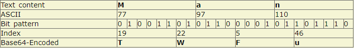

# 一、http

## 01、http常见的状态码有哪些

- 1xx 表示消息
- 2xx 表示成功
- 3xx 表示重定向
- 4xx 表示客户端错误
- 5xx 表示服务器错误

### 常见的状态码

- 101

  > 升级协议，如从http升级到ws，此时需要反向代理支持

- 200

  > 最喜欢见到的状态码，表示请求成功

- 301

  > 永久重定向：搜索引擎在抓取新的内容的是同也会将旧的网址替换为重定向之后的网址

- 302

  > 临时重定向：搜索引擎会抓取新的内容而保留旧的地址，因为服务器返回302，所以搜索引擎认为新的地址是暂时的

- 303

  > 与302一样，只是它希望使用GET方法重定向到新的URL上

- 304

  > 发送附带条件的请求时，条件不满足时返回，与重定向无关。例如：浏览器缓存中，服务器资源未改变，可直接使用客户端未过期的资源

- 400

> 错误的请求：一般指的是 `4xx`其他状态码没有更合适的情况下使用，毕竟客户端出错类型很多，无法准确把情况都定义好

- 401

  > 未被授权，需要身份验证，例如 `token`信息等

- 403

  > 请求被拒绝

- 404

  > 资源缺失，接口不存在，或请求的文件不存在等等

- 500

  > 服务器未知错误

- 502

  > 网关错误

- 503

  > 服务器暂时无法使用

- 肯定会遇到：101/200/301/302/304/400/401/403/404/500/502

### 101 Switch Protocol

升级协议，如从 http 到 ws，此时需要反向代理支持，如 Nginx，在 Nginx 配置 websockt 如下:

```
location / {  proxy_http_version 1.1;  proxy_set_header Upgrade $http_upgrade;  proxy_set_header Connection  $connection_upgrade;}
```

示例:


### 200 Ok

表示资源请求成功，也是最常见到的状态码

示例:

```
$ curl https://shanyue.tech --headHTTP/2 200
```

### 201 Created

资源创建成功，多用于 POST 请求

### 204 No Content

响应不会返回 Body，一般由以下两种情况

1. 与 Options/Delete 请求搭配
2. 打点类

示例一: 掘金为 Options 请求的状态码设置为 204


示例二: 知乎为 Delete 请求的状态码设置为 204，以下请求为取消关注


示例三: 当你在知乎看段子时，不妨打开控制台，会发现一个是 204 的状态码

```http
curl 'https://www.zhihu.com/sc-profiler' \  -H 'content-type: application/json' \  --data-binary '[["i","production.heifetz.main.desktop.v1.Collector.screen.1536_960.count",1,1]]' \  --compressed -vvv< HTTP/2 204< server: CLOUD ELB 1.0.0< date: Thu, 22 Oct 2020 07:46:30 GMT< content-type: text/html< vary: Accept-Encoding< x-backend-response: 0.002< cache-control: no-cache, no-store, must-revalidate, private, max-age=0
```

### 206 Partial Content

当请求多媒体数据数据较大时，会进行分片传输。当你在B站观看视频，打开开发者工具，会发现许多 206 状态码以及响应头 Content-Range

示例:


```http
$ curl www.bilibili.com -vvv< HTTP/1.1 301 Moved Permanently< Server: Tengine< Date: Thu, 22 Oct 2020 08:04:59 GMT< Content-Type: text/html< Content-Length: 239< Connection: keep-alive< Location: https://www.bilibili.com/
```

### 301 Moved Permanently

永久重定向。http 转向 https时，有时会使用 301，如 B 站。

```
$ curl www.bilibili.com -vvv< HTTP/1.1 301 Moved Permanently< Server: Tengine< Date: Thu, 22 Oct 2020 08:04:59 GMT< Content-Type: text/html< Content-Length: 239< Connection: keep-alive< Location: https://www.bilibili.com/
```

### 302 Found

暂时重定向。http 转向 https时，有时也会使用 302，如知乎

```
$ curl www.zhihu.com -vvv< HTTP/1.1 302 Found< Location: https://www.zhihu.com/< Content-Length: 0< X-NWS-LOG-UUID: 16068764905156850032< Connection: keep-alive< Server: Lego Server< Date: Thu, 22 Oct 2020 08:20:29 GMT< X-Cache-Lookup: Return Directly
```

### 304 Not Modified

资源已被缓存，与之相关的响应头部有：

- `ETag`
- `last-modified`/`if-modified-since`

一般用作 `index.html` 等不带 hash 的资源，由于示例太多，这里就不举例了

### 307 Temporary Redirect

暂时重定向。也可作为 http 到 https 的重定向。还有一种用途用作 HSTS，当谷歌浏览器发现某 http 资源已被加入到 HSTS 列表，浏览器内部会通过 307 作重定向

示例:


> [http 状态码中 301，302和307有什么区别(opens in a new tab)](https://github.com/shfshanyue/Daily-Question/issues/37)

- 301，Moved Permanently。永久重定向，该操作比较危险，需要谨慎操作：如果设置了301，但是一段时间后又想取消，但是浏览器中已经有了缓存，还是会重定向。
- 302，Found。临时重定向，但是会在重定向的时候改变 method: 把 POST 改成 GET，于是有了 307
- 307，Temporary Redirect。临时重定向，在重定向时不会改变 method

### 400 Bad Request

对于服务器无法理解的参数，将会使用 400 作为返回码

示例一: 当 Content-Type: JSON 时，服务器解析 JSON 却失败

```
HTTP/1.1 400 Bad RequestContent-Length: 35{"message":"Problems parsing JSON"}
```

### 401 Unauthorized

当没有权限的用户请求需要带有权限的资源时，会返回 401，此时携带正确的权限凭证再试一次可以解决问题

有时认证失败也会返回 401

示例一: 知乎登录时密码不正确


示例二: Github中错误的凭证信息请求带权限资源

```
$ curl -i https://api.github.com -u foo:bar> HTTP/1.1 401 Unauthorized> {>   "message": "Bad credentials",>   "documentation_url": "https://developer.github.com/v3"> }
```

### 403 Forbidden

我就是不想让你访问，不管你的权限凭证是否正确！

> In summary, a 401 Unauthorized response should be used for missing or bad authentication, and a 403 Forbidden response should be used afterwards, when the user is authenticated but isn’t authorized to perform the requested operation on the given resource.

- [403与401状态码有什么区别(opens in a new tab)](https://stackoverflow.com/questions/3297048/403-forbidden-vs-401-unauthorized-http-responses)

### 404 Not Found

未找到资源

### 405 Method Not Allowed

我需要 POST 这条资源，你去 GET 个锤子

### 413 Payload Too Large

不要给我扔这么大的 Body，我处理不过来

### 418 I'm A Teapot

我是一个茶壶

我要抛咖啡，你却扔给我一个茶壶？

也可以用来处理不合法的参数校验，我想要个字符串，你给了我一个整数？

### 422 Unprocessable Entity

常用来处理不合法的参数校验。

Github 上给某个项目点赞时，故意设置一个不正确的参数命名，会返回状态码 422


### 429 Too Many Request

请求过多被限流。

超过某一个 API 的 Rate Limit 规则，会被限流，返回 429 状态码

示例: 在 Sentry 中异常上报过于频繁被限流

### 500 Internal Server Error

服务器内部错误，很有可能是应用层未捕获错误而导致整个服务挂掉

### 502 Bad Gateway

Nginx 上常见，从上游应用层未返回响应，上游应用层挂了

### 503 Service Unavailable

由于大量流量造成服务忙，稍等一下说不定就能用了

### 504 Gateway Timeout

网关超时，上游应用层迟迟未响应

## 02、http状态码中301，302和307有什么区别

- 301，永久重定向，该操作比较危险，需要谨慎操作：如果设置了301，但是一段时间后又想取消，但是浏览器中已经有了缓存，还是会重定向。
- 302，临时重定向，但是会在重定向的时候改变method：把POST改为GET，于是有了307
- 307，临时重定向，在重定向时不会改变method

## 03、http状态码502和504有什么区别

这两种异常状态都与网关Getway有关，首先明确两个概念

- Proxy（Getaway），反向代理层或者网关层，在公司级应用中一般使用Nginx扮演这个角色
- Application（upstream server）应用层服务，作为Proxy层的上游服务，在公司中一般为各种语言编写的服务应用，如Go/Java/Python/PHP/Node等

此时关于502与504的区别就很显而易见了

- `502 Bad Getaway`。一般表现为你自己写的应用层服务挂了，网关无法接收到相应
- `504 Bad Getaway`。一般表现为网关层服务（upstream）超时，如查库操作耗时十分钟，超过了Nginx配置的超时时间

## 04、简介http的缓存机制

http缓存分为以下两种，两者都是http响应头控制缓存

第一次请求：

 第二次请求相同网页：


1. 强制缓存

   ##### 强缓存：浏览器不会像服务器发送任何请求，直接从本地缓存中读取文件并返回Status Code: 200 OK

   

   


   > 200 form memory cache : 不访问服务器，一般已经加载过该资源且缓存在了内存当中，直接从内存中读取缓存。浏览器关闭后，数据将不存在（资源被释放掉了），再次打开相同的页面时，不会出现from memory cache。

   > 200 from disk cache： 不访问服务器，已经在之前的某个时间加载过该资源，直接从硬盘中读取缓存，关闭浏览器后，数据依然存在，此资源不会随着该页面的关闭而释放掉下次打开仍然会是from disk cache。

   > 优先访问memory cache,其次是disk cache，最后是请求网络资源

   与之相关的response header有两个

   - `Expires`

     如果过期时间在当前时间之后，则直接都本地缓存

     这个头部也是丧心病狂：使用绝对时间，且有固定的格式 [https://tools.ietf.org/html/rfc822#section-5.1(opens in a new tab)](https://tools.ietf.org/html/rfc822#section-5.1)

     ```
     Expires: Mon, 25 Oct 2021 20:11:12 GMT
     ```

   - `Cache-Control`，具有强大的缓存控制能力，`Cache-Control`会覆盖掉 `Expires`

     常用的有以下两个

     - `no-cache`，每次请求需要校验服务器资源的新鲜度（协商缓存）
     - `no-store`，不适用任何缓存，每次都直接读取最新。
     - `max-age=31536000`，浏览器在一年内都不需要向服务器请求资源（在失效时间之前都执行强制缓存）

2. 协商缓存

   Last-Modifed/If-Modified-Since和Etag/If-None-Match是分别成对出现的，呈一一对应关系

   **Etag/If-None-Match：**

   Etag：

   > Etag舒服http1.1属性，它由服务器生成返回给前端，用来帮助服务器控制web端的缓存验证。Apach中，Etag的值，默认是对文件的索引节（INode），大小（Size）和最后修改时间（MTime）进行Hash后得到的。

   If-None-Match：

   > 当资源过期时（Express过期/浏览器判断Cache-Control标识的max-age过期），浏览器发现响应头中带有，则再次请求服务器是请求头带上If-Node-Match（值是Etag）。服务器收到请求进行对比时，决定返回200或304

   **Last-Modified/If-Modified-Since**

   Last-Modified：

   > 服务器向浏览器发送最后的修改时间

   If-Modified-Since

   > 当资源过期时（Express过期/浏览器判断Cache-Control标识的max-age过期），浏览器发现响应头中带有Last-Modified，则再次请求时，请求头将带上If-Modified-Since（值是上一次响应头中），如果最后修改时间比If-Modified-Since大，说明资源被修改过，返回新的资源，HTTP200，否则304走缓存

   > Last-Modifed/If-Modified-Since的时间精度是秒，而Etag可以更精确。
   >
   > Etag优先级是高于Last-Modifed的，所以服务器会优先验证Etag
   >
   > Last-Modifed/If-Modified-Since是http1.0的头字段

## 05、http proxy的原理是什么

HTTP代理服务器会自动提取请求数据包的HTTP Request数据，并且把HTTP Response的数据转发给发送请求的客户端；HTTP代理服务器使用的端口通常是8080，如下图所示：


- 对于Web客户端来说，代理扮演的服务器角色，接收请求（Request），返回响应（Response）。
- 对于Web服务器来说，代理扮演的客户端角色，发送请求（Request），返回响应（Response）。

HTTP代理步骤

- 用户向代理发起TCP连接：
- 代理接收用户的连接，双方建立连接；
- 用户向代理发送HTTP请求，请求内容和没有HTTP代理的内容完全相同；
- 代理解析HTTP请求；
- 代理向服务器发起TCP连接；
- 服务器接收代理的连接；
- 代理向服务器发送HTTP请求（这个HTTP请求是基于用户的HTTP请求，可能会有修改）
- 服务器发送响应给代理；
- 代理相应给客户端

HTTP代理功能上名称的区别：

- 全匿名代理，不改变客户端的request fields（请求信息），使服务器端看来就像有个真正的客户浏览器在访问。客户端的真实IP是隐藏起来的。
- 普通匿名代理，能隐藏客户端的真实IP，但会更改客户端的request fields（请求信息），服务器端有可能会被认为使用了代理。
- 透明代理（简单代理），改变客户端的request fields（请求信息），并会传送真实IP地址。

不同HTTP代理的区别：

- 全匿名代理，不改变客户端的request fields（请求信息），使服务器端看来就像有个真正的客户浏览器在访问。客户端的真实IP是隐藏起来的。
- 普通匿名代理，能隐藏客户端的真实IP，但会更改客户端的request fields（请求信息），服务器端有可能会被认为使用了代理。
- 透明代理（简单代理），改变客户端的request fields（请求信息），并会传送真实IP地址。

HTTPS代理

HTTPS代理有多种做法，通常使用 `CONNECT method`，通过proxy建立一条隧道(隧道代理)，这样，`proxy无法解密数据`；此外，还有一种类似于中间人攻击的代理手法。

## 06、HTTP/2带来的加载优化

### 结论：

- 从HTTP/1.0到HTTP/2，都是利用TCP作为底层协议进行通讯的
- HTTP/1.1，增加了许多状态码，新增缓存处理方式，引入了长连接（keep-alive），减少了建立和关闭连接的消耗和延迟
- HTTP/2，引入了多路复用：连接共享，提高了连接的利用率，降低延迟。

### http的基本优化：

影响一个http请求的主要因素有两个：带宽和延迟

**带宽**：如果说我们还停留在拨号上网的阶段，带宽可能会成为一个比较严重影响请求的问题，但是现在网络基础建设已经使得带宽得到极大的提升，我们不再会担心由带宽而影响网速，那么就只剩下延迟了

- **浏览器阻塞（HOL blocking）**：浏览器会因为一些原因阻塞请求。浏览器对于同一个域名，同时只能有 4 ~6个连接（这个根据浏览器内核不同可能会有所差异），超过浏览器最大连接数限制，后续请求就会被阻塞
- **DNS 查询（DNS Lookup）**：浏览器需要知道目标服务器的 IP 才能建立连接。将域名解析为 IP 的这个系统就是 DNS。这个通常可以利用DNS缓存结果来达到减少这个时间的目的
- **建立连接（Initial connection）**：HTTP 是基于 TCP 协议的，浏览器最快也要在第三次握手时才能捎带 HTTP 请求报文，达到真正的建立连接，但是这些连接无法复用会导致每次请求都经历三次握手和慢启动。三次握手在高延迟的场景下影响较明显，慢启动则对文件类大请求影响较大

### HTTP1.0和HTTP1.1的一些区别

- **相应状态码：** HTTP/1.1 中新加入了大量的状态码
- **缓存处理：** 在http1.0主要使用If-Modified-Since，Expires来做缓存判断标准，HTTP1.1则引入了更多的缓存控制策略例如：Etag，If-None-Match等更多可供选择的缓存头来控制缓存
- **连接方式（长连接）**：HTTP1.0默认是用短链接，HTTP 1.1支持长连接（PersistentConnection）和请求的流水线（Pipelining）在一个TCP连接上可以传送多个HTTP请求和响应，减少了建立和关闭连接的消耗和延迟，在HTTP1.1中默认开启Connection： keep-alive，一定程度上弥补了HTTP1.0每次请求都要创建连接的缺点
- **带宽优化及网络连接的使用（206状态码）:**HTTP1.0中，存在一些浪费带宽的现象，例如客户端只是需要某个对象的一部分，而服务器却将整个对象送过来了，并且不支持断点续传功能，HTTP1.1则在请求头引入了**range头域**，它允许只请求资源的**某个部分**，即返回码是**206（Partial Content）**，这样就方便了开发者自由的选择以便于充分利用带宽和连接
- **Host头处理**，在HTTP1.0中认为每台服务器都绑定一个唯一的IP地址，因此，请求消息中的URL并没有传递主机名（hostname）。但随着虚拟主机技术的发展，在一台物理服务器上可以存在多个虚拟主机（Multi-homed Web Servers），并且它们共享一个IP地址。HTTP1.1的请求消息和响应消息都应支持Host头域，且请求消息中如果没有`Host`头域会报告一个错误（`400 Bad Request`）

### HTTP2.0和HTTP1.X相比的新特性

- **新的二进制格式（Binary Format）**,HTTP1.x的解析是基本文本。基于文本协议的格式解析存在天然缺陷，文本的表现形式有多样性，要做到健壮性考虑的场景必然很多，二进制则不同，只认0和1的组合。基于这种考虑HTTP2.0的协议解析决定采用二进制格式，实现方便且健壮。
- **多路复用（MultiPlexing）**，即连接共享，即每一个request都是是用作连接共享机制的。一个request对应一个id，这样一个连接上可以有多个request，每个连接的request可以随机的混杂在一起，接收方可以根据request的 id将request再归属到各自不同的服务端请求里面。
- **header压缩**，如上文中所言，对前面提到过HTTP1.x的header带有大量信息，而且每次都要重复发送，HTTP2.0使用encoder来减少需要传输的header大小，通讯双方各自cache一份header fields表，既避免了重复header的传输，又减小了需要传输的大小。
- **服务端推送（server push）**，同SPDY一样，HTTP2.0也具有server push功能。比如在请求一个html的时候，服务器可以一次性将html+其他资源一起返回

### HTTP2.0的多路复用

多路复用代替原来的序列和阻塞机制，所有就是请求的都是通过一个 TCP 连接并发完成。同时也很好的解决了浏览器限制同一个域名下的请求数量的问题。

在 HTTP/2 中，有了二进制分帧之后，HTTP/2 不再依赖 TCP 链接去实现多流并行了，在 HTTP/2 中：

- **同域名下所有通信都在单个连接上完成，同个域名只需要占用一个 TCP 连接，使用一个连接并行发送多个请求和响应**。
- **单个连接可以承载任意数量的双向数据流，单个连接上可以并行交错的请求和响应，之间互不干扰**。
- **数据流以消息的形式发送，而消息又由一个或多个帧组成，多个帧之间可以乱序发送，因为根据帧首部的流标识可以重新组装。每个请求都可以带一个 31bit 的优先值，0 表示最高优先级， 数值越大优先级越低**。

#### 帧（frame）和流（stream）

---

在 HTTP/2 中，有两个非常重要的概念：帧（frame）和流（stream）。

#### 帧（frame）

HTTP/2 中**数据传输的最小单位**，因此帧不仅要细分表达 HTTP/1.x 中的各个部份，也优化了 HTTP/1.x 表达得不好的地方，同时还增加了 HTTP/1.x 表达不了的方式。 每一帧都包含几个字段，有**length、type、flags、stream identifier、frame playload**等，其中type 代表帧的类型，在 HTTP/2 的标准中定义了 10 种不同的类型，包括上面所说的 HEADERS frame 和 DATA frame。此外还有： `PRIORITY`（设置流的优先级） `RST_STREAM`（终止流） `SETTINGS`（设置此连接的参数） `PUSH_PROMISE`（服务器推送） `PING`（测量 RTT） `GOAWAY`（终止连接） `WINDOW_UPDATE`（流量控制） `CONTINUATION`（继续传输头部数据）

在 HTTP 2.0 中，它把数据报的两大部分分成了 header frame 和 data frame。也就是头部帧和数据体帧。

#### 流（stream）

流： 存在于连接中的一个虚拟通道。流可以承载双向消息，每个流都有一个唯一的整数 ID。 HTTP/2 长连接中的数据包是不按请求-响应顺序发送的，一个完整的请求或响应(称一个数据流 stream，每个数据流都有一个独一无二的编号)可能会分成非连续多次发送。它具有如下几个特点：

- **双向性：同一个流内，可同时发送和接受数据**。
- **有序性：流中被传输的数据就是二进制帧 。帧在流上的被发送与被接收都是按照顺序进行的**。
- **并行性：流中的 二进制帧 都是被并行传输的，无需按顺序等待**。
- **流的创建：流可以被客户端或服务器单方面建立, 使用或共享**。
- **流的关闭：流也可以被任意一方关闭**。
- **HEADERS 帧在 DATA 帧前面**。
- **流的 ID 都是奇数，说明是由客户端发起的，这是标准规定的，那么服务端发起的就是偶数了**。

#### 发展历程

---

从 Http/0.9 到 Http/2 要发送多个请求，从**多个 Tcp 连接=>keep-alive=>管道化=>多路复用**不断的减少多次创建 Tcp 等等带来的性能损耗。

#### 多个 Tcp 连接

在最早的时候没有 `keep-alive`只能创建多个 `Tcp`连接来做多次请求。多次 http 请求效果如下图所示：


一次请求完成就会关闭本次的 Tcp 连接，下个请求又要从新建立 Tcp 连接传输完成数据再关闭，造成很大的性能损耗。

#### Keep-Alive

`Keep-Alive`解决的核心问题是： 一定时间内，同一域名多次请求数据，只建立一次 HTTP 请求，其他请求可复用每一次建立的连接通道，以达到提高请求效率的问题。这里面所说的一定时间是**可以配置**的，不管你用的是 `Apache`还是 `nginx`。 以往，浏览器判断响应数据是否接收完毕，是看连接是否关闭。在使用持久连接后，就不能这样了，这就要求服务器对持久连接的响应头部一定要返回 `content-length`标识 `body的`长度，供浏览器判断界限。有时，`content-length`的方法并不是太准确，也可以使用 `Transfer-Encoding: chunked` 头部发送一串一串的数据，最后由长度为 0 的 `chunked`标识结束。 多次 http 请求效果如下图所示：


上图：设置 Connection:Keep-Alive，保持连接在一段时间内不断开。

`Keep-Alive`还是存在如下问题：

- 串行的文件传输。
- 同域并行请求限制带来的阻塞（6~8）个

#### 管线化

HTTP 管线化可以克服同域并行请求限制带来的阻塞，它是建立在**持久连接**之上，是把所有请求一并发给服务器，但是服务器需要按照**顺序一个一个响应**，而不是等到一个响应回来才能发下一个请求，这样就节省了很多请求到服务器的时间。不过，HTTP 管线化**仍旧**有阻塞的问题，若上一响应迟迟不回，**后面的响应**都会被阻塞到。


上图：HTTPpipelining：建立多个连接

#### 多路复用

多路复用代替原来的序列和阻塞机制。所有就是请求的都是通过一个 TCP 连接并发完成。因为在多路复用之前所有的传输是基于基础文本的，在多路复用中是基于二进制数据帧的传输、消息、流，所以可以做到乱序的传输。多路复用对同一域名下所有请求都是基于流，所以不存在同域并行的阻塞。多次请求如下图：


上图：多路复用

#### 总结

**在 HTTP/2 中，有两个非常重要的概念，分别是帧（frame）和流（stream）**。

**帧代表着最小的数据单位，每个帧会标识出该帧属于哪个流，流也就是多个帧组成的数据流**。

**HTTP2 采用二进制数据帧传输，取代了 HTTP1.x 的文本格式，二进制格式解析更高效**。

多路复用代替了 HTTP1.x 的**序列和阻塞机制**，所有的相同域名请求都通过**同一个 TCP 连接并发**完成。**同一 Tcp 中可以发送多个请求，对端可以通过帧中的标识知道属于哪个请求。通过这个技术，可以避免 HTTP 旧版本中的队头阻塞问题，极大的提高传输性能**。

#### 参考

> [多路复用](https://link.juejin.cn/?target=https%3A%2F%2Fwww.kancloud.cn%2Fdigest%2Fweb-performance-http2%2F74825)

> [一文读懂 HTTP/2 及 HTTP/3 特性](https://link.juejin.cn/?target=https%3A%2F%2Fsegmentfault.com%2Fa%2F1190000018401534)

> [一文读懂 HTTP/2 特性](https://link.juejin.cn/?target=https%3A%2F%2Fzhuanlan.zhihu.com%2Fp%2F26559480)

> [浅析 HTTP/2 的多路复用](https://link.juejin.cn/?target=https%3A%2F%2Fsegmentfault.com%2Fa%2F1190000011172823)

## 07、http 1.1 中的 keep-alive 有什么作用

在 `http 1.1` 中，在响应头中设置 `keep-alive` 可以在一个 TCP 连接上发送多个 http 请求

1. 避免了重开 TCP 连接的开销
2. 避免了刷新时重新建立 SSL 连接的开销
3. 避免了QPS过大时，服务器的连接数过大

在服务器端使用响应头开启 `keep-alive`

```
Connection: Keep-AliveKeep-Alive: timeout=5, max=1000
```

## 08、什么是队首阻塞，如何解决，原理如何

队首阻塞包含http应用层协议上的队首阻塞和tcp传输层的队首阻塞

1. http应用层协议上的队首阻塞: 以http1.1为例，一个tcp连接一次只能处理一个请求，如果接受端处理慢的话，后面的请求就得排队，这是导致队首阻塞的根本原因 虽然http1.1提出了管线技术，支持同时发起多个请求出去，但是又限制了接收端返回必须得按照顺序，所以这项技术也未能解决队首阻塞。

http2.0 提出了 frame 和 stream的概念， 把请求数据分成了不同的二进制frame，有strameid标识，包装进不同的stream通过同一个tcp管道进行并发的多路复用传输， 接收端根据streamid来进行组装，解决了队首阻塞的问题。

但是依然没有解决tcp传输层的队首阻塞，如果过程中一个包丢了，需要重传，就需要后面的包等待了

### 09、简述你们前端项目中资源的缓存配置策略

1. html设置协商缓存
2. 静态资源 hash + 强缓存

## 10、no-cache 与 no-store 的区别是什么

no-cache 可以在本地缓存，可以在代理服务器缓存，但是这个缓存要服务器验证才可以使用 no-store 是禁用缓冲，本地和代理服务器都不缓冲，每次都从服务器获取

> Author 回答者: [shfshanyue(opens in a new tab)](https://github.com/shfshanyue)

`no-cache` 和 `no-store` 用作控制缓存，被服务器通过响应头 `Cache-Control` 传递给客户端

### `no-store`

**永远都不要在客户端存储资源**，每次永远都要从原始服务器获取资源

### `no-cache`

可以在客户端存储资源，但每次都**必须去服务器做新鲜度校验**，来决定从服务器获取最新资源 (200) 还是从客户端读取缓存 (304)，即所谓的协商缓存

> [当服务器资源返回 304 时与那些 HTTP 响应头有关(opens in a new tab)](https://github.com/shfshanyue/Daily-Question/issues/441)

一般情况下对于 `index.html` 或者现代构建环境下不加 hash 的静态资源都需要设置 `Cache-Control: no-cache`，用来强制每次在服务器端的新鲜度校验。

相当于以下响应头

```htt
Cache-Control: max-age=0, must-revalidate
```

## 11、什么是 Basic Auth 和 Digest Auth

### Basic Auth

使用Base64编码的用户名和密码，将其放置在HTTP请求头中进行身份验证

### Digest Auth

使用摘要（Digest）算法，将密码使用算法加密后放在HTTP请求头中进行身份验证；

比较流行的还是Token-based Auth。 Token-based Auth：使用令牌（Token），客户端在登录成功后获取令牌，之后的请求中将令牌包含在请求头中进行身份验证。

一句话：`gzip` 的核心是 `Deflate`，而它使用了 `LZ77` 算法与 `Huffman` 编码来压缩文件，重复度越高的文件可压缩的空间就越大。

因此 `gzip` 用于 HTTP 文件传输中，比如 JS、CSS 等，**但一般不会压缩图片**。在 HTTP Response 报文中，用 `Content-Encoding` 指明使用 gzip 压缩，而以下响应头在大部分生产环境的响应报文中都可以看到！比如你现在立刻马上可以打开[我的网站(opens in a new tab)](https://q.shanyue.tech/)或者[百度(opens in a new tab)](https://www.baidu.com/)试一试。

```
# Request HeaderAccept-Encoding: gzip, deflate, br # Reponse HeaderContent-Encoding: gzip
```

`gzip` 一般在反向代理那一层，如 `nginx` 进行处理，直接使用 C 语言编写，具有更好的性能。

在 `nginx` 开启 `gzip`: 配置可参考 [gzip module(opens in a new tab)](http://nginx.org/en/docs/http/ngx_http_gzip_module.html)

```
gzip on;
```

### LZ77

### Huffman

### 相关阅读

- [gzip原理与实现](https://blog.csdn.net/imquestion/article/details/16439)

## 13、可以对图片开启 gzip 压缩吗，为什么

不需要开启，如果开启的话，有可能使图片变的更大。如果你注意一些网站的 img 资源时，就会发现他们都没有开启 `gzip` 

## 14、http 的请求报文与响应报文的格式是什么

HTTP的请求报文由四部分组成（请求行+请求头部+空行+请求体）：

**真实数据**


TTP的响应报文也由四部分组成（ 响应行+响应头+空行+响应体）：


**真实数据**


## 15、HTTP响应头中的Etag值是如何生成的

关于 `etag`的生成需要满足几个条件

1. 当文件更改时，`etag`值必须改变
2. 尽量便于计算，不会特别耗CPU。这样利用摘要算法生成需要慎重考虑，因为他们是CPU密集型运算。
3. 必须横向扩展，分布式部署时多个服务器节点上生成 `etag`值保持一致，这样子 `inode`就排除了

> 关于服务器中 `etag` 如何生成可以参考 [HTTP: Generating ETag Header(opens in a new tab)](https://stackoverflow.com/questions/4533/http-generating-etag-header)

以上几个条件是理论上的成立条件，那在真正实践中，应该如何处理？

我们来看一下 `nginx` 中是如何做的

### nginx 中 ETag 的生成

我翻阅了 `nginx` 的源代码，并翻译成伪代码如下：由 `last_modified` 与 `content_length` 拼接而成

```
etag = header.last_modified + header.content_lenth;
```

可见源码位置，并在以下贴出: [ngx_http_core_modules.c(opens in a new tab)](https://github.com/nginx/nginx/blob/6c3838f9ed45f5c2aa6a971a0da3cb6ffe45b61e/src/http/ngx_http_core_module.c#L1582)

```
etag->value.len = ngx_sprintf(etag->value.data, "\"%xT-%xO\"",                                  r->headers_out.last_modified_time,                                  r->headers_out.content_length_n)                      - etag->value.data;
```

**总结：`nginx` 中 `etag` 由响应头的 `Last-Modified` 与 `Content-Length` 表示为十六进制组合而成。**

随手在我的k8s集群里找个 `nginx` 服务测试一下

```
$ curl --head 10.97.109.49HTTP/1.1 200 OKServer: nginx/1.16.0Date: Tue, 10 Dec 2019 06:45:24 GMTContent-Type: text/htmlContent-Length: 612Last-Modified: Tue, 23 Apr 2019 10:18:21 GMTConnection: keep-aliveETag: "5cbee66d-264"Accept-Ranges: bytes
```

由 `etag` 计算 `Last-Modified` 与 `Content-Length`，使用 `js` 计算如下，结果相符

```
> new Date(parseInt('5cbee66d', 16) * 1000).toJSON()"2019-04-23T10:18:21.000Z"> parseInt('264', 16)612
```

### Nginx 中的 ETag 算法及其不足

 协商缓存用来计算资源是否返回304，我们知道协商缓存有两种方式

- `Last-Modified/Last-Modified-Since`
- `Etag/If-Node-Match`

既然在 `nginx` 中 `ETag` 由 `Last-Modified` 和 `Content-Length` 组成，那它便算是一个加强版的 `Last-Modified` 了，那加强在什么地方呢？

**`Last-Modified` 是由一个 `unix timestamp` 表示，则意味着它只能作用于秒级的改变，而 nginx 中的 ETag 添加了文件大小的附加条件**

## 17、http 服务中静态文件的 Last-Modified 是根据什么生成的

一般会选文件的 `mtime`，表示文件内容的修改时间

`nginx` 也是这样处理的，源码见: [ngx_http_static_module.c(opens in a new tab)](https://github.com/nginx/nginx/blob/4bf4650f2f10f7bbacfe7a33da744f18951d416d/src/http/modules/ngx_http_static_module.c#L217)

```
    r->headers_out.status = NGX_HTTP_OK;    r->headers_out.content_length_n = of.size;    r->headers_out.last_modified_time = of.mtime;
```

关于为什么使用 `mtime` 而非 `ctime`，可以参考 [#116(opens in a new tab)](https://github.com/shfshanyue/Daily-Question/issues/117)

> Author 回答者: [feefeefee(opens in a new tab)](https://github.com/feefeefee)

针对静态资源而言，一般会选择文件的 mtime 元属性作为上次修改时间，该元属性表示文件内容的修改时间，在linux中可以用stat命令来查看文件属性，其中就包括了mtime和ctime。mtime指的是文件内容修改时间，而ctime指的是文件修改时间

## 18、既然 http 是无状态协议，那它是如何保持登录状态

通过 cookie 或者 Authorization header 来传递凭证，在服务端进行认证

## 19、https 是如何保证报文安全的

### 1. HTTP存在的问题

传统的不使用 `SSL/TLS`的HTTP协议，是不加密的通信。无论是客户端发送给服务端的请求体，还是服务端响应给客户端的响应体，都是明文传输的，这会带来几个问题：

**1. 窃听** 第三方劫持请求后可以获取通信内容。对于一些敏感数据，这是不被允许的。

**2. 篡改** 第三方劫持请求后可以篡改通信内容。例如银行系统中，张三本来要给李四转账，第三方劫持请求后篡改了请求数据，将收款方改为自己，导致用户资金流失。

**3. 冒充** 第三方可以冒充客户端发送数据。由于是明文传输，没有「加签/验签」操作，服务端无法保证请求来源的合法性。

正是因为这些问题，HTTP通信存在巨大的安全隐患，于是HTTPS出现了。 本文将一步步深入，看看HTTPS是如何解决这些问题的。

### 2. SSL/TLS

在介绍HTTPS之前，必须先了解SSL/TLS协议，因为HTTPS是构建在此基础之上的，了解了SSL/TLS基本也就清楚HTTPS的工作原理了。

SSL（Secure Sockets Layer）译为「安全套接字协议」，TLS（Transport Layer Security）译为「传输层安全性协议」。

简单回顾一下它们的发展历史吧：

- 1994年，网景公司设计了SSL协议（Secure Sockets Layer）的1.0版，但是未发布。
- 1995年，网景公司发布SSL 2.0版，但很快发现有严重漏洞。
- 1996年，SSL 3.0版问世，得到大规模应用。
- 1999年，互联网标准化组织ISOC接替网景公司，发布了SSL的升级版TLS 1.0版。
- 2006年和2008年，TLS进行了两次升级，分别为TLS 1.1版和TLS 1.2版。

SSL/TLS协议处于「传输层」和「应用层」之间，主要作用是对网络连接进行加解密，如下图： 

#### 2.1 防窃听：加密

先来看看第一个问题：窃听。既然明文传输可以被第三方窃听数据，那么改为加密传输不就行了吗？ 方向是对的，但是如何加密才能保证数据的安全呢？

##### 2.1.1 对称加密

> 采用单钥密码系统的加密方法，同一个密钥可以同时用作信息的加密和解密，这种加密方法称为对称加密，也称为单密钥加密。

例如DES就是一种对称加密算法，甲乙双方约定一个密钥「Key」，双方发送数据前都用该密钥对数据进行加密传输，收到数据后再解密成明文即可。这种方式，只要保证密钥不被泄漏，理论上也是安全的。


但是这会带来一个新的问题：**密钥如何保存？**

对于PC端来说，浏览器页面是明文的，肯定不能存储密钥。对于iOS/Android来说，即使把密钥藏在安装包的某个位置，也很容易被第三方拆包破解。

既然客户端保存不靠谱，那么密钥只在服务端保存，客户端去向服务端拿密钥是否可行？

依然不可行，服务端要怎么把密钥给你呢？明文肯定不行，如果要加密，又要用到密钥B，密钥B的传输又要用到密钥C，如此循环，无解。

##### 2.1.2 非对称加密

> 非对称加密算法需要两个密钥：公开密钥（publickey:简称公钥）和私有密钥（privatekey:简称私钥）。公钥与私钥是一对，如果用公钥对数据进行加密，只有用对应的私钥才能解密。因为加密和解密使用的是两个不同的密钥，所以这种算法叫作非对称加密算法。

甲乙双方各有一套自己的密钥对，互相公开彼此的公钥，当甲方要发送数据给乙方时，用乙方公钥加密，这样密文就只有乙方自己能解开了，就算请求被劫持，第三方拿到了数据，由于没有乙方的私钥，也无法解密，这样就保证了数据被窃听。

**单向非对称加密** 绝大多数互联网网站对外是完全公开的，所有人都可以访问，服务端没必要验证所有客户端的合法性，只有客户端需要验证服务端的合法性。例如用户在访问电商网站时，必须确保不是钓鱼网站，以防资金损失。

这种情况下，只需要单向加密即可。服务端发送给客户端的一般不会有敏感信息，明文传输即可。但是客户端发送给服务端的就很有可能是敏感信息，例如用户修改密码，这时就必须加密传输了。 

**双向非对称加密** 有时，服务端也需要验证客户端的合法性，例如银行系统。由于涉及到金钱，因此系统必须设计的足够安全。除了客户端发送给服务端的数据是加密的，服务端发送给客户端的数据也必须加密。

怎么做的呢？一般银行会给用户一个U盘，里面存储的就是一套密钥对，客户端告诉服务端自己的公钥，服务端根据公钥加密后再传输给客户端。 

#### 2.2 防篡改：加签

通过非对称加密的密文传输，可以防止数据被窃听，但是如果存在这种场景呢？

张三登陆银行系统，要给李四转一笔钱，数据通过服务端的公钥PubB加密传输，但是第三方劫持了这个请求，篡改了报文数据，写入的是「给王五转钱」，因为服务端的公钥是公开的，谁都能拿到，因此第三方也可以正常加密传输，服务端正常解密后进行了错误的操作，导致用户资金流失。 

对于涉及到资金的操作，服务端必须要验证数据的合法性，确保数据没有被篡改，这就需要客户端对数据进行加签了。

非对称加密除了可以「公钥加密，私钥解密」外，还可以「私钥加签，公钥验签」。

银行给用户一个U盘，里面有一套密钥对。客户端在发送转账请求前，先对请求体 加签，得到签名「sign」，然后再用服务端公钥加密，得到密文「data」，客户端将签名和密文一起发送给服务端，服务端解密后，还需要用客户端的公钥对「sign」进行验签，只有验签通过才能进行后续操作，否则就是非法请求了。  这样，即使请求被第三方劫持了，第三方可以篡改数据，但是签名它改不了，服务端解密后会发现数据和「sign」对不上，说明数据是被篡改过的。

#### 2.3 防冒充：证书

通过加密防止数据被窃听，通过加签防止数据被篡改，现在看来好像已经很安全了，但是别忘了，有个前提是：公钥的传输是安全的。不幸的是，公钥的安全传输很难保证。

**中间人攻击** 假设存在这样一种场景，客户端和服务端想互换公钥，但是请求都被一个中间人劫持了，结果就是：服务端和客户端以为是和双方互换公钥了，结果是客户端和服务端都和中间人互换公钥了。  一旦出现这种问题就非常严重，前面讲到的加密解密、加签验签都失效了。客户端以为中间人就是服务端，服务端以为中间人就是客户端，双方以为是在和对方通信，其实都是在和中间人通信，中间人可以随意的窃听和篡改数据。

这个问题之所以会出现，就是因为公钥的传输是不安全的。客户端和服务端之间互换公钥时，如何确保公钥就是对方发出的，没有被篡改过呢？？？

##### 2.3.1 数字证书与认证中心

在之前的基础上，引入一个中间角色：证书认证中心CA。当服务端要把公钥发送给客户端时，不是直接发送公钥，而是先把公钥发送给CA，CA根据公钥生成一份「证书」给到服务端，服务端将证书给客户端。客户端拿到证书后去CA验证证书的合法性，确保证书是服务端下发的。

CA就类似于「公证处」，也是一台服务器，它自己本身也有一套密钥对。它的工作就是根据服务端的公钥生成证书，然后帮助客户端来验证证书的合法性。 

##### 2.3.2 CA被冒充怎么办？

引入CA可以保证公钥的传输安全，但是有一个前提，客户端和服务端是信任CA的，也就是说CA必须是安全可信任的，如果CA被冒充，就又会出现上面的问题。  基于这个问题，就引入了「根证书」和「CA信任链」的概念。

要让客户端和服务端信任CA，其实CA也面临着同样的问题，那就是：如何保证CA的公钥是安全不被篡改的？答案也是一样的，就是给CA也颁发证书，那这个证书由谁来颁发呢？自然是CA的上一级CA了。CA的上一级CA如何保证安全？那就CA的上一级CA的上一级CA给它颁发证书了。最终就会形成一个证书信用链，如下：  客户端要想验证服务器的C3证书是否合法，会跑去CA2验证，要验证CA2就去CA1验证，以此类推。对于根证书，是没法验证的，只能无条件相信。因为Root CA都是国际上公认的机构，一般用户的操作系统或浏览器在发布时，就会在里面嵌入这些机构的Root证书。

如下是百度官网的证书，点击浏览器地址栏旁边的锁标识就能看到了。 

#### 2.4 SSL/TLS 四次握手

了解了底层的实现，加密、加签、证书等概念后，再来看SSL/TLS协议就很容易理解了。SSL/TLS需要四次握手的过程：

##### 1）客户端发出请求Client Hello

首先，客户端先向服务器发出加密通信的请求，这被叫做clienthello请求。

在这一步，客户端主要向服务器提供以下信息：

- 支持的**协议版本**，比如TLS1.0版本；
- 支持的**加密方法**，比如RSA公钥加密；
- 一个客户端生成的**随机数**(client random), 稍后用于生成对话密钥(session key)

由于客户端(如浏览器)对一些加解密算法的支持程度不一样，但是**在TLS协议**传输过程中必须使用**同一套加解密算法**才能保证数据能够正常的加解密。在TLS握手阶段，客户端首先要告知服务端，自己支持哪些加密算法，所以客户端需要将**本地支持的加密套件(Cipher Suite)的列表**传送给服务端。除此之外，客户端还要产生**一个随机数**，这个随机数一方面需要在客户端保存，另一方面需要传送给服务端，客户端的随机数需要跟服务端产生的随机数结合起来产生后面要讲到的Master Secret。

##### （2）服务器回应Server Hello

服务器收到客户端请求后，向客户端发出回应，这叫做serverhello。

这一步服务器主要干三件事：

- 确认使用的**加密通信协议版本**，比如TLS1.00版本。如果游览器与服务器支持的版本不一致，服务器关闭加密通信；
- 确认使用的**加密方法**（客户端所支持），比如RSA公钥加密；
- 将**服务器证书**、**非对称加密的公钥**，以及**一个随机数(Server random)**发送给客户端游览器

服务端在接收到客户端的Client Hello之后，服务端需要将**自己的证书**发送给客户端。这个证书是对于服务端的一种认证。例如，客户端收到了一个来自于称自己是[http://www.alipay.com](https://link.zhihu.com/?target=http%3A//www.alipay.com)的数据，但是如何证明对方是合法的alipay支付宝呢？这就是证书的作用，支付宝的证书可以证明它是alipay，而不是财付通。证书是需要申请，并由专门的数字证书认证机构(CA)通过非常严格的审核之后颁发的电子证书。**颁发证书的同时会产生一个私钥和公钥。私钥由服务端自己保存，不可泄漏。公钥则是附带在证书的信息中，可以公开的**。**证书本身也附带一个证书电子签名**，这个签名用来验证证书的完整性和真实性，可以防止证书被串改。另外，证书还有个有效期。

##### （3）客户端回应

客户端收到服务器回应以后，首先验证服务器证书，验证手段就是执行如下三种检查：

- **检查证书是否已过期**；
- **检查证书中的域名与实际域名是否一致**；
- **检查证书是否是可信机构颁布的；**

如果，上述过程中有任何一个环节发现问题，那么浏览器就会向访问者显示一个警告，由其选择是否还要继续通信。如果证书受信任，或者是用户接受了不受信的证书，**浏览器会生成一串新的随机数（Premaster secret ），并用证书中提供的公钥加密，发送给服务器**。

此时，浏览器会根据前三次握手中的三个随机数：

- **Client random**
- **Server random**
- **Premaster secret**

通过一定的算法来**生成 “会话密钥” （Session Key）**，这个会话密钥就是接下来双方进行**对称加密解密**使用的密钥！

##### （4）服务端回应

服务端收到客户端的回复，利用已知的加密解密方式进行解密，服务器收到客户端的第三个随机数（ Premaster secret） 之后，使用同样的算法计算出 “会话密钥” （Session Key）。

至此，整个握手阶段全部结束。接下来，客户端与服务器进入加密通信，就完全是使用普通的 HTTP 协议，只不过用 “会话密钥” 加密内容。（非对称加密解密将不再使用，接下来完全由对称加密接手了，因为密钥已经安全的传送给了通信的双方）


### 3. 再看HTTPS

了解SSL/TLS，再回过头来看HTTPS就很简单了，HTTPS=HTTP+SSL/TLS。

使用HTTPS进行通信时，先是建立传输层TCP的连接，完成三次握手，然后再是SSL/TLS协议的四次握手，双方协商出对称加密的密钥，之后的通信数据会利用该密钥进行加密传输。  HTTP1.1开始支持长连接了，只要连接不关闭，七次握手只需要执行一次，性能损耗不会太大，而且数据传输采用的是对称加密，相比于非对称加密，性能损耗也小得多。因此HTTPS相比于HTTP，性能会有一定影响，但不会太大，相比之下，数据传输安全显得更加重要！

总结

## 20、我们如何从 http 的报文中得知该服务使用的技术栈

一般有两个 response header，有时服务端为了隐蔽自己真实的技术栈会隐蔽这两个字段

- `X-Powerd-By`：用于指示生成该响应的技术或框架。例如，如果一个网站是用 PHP 编写的，那么 `X-Powered-By` 字段可能会设置为 `PHP/7.2.1`。这给了我们一个线索，让我们知道正在运行的是哪个版本的 PHP。
- `Server`：服务器信息，例如：`Server: Apache/2.4.27(Win32)0pensSL/1.0.21 PHP/7.1.8`在 Windows 系统， Apache服务下，编程语言为 php。

## 21、在发送 http 请求报文时，Host 是必要的吗

是有必要的，因为我们不知道会途径会不会有代理出现， 如果直接到达服务器的话，服务器是可以通过路径知道资源在哪，但是如果通过代理的话，代理无法得知具体服务器是什么地址

## 24、http 响应头中的 Date 与 Last-Modified 有什么不同，网站部署时需要注意什么

- `Date`: 报文在源服务器的产生时间，由此可查看报文已缓存了多久时间
- `Last-Modified`: 源服务器上资源的上次修改时间

## 25、http 1.1 中的 keep-alive 有什么作用

在 `http 1.1` 中，在响应头中设置 `keep-alive` 可以在一个 TCP 连接上发送多个 http 请求

1. 避免了重开 TCP 连接的开销
2. 避免了刷新时重新建立 SSL 连接的开销
3. 避免了QPS过大时，服务器的连接数过大

在服务器端使用响应头开启 `keep-alive`

```http
Connection: Keep-Alive
Keep-Alive: timeout=5, max=1000
```

- `timeout`：指定了一个空闲连接需要保持打开状态的最小时长（以秒为单位）。需要注意的是，如果没有在传输层设置 keep-alive TCP message 的话，大于 TCP 层面的超时设置会被忽略。
- `max`：在连接关闭之前，在此连接可以发送的请求的最大值。在非管道连接中，除了 0 以外，这个值是被忽略的，因为需要在紧跟着的响应中发送新一次的请求。HTTP 管道连接则可以用它来限制管道的使用。

## 26、https 中如何保证证书是可信任的

数字签名

数字签名的原理其实很简单，就是把公钥私钥的用法反过来，之前是公钥加密、私钥解密，现在是私钥加密、公钥解密。但又因为非对称加密效率太低，所以私钥只加密原文的摘要，这样运算量就小的多，而且得到的数字签名也很小，方便保管和传输。

数字证书和CA

因为公钥是任何人都可以发布的，所以我们需要引入第三方来保证公钥的可信度，这个“第三方”就是我们常说的 CA（Certificate Authority，证书认证机构），CA 对公钥的签名认证也是有格式的，要包含公钥的序列号、用途、颁发者、有效时间等等，把这些打成一个包再签名，完整地证明公钥关联的各种信息，形成“数字证书”（Certificate）。小一点的 CA 可以让大 CA 签名认证，但链条的最后，也就是 Root CA，就只能自己证明自己了，这个就叫“自签名证书”（Self-Signed Certificate）或者“根证书”（Root Certificate）。你必须相信，否则整个证书信任链就走不下去了。

## 27、CSP是干什么用的

`CSP` **只允许加载指定的脚本及样式**，**最大限度地防止 `XSS` 攻击**，是解决 XSS 的最优解。CSP 的设置根据加载页面时 http 的响应头 `Content Security Policy` 在服务器端控制。

1. 外部脚本可以通过指定域名来限制：**`Content-Security-Policy: script-src 'self'`**，`self` 代表只加载当前域名
2. 如果网站必须加载内联脚本 (inline script) ，则可以提供一个 `nonce` 才能执行脚本，攻击者则无法注入脚本进行攻击。**`Content-Security-Policy: script-src 'nonce-xxxxxxxxxxxxxxxxxx'`**

通过 `devtools -> network` 可见 github 的 CSP 配置如下：

```http
Content-Security-Policy: default-src 'none';  base-uri 'self';  block-all-mixed-content;  connect-src 'self' uploads.github.com www.githubstatus.com collector.githubapp.com api.github.com www.google-analytics.com github-cloud.s3.amazonaws.com github-production-repository-file-5c1aeb.s3.amazonaws.com github-production-upload-manifest-file-7fdce7.s3.amazonaws.com github-production-user-asset-6210df.s3.amazonaws.com cdn.optimizely.com logx.optimizely.com/v1/events wss://alive.github.com;  font-src github.githubassets.com;  form-action 'self' github.com gist.github.com;  frame-ancestors 'none';  frame-src render.githubusercontent.com;  img-src 'self' data: github.githubassets.com identicons.github.com collector.githubapp.com github-cloud.s3.amazonaws.com *.githubusercontent.com;  manifest-src 'self';  media-src 'none';  script-src github.githubassets.com;  style-src 'unsafe-inline' github.githubassets.com;  worker-src github.com/socket-worker.js gist.github.com/socket-worker.js
```

### 资源加载限制

以下选项限制各类资源的加载。

> - **`script-src`**：外部脚本
> - **`style-src`**：样式表
> - **`img-src`**：图像
> - **`media-src`**：媒体文件（音频和视频）
> - **`font-src`**：字体文件
> - **`object-src`**：插件（比如 Flash）
> - **`child-src`**：框架
> - **`frame-ancestors`**：嵌入的外部资源（比如`<frame>`、`<iframe>`、`<embed>`和`<applet>`）
> - **`connect-src`**：HTTP 连接（通过 XHR、WebSockets、EventSource等）
> - **`worker-src`**：`worker`脚本
> - **`manifest-src`**：manifest 文件

### default-src

`default-src`用来设置上面各个选项的默认值。

> ```http
> Content-Security-Policy: default-src 'self'
> ```

上面代码限制**所有的**外部资源，都只能从当前域名加载。

如果同时设置某个单项限制（比如 `font-src`）和 `default-src`，前者会覆盖后者，即字体文件会采用 `font-src`的值，其他资源依然采用 `default-src`的值。

### 相关链接

- [Content Security Policy 入门教程 - 阮一峰(opens in a new tab)](http://www.ruanyifeng.com/blog/2016/09/csp.html)
- [Content Security Policy - w3(opens in a new tab)](https://www.w3.org/TR/CSP3/#directive-form-action)

> Author 回答者: [zzetao(opens in a new tab)](https://github.com/zzetao)

## 28、http2 中的首部压缩的实现原理是什么

`HPACK` 协议，其中原理是**哈夫曼编码**及**索引表** (看来常用的数据结构及算法要有所了解)，以下内容摘自 [谷歌开发者文档：http2(opens in a new tab)](https://developers.google.com/web/fundamentals/performance/http2/)

> 每个 HTTP 传输都承载一组标头，这些标头说明了传输的资源及其属性。 在 HTTP/1.x 中，此元数据始终以纯文本形式，通常会给每个传输增加 500–800 字节的开销。如果使用 HTTP Cookie，增加的开销有时会达到上千字节。 （请参阅测量和控制协议开销。） 为了减少此开销和提升性能，HTTP/2 使用 HPACK 压缩格式压缩请求和响应标头元数据，这种格式采用两种简单但是强大的技术：
>
> 1. 这种格式支持通过静态霍夫曼代码对传输的标头字段进行编码，从而减小了各个传输的大小。
> 2. 这种格式要求客户端和服务器同时维护和更新一个包含之前见过的标头字段的索引列表（换句话说，它可以建立一个共享的压缩上下文），此列表随后会用作参考，对之前传输的值进行有效编码。

实践出真知，通过 `wireshark` 抓包分析 http2 的报文对理解 http2 收益颇多。

> 你要有知识，你就得参加变革现实的实践。你要知道梨子的滋味，你就得变革梨子，亲口吃一吃。你要知道原子的组织同性质，你就得实行物理学和化学的实验，变革原子的情况。你要知道革命的理论和方法，你就得参加革命。

以下是关于抓包信息的截图

**http2 通过 `Settings` 帧设置 header table size，进行首部压缩**


**http2 通过首部压缩后，:method 伪标头在索引表中的 Index 为 2**


关于**常用的标头会存储在静态索引表固定的位置**，详见 [https://httpwg.org/specs/rfc7541.html#static.table.definition(opens in a new tab)](https://httpwg.org/specs/rfc7541.html#static.table.definition)


## 29、http 请求头中的 X-Forwarded-For 代表什么意思

`X-Forwarded-For` 被反向代理器生成，如 nginx，traefik 等，一般用作标识客户端真实的 IP 地址，目前已成为事实上的标准。

### base64算法

1. 将每三个字节作为一组，一共是24个二进制位。
2. 将这24个二进制位分为四组，每个组有6个二进制位。
3. 在每组前面加 `00`，扩展成32个二进制位，即四个字节。
4. 根据下表，得到扩展后的每个字节的对应符号，这就是Base64的编码值。

> 　　　　0　A　　17　R　　　34　i　　　51　z
>
> 　　　　1　B　　18　S　　　35　j　　　52　0
>
> 　　　　2　C　　19　T　　　36　k　　　53　1
>
> 　　　　3　D　　20　U　　　37　l　　　54　2
>
> 　　　　4　E　　21　V　　　38　m　　　55　3
>
> 　　　　5　F　　22　W　　　39　n　　　56　4
>
> 　　　　6　G　　23　X　　　40　o　　　57　5
>
> 　　　　7　H　　24　Y　　　41　p　　　58　6
>
> 　　　　8　I　　　25　Z　　　42　q　　　59　7
>
> 　　　　9　J　　26　a　　　43　r　　　60　8
>
> 　　　　10　K　　27　b　　　44　s　　　61　9
>
> 　　　　11　L　　28　c　　　45　t　　　62　+
>
> 　　　　12　M　　29　d　　　46　u　　　63　/
>
> 　　　　13　N　　30　e　　　47　v
>
> 　　　　14　O　　31　f　　　48　w　　　
>
> 　　　　15　P　　32　g　　　49　x
>
> 　　　　16　Q　　33　h　　　50　y

因为，Base64将三个字节转化成四个字节，因此Base64编码后的文本，会比原文本大出三分之一左右。

举一个具体的实例，演示英语单词Man如何转成Base64编码。



1. 第一步，"M"、"a"、"n"的 `ASCII`值分别是77、97、110，对应的二进制值是01001101、01100001、01101110，将它们连成一个24位的二进制字符串010011010110000101101110。
2. 第二步，将这个24位的二进制字符串分成4组(010011,010110,000101,101110)，每组6个二进制位：010011、010110、000101、101110。
3. 第三步，在每组前面加两个00，扩展成32个二进制位，即四个字节：00010011、00010110、00000101、00101110。它们的十进制值分别是19、22、5、46。
4. 第四步，根据上表，得到每个值对应Base64编码，即T、W、F、u。

如果字节数不足三，则这样处理：

> a）二个字节的情况：将这二个字节的一共16个二进制位，按照上面的规则，转成三组，最后一组除了前面加两个0以外，后面也要加两个0。这样得到一个三位的Base64编码，再在末尾补上一个"="号。
>
> 比如，"Ma"这个字符串是两个字节，可以转化成三组00010011、00010110、00000100以后，对应Base64值分别为T、W、E，再补上一个"="号，因此"Ma"的Base64编码就是TWE=。

> b）一个字节的情况：将这一个字节的8个二进制位，按照上面的规则转成二组，最后一组除了前面加二个0以外，后面再加4个0。这样得到一个二位的Base64编码，再在末尾补上两个"="号。
>
> 比如，"M"这个字母是一个字节，可以转化为二组00010011、00010000，对应的Base64值分别为T、Q，再补上二个"="号，因此"M"的Base64编码就是TQ==。

### 中文转码问题 

这一节介绍如何用Javascript语言进行Base64编码。

首先，假定网页的编码是utf-8，我们希望对于同样的字符串，用PHP和Javascript可以得到同样的Base64编码。

这里就会产生一个问题。因为Javascript内部的字符串，都以utf-16的形式进行保存，因此编码的时候，我们首先必须将utf-8的值转成utf-16再编码，解码的时候，则是解码后还需要将utf-16的值转回成utf-8。

网上已经有人写好了现成的Javascript函数：

```javascript
/* utf.js - UTF-8 <=> UTF-16 convertion
*
\* Copyright (C) 1999 Masanao Izumo <iz@onicos.co.jp>
\* Version: 1.0
\* LastModified: Dec 25 1999
\* This library is free. You can redistribute it and/or modify it.
*/

/*
\* Interfaces:
\* utf8 = utf16to8(utf16);
\* utf16 = utf8to16(utf8);
*/

function utf16to8(str) {
var out, i, len, c;

out = "";
len = str.length;
for(i = 0; i < len; i++) {
c = str.charCodeAt(i);
if ((c >= 0x0001) && (c <= 0x007F)) {
out += str.charAt(i);
} else if (c > 0x07FF) {
out += String.fromCharCode(0xE0 | ((c >> 12) & 0x0F));
out += String.fromCharCode(0x80 | ((c >> 6) & 0x3F));
out += String.fromCharCode(0x80 | ((c >> 0) & 0x3F));
} else {
out += String.fromCharCode(0xC0 | ((c >> 6) & 0x1F));
out += String.fromCharCode(0x80 | ((c >> 0) & 0x3F));
}
}
return out;
}

function utf8to16(str) {
var out, i, len, c;
var char2, char3;

out = "";
len = str.length;
i = 0;
while(i < len) {
c = str.charCodeAt(i++);
switch(c >> 4)
{
case 0: case 1: case 2: case 3: case 4: case 5: case 6: case 7:
// 0xxxxxxx
out += str.charAt(i-1);
break;
case 12: case 13:
// 110x xxxx 10xx xxxx
char2 = str.charCodeAt(i++);
out += String.fromCharCode(((c & 0x1F) << 6) | (char2 & 0x3F));
break;
case 14:
// 1110 xxxx 10xx xxxx 10xx xxxx
char2 = str.charCodeAt(i++);
char3 = str.charCodeAt(i++);
out += String.fromCharCode(((c & 0x0F) << 12) |
((char2 & 0x3F) << 6) |
((char3 & 0x3F) << 0));
break;
}
}

return out;
}
```

上面的这段代码中定义了两个函数，utf16to8()用于将utf-16转成utf-8，utf8to16用于将utf-8转成utf-16。

下面才是真正用于base64编码的函数。

```javascript
/* Copyright (C) 1999 Masanao Izumo <iz@onicos.co.jp>
\* Version: 1.0
\* LastModified: Dec 25 1999
\* This library is free. You can redistribute it and/or modify it.
*/

/*
\* Interfaces:
\* b64 = base64encode(data);
\* data = base64decode(b64);
*/


var base64EncodeChars = "ABCDEFGHIJKLMNOPQRSTUVWXYZabcdefghijklmnopqrstuvwxyz0123456789+/";
var base64DecodeChars = new Array(
  -1, -1, -1, -1, -1, -1, -1, -1, -1, -1, -1, -1, -1, -1, -1, -1,
  -1, -1, -1, -1, -1, -1, -1, -1, -1, -1, -1, -1, -1, -1, -1, -1,
  -1, -1, -1, -1, -1, -1, -1, -1, -1, -1, -1, 62, -1, -1, -1, 63,
  52, 53, 54, 55, 56, 57, 58, 59, 60, 61, -1, -1, -1, -1, -1, -1,
  -1, 0, 1, 2, 3, 4, 5, 6, 7, 8, 9, 10, 11, 12, 13, 14,
  15, 16, 17, 18, 19, 20, 21, 22, 23, 24, 25, -1, -1, -1, -1, -1,
  -1, 26, 27, 28, 29, 30, 31, 32, 33, 34, 35, 36, 37, 38, 39, 40,
  41, 42, 43, 44, 45, 46, 47, 48, 49, 50, 51, -1, -1, -1, -1, -1);

function base64encode(str) {
  var out, i, len;
  var c1, c2, c3;

  len = str.length;
  i = 0;
  out = "";
  while(i < len) {
    c1 = str.charCodeAt(i++) & 0xff;
    if(i == len)
    {
      out += base64EncodeChars.charAt(c1 >> 2);
      out += base64EncodeChars.charAt((c1 & 0x3) << 4);
      out += "==";
      break;
    }
    c2 = str.charCodeAt(i++);
    if(i == len)
    {
      out += base64EncodeChars.charAt(c1 >> 2);
      out += base64EncodeChars.charAt(((c1 & 0x3)<< 4) | ((c2 & 0xF0) >> 4));
      out += base64EncodeChars.charAt((c2 & 0xF) << 2);
      out += "=";
      break;
    }
    c3 = str.charCodeAt(i++);
    out += base64EncodeChars.charAt(c1 >> 2);
    out += base64EncodeChars.charAt(((c1 & 0x3)<< 4) | ((c2 & 0xF0) >> 4));
    out += base64EncodeChars.charAt(((c2 & 0xF) << 2) | ((c3 & 0xC0) >>6));
    out += base64EncodeChars.charAt(c3 & 0x3F);
  }
  return out;
}

function base64decode(str) {
  var c1, c2, c3, c4;
  var i, len, out;

  len = str.length;
  i = 0;
  out = "";
  while(i < len) {
    /* c1 */
    do {
      c1 = base64DecodeChars[str.charCodeAt(i++) & 0xff];
    } while(i < len && c1 == -1);
    if(c1 == -1)
      break;

    /* c2 */
    do {
      c2 = base64DecodeChars[str.charCodeAt(i++) & 0xff];
    } while(i < len && c2 == -1);
    if(c2 == -1)
      break;

    out += String.fromCharCode((c1 << 2) | ((c2 & 0x30) >> 4));

    /* c3 */
    do {
      c3 = str.charCodeAt(i++) & 0xff;
      if(c3 == 61)
        return out;
      c3 = base64DecodeChars[c3];
    } while(i < len && c3 == -1);
    if(c3 == -1)
      break;

    out += String.fromCharCode(((c2 & 0XF) << 4) | ((c3 & 0x3C) >> 2));

    /* c4 */
    do {
      c4 = str.charCodeAt(i++) & 0xff;
      if(c4 == 61)
        return out;
      c4 = base64DecodeChars[c4];
    } while(i < len && c4 == -1);
    if(c4 == -1)
      break;
    out += String.fromCharCode(((c3 & 0x03) << 6) | c4);
  }
  return out;
}
```

上面代码中的base64encode()用于编码，base64decode()用于解码。

因此，对utf-8字符进行编码要这样写：

```javascript
sEncoded=base64encode(utf16to8(str));
```

然后，解码要这样写：

```javascript
sDecoded=utf8to16(base64decode(sEncoded));
```

### 中文编码问题

> 根据设计，Base64 仅将二进制数据作为其输入。而在 JavaScript 字符串中，这意味着每个字符只能使用一个字节表示。所以，如果你将一个字符串传递给 `btoa()`，而其中包含了需要使用超过一个字节才能表示的字符，你就会得到一个错误，因为这个字符串不能被看作是二进制数据

## 31、关闭cors的响应头有哪些

- `Access-Control-Allow-Origin`
- `Access-Control-Allow-Methods`
- **Access-Control-Request-Method**: "预检"请求的头信息特殊字段。该字段是必须的，用来列出浏览器的CORS请求会用到哪些HTTP方法
- `Access-Control-Allow-Headers`：如果为非简单请求的请求头，此字段也必须设置头名称
- **Access-Control-Request-Headers**：预检"请求的头信息特殊字段。指定浏览器CORS请求会额外发送的头信息字段
- `Access-Control-Allow-Credentials`：是否携带cookie
- `Access-Control-Expose-Headers`：除了基本头部之外的字段，比如 `FooBar`
- `Access-Control-Max-Age`：复杂请求预检请求有效期

浏览器将CORS请求分成两类：简单请求（simple request）和非简单请求（not-so-simple request）。

只要同时满足以下两大条件，就属于简单请求。

（1) 请求方法是以下三种方法之一：

- HEAD
- GET
- POST

（2）HTTP的头信息不超出以下几种字段：

- Accept
- Accept-Language
- Content-Language
- Last-Event-ID
- Content-Type：只限于三个值 `application/x-www-form-urlencoded(表单提交)`、`multipart/form-data（表单提交包含文件）`、`text/plain（文本格式）`

[参考资料](https://ruanyifeng.com/blog/2016/04/cors.html)

**注意：**复杂请求不一定会发送options请求，取决于服务器的设置

## 32、如何避免 CDN 为 PC 端缓存移动端页面

如果 PC 端和移动端是一套代码则不会出现这个问题。**这个问题出现在 PC 端和移动端是两套代码，却共用一个域名。**

使用 `nginx` 配置如下，根据 UA 判断是否移动端，而走不同的逻辑 (判断UA是否移动端容易出问题)

```nginx
location / {
  // 默认 PC 端
    root /usr/local/website/web;
  # 判断 UA，访问移动端
  if ( $http_user_agent ~* "(Android|webOS|iPhone|iPad|BlackBerry)" ){
    root /usr/local/website/mobile;
  }
  index index.html index.htm;
}
```

### 解决方案

#### 方案一：Vary

通常使用 `Vary` 响应头，来控制 CDN 对不同请求头的缓存。

#### 方案二：前端入口文件识别

在项目的入口文件上(一般是index.html)，加入一段js代码，通过获取userAgent判断是否访问到了正确的设备，若不正确，则[重定向](https://so.csdn.net/so/search?q=重定向&spm=1001.2101.3001.7020)。

#### 方案二：pc 端和 mobile 端域名拆分

将 pc 端和 mobile 端的域名进行拆分，将顶级域名 testUrl.com 和主域名 www.testUrl.com 指向 pc 项目，将子域名 m.testUrl.com 指向 mobile 项目。用户通过不同的域名访问项目。

## 33、在 node 端如何向服务器上传文件

[参考资料](https://www.zhihu.com/question/647137868#:~:text=1%20%E5%88%9B%E5%BB%BAHTTP%E6%9C%8D%E5%8A%A1%E5%99%A8%20%EF%BC%9A%20%E4%BD%BF%E7%94%A8Node.js%E7%9A%84%20http%20%E6%A8%A1%E5%9D%97%E6%88%96%E8%80%85%E6%9B%B4%E5%B8%B8%E7%94%A8%E7%9A%84%20express%20%E6%A1%86%E6%9E%B6%E6%9D%A5%E5%88%9B%E5%BB%BA%E4%B8%80%E4%B8%AAHTTP%E6%9C%8D%E5%8A%A1%E5%99%A8%EF%BC%8C%E4%BB%A5%E4%BE%BF%E7%9B%91%E5%90%AC%E5%AE%A2%E6%88%B7%E7%AB%AF%E7%9A%84%E4%B8%8A%E4%BC%A0%E8%AF%B7%E6%B1%82%E3%80%82,%E4%BF%9D%E5%AD%98%E6%96%87%E4%BB%B6%20%EF%BC%9A%20%E4%B8%80%E6%97%A6%E6%96%87%E4%BB%B6%E8%A2%AB%E8%A7%A3%E6%9E%90%EF%BC%8C%E4%BD%A0%E5%8F%AF%E4%BB%A5%E5%B0%86%E5%85%B6%E4%BF%9D%E5%AD%98%E5%88%B0%E6%9C%8D%E5%8A%A1%E5%99%A8%E7%9A%84%E6%96%87%E4%BB%B6%E7%B3%BB%E7%BB%9F%E4%B8%AD%E3%80%82%20...%205%20%E5%93%8D%E5%BA%94%E5%AE%A2%E6%88%B7%E7%AB%AF%20%EF%BC%9A%20%E4%B8%8A%E4%BC%A0%E5%AE%8C%E6%88%90%E5%90%8E%EF%BC%8C%E5%90%91%E5%AE%A2%E6%88%B7%E7%AB%AF%E5%8F%91%E9%80%81%E4%B8%80%E4%B8%AA%E5%93%8D%E5%BA%94%EF%BC%8C%E5%8F%AF%E4%BB%A5%E6%98%AF%E7%AE%80%E5%8D%95%E7%9A%84%E7%A1%AE%E8%AE%A4%E6%B6%88%E6%81%AF%E6%88%96%E8%80%85%E4%B8%8A%E4%BC%A0%E6%96%87%E4%BB%B6%E7%9A%84%E7%9B%B8%E5%85%B3%E4%BF%A1%E6%81%AF%E3%80%82)

## 34、什么情况下会发送 OPTIONS 请求

非简单请求会先发送（取决于服务器设置，不一定会发送OPTIONS 请求）

满足以下请求就是简单请求：

1. `GET`、`POST`及 `HEAD`
2. `Header`: 请求头是 `Content-Type`、`Accept-Language`、`Content-Language` 等
3. `Content-Type`: 请求类型是 `application/x-www-form-urlencoded`、`multipart/form-data` 或 `text/plain`

而在项目中常见的 `Content-Type: application/json` 及 `Authorization: <token>` 为典型的**非简单请求**，在发送请求时往往会带上 `Options`

> *更详细内容请参考* [CORS - MDN](https://developer.mozilla.org/zh-CN/docs/Web/HTTP/Access_control_CORS)

## 35、CORS 如果需要指定多个域名怎么办

`CORS` 通过控制 `Access-Control-Allow-Origin` 控制哪些域名可以共享资源，取值如下

```javascript
Access-Control-Allow-Origin: <origin> | *
```

其中 `*` 代表所有域名，`origin` 代表指定特定域名，那如何设置多个域名了？

此时需要通过代码实现，**根据请求头中的 `Origin` 来设置响应头 `Access-Control-Allow-Origin`**，那 Origin 又是什么东西？

### 请求头: Origin

并不是所有请求都会自动带上 `Origin`，在浏览器中带 `Origin` 的逻辑如下

1. 如果存在跨域，则带上 `Origin`，值为当前域名
2. 如果不存在跨域，则不带 `Origin`

逻辑理清楚后，关于服务器中对于 `Access-Control-Allow-Origin` 设置多域名的逻辑也很清晰了

1. 如果请求头不带有 `Origin`，证明未跨域，则不作任何处理
2. 如果请求头带有 `Origin`，证明跨域，根据 `Origin` 设置相应的 `Access-Control-Allow-Origin: <Origin>`

使用伪代码实现如下:

```javascript
// 获取 Origin 请求头
const requestOrigin = ctx.get("Origin");

// 如果没有，则跳过
if (!requestOrigin) {  
  return await next();
} 

// 设置响应头
ctx.set("Access-Control-Allow-Origin", requestOrigin);
```

### 总结 (简要答案)

CORS 如何指定多个域名？

**根据请求头中的 `Origin` 来设置响应头 `Access-Control-Allow-Origin`**，思路如下

1. 总是设置 `Vary: Origin`，避免 CDN 缓存破坏 CORS 配置
2. 如果请求头不带有 `Origin`，证明未跨域，则不作任何处理
3. 如果请求头带有 `Origin`，证明浏览器访问跨域，根据 `Origin` 设置相应的 `Access-Control-Allow-Origin: <Origin>`

使用伪代码实现如下

```javascript
// 获取 Origin 请求头
const requestOrigin = ctx.get("Origin");

ctx.set("Vary", "Origin");

// 如果没有，则跳过
if (!requestOrigin) {
  return await next();
}

// 设置响应头
ctx.set("Access-Control-Allow-Origin", requestOrigin);
```

## 36、既然 cors 配置可以做跨域控制，那可以防止 CSRF 攻击吗

### 前言

CSRF：**跨站请求伪造（CSRF）**是一种冒充受信任用户，向服务器发送非预期请求的攻击方式。例如，这些非预期请求可能是通过在跳转链接后的 [URL](https://developer.mozilla.org/zh-CN/docs/Glossary/URL) 中加入恶意参数来完成：

**对 CORS 一点用也没有**

1. **`form` 提交不通过 `CORS` 检测**，你可以在本地进行测试
2. 即使通过 `xhr` 及 `fetch` 进行提交被 CORS 拦住，**但是对于简单请求而言，请求仍被发送**，已造成了攻击

## 37、http2 中 server push 与 websocket 有什么区别

- `HTTP2 Server Push`，一般用以服务器根据解析 `index.html` 同时推送 `JPG/JS/CSS` 等资源，而免了服务器发送多次请求

  所谓的 **`Server Push`** 这里举个例子就很容易理解了：

  - `HTTP/2` 之前访问一个站点：
    - 服务器返回对应的 `xxx.html` 文件
    - 客户端[预解析](https://www.zhihu.com/search?q=预解析&search_source=Entity&hybrid_search_source=Entity&hybrid_search_extra={) `xxx.html` 文件
    - 根据预解析的识别到的 `link、script` 标签等并行加载文件资源
    - ...
  - `HTTP/2` 后访问一个站点:
    - 服务器返回对应的 `xxx.html` 文件，同时可以返回相应的 `x.css、x.js` 等资源，即实现了静态资源的 **提前请求**，于是就能加快页面的渲染和显示

- websocket，用以服务器与客户端手动编写代码去推送进行数据通信

## 38、简单介绍一下 RSA 算法

**RSA**：非对称加密算法

## 39、https层可以做哪些性能优化

### 一：HTTP 优化角度

由于 HTTP 不涉及加密传输等过程，最主要的流程就是请求和响应，因此应该从这两个方面来考虑优化；

#### **1.1：避免 HTTP 请求：**

即通过**强制缓存**和**协商缓存**相结合的缓存技术尽量让请求方从缓存中获取资源，减少建立连接带来的资源消耗；

#### **1.2：减少 HTTP 请求：**

- **减少重定向次数**

当请求方向服务器请求的资源重定向后，请求方需要再次发送请求**（redirect）**而且往往请求方向服务器请求资源时还需要**经过中间服务器的转发**，因此重定向会产生许多额外请求（每个请求都会消耗资源）不可取；如果能**避免重定向**或者将**重定向的工作交给中间服务器（forward）**进行，可以减少很多额外 HTTP 请求；

- **资源合并请求**

由于 HTTP 存在请求报文队头阻塞的问题（因为管道默认关闭且浏览器几乎都不支持，所以**无视管道技术**）因此通常请求方会跟服务器**建立多个 TCP 连接**避免单个连接阻塞任务进行，因此合并多个请求可以减少额外的 TCP 握手等时间；例如请求方请求一个 HTML 文档可能包含许多内存很小的图片，因此可以考虑将对这些图片的请求打包成一个请求发送出去，然后再根据收到的资源进行分配，这也叫 **CSS Image Sprites** 技术（类似技术还有利用 **Webpack** 打包多个 Javascript）该技术缺陷是当其中一张小图片更新时需要**重新获取**所有图片；另一种做法是直接将 HTML 页面所需图片对应的 URL 替换为该图片对应的二进制数据（这要求服务器对图片进行 **base64** 编码后再响应）

- **资源延迟请求**

就是不一次性加载整个网页上的资源，而是根据页面的滑动过程实时请求**所需**资源；

#### **1.3：响应数据压缩：**

即服务器采用**无损压缩**（不会损失原始数据，适用于**文本，程序**等数据）或者**有损压缩**（可能会损失部分原始信息，但几乎和原始信息相似；通常音频 / 视频许多帧变化实际不大，因此常用的有损压缩算法是**增量数据法**；适合图片的有损压缩方式是 **WebP**）对响应的数据进行压缩后在发送；

### 二：HTTPS 优化角度

HTTPS 协议由于保证了数据传输的安全性，因此需要调用 TLS 层建立**四次握手**等操作**（影响性能的因素之一）**并且后期的**对称加密数据传输**过程也需要经过底层硬件大量计算**（影响性能的因素之二）**因此应该从这两个方面来考虑优化；

#### 2.1：硬件优化

实际上通信双方在 TLS 握手结束之后进行对称加密传输的各种算法已经被设计者们优化的**比较理想**，而且许多服务器集成的 CPU 还会专门针对这些算法进行**适配**（即使没有适配的话，许多公司都会有大量服务器集群，单纯为了将性能提高一点而耗费人力物力去更换整个公司服务器也不现实）因此对称加密阶段的性能消耗几乎不需要再进行额外优化，如果非要优化建议在新购入服务器时买针对对称加密算法优化的类型或者使用对 CPU 压力更小的对称加密算法**（如 chacha20）**

#### 2.2：软件优化

- **软件升级：**软件升级包含升级操作系统内核和应用层等方面，但对于大型公司来说也**耗时耗力有风险**
- **协议升级：**风险相对软件升级更小

协议升级可以是使用 ECDHE 算法（ECDHE 也可以选择计算**更快的椭圆曲线**和**更快的对称加密算法**）的 TLS 代替 RSA 的 TLS（虽然都是四次握手，但 ECDHE **第三次握手**后就可以**抢跑**发送 HTTP 请求并且具备前向安全性）也可以将 TLS 协议等协议升级到更高版本或最新版本，因为新版本的协议往往会完善老版本的一些缺陷并且可能会引入一些有利于提高性能的改进；例如 TLS 1.3 就将 TLS 1.2 四次握手消耗 **2 RTT** 的时间优化到消耗 **1 RTT** 的时间；以基于 ECDHE 密钥交换算法的握手流程来说，就是请求方在发送 ClientHello 的时候就将自身包含的所有椭圆曲线及对应 G 点，与自身随机产生的私钥 CP 进行运算后得到所有对应的公钥 CK 一并发送给服务器，服务器收到后从中选择一个自己适配的椭圆曲线，根据对应的 G 点结合自身随机私钥计算出公钥 SK 并发给请求方，并利用自身私钥 SP 结合 CK 计算出 M；请求方收到 SK 后结合自身私钥 CP 计算出 M，后续第三次握手就可以传输 HTTP 请求了，相当于将整个流程进行了压缩！

#### 2.3：证书优化

证书优化也分为两个方面：**一是**请求方拿到证书前，服务器可以考虑将证书采用相应加密算法进行处理以减轻传播过程中的带宽占用；**二是**请求方拿到服务器证书后不仅需要进行证书安全验证，还需要验证证书是否过期**（被吊销）**这个步骤涉及以下几种方法：

- **CRL（Certificate Rovacation Lists）**

请求方向根据从 CA 下载的 CRL（保存的都是已经被吊销的证书）进行查询，如果证书在列表中则判定为失效，反之证明证书可用；但这种方式存在本地 CRL 可能**更新不够及时**导致误判风险、随着被吊销证书越来越多，CRL **内存占用越来越大**也会消耗资源且进行**列表查找**时的时间开销也不可忽视；

- **OCSP（Oline Certificate Status Protocal）**

针对 CRL 的缺陷，设计者提出了 OCSP，即证书状态在线查询协议，通过向 CA 机构直接申请证书查询可以避免 CRL 更新不及时，CRL 内存过大占用资源和列表查询时间开销大灯问题；但这种方式存在查询性能受 CA 机构影响服务器状态影响（**服务器如果繁忙就会导致效率低下**）

- **OCSP stapling**

针对 OCSP 可能受服务器状态影响的缺陷，设计者提出了 **OCSP Stapling**，即由服务器周期性的向 CA 查询证书状态获得一个带有**时间戳**和**数字签名**的响应结果并缓存起来（服务器相对客户端来说内存不是一个数量级的，所以不考虑类似 CRL 内容过多占用大量客户端内存资源的情况）请求方建立 TLS 握手时服务器将这个结果发送给请求方，请求方就能知道证书是否过期了；

#### **2.4：会话复用**

- **Session ID**

既然 TLS 握手的目的是获得对称加密密钥，那么如果能将**密钥缓存**起来，下次请求时直接去缓存调用不就可以避免再进行复杂耗时的 TLS 握手了吗？Session ID 就是基于这个概念提出的，通信双方通过将第一次连接产生的密钥用一个唯一的 Session ID 进行标识后**缓存到本地**，下次连接时直接根据 Session ID 取出对应密钥进行数据传输，这样一个 RTT 就能建立连接，的确能提高效率；但 Session ID 可能会被**重放攻击**劫取，攻击者就可能直接利用 POST 请求修改数据库（无法保证前向安全，缓解办法是**设置过期时间**或者限制 Session ID 只能用于具有安全性的 HTTP 请求方法）另外服务器通常会接受很多请求，因此缓存大量 Session ID 消耗的资源也是不可估量的；

- **Session Ticket**

针对 Session ID 占用服务器大量资源的问题，设计者提出了 Session Ticket，即服务器将对称密钥加密后作为 Session Ticket 发送给请求方，请求方下次请求时会带上 Session Ticket，服务器解密后直接取出密钥验证有效期，如果没问题请求方就可以发送 HTTP 请求，1 RTT 就能建立连接；但 Session Ticket 一旦遭到重放攻击劫取，攻击者就可能直接利用 POST 请求修改数据库（无法保证前向安全，缓解办法也是设置一个过期时间或者限制 Session Ticket 只能用于具有安全性的 HTTP 请求）另外 TLS 1.3 的会话复用通过将 Session Ticket 和 HTTP 请求一同发送，将复用连接时间降低到 0 RTT，但同时有以上风险；

## 40、ECDHE与RSA有何区别

- RSA 密钥协商算法「不支持」前向保密，ECDHE 密钥协商算法「支持」前向保密；
- 使用了 RSA 密钥协商算法，TLS 完成四次握手后，才能进行应用数据传输，而对于 ECDHE 算法，客户端可以不用等服务端的最后一次 TLS 握手，就可以提前发出加密的 HTTP 数据，节省了一个消息的往返时间；
- 使用 ECDHE， 在 TLS 第 2 次握手中，会出现服务器端发出的「Server Key Exchange」消息，而 RSA 握手过程没有该消息；

## 1、https 中证书的格式化信息有哪些

在 TLS 握手过程中，服务器端需要给客户端提供证书，**X.509 就是证书的标准格式。**


以下是 github 的证书在 Mac 上显示的内容，可见：

1. 序列号
2. Subject Name
3. Issuer Name
4. 电子签名
5. 签名算法
6. 公钥
7. 扩展

### 相关链接

- [What Is an X.509 Certificate?](https://www.ssl.com/faqs/what-is-an-x-509-certificate/)

## 43、TLS1.3 相比 TLS1.2 有何不同

> Issue 欢迎在 Gtihub Issue 中回答此问题: [Issue 403(opens in a new tab)](https://github.com/shfshanyue/Daily-Question/issues/403)

> Author 回答者: [shfshanyue(opens in a new tab)](https://github.com/shfshanyue)

以下摘自 [RFC 5246: TLS 1.2(opens in a new tab)](https://tools.ietf.org/html/rfc5246#section-7.3)

```
      Client                                               Server      ClientHello                  -------->                                                      ServerHello                                                     Certificate*                                               ServerKeyExchange*                                              CertificateRequest*                                   <--------      ServerHelloDone      Certificate*      ClientKeyExchange      CertificateVerify*      [ChangeCipherSpec]      Finished                     -------->                                               [ChangeCipherSpec]                                   <--------             Finished      Application Data             <------->     Application Data             Figure 1.  Message flow for a full handshake   * Indicates optional or situation-dependent messages that are not   always sent.
```

以下摘自 [RFC 8446: TLS 1.3(opens in a new tab)](https://tools.ietf.org/html/rfc8446)

```
       Client                                           ServerKey  ^ ClientHelloExch | + key_share*     | + signature_algorithms*     | + psk_key_exchange_modes*     v + pre_shared_key*       -------->                                                  ServerHello  ^ Key                                                 + key_share*  | Exch                                            + pre_shared_key*  v                                        {EncryptedExtensions}  ^  Server                                        {CertificateRequest*}  v  Params                                               {Certificate*}  ^                                         {CertificateVerify*}  | Auth                                                   {Finished}  v                               <--------  [Application Data*]     ^ {Certificate*}Auth | {CertificateVerify*}     v {Finished}              -------->       [Application Data]      <------->  [Application Data]              +  Indicates noteworthy extensions sent in the                 previously noted message.              *  Indicates optional or situation-dependent                 messages/extensions that are not always sent.              {} Indicates messages protected using keys                 derived from a [sender]_handshake_traffic_secret.              [] Indicates messages protected using keys                 derived from [sender]_application_traffic_secret_N.               Figure 1: Message Flow for Full TLS Handshake
```

1. 握手时间从以前的 2RTT 缩短到 1RTT，通过 `Pre shared-key` 减少了单独的 ServerKeyExchange 与 ClientKeyExchange 消耗的一个 RTT
2. 0-RTT Resumption

## 44、在 wireshark 中如何抓包 https/http2

参考: https://imququ.com/post/http2-traffic-in-wireshark.html

## 45、在TLS层如何优化网站性能

1. OSCP Stapling
2. TLS 1.3

## 46、DV、OV、EV 类的证书有何区别

- `Domain Validation`，最低级别的证书校验，Lets Encrypt 就是这种，因此也不怎么需要花钱
- `Organization Validation`，校验证书中组织身份，从中可以看出公司名称，所在地等信息
- `Extended Validation`，最高级别的证书校验

## 47、https 中是如何进行身份认证的

### SSL/TLS协议运行机制的概述

作者： [阮一峰](http://www.ruanyifeng.com/)

日期： [2014年2月 5日](http://www.ruanyifeng.com/blog/2014/02/)

互联网的通信安全，建立在SSL/TLS协议之上。

本文简要介绍SSL/TLS协议的运行机制。文章的重点是设计思想和运行过程，不涉及具体的实现细节。如果想了解这方面的内容，请参阅[RFC文档](http://tools.ietf.org/html/rfc5246)。


**一、作用**

不使用SSL/TLS的HTTP通信，就是不加密的通信。所有信息明文传播，带来了三大风险。

> （1） **窃听风险**（eavesdropping）：第三方可以获知通信内容。
>
> （2） **篡改风险**（tampering）：第三方可以修改通信内容。
>
> （3） **冒充风险**（pretending）：第三方可以冒充他人身份参与通信。

SSL/TLS协议是为了解决这三大风险而设计的，希望达到：

> （1） 所有信息都是**加密传播**，第三方无法窃听。
>
> （2） 具有**校验机制**，一旦被篡改，通信双方会立刻发现。
>
> （3） 配备**身份证书**，防止身份被冒充。

互联网是开放环境，通信双方都是未知身份，这为协议的设计带来了很大的难度。而且，协议还必须能够经受所有匪夷所思的攻击，这使得SSL/TLS协议变得异常复杂。

**二、历史**

互联网加密通信协议的历史，几乎与互联网一样长。

> 1994年，NetScape公司设计了SSL协议（Secure Sockets Layer）的1.0版，但是未发布。
>
> 1995年，NetScape公司发布SSL 2.0版，很快发现有严重漏洞。
>
> 1996年，SSL 3.0版问世，得到大规模应用。
>
> 1999年，互联网标准化组织ISOC接替NetScape公司，发布了SSL的升级版[TLS](https://en.wikipedia.org/wiki/Secure_Sockets_Layer) 1.0版。
>
> 2006年和2008年，TLS进行了两次升级，分别为TLS 1.1版和TLS 1.2版。最新的变动是2011年TLS 1.2的[修订版](http://tools.ietf.org/html/rfc6176)。

目前，应用最广泛的是TLS 1.0，接下来是SSL 3.0。但是，主流浏览器都已经实现了TLS 1.2的支持。

TLS 1.0通常被标示为SSL 3.1，TLS 1.1为SSL 3.2，TLS 1.2为SSL 3.3。

**三、基本的运行过程**

SSL/TLS协议的基本思路是采用[公钥加密法](https://en.wikipedia.org/wiki/Public-key_cryptography)，也就是说，客户端先向服务器端索要公钥，然后用公钥加密信息，服务器收到密文后，用自己的私钥解密。

但是，这里有两个问题。

**（1）如何保证公钥不被篡改？**

> 解决方法：将公钥放在[数字证书](https://en.wikipedia.org/wiki/Digital_certificate)中。只要证书是可信的，公钥就是可信的。

**（2）公钥加密计算量太大，如何减少耗用的时间？**

> 解决方法：每一次对话（session），客户端和服务器端都生成一个"对话密钥"（session key），用它来加密信息。由于"对话密钥"是对称加密，所以运算速度非常快，而服务器公钥只用于加密"对话密钥"本身，这样就减少了加密运算的消耗时间。

因此，SSL/TLS协议的基本过程是这样的：

> （1） 客户端向服务器端索要并验证公钥。
>
> （2） 双方协商生成"对话密钥"。
>
> （3） 双方采用"对话密钥"进行加密通信。

上面过程的前两步，又称为"握手阶段"（handshake）。

**四、握手阶段的详细过程**


"握手阶段"涉及四次通信，我们一个个来看。需要注意的是，"握手阶段"的所有通信都是明文的。

**4.1 客户端发出请求（ClientHello）**

首先，客户端（通常是浏览器）先向服务器发出加密通信的请求，这被叫做ClientHello请求。

在这一步，客户端主要向服务器提供以下信息。

> （1） 支持的协议版本，比如TLS 1.0版。
>
> （2） 一个客户端生成的随机数，稍后用于生成"对话密钥"。
>
> （3） 支持的加密方法，比如RSA公钥加密。
>
> （4） 支持的压缩方法。

这里需要注意的是，客户端发送的信息之中不包括服务器的域名。也就是说，理论上服务器只能包含一个网站，否则会分不清应该向客户端提供哪一个网站的数字证书。这就是为什么通常一台服务器只能有一张数字证书的原因。

对于虚拟主机的用户来说，这当然很不方便。2006年，TLS协议加入了一个[Server Name Indication扩展](http://tools.ietf.org/html/rfc4366)，允许客户端向服务器提供它所请求的域名。

**4.2 服务器回应（SeverHello）**

服务器收到客户端请求后，向客户端发出回应，这叫做SeverHello。服务器的回应包含以下内容。

> （1） 确认使用的加密通信协议版本，比如TLS 1.0版本。如果浏览器与服务器支持的版本不一致，服务器关闭加密通信。
>
> （2） 一个服务器生成的随机数，稍后用于生成"对话密钥"。
>
> （3） 确认使用的加密方法，比如RSA公钥加密。
>
> （4） 服务器证书。

除了上面这些信息，如果服务器需要确认客户端的身份，就会再包含一项请求，要求客户端提供"客户端证书"。比如，金融机构往往只允许认证客户连入自己的网络，就会向正式客户提供USB密钥，里面就包含了一张客户端证书。

**4.3 客户端回应**

客户端收到服务器回应以后，首先验证服务器证书。如果证书不是可信机构颁布、或者证书中的域名与实际域名不一致、或者证书已经过期，就会向访问者显示一个警告，由其选择是否还要继续通信。

如果证书没有问题，客户端就会从证书中取出服务器的公钥。然后，向服务器发送下面三项信息。

> （1） 一个随机数。该随机数用服务器公钥加密，防止被窃听。
>
> （2） 编码改变通知，表示随后的信息都将用双方商定的加密方法和密钥发送。
>
> （3） 客户端握手结束通知，表示客户端的握手阶段已经结束。这一项同时也是前面发送的所有内容的hash值，用来供服务器校验。

上面第一项的随机数，是整个握手阶段出现的第三个随机数，又称"pre-master key"。有了它以后，客户端和服务器就同时有了三个随机数，接着双方就用事先商定的加密方法，各自生成本次会话所用的同一把"会话密钥"。

至于为什么一定要用三个随机数，来生成"会话密钥"，[dog250](http://blog.csdn.net/dog250/article/details/5717162)解释得很好：

> "不管是客户端还是服务器，都需要随机数，这样生成的密钥才不会每次都一样。由于SSL协议中证书是静态的，因此十分有必要引入一种随机因素来保证协商出来的密钥的随机性。
>
> 对于RSA密钥交换算法来说，pre-master-key本身就是一个随机数，再加上hello消息中的随机，三个随机数通过一个密钥导出器最终导出一个对称密钥。
>
> pre master的存在在于SSL协议不信任每个主机都能产生完全随机的随机数，如果随机数不随机，那么pre master secret就有可能被猜出来，那么仅适用pre master secret作为密钥就不合适了，因此必须引入新的随机因素，那么客户端和服务器加上pre master secret三个随机数一同生成的密钥就不容易被猜出了，一个伪随机可能完全不随机，可是是三个伪随机就十分接近随机了，每增加一个自由度，随机性增加的可不是一。"

此外，如果前一步，服务器要求客户端证书，客户端会在这一步发送证书及相关信息。

**4.4 服务器的最后回应**

服务器收到客户端的第三个随机数pre-master key之后，计算生成本次会话所用的"会话密钥"。然后，向客户端最后发送下面信息。

> （1）编码改变通知，表示随后的信息都将用双方商定的加密方法和密钥发送。
>
> （2）服务器握手结束通知，表示服务器的握手阶段已经结束。这一项同时也是前面发送的所有内容的hash值，用来供客户端校验。

至此，整个握手阶段全部结束。接下来，客户端与服务器进入加密通信，就完全是使用普通的HTTP协议，只不过用"会话密钥"加密内容。


## 48、http 状态码 401 和 403 有什么区别

401，请求的资源**没有权限**，需要认证。一般代表没有携带 token，或者 token 失效，而造成对该资源没有权限。需重新认证，传递正确的 token。

403，请求的资源**禁止访问**。一般代表用户所拥有的权限不满足该资源的权限。如学生去访问教师资源，学生 A 访问学生 B 的成绩单等数据资源。还有一种情况是爬虫爬取页面被监控到而返回 403。


## 49、当服务器资源返回 304 时与那些 HTTP 响应头有关

304说明走的是协商缓存

304 Not Modified，表示资源没有发生过改变。 与协商缓存有关，也就是Last-Modify和Etag两个http响应头，在获取资源之前先判断缓存资源是否发生过改变。 no-cache表示使用缓存资源时，都向服务器请求验证。 no-store才表示不使用任何形式的缓存。

缓存机制首先会判断

expires和cach-control，如果这两个字段显示本地的资源已经过期，则就会向服务器发送请求，并且判断以下字段

- `Last-Modified`/`If-Modified-Since`
- `Etag`/`If-None-Match`

如果服务器对比这两队字段得到文件没有修改，则会返回304并读取本地缓存的文件

## 50、HTTP3解决了什么

### 主要特点

1. 改进的拥塞控制、可靠传输
2. 快速握手
3. 集成了 TLS 1.3 加密
4. 多路复用
5. 连接迁移

#### 改进的拥塞控制、可靠传输

从拥塞算法和可靠传输本身来看，QUIC 只是按照 TCP 协议重新实现了一遍，那么 QUIC 协议到底改进在哪些方面呢？主要有如下几点：

**1. 可插拔 — 应用程序层面就能实现不同的拥塞控制算法。**

一个应用程序的不同连接也能支持配置不同的拥塞控制。 应用程序不需要停机和升级就能实现拥塞控制的变更，可以针对不同业务，不同网络制式，甚至不同的 RTT，使用不同的拥塞控制算法。

关于应用层的可插拔拥塞控制模拟，可以对 socket 上的流为对象进行实验。

**2. 单调递增的 Packet Number — 使用 Packet Number 代替了 TCP 的 seq。**

每个 Packet Number 都严格递增，也就是说就算 Packet N 丢失了，重传的 Packet
N 的 Packet
Number 已经不是 N，而是一个比 N 大的值。而 TCP 重传策略存在二义性，比如客户端发送了一个请求，一个 RTO 后发起重传，而实际上服务器收到了第一次请求，并且响应已经在路上了，当客户端收到响应后，得出的 RTT 将会比真实 RTT 要小。当 Packet N 唯一之后，就可以计算出正确的 RTT。

**3. 不允许 Reneging — 一个 Packet 只要被 Ack，就认为它一定被正确接收。**

Reneging 的意思是，接收方有权把已经报给发送端 [SACK（Selective Acknowledgment）](https://link.zhihu.com/?target=https%3A//allen-kevin.github.io/2017/03/01/TCP%E9%87%8D%E7%82%B9%E7%B3%BB%E5%88%97%E4%B9%8Bsack%E4%BB%8B%E7%BB%8D/) 里的数据给丢了（如接收窗口不够而丢弃乱序的包）。

QUIC 中的 ACK 包含了与 TCP 中 SACK 等价的信息，但 QUIC 不允许任何（包括被确认接受的）数据包被丢弃。这样不仅可以简化发送端与接收端的实现难度，还可以减少发送端的内存压力。

**4. 前向纠错（FEC）**

早期的 QUIC 版本存在一个丢包恢复机制，但后来由于增加带宽消耗和效果一般而**废弃**。FEC 中，QUIC 数据帧的数据混合原始数据和冗余数据，来确保无论到达接收端的 n 次传输内容是什么，接收端都能够恢复所有 n 个原始数据包。FEC 的实质就是异或。示意图：


**5. 更多的 Ack 块和增加 Ack Delay 时间。**

QUIC 可以同时提供 256 个 Ack Block，因此在重排序时，QUIC 相对于 TCP（使用 SACK）更有弹性，这也使得在**重排序**或**丢失**出现时，QUIC 可以在网络上保留更多的[在途字节](https://link.zhihu.com/?target=https%3A//blog.csdn.net/u014023993/article/details/85299434)。在丢包率比较高的网络下，可以提升网络的恢复速度，减少重传量。

TCP 的 Timestamp 选项存在一个问题：发送方在发送报文时设置发送时间戳，接收方在确认该报文段时把时间戳字段值复制到确认报文时间戳，但是没有计算接收端接收到包到发送 Ack 的时间。这个时间可以简称为 Ack Delay，会导致 RTT 计算误差。现在就是把这个东西加进去计算 RTT 了。

**6. 基于 stream 和 connection 级别的流量控制。**

为什么需要两类流量控制呢？主要是因为 QUIC 支持多路复用。 Stream 可以认为就是一条 HTTP 请求。 Connection 可以类比一条 TCP 连接。多路复用意味着在一条 Connetion 上会同时存在多条 Stream。

QUIC 接收者会通告每个流中最多想要接收到的数据的绝对字节偏移。随着数据在特定流中的发送，接收和传送，接收者发送 WINDOW_UPDATE 帧，该帧增加该流的通告偏移量限制，允许对端在该流上发送更多的数据。

除了每个流的流控制外，QUIC 还实现连接级的流控制，以限制 QUIC 接收者愿意为连接分配的总缓冲区。连接的流控制工作方式与流的流控制一样，但传送的字节和最大的接收偏移是所有流的总和。

最重要的是，我们可以在内存不足或者上游处理性能出现问题时，通过流量控制来限制传输速率，保障服务可用性。


#### 快速握手

由于 QUIC 是基于 UDP 的，所以 QUIC 可以实现 0-RTT 或者 1-RTT 来建立连接，可以大大提升首次打开页面的速度。

#### 集成了 TLS 1.3 加密

TLS 1.3 支持 3 种基本密钥交换模式：

```text
(EC)DHE (基于有限域或椭圆曲线的 Diffie-Hellman)
PSK - only
PSK with (EC)DHE
```

在完全握手情况下，需要 1-RTT 建立连接。 TLS1.3 恢复会话可以直接发送加密后的应用数据，不需要额外的 TLS 握手，也就是 0-RTT。

TLS 1.3 0-RTT 简单原理示意（基于 DHE）：


但是 TLS1.3 也并不完美。TLS 1.3 的 0-RTT 无法保证前向安全性(Forward secrecy)。简单讲就是，如果当攻击者通过某种手段获取到了 Session Ticket Key，那么该攻击者可以解密以前的加密数据。

要缓解该问题可以通过设置使得与 Session Ticket Key 相关的 DH 静态参数在短时间内过期（一般几个小时）。

#### 多路复用

QUIC 是为多路复用从头设计的，携带个别流的的数据的包丢失时，通常只影响该流。QUIC 连接上的多个 stream 之间并没有依赖，也不会有底层协议限制。假如 stream2 丢了一个包，也只会影响 stream2 的处理。

#### 连接迁移

TCP 是按照 4 要素（客户端 IP、端口, 服务器 IP、端口）确定一个连接的。而 QUIC 则是让客户端生成一个 Connection ID （64 位）来区别不同连接。只要 Connection ID 不变，连接就不需要重新建立，即便是客户端的网络发生变化。由于迁移客户端继续使用相同的会话密钥来加密和解密数据包，QUIC 还提供了迁移客户端的自动加密验证。

## 51、SameSite Cookie 有哪些值，是如何预防 CSRF 攻击的

- None: 任何情况下都会向第三方网站请求发送 Cookie
- Lax: 只有导航到第三方网站的 Get 链接会发送 Cookie，跨域的图片、iframe、form表单都不会发送 Cookie
- Strict: 任何情况下都不会向第三方网站请求发送Cookie

目前，主流浏览器 Same-Site 的默认值为 `Lax`，而在以前是 `None`，将会预防大部分 CSRF 攻击，如果需要手动指定 `Same-Site` 为 `None`，需要指定 Cookie 属性 `Secure`，即在 https 下发送

## 51、SameSite Cookie 有哪些值，是如何预防 CSRF 攻击的

- None: 任何情况下都会向第三方网站请求发送 Cookie
- Lax: 只有导航到第三方网站的 Get 链接会发送 Cookie，跨域的图片、iframe、form表单都不会发送 Cookie
- Strict: 任何情况下都不会向第三方网站请求发送Cookie

目前，主流浏览器 Same-Site 的默认值为 `Lax`，而在以前是 `None`，将会预防大部分 CSRF 攻击，如果需要手动指定 `Same-Site` 为 `None`，需要指定 Cookie 属性 `Secure`，即在 https 下发送

## 52、Data URL 的应用场景及如何生成

### 1 Data URL是什么

Data URL 是前缀为 `data:`协议的 URL，可以使用 Data URL 将小文件嵌入到文档中。

```abnf
data:[<mediatype>][;base64],<data>
mediatype`是一个MIME类型的字符串，表示内容类型。被省略时默认值为 `text/plain;charset=US-ASCII
```

如果数据是文本数据，可以直接作为 `data`嵌入。如果是二进制数据，需要将二进制数据进行 base64 编码后再嵌入。

```text
// 宽高为 1x1 的黑色png图片
data:image/png;base64,iVBORw0KGgoAAAANSUhEUgAAAAEAAAABCAYAAAAfFcSJAAAAAXNSR0IArs4c6Q
```

### 2 Data URL使用场景

Data URL 也是URL，可以用在所有 URL 能用到的地方。使用Data URL 可以减少 `HTTP`请求，是一种优化加载速度的手段。

1. 直接通过浏览器地址栏打开
2. 作为 `img`标签的 `src`属性
3. css中作为背景图片
4. css中作为字体文件

### 3 生成Data URL

浏览器中可以获取到 Data URL 的 API 如下

#### 3.1 HTMLCanvasElement.toDataURL

## 53、Blob URL

### 1 Blob是什么

Blob 对象表示一个不可变的二进制类文件对象，File 是 Blob 的子类，可以像操作文件对象一样操作 Blob 对象。Blob 是不透明的，需要转换为其他可读取类型。对象包含的属性如下

### 1.1 size

Blob 对象包含数据的大小。

### 1.2 type

一个 MIME 类型的字符串，用来标识数据类型。类型未知时，该值为空字符串。

### 1.3 stream

返回 ReadableStream 对象，可以读取其中的内容。

### 1.4 text

返回一个 `promise`,包含 Blob 内容的 UTF-8 格式的 `USVString`。

### 1.5 arrayBuffer

返回一个 `promise`,包含 Blob 内容的二进制格式的 `ArrayBuffer` 。

### 2 创建和读取Blob

### 2.1 通过构造函数直接生成

```js
// 通过string生成blob
var b = new Blob(['hello, world'], { type: 'text/plain' });

console.log(b); // Blob {size: 12, type: "text/plain"}

// 读取text
b.text().then(res => {
    console.log(res); // hello, world
});

b.arrayBuffer().then(res => {
    console.log(res); // ArrayBuffer(12)
})

// 读取ReadableStream
b.stream().getReader().read().then(res => {
    console.log(res); // {value: Uint8Array(12), done: false}
});
```

### 2.2 Response.blob

`fetch`请求的响应对象 `Response`的 `blob`方法, 会返回一个promise, 包含请求资源的 `Blob`对象

```js
fetch('http://localhost:8090/static/1x1.png')
    .then(res => res.blob())
    .then(res => console.log(res)); // Blob {size: 120, type: "image/png"}
```

### 2.3 HTMLCanvasElement.toBlob

```js
var cvs = document.querySelector('#cvs');
var ctx = cvs.getContext('2d');

ctx.fillRect(0, 0, 1, 1);
cvs.toBlob(function(b) {
    console.log(b); // Blob {size: 83, type: "image/png"}
}); 
```

### 2.4 File

`File`对象是 `Blob`对象的子类，可以用在任何 `Blob`类型的上下文中。对象扩展了 `lastModified`和 `name`属性，用来表示文件最后修改时间和文件名称。`File`对象可以从input元素获取，也可以来自拖放操作产生的 `DataTransfer`对象。


### 2.5 XMLHttpRequest.response

```js
var xhr = new XMLHttpRequest();
xhr.onreadystatechange = function() {
    if (this.readyState == 4) {
        console.log(this.response); // Blob {size: 120, type: "image/png"}
    }
}
xhr.open('GET', 'http://localhost:8090/static/1x1.png');
xhr.responseType = 'blob';
xhr.send();
```

### 3 Blob URL 的生成和使用

Blob URL 是前缀为 `blob:`的 URL， 用来表示关联的 `Blob`对象，这个 URL 的生命周期和创建它的窗口的 document 绑定。

```js
var b = new Blob(['hello, world'], { type: 'text/plain' });
var bUrl = URL.createObjectURL(b);

console.log(bUrl); // blob:http://localhost:8090/87341e25-e43c-4ef6-8db8-fbee68eea76c
```

由于Blob URL具有生命周期，其使用场景会有一定限制

### 3.1 在img标签中作为src使用

Blob URL 用的最多的使用场景，就是用来预览本地图片

```js
// 使用Blob URL作为img的src
fetch('http://localhost:8090/static/1x1.png')
    .then(res => res.blob())
    .then(res => {
        var imgsrc = URL.createObjectURL(res);
        var img = document.querySelector('#img');

        img.onload = function() {
            URL.revokeObjectURL(imgsrc);
        }
        img.src = imgsrc;
    });
```

### 3.2 在内联样式中作为背景图片使用

```js
fetch('http://localhost:8090/static/1x1.png')
    .then(res => res.blob())
    .then(res => {
        var imgsrc = URL.createObjectURL(res);
        var container = document.querySelector('#container');

        container.style.backgroundImage = 'url('+ imgsrc +')';
    });
```

### 3.3 在css中使用

```js
fetch('http://localhost:8090/static/1x1.png')
    .then(res => res.blob())
    .then(res => {
        var imgsrc = URL.createObjectURL(res);
        var container = document.querySelector('#container');
        var cssElm = document.createElement('style');

        cssElm.textContent = '#container { background-image: url('+ imgsrc +') }';
        document.head.append(cssElm);
    });
```

3.2 和 3.3都是将Blob URL用在css中，不能使用 `URL.revokeObjectURL(imgsrc)`释放图片数据, 否则会报找不到资源的错误。


### Data URL与Blob URL对比

1. 格式不同
2. 长度不同，Data URL 中嵌入了资源内容，一般会很长。Blob URL 一般较短。
3. 可复用性不同，Blob URL 具有生命周期，离开被创建的环境就不能使用。Data URL 可以像正常的 URL 一样保存和传递。

## 54、HTTP 响应头 cache-control: s-maxage=0 是什么意思

本地的缓存立即失效

## 55、http 缓存控制中 Cach-Control 为 public 与 private 有何区别

cache-control:默认值是private, privite 响应只能为私有缓存，不能在用户间共享 public 公有缓存，可以在多用户间共享

HTTP的服务端缓存主要由代理服务器来实现，代理服务器收到源服务器的响应之后将报文转发给客户端的同时也存入自己的cache里，下次再有相同的请求就可以直接发送304或者缓存数据，节省源服务器的成本。 因为代理服务器既是服务端，又是客户端的特性，有一些特殊的cache-control属性： 其中就有 private 跟 public

private：只允许在客户端缓存，不允许在代理服务器上缓存 public：完全公开，客户端跟代理服务器都可以缓存

## 56、http 方法 get 与 post 有何区别

### 一、原理区别

一般我们在浏览器输入一个网址访问网站都是GET请求;再FORM表单中，可以通过设置Method指定提交方式为GET或者POST提交方式，默认为GET提交方式。

HTTP定义了与服务器交互的不同方法，其中最基本的四种：GET，POST，PUT，DELETE，HEAD，其中GET和HEAD被称为安全方法，因为使用GET和HEAD的HTTP请求不会产生什么动作。不会产生动作意味着GET和HEAD的HTTP请求不会在服务器上产生任何结果。但是安全方法并不是什么动作都不产生，这里的安全方法仅仅指不会修改信息。

根据HTTP规范，POST可能会修改服务器上的资源的请求。比如知乎编写文章，用户提交一篇文章或者一个读者提交评论是通过POST请求来实现的，因为再提交文章或者评论提交后资源（即某个页面）不同了，或者说资源被修改了，这些便是“不安全方法”。

### 二、使用时最直观的区别

最直观的区别就是GET把参数包含在URL中，POST通过request body传递参数。

get请求：


post请求：


### 三、为什么get比post更快

**1.post请求包含更多的请求头**

因为post需要在请求的body部分包含数据，所以会多了几个数据描述部分的首部字段（如：content-type）,这其实是微乎其微的。

**2.最重要的一条，post在真正接收数据之前会先将请求头发送给服务器进行确认，然后才真正发送数据**

post请求的过程：
（1）浏览器请求tcp连接（第一次握手）
（2）服务器答应进行tcp连接（第二次握手）
（3）浏览器确认，并发送post请求头（第三次握手，这个报文比较小，所以http会在此时进行第一次数据发送）
（4）服务器返回100 Continue响应
（5）浏览器发送数据
（6）服务器返回200 OK响应
get请求的过程：
（1）浏览器请求tcp连接（第一次握手）
（2）服务器答应进行tcp连接（第二次握手）
（3）浏览器确认，并发送get请求头和数据（第三次握手，这个报文比较小，所以http会在此时进行第一次数据发送）
（4）服务器返回200 OK响应
也就是说，目测get的总耗是post的2/3左右，这个口说无凭，网上已经有网友进行过测试。

**3.get会将数据缓存起来，而post不会**

可以做个简短的测试，使用ajax采用get方式请求静态数据（比如html页面，图片）的时候，如果两次传输的数据相同，第二次以后消耗的时间将会在10ms以内（chrome测试），而post每次消耗的时间都差不多。经测试，chrome和firefox下如果检测到get请求的是静态资源，则会缓存，如果是数据，则不会缓存，但是IE什么都会缓存起来，当然，应该没有人用post去获取静态数据吧，反正我是没见过。

### 四、面试是一般怎么回答get和post的区别

（1）post更安全（不会作为url的一部分，不会被缓存、保存在服务器日志、以及浏览器浏览记录中）

（2）post发送的数据更大（get有url长度限制）

（3）post能发送更多的数据类型（get只能发送ASCII字符）

（4）post比get慢

（5）post用于修改和写入数据，get一般用于搜索排序和筛选之类的操作（淘宝，支付宝的搜索查询都是get提交），目的是资源的获取，读取数据

## 58、现代前端应用应如何配置 HTTP 缓存机制

1. 文件路径中带有 hash 值：一年的强缓存。因为该文件的内容发生变化时，会生成一个带有新的 hash 值的 URL。前端将会发起一个新的 URL 的请求。配置响应头 `Cache-Control: public,max-age=31536000,immutable`
2. 文件路径中不带有 hash 值：协商缓存。大部分为 `public` 下文件。配置响应头 `Cache-Control: no-cache` 与 `etag/last-modified`

是当处理永久缓存时，切记不可打包为一个大的 `bundle.js`，此时一行业务代码的改变，将导致整个项目的永久缓存失效，此时需要按代码更新频率分为多个 chunk 进行打包，可细粒度控制缓存。


1. `webpack-runtime`: 应用中的 `webpack` 的版本比较稳定，分离出来，保证长久的永久缓存
2. `react/react-dom`: `react` 的版本更新频次也较低
3. `vendor`: 常用的第三方模块打包在一起，如 `lodash`，`classnames` 基本上每个页面都会引用到，但是它们的更新频率会更高一些。另外对低频次使用的第三方模块不要打进来
4. `pageA`: A 页面，当 A 页面的组件发生变更后，它的缓存将会失效
5. `pageB`: B 页面
6. `echarts`: 不常用且过大的第三方模块单独打包
7. `mathjax`: 不常用且过大的第三方模块单独打包
8. `jspdf`: 不常用且过大的第三方模块单独打包

在 `webpack5` 中可以使用以下配置:

```javascript
{
  // Automatically split vendor and commons
  // https://twitter.com/wSokra/status/969633336732905474
  // https://medium.com/webpack/webpack-4-code-splitting-chunk-graph-and-the-splitchunks-optimization-be739a861366
  splitChunks: {
    chunks: 'all',
  },
    // Keep the runtime chunk separated to enable long term caching
    // https://twitter.com/wSokra/status/969679223278505985
    // https://github.com/facebook/create-react-app/issues/5358
    runtimeChunk: {
      name: entrypoint => `runtime-${entrypoint.name}`,
    },
}
```

都在 nginx 配置里，见 [https://q.shanyue.tech/deploy/cra-route.html#nginx-%E9%85%8D%E7%BD%AE%E6%96%87%E4%BB%B6](https

## 59、如何确保你们的项目开启了 gzip

在响应头中查看是否有以下值：

```http
content-encoding: gzip
```

## 60、HTTP常见的请求头和响应头

### 常见的请求头

- Accept：浏览器支持的MIME媒体类型，比如：text/html，application/json,
- Accept-Encoding: 浏览器发给服务器,声明浏览器支持的编码类型，gzip, deflate
- Accept-Language: 客户端接受的语言格式,比如 zh-CN
- Connection: keep-alive , 开启HTTP持久连接
- Host：服务器的域名
- Origin：告诉服务器请求从哪里发起的，仅包括协议和域名 CORS跨域请求中可以看到response有对应的header，Access-Control-Allow-Origin
- Referer：告诉服务器请求的原始资源的URI，其用于所有类型的请求，并且包括：协议+域名+查询参数； 很多抢购服务会用这个做限制，必须通过某个入来进来才有效
- User-Agent: 服务器通过这个请求头判断用户的软件的应用类型、操作系统、软件开发商以及版本号、浏览器内核信息等； 风控系统、反作弊系统、反爬虫系统等基本会采集这类信息做参考
- Cookie: 表示服务端给客户端传的http请求状态,也是多个key=value形式组合，比如登录后的令牌等
- Content-Type： HTTP请求提交的内容类型，一般只有post提交时才需要设置，比如文件上传，表单提交等
- last-event-ID：

### 响应头

- Allow: 服务器支持哪些请求方法
- Content-Length: 响应体的字节长度
- Content-Type: 响应体的MIME类型
- Content-Encoding: 设置数据使用的编码类型
- Date: 设置消息发送的日期和时间
- Expires: 设置响应体的过期时间,一个GMT时间，表示该缓存的有效时间
- cache-control: Expires的作用一致，都是指明当前资源的有效期, 控制浏览器是否直接从浏览器缓存取数据还是重新发请求到服务器取数据,优先级高于Expires,控制粒度更细，如max-age=240，即4分钟
- Location：表示客户应当到哪里去获取资源，一般同时设置状态代码为3xx
- Server: 服务器名称
- Transfer-Encoding：chunked 表示输出的内容长度不能确定，静态网页一般没，基本出现在动态网页里面
- Access-Control-Allow-Origin: 定哪些站点可以参与跨站资源共享

### 常见的Content-type

> text/html ：HTML格式
>
> text/plain ：纯文本格式
>
> text/xml ： XML格式
>
> image/gif ：gif图片格式
>
> image/jpeg ：jpg图片格式
>
> image/png：png图片格式
>
> application/json：JSON数据格式
>
> application/pdf ：pdf格式
>
> application/octet-stream ：二进制流数据，一般是文件下载
>
> application/x-www-form-urlencoded：form表单默认的提交数据的格式，会编码成key=value格式
>
> multipart/form-data： 表单中需要上传文件的文件格式类型

## 61、什么是HSTS

HSTS是HTTP严格传输安全（HTTP Strict Transport Security）的缩写。这是一种网站用来声明他们只能使用安全连接（HTTPS）访问的方法。 如果一个网站声明了 HSTS 策略，浏览器必须拒绝所有的 HTTP 连接并阻止用户接受不安全的 SSL 证书

## 62、http 中 referer 请求头是做什么的

判断该网页的来源地址

1. 打点
2. 防盗链

## 63、在nginx中如何配置HTTP协商缓存

Nginx 中在 1.3.3 后已默认开启了协商缓存，手动配置如下：

```nginx
location /public {
  add_header Cache-Control no-cache;
  etag on;
  if_modified_since exact;
}
```

## 64、什么是 base64 与 URL Safe base64

`base64` 由 `0-9`、`A-Z`、`a-z` 及 `+`、`/` 组成，但是在 URL 中使用 `base64` 时，`/` 容易与路径符号发生冲突。

因此，URL Safe Base64 将 `+` 替换为 `_`，`/` 替换为 `-`。

## 65、HTTP与TCP的keep-alive各是什么

- HTTP的keep-alive，是由应用层（用户态）失效的，称为HTTP长连接
- TCP的keep-alive，是由TCP层（内核层）实现的，称为TCP保活机制

[参考资料](https://blog.csdn.net/sunyctf/article/details/129111558#:~:text=%E4%BA%8B%E5%AE%9E%E4%B8%8A%EF%BC%8C%E8%BF%99%E4%B8%A4%E4%B8%AA%E5%AE%8C%E5%85%A8%E6%98%AF%E4%B8%A4%E6%A0%B7%E4%B8%8D%E5%90%8C%E4%B8%9C%E8%A5%BF%EF%BC%8C%E5%AE%9E%E7%8E%B0%E7%9A%84%E5%B1%82%E9%9D%A2%E4%B9%9F%E4%B8%8D%E5%90%8C%EF%BC%9AHTTP%20%E7%9A%84%20Keep-Alive%EF%BC%8C%E6%98%AF%E7%94%B1%E5%BA%94%E7%94%A8%E5%B1%82%EF%BC%88%E7%94%A8%E6%88%B7%E6%80%81%EF%BC%89%E5%AE%9E%E7%8E%B0%E7%9A%84%EF%BC%8C%E7%A7%B0%E4%B8%BA%20HTTP%20%E9%95%BF%E8%BF%9E%E6%8E%A5%EF%BC%9BTCP,%E7%9A%84%20Keepalive%EF%BC%8C%E6%98%AF%E7%94%B1TCP%20%E5%B1%82%EF%BC%88%E5%86%85%E6%A0%B8%E6%80%81%EF%BC%89%E5%AE%9E%E7%8E%B0%E7%9A%84%EF%BC%8C%E7%A7%B0%E4%B8%BA%20TCP%20%E4%BF%9D%E6%B4%BB%E6%9C%BA%E5%88%B6%EF%BC%9B_keepalive%E3%80%82)

## 66、http 各个版本间各有什么改进

## 67、简述 http3，http3 解决了什么问题

http3是基于UDP协议的。 它主要解决了http1.1和http2都存在的队头阻塞，TCP和TLS的握手时延问题。

## 68、http2 中 Stream 与 Frame 是什么关系

- Stream 为 Request/Response 报文的双向通道，一个完整资源的请求与相应是一个 stream，特殊的 stream 作为 Settings、Window_Update 等 Frame 发送的通道
- Frame 为 http2 通信的最小单位，有 Data、Headers 等，一个 Stream 包含多个 Frame，如一条 http 请求包含 Header、Data Frame 等

## 69、什么是点击劫持(ClickJacking)，如何预防

### 什么是点击劫持攻击？

点击劫持（Clickjacking）攻击。又称为界面伪装攻击，是一种利用视觉欺骗手段进行攻击的方式。

## 69、什么是点击劫持(ClickJacking)，如何预防

### 什么是点击劫持攻击？

点击劫持（Clickjacking）攻击。又称为界面伪装攻击，是一种利用视觉欺骗手段进行攻击的方式。

### 处理方法

可以使用 HTTP X-Frame-Options 响应头以及 `CSP: frame-ancestors` 指令，避免**自己网站被当做 iframe 嵌入到非法网站引导用户点击**

```http
X-Frame-Options: DENYX-Frame-Options: SAMEORIGIN
```

或者使用 CSP 的指令 `frame-ancestors` 进行预防

```http
Content-Security-Policy: frame-ancestors 'none';
Content-Security-Policy: frame-ancestors 'self' https://www.example.org;
```

同时，也可以使用 Javascript 进行控制，当发现自身网站置于 iframe 中时，将不予展现

```html
<head> </head>
<body>
  <script>
    // 如果发现现在是在 iframe 中
    if (self !== top) {
      document.write("");
    }
  </script>
</body>
```

## 70、https 如何被抓包，原理是什么

通过中间服务器进行

## 71、什么是OCSP Stapling

 背景

首先，我们先了解一下互联网PKI证书的生命周期。


对于一个可信任的 CA 机构颁发的有效证书，在证书到期之前，只要 CA 没有将该证书吊销，那么这个证书就是有效可信任的。但是，由于某些特殊原因（比如私钥泄漏，证书信息有误，CA 有漏洞被黑客利用，颁发了其他域名的证书等等），需要吊销某些证书。那浏览器或者客户端如何知道当前使用的证书已经被吊销了呢？通常有两种方式：CRL和 OCSP。

### CRL

CRL（Certificate Revocation List，证书吊销列表） 是由 CA 机构维护的一个列表，列表中包含已经被吊销的证书序列号和吊销时间。浏览器可以定期去下载这个列表用于校验证书是否已被吊销。可以看出，CRL 只会越来越大，而且当一个证书刚被吊销后，浏览器在更新 CRL 之前还是会信任这个证书的，实时性较差。这时，OCSP弥补了这一点缺陷。

### OCSP

OCSP（Online Certificate Status Protocol，在线证书状态协议），是一个在线证书查询接口，它建立一个可实时响应的机制，让浏览器发送查询证书请求到CA服务器，然后CA服务器实时响应验证证书是否合法有效，这样可以实时查询每一张证书的有效性，解决了 CRL 的实时性问题。

但是 OCSP 又有另外两个问题：CA服务器上的隐私和性能问题。

由于OCSP要求浏览器直接请求第三方CA以确认证书的有效性，因此会损害隐私。CA知道什么网站访问了该CA以及哪些用户访问了该网站。而这些数据对于跨国业务网站或者政企网站尤为敏感。

另一方面，某些客户端会在 SSL 握手时去实时查询 OCSP 接口，并在获得查询结果前会阻塞后续流程，在网络不佳时（尤其是内陆地区）会造成较长时间的页面空白，降低了HTTPS性能，严重影响用户体验。在服务器上部署OCSP Stapling将可以解决以上问题。

### OCSP Stapling

OCSP Stapling 就是为了解决 OCSP 隐私问题和性能问题而生的。其原理是：**网站服务器将自行查询OCSP服务器并缓存响应结果，然后在与浏览器进行TLS连接时返回给浏览器，这样浏览器就不需要再去查询了**。因此，浏览器客户端也不再需要向任何第三方披露用户的浏览习惯，完美解决了隐私问题。同时，当有客户端向服务器发起 SSL 握手请求时，服务器将证书的 OCSP 信息随证书链一同发送给客户端，从而避免了客户端验证会产生的阻塞问题，提升了HTTPS性能。由于 OCSP 响应是无法伪造的，因此这一过程也不会产生额外的安全问题。


（OCSP与OCSP Stapling对比图）

所以，在服务器上部署OCSP Stapling能极大的提高安全稳定性能、使网站访问速度更快，用户体验更好。

**为了让您的用户更快、更稳、更安全地访问国内网站，锐成信息平台可提供锐安信、GlobalSign、DigiCert、Baidu Trust品牌SSL证书，开启网站OCSP Stapling 服务。**

## 72、websocket 和短轮询有什么区别

短轮询是每隔一段时间发送一次HTTP请求，WebSocket 是全双工通讯的协议，允许服务端主动向客户端推送数据。短轮询的实时性不高，而且影响性能，而WebSocket做到了真正意义上的实时。

长轮询与短轮询

- 短轮询：
  一般是由客户端每隔一段时间（如每隔5s）向服务器发起一次普通 HTTP 请求。服务端查询当前接口是否有数据更新，若有数据更新则向客户端返回最新数据，若无则提示客户端无数据更新。
- 长轮询：
  一般是由客户端向服务端发出一个设置较长网络超时时间的 HTTP 请求，并在Http连接超时前，不主动断开连接；待客户端超时或有数据返回后，再次建立一个同样的Http请求，重复以上过程。

## 73、我们上传图片为 Blob/File 对象时，是如何向服务器端传送数据的

new FormData()可以发送二进制对象 #[https://developer.mozilla.org/zh-CN/docs/Web/API/FormData(opens in a new tab)](https://developer.mozilla.org/zh-CN/docs/Web/API/FormData) 也可以发送base64然后保存

```javascript
// 创建一个空对象实例
const formData = new FormData();
// 调用append()方法来添加数据
formData.append('file', param);
```

## 74、TCP

### 1.TCP简介

TCP协议，传输控制协议（英语：Transmission Control Protocol，缩写为：TCP）是一种面向连接的、可靠的、基于字节流的通信协议

TCP把连接作为最基本的抽象单元，每条TCP连接有两个端点，TCP连接的端点即套接字。
套接字socket = （IP地址+端口号）
TCP连接={socket1，socket2}={（IP1:port1），（IP2,port2）}
TCP提供全双工通信。

### 2.TCP报文


首部中的重要概念

- 序号：Seq序号，占32位。用于说明当前数据第一个字节所在数据（整个文件）中的位置。
- 确认号：Ack序号，占32位。用于高速发送者接下来需要发送的数据序号。
- 数据偏移：用于说明首部长度。比如1111说明首部长度15*4字节
- 标志位：tcp标志位有4种
  - SYN（synchronous 发起一个新连接）
  - ACK(acknowledgement 确认)
  - PSH(push传送)  
  - FIN(finish结束) 
  - RST(reset重置)  
  - URG(urgent紧急)

​		**不要将确认序号Ack与标志位中的ACK搞混**

- 窗口：表示发送/接收缓存窗口大小。如下图。


### 3.TCP建立与断开连接

#### 3.1 TCP的三次握手

三次握手其实就是建立连接的过程。其过程如图：


1. 第一次握手：Client将标志位**SYN(建立新连接)置为1**，随机产生一个值序号seq=x，并将该数据包发送给Server，Cilent进入SYN_SENT（等待服务器）状态，等待Server确认。
2. 第二次握手：Server收到数据包之后由标志位SYN=1知道client请求建立连接，Server将SYN和ACK标志位都设置为1，确认号ack=x+1，并随机产生一个seq=y，并将该数据包发送给Client以确认连接请求，Server进入SYN_RCVD（中间）状态。
3. 第三次握手：Client收到确认后，**检查ack是否为x+1，ACK是否为1**，如果正确则将标志位**ACK置为1，ack=y+1**，并将该数据包发送给Server，，Server检查ack是否为y+1，ACK是否为1，如果正确则连接建立成功，Client和Server进入ESTABLISHED状态，完成三次握手，随后Client与Server之间可以开始传输数据了。


#### 3.2 TCP的四次挥手

**四次挥手其实就是断开连接的过程**。过程如图：

 

- 第一次挥手：客户端向服务器发起请求释放连接的TCP报文，置FIN为1。**客户端进入终止等待-1阶段**。
- 第二次挥手：服务器端接收到从客户端发出的TCP报文之后，确认了客户端想要释放连接，**服务器端进入CLOSE-WAIT阶段**，并向客户端发送一段TCP报文。**客户端收到后进入种植等待-2阶段**。
- 第三次挥手：服务器做好了释放服务器端到客户端方向上的连接准备，再次向客户端发出一段TCP报文。。此时服务器**进入最后确认阶段**。
- 第四次挥手：客户端收到从服务器端发出的TCP报文，确认了服务器端已做好释放连接的准备，于是**进入时间等待阶段**，并向服务器端发送一段报文。**注意：第四次挥手后客户端不会立即进入closed阶段，而是等待2MSL再关闭。**

**四次挥手的通俗理解**：


## 74、UDP

*1. 连接*

- TCP 是面向连接的传输层协议，传输数据前先要建立连接。
- UDP 是不需要连接，即刻传输数据。

*2. [服务对象](https://www.zhihu.com/search?q=服务对象&search_source=Entity&hybrid_search_source=Entity&hybrid_search_extra={"sourceType"%3A"answer"%2C"sourceId"%3A2619299969})*

- TCP 是一对一的两点服务，即一条连接只有两个[端点](https://www.zhihu.com/search?q=端点&search_source=Entity&hybrid_search_source=Entity&hybrid_search_extra={"sourceType"%3A"answer"%2C"sourceId"%3A2619299969})。
- UDP 支持一对一、一对多、多对多的交互通信

*3. 可靠性*

- TCP 是可靠交付数据的，数据可以无差错、不丢失、不重复、按需到达。
- UDP 是尽最大努力交付，不保证可靠交付数据。

*4. 拥塞控制、流量控制*

- TCP 有拥塞控制和[流量控制机制](https://www.zhihu.com/search?q=流量控制机制&search_source=Entity&hybrid_search_source=Entity&hybrid_search_extra={"sourceType"%3A"answer"%2C"sourceId"%3A2619299969})，保证数据传输的安全性。
- UDP 则没有，即使网络非常拥堵了，也不会影响 UDP 的发送速率。

*5. 首部开销*

- TCP 首部长度较长，会有一定的开销，首部在没有使用「选项」字段时是 `20` 个字节，如果使用了「选项」字段则会变长的。
- UDP 首部只有 8 个字节，并且是固定不变的，开销较小。

*6. 传输方式*

- TCP 是[流式传输](https://www.zhihu.com/search?q=流式传输&search_source=Entity&hybrid_search_source=Entity&hybrid_search_extra={"sourceType"%3A"answer"%2C"sourceId"%3A2619299969})，没有边界，但保证顺序和可靠。
- UDP 是一个包一个包的发送，是有边界的，但可能会丢包和乱序。

*7. 分片不同*

- TCP 的数据大小如果大于 MSS 大小，则会在传输层进行[分片](https://www.zhihu.com/search?q=分片&search_source=Entity&hybrid_search_source=Entity&hybrid_search_extra={"sourceType"%3A"answer"%2C"sourceId"%3A2619299969})，目标主机收到后，也同样在传输层组装 TCP 数据包，如果中途丢失了一个分片，只需要传输丢失的这个分片。
- UDP 的数据大小如果大于 MTU 大小，则会在 IP 层进行分片，目标主机收到后，在 IP 层组装完数据，接着再传给传输层。

## 75、CSRF（跨站请求伪造漏洞）

### 一、CSRF分类

**CSRF(Cross-Site Request Forgery)**，跟XSS漏洞攻击一样，存在巨大的危害性。

你可以这么来理解：攻击者盗用了你的身份，以你的名义发送恶意请求，对服务器来说这个请求是完全合法的，但是却完成了攻击者所期望的一个操作，比如以你的名义发送邮件、发消息，盗取你的账号，添加系统管理员，甚至于购买商品、虚拟货币转账等

**1. GET型：**

如果一个网站某个地方的功能，比如用户修改邮箱是通过GET请求进行修改的。如：/user.php?id=1&email=123@163.com ，这个链接的意思是用户id=1将邮箱修改为123@163.com。当我们把这个链接修改为 /user.php?id=1&email=abc@163.com ，然后通过各种手段发送给被攻击者，诱使被攻击者点击我们的链接，当用户刚好在访问这个网站，他同时又点击了这个链接，那么悲剧发生了。这个用户的邮箱被修改为 abc@163.com 了

### **2.POST型：**

在普通用户的眼中，点击网页->打开试看视频->购买视频是一个很正常的一个流程。可是在攻击者的眼中可以算正常，但又不正常的，当然不正常的情况下，是在开发者安全意识不足所造成的。攻击者在购买处抓到购买时候网站处理购买(扣除)用户余额的地址。比如：/coures/user/handler/25332/buy.php 。通过提交表单，buy.php处理购买的信息，这里的25532为视频ID。那么攻击者现在构造一个链接，链接中包含以下内容

```text
<form action=/coures/user/handler/25332/buy method=POST>
<input type="text" name="xx" value="xx" />
</form>
<script> document.forms[0].submit(); </script> 
```

当用户访问该页面后，表单会自动提交，相当于模拟用户完成了一次POST操作，自动购买了id为25332的视频，从而导致受害者余额扣除

### 二、CSRF攻击原理


1. 用户输入账号信息请求登录A网站。
2. A网站验证用户信息，通过验证后返回给用户一个cookie
3. 在未退出网站A之前，在同一浏览器中请求了黑客构造的恶意网站B
4. B网站收到用户请求后返回攻击性代码，构造访问A网站的语句
5. 浏览器收到攻击性代码后，在用户不知情的情况下携带cookie信息请求了A网站。此时A网站不知道这是由B发起的。那么这时黑客就可以进行一下骚操作了！

两个条件：a 用户访问站点A并产生了cookie

b 用户没有退出A同时访问了B

### 三、CSRF攻击的防御

#### **1.验证 HTTP Referer 字段**

根据 HTTP 协议，在 HTTP 头中有一个字段叫 Referer，它记录了该 HTTP 请求的来源地址。在通常情况下，访问一个安全受限页面的请求来自于同一个网站，比如需要访问 [http://bank.example/withdraw?account=bob&amount=1000000&for=Mallory](https://link.zhihu.com/?target=http%3A//bank.example/withdraw%3Faccount%3Dbob%26amount%3D1000000%26for%3DMallory)，用户必须先登陆 bank.example，然后通过点击页面上的按钮来触发转账事件。这时，该转帐请求的 Referer 值就会是转账按钮所在的页面的 URL，通常是以 bank.example 域名开头的地址。而如果黑客要对银行网站实施 CSRF 攻击，他只能在他自己的网站构造请求，当用户通过黑客的网站发送请求到银行时，该请求的 Referer 是指向黑客自己的网站。因此，要防御 CSRF 攻击，银行网站只需要对于每一个转账请求验证其 Referer 值，如果是以 bank.example 开头的域名，则说明该请求是来自银行网站自己的请求，是合法的。如果 Referer 是其他网站的话，则有可能是黑客的 CSRF 攻击，拒绝该请求

这种方法的显而易见的好处就是简单易行，网站的普通开发人员不需要操心 CSRF 的漏洞，只需要在最后给所有安全敏感的请求统一增加一个拦截器来检查 Referer 的值就可以。特别是对于当前现有的系统，不需要改变当前系统的任何已有代码和逻辑，没有风险，非常便捷

然而，这种方法并非万无一失。Referer 的值是由浏览器提供的，虽然 HTTP 协议上有明确的要求，但是每个浏览器对于 Referer 的具体实现可能有差别，并不能保证浏览器自身没有安全漏洞。使用验证 Referer 值的方法，就是把安全性都依赖于第三方（即浏览器）来保障，从理论上来讲，这样并不安全。事实上，对于某些浏览器，比如 IE6 或 FF2，目前已经有一些方法可以篡改 Referer 值。如果 bank.example 网站支持 IE6 浏览器，黑客完全可以把用户浏览器的 Referer 值设为以 bank.example 域名开头的地址，这样就可以通过验证，从而进行 CSRF 攻击。即便是使用最新的浏览器，黑客无法篡改 Referer 值，这种方法仍然有问题。因为 Referer 值会记录下用户的访问来源，有些用户认为这样会侵犯到他们自己的隐私权，特别是有些组织担心 Referer 值会把组织内网中的某些信息泄露到外网中。因此，用户自己可以设置浏览器使其在发送请求时不再提供 Referer。当他们正常访问银行网站时，网站会因为请求没有 Referer 值而认为是 CSRF 攻击，拒绝合法用户的访问


#### **2.在请求地址中添加 token 并验证(Anti-CSRF token)**


CSRF 攻击之所以能够成功，是因为黑客可以完全伪造用户的请求，该请求中所有的用户验证信息都是存在于 cookie 中，因此黑客可以在不知道这些验证信息的情况下直接利用用户自己的 cookie 来通过安全验证。要抵御 CSRF，关键在于在请求中放入黑客所不能伪造的信息，并且该信息不存在于 cookie 之中。可以在 HTTP 请求中以参数的形式加入一个随机产生的 token，并在服务器端建立一个拦截器来验证这个 token，如果请求中没有 token 或者 token 内容不正确，则认为可能是 CSRF 攻击而拒绝该请求

这种方法要比检查 Referer 要安全一些，token 可以在用户登陆后产生并放于 session 之中，然后在每次请求时把 token 从 session 中拿出，与请求中的 token 进行比对，但这种方法的难点在于如何把 token 以参数的形式加入请求。对于 GET 请求，token 将附在请求地址之后，这样 URL 就变成 [http://url](https://link.zhihu.com/?target=http%3A//url)?csrftoken=tokenvalue。而对于 POST 请求来说，要在 form 的最后加上 ，这样就把 token 以参数的形式加入请求了。但是，在一个网站中，可以接受请求的地方非常多，要对于每一个请求都加上 token 是很麻烦的，并且很容易漏掉，通常使用的方法就是在每次页面加载时，使用 javascript 遍历整个 dom 树，对于 dom 中所有的 a 和 form 标签后加入 token。这样可以解决大部分的请求，但是对于在页面加载之后动态生成的 html 代码，这种方法就没有作用，还需要程序员在编码时手动添加 token

该方法还有一个缺点是难以保证 token 本身的安全。特别是在一些论坛之类支持用户自己发表内容的网站，黑客可以在上面发布自己个人网站的地址。由于系统也会在这个地址后面加上 token，黑客可以在自己的网站上得到这个 token，并马上就可以发动 CSRF 攻击。为了避免这一点，系统可以在添加 token 的时候增加一个判断，如果这个链接是链到自己本站的，就在后面添加 token，如果是通向外网则不加。不过，即使这个 csrftoken 不以参数的形式附加在请求之中，黑客的网站也同样可以通过 Referer 来得到这个 token 值以发动 CSRF 攻击。这也是一些用户喜欢手动关闭浏览器 Referer 功能的原因

#### **3.在 HTTP 头中自定义属性并验证**

这种方法也是使用 token 并进行验证，和上一种方法不同的是，这里并不是把 token 以参数的形式置于 HTTP 请求之中，而是把它放到 HTTP 头中自定义的属性里。通过 XMLHttpRequest 这个类，可以一次性给所有该类请求加上 CSRFToken 这个 HTTP 头属性，并把 token 值放入其中。这样解决了上种方法在请求中加入 token 的不便，同时，通过 XMLHttpRequest 请求的地址不会被记录到浏览器的地址栏，也不用担心 token 会透过 Referer 泄露到其他网站中去

然而这种方法的局限性非常大。XMLHttpRequest 请求通常用于 Ajax 方法中对于页面局部的异步刷新，并非所有的请求都适合用这个类来发起，而且通过该类请求得到的页面不能被浏览器所记录下，从而进行前进，后退，刷新，收藏等操作，给用户带来不便。另外，对于没有进行 CSRF 防护的遗留系统来说，要采用这种方法来进行防护，要把所有请求都改为 XMLHttpRequest 请求，这样几乎是要重写整个网站，这代价无疑是不能接受的

# 二、css

## 01、垂直水平居中

1. 可以使用定位来解决

   ```css
   .container {
     position: relative;
     height: 300px;
     border: 1px solid red;
   }
   .item {
     width: 100px;
     height: 50px;
     position: absolute;
     left: 0;
     top: 0;
     right: 0;
     bottom: 0;
     margin: auto;
     border: 1px solid green;
   }
   ```

2. 定位+transform：主要来处理高宽未知的元素

   ```css
   .container {
     position: relative;
     height: 300px;
     border: 1px solid red;
   }
   .item {
     postion: absolute;
     top: 50%;
     bottom: 50%;
     width: 50px;
     height: 50px;
     transform: translate(-50%, -50%);
   }
   ```

3. 经典的flex方法

   ```css
   .container {
     display: flex;
     justify-content: center;
     align-items: center;
   }
   ```

4. **新的flex方法**

   ```css
   .container {
     display: flex;
   }
   .item{
     margin: auto
   }
   ```

5. grid方式

   其中：`place-content: center;`是`align-content`和`justify-content`的简写

   ```css
   .container {
     display: grid;
     place-content: center;
   }
   ```

   其中：`place-items: center;`是`align-items`和`justify-items`的简写

   ```css
   .container {
     display: grid;
     place-items: center;
   }
   ```

## 02、css 如何实现左侧固定300px，右侧自适应的布局

方法一：flex布局

```html
<!DOCTYPE html>
<html lang="en">
  <head>
    <meta charset="UTF-8" />
    <meta name="viewport" content="width=device-width, initial-scale=1.0" />
    <title>02_左侧固定，右侧自适应</title>
    <style>
      .container {
        display: flex;
        height: 400px;
        border: 1px solid black;
      }
      .left {
        width: 300px;
        height: 100%;
        background-color: #bfa;
      }
      .main {
        flex: 1;
        height: 100%;
        background-color: aqua;
      }
    </style>
  </head>
  <body>
    <div class="container">
      <div class="left"></div>
      <div class="main"></div>
    </div>
  </body>
</html>
```

备注：

`flex: 1`===`flex: 1 1 任意数字+任意长度单位`

`flex`代表三个参数

1. `flex-grow`
2. `flex-shrink`
3. `flex-basis`


方法一：Grid 布局

```css
.container {
  display: grid;
  grid-template-columns: 300px 1fr;
}
```

## 03、如何实现一个loading效果

### svg实现方案

```html
<svg class="loading" viewbox="25 25 50 50">
  <circle cx="50" cy="50" r="25" class="path" fill="none" />
</svg>
```


```css
.loading {
  width: 50px;
  height: 50px;
  animation: rotate 2s linear 0s infinite;
}
.path {
  animation: dash 2s ease-in-out infinite;
  stroke: #00b390;
  stroke-width: 2;
  stroke-dasharray: 90 150;
  stroke-dashoffset: 0;
  stroke-linecap: round;
}

@keyframes rotate {
  from {
    tranform: rotate(0deg);
  }
  to {
    tranform: rotate(360deg);
  }
}

@keyframes dash {
  0% {
    stroke-dasharray: 1 150;
    stroke-dashoffset: 0;
  }
  50% {
    stroke-dasharray: 90 150;
    stroke-dashoffset: -40px;
  }
  100% {
    stroke-dasharray: 90 150;
    stroke-dashoffset: -120px;
  }
}
```

#### 注意

viewBox 属性的值是一个包含 4 个参数的列表 `min-x`, `min-y`, `width` and `height`，以空格或者逗号分隔开，在用户空间中指定一个矩形区域映射到给定的元素，查看属性

`min-x`：表示0点的x方向向左的偏移量

`min-y`：表示0点的y方向向上的偏移量

`cx`：圆心x坐标

`cy`：圆心y坐标

## 07、谈谈你对 styled-component 的看法

认识`styled-component`

```jsx
import React from 'react';
import styled from 'styled-components';
// Create a <Title> react component that renders an <h1> which is
// centered, palevioletred and sized at 1.5em
const Title = styled.h1`
  font-size: 1.5em;
  text-align: center;
  color: palevioletred;
`;
// Create a <Wrapper> react component that renders a <section> with
// some padding and a papayawhip background
const Wrapper = styled.section`
  padding: 4em;
  background: papayawhip;
`;
// Use them like any other React component – except they're styled!
<Wrapper>
  <Title>Hello World, this is my first styled component!</Title>
</Wrapper>

```

扩展

```jsx
const Button = styled.button`
  padding: 10px;
`;
const TomatoButton = Button.extend`
  color: #f00;
`;
```

传参

```jsx
import styled from 'styled-components'; // 引入styled-components组件
// 生命样式 ButtonA组件，通过styled 对象进行创建，注意styled.hlml 元素后面是 反引号；
const ButtonC = styled.button`
  width: 120px;
  height: 40px;
  border: 1 px solid ${props => props.color};
  color: ${props => props.color};
`;
// 对外暴露出去
export {
ButtonC
}
```

## 08、使用css如何画一个三角形

使用border来画三角形

```html
<!DOCTYPE html>
<html lang="en">
  <head>
    <meta charset="UTF-8" />
    <meta name="viewport" content="width=device-width, initial-scale=1.0" />
    <title>06_css画一个三角形</title>
    <style>
      .triangle {
        width: 0px;
        height: 0px;
        border: 100px solid;
        border-color: transparent transparent rgba(134, 241, 143, 1) transparent;
      }
    </style>
  </head>
  <body>
    <div class="triangle"></div>
  </body>
</html>

```

## 09、display: inline 的元素设置 margin 和 padding 会生效吗

- `margin`上下不生效

- `padding`上下左右都生效，但是上下不会影响其他元素的位置

- `border`上下左右都生效，但是上下不会影响其他元素的位置

- ## 10、html 的默认 display 属性是多少

  `html` 根元素的默认 `display` 为 `block`

  ## 11、响应式布局需要注意哪一些

  media-query 媒体查询 rem 相对长度单位，相对于html根元素 vw/vh 网页视口高度和宽度


## 12、对一个非定长宽的块状元素如何做垂直水平居中

方法一：使用定位+`transform`

```html
<!DOCTYPE html>
<html lang="en">
  <head>
    <meta charset="UTF-8" />
    <meta name="viewport" content="width=device-width, initial-scale=1.0" />
    <title>08_非顶长宽块状元素垂直居中</title>
    <style>
      .container {
        position: relative;
        height: 100vh;
      }
      .box {
        position: absolute;
        top: 50%;
        left: 50%;
        transform: translate(-50%, -50%);
        background-color: #bfa;
      }
    </style>
  </head>
  <body>
    <div class="container">
      <div class="box">非定长宽</div>
    </div>
  </body>
</html>

```

方法二：使用flex

```html
<!DOCTYPE html>
<html lang="en">
  <head>
    <meta charset="UTF-8" />
    <meta name="viewport" content="width=device-width, initial-scale=1.0" />
    <title>08_非顶长宽块状元素垂直居中</title>
    <style>
      .container {
        display: flex;
        height: 100vh;
      }
      .box {
        margin: auto;
        background-color: #bfa;
      }
    </style>
  </head>
  <body>
    <div class="container">
      <div class="box">非定长宽</div>
    </div>
  </body>
</html>

```

## 13、简述下 css specificity

`css specificity` 即 css 中关于选择器的权重，以下三种类型的选择器依次下降

1. `id` 选择器，如 `#app`

2. `class`、`attribute` 与 `pseudo-classes` 选择器，如 `.header`、`[type="radio"]` 与 `:hover`
3. `type` 标签选择器和伪元素选择器，如 `h1`、`p` 和 `::before`

其中通配符选择器 `*`，组合选择器 `+ ~ >`，否定伪类选择器 `:not()` 对优先级无影响

另有内联样式 `<div class="foo" style="color: red;"></div>` 及 `!important`(最高) 具有更高的权重

## 14、'+' 与 '~' 选择器有什么不同

- `+` 选择器匹配紧邻的兄弟元素
- `~` 选择器匹配随后的所有兄弟元素

## 15、有哪些 css 属性不能展示动画效果

一些不能被量化的属性不能进行动画效果，比如display，还有height从特定数值到auto等等

display,height css不能在display:none和display:block之间进行动画，也不能在height:0和height:auto之间进行动画

## 16、css 动画与 js 动画哪个性能更好

### CSS3动画和JS动画的比较

关于CSS动画和JS动画，**有一种说法是CSS动画比JS流畅，其实这种流畅是有前提的**。借此机会，我们对CSS3动画和JS动画进行一个简单对比。

### JS动画

**优点：**  

1. JS动画控制能力强，可以在动画播放过程中对动画进行精细控制，如开始、暂停、终止、取消等；
2. JS动画效果比CSS3动画丰富，功能涵盖面广，比如可以实现曲线运动、冲击闪烁、[视差滚动](https://www.zhihu.com/search?q=视差滚动&search_source=Entity&hybrid_search_source=Entity&hybrid_search_extra={"sourceType"%3A"answer"%2C"sourceId"%3A2232180074})等CSS难以实现的效果；
3. JS动画大多数情况下没有兼容性问题，而CSS3动画有兼容性问题；

**缺点：**  

1. JS在浏览器的主线程中运行，而主线程中还有其它需要运行的JS脚本、样式计算、布局、绘制任务等，对其干扰可能导致线程出现阻塞，从而造成丢帧的情况；
2. 对于帧速表现不好的低版本浏览器，CSS3可以做到自然降级，而JS则需要撰写额外代码；
3. JS动画往往需要频繁操作DOM的css属性来实现视觉上的动画效果，这个时候浏览器要不停地执行重绘和重排，这对于性能的消耗是很大的，尤其是在分配给浏览器的内存没那么宽裕的移动端。

### CSS3动画

**优点：**  

1. 部分情况下浏览器可以对动画进行优化（比如专门新建一个图层用来跑动画），为什么说部分情况下呢，因为是有条件的：  
   1. 在Chromium基础上的浏览器中
   2. 同时CSS动画不触发layout或paint，在CSS动画或JS动画触发了paint或layout时，需要[main thread](https://www.zhihu.com/search?q=main thread&search_source=Entity&hybrid_search_source=Entity&hybrid_search_extra={"sourceType"%3A"answer"%2C"sourceId"%3A2232180074})进行Layer树的重计算，这时CSS动画或JS动画都会阻塞后续操作。
2. 部分效果可以强制使用硬件加速 （通过 GPU 来提高动画性能）

**缺点：**  

1. 代码冗长。CSS 实现稍微复杂一点动画，CSS代码可能都会变得非常笨重；
2. 运行[过程控制](https://www.zhihu.com/search?q=过程控制&search_source=Entity&hybrid_search_source=Entity&hybrid_search_extra={"sourceType"%3A"answer"%2C"sourceId"%3A2232180074})较弱。css3动画只能在某些场景下控制动画的暂停与继续，不能在特定的位置添加[回调函数](https://www.zhihu.com/search?q=回调函数&search_source=Entity&hybrid_search_source=Entity&hybrid_search_extra={"sourceType"%3A"answer"%2C"sourceId"%3A2232180074})。

### main thread(主线程)和compositor thread([合成器线程](https://www.zhihu.com/search?q=合成器线程&search_source=Entity&hybrid_search_source=Entity&hybrid_search_extra={"sourceType"%3A"answer"%2C"sourceId"%3A2232180074}))

1. **渲染线程分为main thread(主线程)和compositor thread(合成器线程)。**主线程中维护了一棵Layer树（LayerTreeHost），管理了TiledLayer，在compositor thread，维护了同样一颗LayerTreeHostImpl，管理了LayerImpl，这两棵树的内容是拷贝关系。因此可以彼此不干扰，当Javascript在main thread操作LayerTreeHost的同时，compositor thread可以用LayerTreeHostImpl做渲染。当Javascript繁忙导致主线程卡住时，合成到屏幕的过程也是流畅的。
2. 为了实现防假死，鼠标键盘消息会被首先分发到compositor thread，然后再到main thread。这样，当main thread繁忙时，compositor thread还是能够响应一部分消息，例如，鼠标滚动时，如果main thread繁忙，compositor thread也会处理滚动消息，滚动已经被提交的页面部分（未被提交的部分将被刷白）。

### CSS动画比JS动画流畅的前提

1. CSS动画比较少或者不触发pain和layout，即重绘和重排时。例如通过改变如下属性生成的[css动画](https://www.zhihu.com/search?q=css动画&search_source=Entity&hybrid_search_source=Entity&hybrid_search_extra={"sourceType"%3A"answer"%2C"sourceId"%3A2232180074})，这时整个CSS动画得以在[compositor thread](https://www.zhihu.com/search?q=compositor thread&search_source=Entity&hybrid_search_source=Entity&hybrid_search_extra={"sourceType"%3A"answer"%2C"sourceId"%3A2232180074})完成（而JS动画则会在main thread执行，然后触发compositor进行下一步操作）：
   1. [backface-visibility](https://www.zhihu.com/search?q=backface-visibility&search_source=Entity&hybrid_search_source=Entity&hybrid_search_extra={"sourceType"%3A"answer"%2C"sourceId"%3A2232180074})：该属性指定当元素背面朝向观察者时是否可见（3D，实验中的功能）；
   2. opacity：设置 div 元素的不透明级别；
   3. perspective 设置元素视图，该属性只影响 3D 转换元素；
   4. [perspective-origin](https://www.zhihu.com/search?q=perspective-origin&search_source=Entity&hybrid_search_source=Entity&hybrid_search_extra={"sourceType"%3A"answer"%2C"sourceId"%3A2232180074})：该属性允许您改变 3D 元素的底部位置；
   5. transform：该属性应用于元素的2D或3D转换。这个属性允许你将元素旋转，缩放，移动，倾斜等。
2. JS在执行一些昂贵的任务时，main thread繁忙，CSS动画由于使用了compositor thread可以保持流畅；
3. 部分属性能够启动3D加速和GPU硬件加速，例如使用transform的translateZ进行3D变换时；
4. 通过设置 will-change 属性，浏览器就可以提前知道哪些元素的属性将会改变，提前做好准备。待需要改变元素的时机到来时，就可以立刻实现它们，从而避免卡顿等问题。
   1. 不要将 will-change 应用到太多元素上，如果过度使用的话，可能导致页面响应缓慢或者消耗非常多的资源。
   2. 例如下面的代码就是提前告诉渲染引擎 box 元素将要做几何变换和[透明度变换](https://www.zhihu.com/search?q=透明度变换&search_source=Entity&hybrid_search_source=Entity&hybrid_search_extra={"sourceType"%3A"answer"%2C"sourceId"%3A2232180074})操作，这时候**渲染引擎会将该元素单独实现一帧**，等这些变换发生时，渲染引擎会通过[合成线程](https://www.zhihu.com/search?q=合成线程&search_source=Entity&hybrid_search_source=Entity&hybrid_search_extra={"sourceType"%3A"answer"%2C"sourceId"%3A2232180074})直接去处理变换，这些变换并没有涉及到主线程，这样就大大提升了渲染的效率。

```css
 .box {will-change: transform, opacity;}
```

### setTimeout、setInterval 和 requestAnimationFrame 的一些细节

setTimeout 的执行时间并不是确定的。在JavaScript中，setTimeout 任务被放进了异步队列中，**只有当主线程上的任务执行完以后，才会去检查该队列里的任务是否需要开始执行**，所以 setTimeout 的实际执行时机一般要比其设定的时间晚一些。

刷新频率受 屏幕分辨率 和 屏幕尺寸 的影响，不同设备的屏幕绘制频率可能会不同，而 setTimeout 只能设置一个固定的时间间隔，这个时间不一定和屏幕的刷新时间相同。

**setTimeout 的执行只是在内存中对元素属性进行改变，这个变化必须要等到屏幕下次绘制时才会被更新到屏幕上。如果两者的步调不一致，就可能会导致中间某一帧的操作被跨越过去，而直接更新下一帧的元素。**假设屏幕每隔16.7ms刷新一次，而setTimeout 每隔10ms设置图像向左移动1px， 就会出现如下绘制过程：  

1. 第 0 ms：屏幕未绘制，等待中，setTimeout 也未执行，等待中；
2. 第 10 ms：屏幕未绘制，等待中，setTimeout 开始执行并设置元素属性 left=1px；
3. 第 16.7 ms：屏幕开始绘制，屏幕上的元素向左移动了 1px， setTimeout 未执行，继续等待中；
4. 第 20 ms：屏幕未绘制，等待中，setTimeout 开始执行并设置 left=2px;
5. 第 30 ms：屏幕未绘制，等待中，setTimeout 开始执行并设置 left=3px;
6. 第 33.4 ms：屏幕开始绘制，屏幕上的元素向左移动了 3px， setTimeout 未执行，继续等待中；
7. ...

从上面的绘制过程中可以看出，屏幕没有更新 left=2px 的那一帧画面，元素直接从left=1px 的位置跳到了 left=3px 的的位置，这就是**[丢帧现象](https://www.zhihu.com/search?q=丢帧现象&search_source=Entity&hybrid_search_source=Entity&hybrid_search_extra={"sourceType"%3A"answer"%2C"sourceId"%3A2232180074})**，这种现象就会引起动画卡顿。

- setInterval的回调函数调用之间的实际延迟小于代码中设置的延迟，因为回调函数执行所需的时间“消耗”了间隔的一部分，**如果回调函数执行时间长、执行次数多的话，误差也会越来越大**：

```javascript
// repeat with the interval of 2 seconds
let timerId = setInterval(() => console.log('tick', timerId), 2000);
// after 50 seconds stop
setTimeout(() => {
  clearInterval(timerId);
  console.log('stop', timerId);
}, 50000);
```


- 嵌套的setTimeout可以保证固定的延迟：

在动画的实现上，requestAnimationFrame 比起 setTimeout 和 setInterval来无疑更具优势。我们先看看打字机效果的requestAnimationFrame实现：

```js
(function () {
    const container = document.getElementById('content')
    const data = '与 setTimeout 相比，requestAnimationFrame 最大的优势是 由系统来决定回调函数的执行时机。具体一点讲就是，系统每次绘制之前会主动调用 requestAnimationFrame 中的回调函数，如果系统绘制率是 60Hz，那么回调函数就每16.7ms 被执行一次，如果绘制频率是75Hz，那么这个间隔时间就变成了 1000/75=13.3ms。换句话说就是，requestAnimationFrame 的执行步伐跟着系统的绘制频率走。它能保证回调函数在屏幕每一次的绘制间隔中只被执行一次，这样就不会引起丢帧现象，也不会导致动画出现卡顿的问题。'.split('')
    let index = 0
    function writing() {
      if (index < data.length) {
        container.innerHTML += data[index ++]
        requestAnimationFrame(writing)
      }
    }
    writing()
  })();
```


与setTimeout相比，requestAnimationFrame最大的优势是**由系统来决定回调函数的执行时机**。具体一点讲，如果屏幕刷新率是60Hz,那么回调函数就每16.7ms被执行一次，如果刷新率是75Hz，那么这个时间间隔就变成了1000/75=13.3ms，换句话说就是，requestAnimationFrame 的步伐跟着系统的刷新步伐走。**它能保证回调函数在屏幕每一次的刷新间隔中只被执行一次，这样就不会引起丢帧现象，也不会导致动画出现卡顿的问题**。

提到的requestAnimationFrame的优势外，requestAnimationFrame还有以下两个优势：

1. CPU节能：使用setTimeout实现的动画，当页面被隐藏或最小化时，setTimeout 仍然在后台执行动画任务，由于此时页面处于不可见或不可用状态，刷新动画是没有意义的，完全是浪费CPU资源。而requestAnimationFrame则完全不同，**当页面处于未激活的状态下，该页面的屏幕刷新任务也会被系统暂停，因此跟着系统步伐走的requestAnimationFrame也会停止渲染**，当页面被激活时，动画就从上次停留的地方继续执行，有效节省了CPU开销。
2. 函数节流：在高频率事件(resize,scroll等)中，为了防止在一个刷新间隔内发生多次函数执行，使用requestAnimationFrame可**保证每个刷新间隔内，函数只被执行一次**，这样既能保证流畅性，也能更好的节省函数执行的开销。一个刷新间隔内函数执行多次是没有意义的，因为显示器每16.7ms刷新一次，多次绘制并不会在屏幕上体现出来。

### 关于最小时间间隔

1. [2011年的标准](https://link.zhihu.com/?target=https%3A//www.w3.org/TR/2011/WD-html5-20110525/timers.html)中是这么规定的：
   1. setTimeout：如果当前正在运行的任务是由setTimeout（）方法创建的任务，并且时间间隔小于4ms，则将时间间隔增加到4ms；
   2. setInterval：如果时间间隔小于10ms，则将时间间隔增加到10ms。
2. [在最新标准中](https://link.zhihu.com/?target=https%3A//html.spec.whatwg.org/multipage/timers-and-user-prompts.html)：如果时间间隔小于0，则将时间间隔设置为0。 如果**嵌套级别大于5，并且时间间隔小于4ms，则将时间间隔设置为4ms。**

### 定时器的清除

- 由于clearTimeout（）和clearInterval（）清除的是同一列表（活动计时器列表）中的条目，因此可以使用这两种方法清除setTimeout（）或 setInterval（）创建的计时器。

## 17、css 中属性选择器及类选择器的权重哪个高

.box 权重是10 ，div[class=box]权重可以看成11 div .box 和 div[class=box]权重是一样的

## 18、为什么会发生样式抖动

因为没有指定元素具体高度和宽度,比如数据还没有加载进来时元素高度是100px(假设这里是100px),数据加载进来后,因为有了数据,然后元素被撑大,所有出现了抖动

## 19、position: sticky 如何工作，适用于哪些场景

MDN的解释：`position: sticky` 在正常文档流中仍然保有位置，然后会相对于它的最近的滚动祖先和最近的块级祖先根据 `top`, `left`, `right`, `bottom` 的值进行偏移。元素偏移不会影响其他任何元素的位置，因为会为该元素创建一个新的层叠上下文，从而不会影响到页面上的其他元素

css-tricks一篇文章的理解：在窗口的管轮向下滚动没有让该元素完全消失前，该元素的表现就与postion:relative的元素相同，之后该元素的表现就类似于position: fixed 的元素， 只不过该元素是相对于离他最近的滚轮祖先

如果设置的值的`top`值大于当前元素的top值，则以设置的top值为准。

## 20、什么是层叠上下文 (stacking contect)，谈谈对它的理解

https://www.zhangxinxu.com/wordpress/2016/01/understand-css-stacking-context-order-z-index/

## 21、你用 css 实现过什么不错的效果

## 22、你做前端有多少时间花在写 css 上

如果说是开发阶段，我会用 20%-30% 的时间写 CSS。

比你想象的时间更少？

1. 我们开发的是一套内部的管理系统。
2. 其中一个原因是在 UI 设计时遵循了 element-ui 的规范，而开发使用的 UI 框架为 element-ui，因此大多数的界面并不需要写大量的 CSS，因为预设样式已足够使用。
3. 另外一个不得不提的原因是，针对业务场景，我们开发了一批公共组件，剩余的开发部分只需要对组件进行排列组合即可。
4. 最后是，我们的系统对动效的要求不高，不需要花费大量时间去调整动效。

## 23、伪类与伪元素有什么区别

1. 伪类使用单冒号，而伪元素使用双冒号。如 `:hover` 是伪类，`::before` 是伪元素
2. 伪元素会在文档流生成一个新的元素，并且可以使用 `content` 属性设置内容

参考 https://www.w3.org/TR/CSS2/selector.html#pseudo-elements

## 24、css 如何匹配前N个子元素及最后N个子元素

- 如何匹配最前三个子元素: `:nth-child(-n+3)`

- 如何匹配最后三个子元素: `:nth-last-child(-n+3)`

## 25、如何使用 CSS 实现网站的暗黑模式 (Dark Mode)

实现方式：

```html
<!DOCTYPE html>
<html lang="en">
  <head>
    <meta charset="UTF-8" />
    <meta name="viewport" content="width=device-width, initial-scale=1.0" />
    <title>12_暗黑模式</title>
    <style>
      html {
        /* background-color: yellow; */
        background-color: #fff;
      }
      html[theme='dark-model'] {
        filter: invert(0.6) hue-rotate(180deg);
        transition: all 1000; /*过渡动画*/
      }
      html[theme='light-model'] {
        filter: none;
        transition: color 1000, background-color 1000; /*过渡动画*/
      }
      .box1 {
        width: 100px;
        height: 100px;
        background-color: yellow;
      }
    </style>
  </head>
  <body>
    <button onclick="handleDarkTheme()">深色模式</button>
    <button onclick="handleLightTheme()">浅色模式</button>
    <div class="box1" />
    <script>
      // 暗黑模式
      function handleDarkTheme() {
        const htmlNode = document.getElementsByTagName('html')[0]
        htmlNode.setAttribute('theme', 'dark-model')
      }
      // 暗黑模式
      function handleLightTheme() {
        const htmlNode = document.getElementsByTagName('html')[0]
        htmlNode.setAttribute('theme', 'light-model')
      }
    </script>
  </body>
</html>

```

解释： css 的 filter属性 是将用于图片上的过滤，颜色变化等图形效果应用与元素上， 上面所使用到的 invert 可以用来反转应用程序的颜色; hue-rotate 是用来改变图像上的应用色颜色 通过invert(1)将白色变成黑色，那么为了适配颜色的变化，网页上的图像的颜色应该也做一个改变，这个改变就是通过hue-rotate(180edg)来实现的 filter属性 其他著名的应用还有: _ blur() 模糊图像 _ opacity() 图像透明程度 _ drop-shadow() 对图像应用阴影效果 _ ...

### Reference

[MDN Docs(opens in a new tab)](https://developer.mozilla.org/zh-CN/docs/Web/CSS/filter) [如何实现网页dark-model](https://segmentfault.com/a/1190000023598551)

## 26、介绍 CSS 隐藏页面中某个元素的几种方法

### 01 display: none

通过 CSS 操控 display，移出文档流

```css
display: none;
```

## 27、css 如何实现响应式布局大屏幕三等分、中屏幕二等分、小屏幕一等分

方法一：使用flex

```html
<!DOCTYPE html>
<html lang="en">
  <head>
    <meta charset="UTF-8" />
    <meta name="viewport" content="width=device-width, initial-scale=1.0" />
    <title>14_相应三等分，二等分，一等分</title>
    <style>
      @media (min-width: 768px) {
        /* .container {
        grid-template-columns: repeat(2, minmax(0, 1fr));
      } */
        .container {
          .item {
            flex: 33.3%;
          }
        }
      }

      @media (min-width: 1024px) {
        /* .container {
        grid-template-columns: repeat(3, minmax(0, 1fr));
      } */
        .container {
          .item {
            flex: 33%;
          }
        }
      }

      .container {
        /* display: grid; */
        display: flex;
        flex-wrap: wrap;
      }
      .item {
        flex: 100%;
        height: 50px;
        background-color: #bfa;
        border: 1px solid #000;
      }
    </style>
  </head>
  <body>
    <div class="container">
      <div class="item"></div>
      <div class="item"></div>
      <div class="item"></div>
      <div class="item"></div>
      <div class="item"></div>
      <div class="item"></div>
    </div>
  </body>
</html>

```

方法二：使用grid布局

- `repeat(2, minmax(0, 1fr))`：这里使用了 `repeat()` 函数，它的第一个参数是重复的次数，这里是 `2`，表示重复两次。第二个参数是列的定义，这里使用了 `minmax()` 函数，它的第一个参数是列的最小宽度，这里是 `0`，表示列的最小宽度为 `0`。第二个参数是列的最大宽度，这里是 `1fr`，表示列的最大宽度为剩余空间的一个分数单位。

```html
<!DOCTYPE html>
<html lang="en">
  <head>
    <meta charset="UTF-8" />
    <meta name="viewport" content="width=device-width, initial-scale=1.0" />
    <title>14_相应三等分，二等分，一等分</title>
    <style>
      @media (min-width: 768px) {
        .container {
          grid-template-columns: repeat(2, minmax(0, 1fr));
        }
      }

      @media (min-width: 1024px) {
        .container {
          grid-template-columns: repeat(3, minmax(0, 1fr));
        }
      }

      .container {
        display: grid;
      }
      .item {
        flex: 100%;
        height: 50px;
        background-color: #bfa;
        border: 1px solid #000;
      }
    </style>
  </head>
  <body>
    <div class="container">
      <div class="item"></div>
      <div class="item"></div>
      <div class="item"></div>
      <div class="item"></div>
      <div class="item"></div>
      <div class="item"></div>
    </div>
  </body>
</html>

```

## 28、⭐多主体适配方案

`antv4`自带有一套

## 29、如何自定义滚动条的样式

滚动条相关样式都是伪元素，以 `scrollbar` 打头，有以下伪元素，从 `-webkit` 中可见兼容性一般，不过无所谓，现在 Chrome 浏览器占大头

- `::-webkit-scrollbar` — 整个滚动条.
- `::-webkit-scrollbar-button` — 滚动条上的按钮 (上下箭头).
- `::-webkit-scrollbar-thumb` — 滚动条上的滚动滑块.
- `::-webkit-scrollbar-track` — 滚动条轨道.
- `::-webkit-scrollbar-track-piece` — 滚动条没有滑块的轨道部分.
- `::-webkit-scrollbar-corner` — 当同时有垂直滚动条和水平滚动条时交汇的部分.
- `::-webkit-resizer` — 某些元素的corner部分的部分样式(例:textarea的可拖动按钮).

但其实最常用的是以下几个伪元素：**滚动条、滑块、轨道**，如下滚动条设置成功

```css
::-webkit-scrollbar {
  width: 6px;
  height: 6px;
}

::-webkit-scrollbar-track {
  border-radius: 3px;
  background: rgba(0, 0, 0);
  box-shadow: inset 0 0 5px rgba(0, 0, 0, 0.08);
}

::-webkit-scrollbar-thumb {
  border-radius: 3px;
  background: rgba(0, 0, 1);
  box-shadow: inset 0 0 10px rgba(0, 0, 0, 0.2);
}
```

## 30、如何实现容器中子元素三个三列布局，子元素两个则两列布局

```html
<!DOCTYPE html>
<html lang="en">
  <head>
    <meta charset="UTF-8" />
    <meta name="viewport" content="width=device-width, initial-scale=1.0" />
    <title>16_元素自适应排列</title>
    <style>
      .container {
        display: flex;
        flex-wrap: wrap;
      }
      .item {
        width: calc(100% / 3);
        height: 100px;
        background-color: #bfa;
        border: 1px solid #ccc;
        box-sizing: border-box;
      }
      /*前3/2个flex：33.3*/
      .item:nth-child(-n + 3) {
        flex: 33%;
      }

      /*超过3个则none*/
    </style>
  </head>
  <body>
    <div class="container">
      <div class="item">1</div>
      <div class="item">2</div>
      <div class="item">3</div>
      <div class="item">4</div>
    </div>
  </body>
</html>

```

## 31、网站设置字体时，如何设置优先使用系统默认字体

```css
font-family: system-ui;
```

## 32、写 CSS 时如何避免命名样式冲突

### 3. CSS Module

## 33、CSS 如何设置方格背景

```css
background: linear-gradient(90deg, rgba(200, 200, 200, 0.1) 3%, transparent 0),
linear-gradient(rgba(200, 200, 200, 0.1) 3%, transparent 0);
background-size: 20px 20px;
```

## 34、如何更好地给元素设置 z-index

1. 确保元素的z-index值是唯一的，否则可能会出现元素重叠的问题。
2. 尽量将具有高z-index值的元素放在较低z-index值的元素的上面，以确保元素的堆叠顺序正确。
3. 如果需要设置多个元素的z-index值，可以使用CSS的层叠上下文（z-index stacking context）来解决。层叠上下文可以将元素分组，使得每个组内的元素按照z-index值的大小进行堆叠。

## 35、画一个 100x100 的方框，其中文字可以正常换行，文字过多超过方框显示滚动条

超出省略

```css
.box {
  width: 100px;
  height: 100px;
  white-space: nowrap;
  text-overflow: ellipsis;
  overflow: hidden;
}
```

超出换行并有滚动条

```css
.box {
  width: 100px;
  height: 100px;
  overflow: auto;
}
```

多行省略

```css
.box {
  display: -webkit-box;
  width: 100px;
  -webkit-line-clamp: 3;
  -webkit-box-orient: vertical;
  overflow: hidden;
}
```

## 36、Grid 布局如何实现类似 flex: row-reverse

通过 grid-auto-flow属性 和 direction属性 来实现grid布局类似 flex: row-reverse的样式

flex

```css
.container {
  /* display: grid; */
  display: flex;
  flex-direction: row-reverse;
  /* grid-auto-flow: column; */
  /* direction: rtl; */
}
.item {
  width: 50px;
  height: 50px;
  border: 1px solid #ccc;
}
```

grid

```css
.container {
  display: grid;
  /* display: flex; */
  /* flex-direction: row-reverse; */
  grid-auto-flow: column;
  direction: rtl;
}
.item {
  width: 50px;
  height: 50px;
  border: 1px solid #ccc;
}
```

## 37、CSS如何设置一行超出显示省略号

单行省略

```css
white-space: nowrap;
text-overflow: ellipsis;
overflow: hidden;
```

多行省略

```css
display: -webkit-box;
-webkit-box-orient: vertical;
-webkit-line-clamp: 1;
overflow: hidden;
```

## 28、flex 布局中 order 有何作用

`order` 属性定义Flex布局中子元素的排列顺序，数值越小，排列越靠前，默认为0。

- `align-content` 作用于纵轴多行元素，一行元素不起作用
- `align-items` 作用于纵轴单行元素

下图，上部分为 `align-content`，下部分为 `align-items`


## 29、子元素垂直居中，并且该子元素的长度/宽度为父容器宽度(width)一半的正方形

方法一：

使用padding百分比，padding的百分比是相对父元素的width

```css
.container {
  display: flex;
  width: 400px;
  height: 300px;
  border: 1px solid #ccc;
}
.item {
  margin: auto;
  width: 0;
  height: 0;
  background-color: #bfa;
  padding: 25%;
}
```

方法二：

使用grid

```css
.container {
  display: grid;
  place-items: center;
  width: 400px;
  height: 300px;
  border: 1px solid #ccc;
}
.item {
  width: 50%;
  background-color: #bfa;
  aspect-ratio: 1/1;
}
```

## 30、简述 css 中 position 的值

- `static`: 默认值，无定位，`top`、`right`、`bottom`、`left` 不起任何作用
- `relative`: 相对定位
- `absolute`: 绝对定位，脱离文档流，上下左右以最近的定位父元素为参照系
- `fixed`: 脱离文档流，上下左右以浏览器视口为参照系
- `sticky`: `relative` 与 `fixed` 的结合体

## 31、BFC

块级格式化上下文（Block Formatting Context，BFC）是Web页面的可视化CSS渲染的一部分，是布局过程中生成块级盒子的区域，也是浮动元素与其他元素的交互限定区域。

1. BFC 是一个独立的容器，容器内子元素不会影响容器外的元素。反之亦如此。
2. 盒子从顶端开始垂直地一个接一个地排列，盒子之间垂直的间距是由 margin 决定的。
3. 在同一个 BFC 中，两个相邻的块级盒子的**垂直外边距**会发生重叠。
4. **BFC 区域不会和 float box 发生重叠。**
5. **BFC 能够识别并包含浮动元素，当计算其区域的高度时，浮动元素也可以参与计算了。**

BFC作用

1.包含浮动元素（清除浮动）

2.避免外边距折叠

## 32、CSS 如何实现固定长宽比的元素

过去的解决方案是使用 `padding`。一个元素的 `padding` 如若设置为百分比，则代表的是以父元素宽度为基准，根据这个原理，可设置长宽比。但实际上意义有限，毕竟你把 padding 给占了，content 无任何区域。

现代化的解决方案是使用长宽比的 CSS 属性: `aspect-ratio`

## 33、rem、em、vw、vh 的值各是什么意思

- `rem`: 根据根元素(即 `html`)的 `font-size`
- `em`: 根据**自身元素**的 `font-size`
- `vw`: viewport width
- `vh`: viewport height

## 34、normalize.css 与 reset.css 又何区别

- [normalize.css(opens in a new tab)](https://github.com/necolas/normalize.css/blob/master/normalize.css): 会保留有用的样式，比如 h1 的字体大小
- [reset.css(opens in a new tab)](https://github.com/jgthms/minireset.css/blob/master/minireset.css): 把所有样式都重置，比如 h1、h2、h3 的字体大小都进行了重置，保持了无样式

可以看看这篇文章 https://jerryzou.com/posts/aboutNormalizeCss/

## 35、 的值分别取 [2, 2em, 200%] 有什么区别?

建议取值2，因为2em和200%都会被子元素继承，2的话会根据自身的`font-size`计算

比如父元素设置了`line-height：2`，则子元素的值都是`2 * 自身font-size`，如果带单位，则所有子元素都会被设置为此时父元素的值

## 36、某元素的 fontSize: 2rem; lineHeight: 1.5em; 此时 lineHeight 为多少像素

rem是相对长度单位，相对于根元素。 em也是相对长度单位，相对于父元素。 浏览器默认 1rem = 16px 所以font-size : 2rem = 2 _ 16px = 32px line-height: 1.5em ，em相对于父元素的font-size (32px) ==> line-height: 1.5em = 1.5 _ 32 = 48px

## 40、请简介 CSS 的盒模型

box-sizing 属性可以被用来调整这些表现：

- `content-box` 是默认值。如果你设置一个元素的宽为 100px，那么这个元素的内容区会有 100px 宽，并且任何边框和内边距的宽度都会被增加到最后绘制出来的元素宽度中。
- `border-box` 告诉浏览器：你想要设置的边框和内边距的值是包含在 width 内的。也就是说，如果你将一个元素的 width 设为 100px，那么这 100px 会包含它的 border 和 padding，内容区的实际宽度是 width 减去 (border + padding) 的值。大多数情况下，这使得我们更容易地设定一个元素的宽高。

## 41、CSS 有哪些选择器

1. id选择器
2. 类选择器
3. 伪类选择器
4. 元素选择器
5. 伪元素选择器
6. 分组选择器（并集选择器）

```css
#box.box{
  color: yellow;
}
```

7. 复合选择器（交集选择器）

```css
#box,.box{
  color: yellow;
}
```

8. 属性选择器

9. 后代选择器

10. 子元素选择器

11. 兄弟元素选择器

12. 通配符选择器

## 42、css有哪些伪类与为元素选择器

### 伪元素

- `::before`
- `::after`
- `::selection`
- `::placeholder`
- `::marker`

### 伪类

- `:hover`
- `:first-child`
- `:last-child`
- `:nth-child`

| 选择器               | 例子                  | 例子描述                                                   |
| -------------------- | --------------------- | ---------------------------------------------------------- |
| :active              | a:active              | 选择活动的链接。                                           |
| :checked             | input:checked         | 选择每个被选中的 元素。                                    |
| :disabled            | input:disabled        | 选择每个被禁用的 元素。                                    |
| :empty               | p:empty               | 选择没有子元素的每个元素。                                 |
| :enabled             | input:enabled         | 选择每个已启用的 元素。                                    |
| :first-child         | p:first-child         | 选择作为其父的首个子元素的每个元素。                       |
| :first-of-type       | p:first-of-type       | 选择作为其父的首个元素的每个元素。                         |
| :focus               | input:focus           | 选择获得焦点的 元素。                                      |
| :hover               | a:hover               | 选择鼠标悬停其上的链接。                                   |
| :in-range            | input:in-range        | 选择具有指定范围内的值的 元素。                            |
| :invalid             | input:invalid         | 选择所有具有无效值的 元素。                                |
| :lang(language)      | p:lang(it)            | 选择每个 lang 属性值以 "it" 开头的元素。                   |
| :last-child          | p:last-child          | 选择作为其父的最后一个子元素的每个元素。                   |
| :last-of-type        | p:last-of-type        | 选择作为其父的最后一个元素的每个元素。                     |
| :link                | a:link                | 选择所有未被访问的链接。                                   |
| :not(selector)       | :not(p)               | 选择每个非元素的元素。                                     |
| :nth-child(n)        | p:nth-child(2)        | 选择作为其父的第二个子元素的每个元素。                     |
| :nth-last-child(n)   | p:nth-last-child(2)   | 选择作为父的第二个子元素的每个元素，从最后一个子元素计数。 |
| :nth-last-of-type(n) | p:nth-last-of-type(2) | 选择作为父的第二个元素的每个元素，从最后一个子元素计数     |
| :nth-of-type(n)      | p:nth-of-type(2)      | 选择作为其父的第二个元素的每个元素。                       |
| :only-of-type        | p:only-of-type        | 选择作为其父的唯一元素的每个元素。                         |
| :only-child          | p:only-child          | 选择作为其父的唯一子元素的元素。                           |
| :optional            | input:optional        | 选择不带 "required" 属性的 元素。                          |
| :out-of-range        | input:out-of-range    | 选择值在指定范围之外的 元素。                              |
| :read-only           | input:read-only       | 选择指定了 "readonly" 属性的 元素。                        |
| :read-write          | input:read-write      | 选择不带 "readonly" 属性的 元素。                          |
| :required            | input:required        | 选择指定了 "required" 属性的 元素。                        |
| :root                | root                  | 选择元素的根元素。                                         |
| :target              | #news:target          | 选择当前活动的 #news 元素（单击包含该锚名称的 URL）。      |
| :valid               | input:valid           | 选择所有具有有效值的 元素。                                |
| :visited             | a:visited             | 选择所有已访问的链接。                                     |

## 43、css加载会阻塞DOM树的解析和渲染吗

css加载会直接影响网页的渲染，因为只有css加载完毕，构建完 CSSOM 后，渲染树(Render Tree)才会构建，然后渲染成位图

如果html中有加载script的话，还会间接影响DOM树的解析，因为javascript的下载、解析和执行和阻塞DOM树的解析，而javascript中有可能访问CSSOM，比如 Element.getBoundingClientRect，因此CSSOM构建完毕以后才会开始javascript的执行，间接阻塞dom树的解析

## 44、在 CSS 中，使用 rem 作为单位有何缺点

不支持iframe 而且有一个理念问题 大屏是为了更大更清晰还是为了承载更多内容

其实这也是现在很多舍弃rem的原因 1:1还原之后 你希望pad也和手机一样？ 大屏手机也和普通手机一样？ 这个我觉得你体验过其实会发现这里其实不是一个好的展示逻辑

还有一个找到的 但是没有实际踩过得坑 就是在很高的高倍屏上rem会有展示问题 但是我没遇到过...

## 45、Flex 布局中的 flex-basis 与 width 有何区别

[CSS](https://developer.mozilla.org/zh-CN/docs/Web/CSS) 属性 **`flex-basis`** 指定了 flex 元素在主轴方向上的初始大小。如果不使用 [`box-sizing`](https://developer.mozilla.org/zh-CN/docs/Web/CSS/box-sizing) 改变盒模型的话，那么这个属性就决定了 flex 元素的内容盒（content-box）的尺寸。

**备注：** 当一个元素同时被设置了 `flex-basis` (除值为 `auto` 外) 和 `width` (或者在 `flex-direction: column` 情况下设置了`height`) , `flex-basis` 具有更高的优先级。

```html
<!DOCTYPE html>
<html lang="en">
  <head>
    <meta charset="UTF-8" />
    <meta name="viewport" content="width=device-width, initial-scale=1.0" />
    <title>26_flex-basis</title>
    <style>
      .container {
        display: flex;
        width: 200px;
        border: 1px solid #ccc;
      }
      .item {
        width: 100px;
        flex-grow: 1;
        background-color: #bfa;
      }
      .item1 {
        flex-basis: 0;
      }
    </style>
  </head>
  <body>
    <div class="container">
      <div class="item item1"></div>
      <div class="item item2">2</div>
      <div class="item item3">3</div>
    </div>
  </body>
</html>

```

此时item1宽度为0，item2和item3的宽度为100px

# 三、dom

## 01、实现懒加载

懒加载，顾名思义，在当前网页，滑动页面能看到图片的时候再加载图片

故问题拆分成两个：

1. 如何判断图片出现在了当前视口（即如何判断我们能够看到图片）
2. 如何控制图片的加载

### 方案一：位置计算+滚动事件+DataSet API

#### 如何判断图片出现在了当前视口

`clientTop`，`offsetTop`，`clientHeight` 以及 `scrollTop` 各种关于图片的高度作比对

这些高度都代表了什么意思？

这我以前有可能是知道的，那时候我比较单纯，喜欢死磕。我现在想通了，背不过的东西就不要背了

**所以它有一个问题：复杂琐碎不好理解！**

仅仅知道它静态的高度还不够，我们还需要知道动态的

**如何动态？监听 `window.scroll` 事件**

#### 如何控制图片的加载

```

```

首先设置一个临时 Data 属性 `data-src`，控制加载时使用 `src` 代替 `data-src`，可利用 DataSet API 实现

```
img.src = img.datset.src
```

### 方案三: IntersectionObserver API + DataSet API

#### 如何判断图片出现在了当前视口

**方案二使用的方法是: `window.scroll` 监听 `Element.getBoundingClientRect()` 并使用 `_.throttle` 节流**

**一系列组合动作太复杂了，于是浏览器出了一个三合一事件: `IntersectionObserver` API，一个能够监听元素是否到了当前视口的事件，一步到位！**

事件回调的参数是 [IntersectionObserverEntry(opens in a new tab)](https://developer.mozilla.org/en-US/docs/Web/API/IntersectionObserverEntry) 的集合，代表关于是否在可见视口的一系列值

其中，`entry.isIntersecting` 代表目标元素可见

```javascript
const observer = new IntersectionObserver((changes) => {
  // changes: 目标元素集合
  changes.forEach((change) => {
    // intersectionRatio
    if (change.isIntersecting) {
      const img = change.target;
      img.src = img.dataset.src;
      observer.unobserve(img);
    }
  });
});
// 监听，如果是list,则遍历后再监听
observer.observe(img);
```

**当然，`IntersectionObserver` 除了给图片做懒加载外，还可以对单页应用资源做预加载。**

如在 `next.js v9` 中，会对视口内的资源做预加载，可以参考 [next 9 production optimizations(opens in a new tab)](https://nextjs.org/blog/next-9#production-optimizations)

```
<Link href="/about">  <a>关于山月</a></Link>
```

### 方案四: LazyLoading属性

浏览器觉得懒加载这事可以交给自己做，你们开发者加个属性就好了。实在是...！

```

```

不过目前浏览器兼容性不太好，关于 `loading` 属性的文章也可以查看 [Native image lazy-loading for the web!](https://addyosmani.com/blog/lazy-loading/)

## 02、如何设置一个cookie

HTTP Cookie（也叫Web Cookie或浏览器Cookie）是服务器发送到用户浏览器并保存在本地的一小块数据，它会在浏览器下次向同一服务器再发起请求时被携带并发送到服务器上。通常，它用于告知服务端两个请求是否来自同一浏览器，如保持用户的登录状态。Cookie使基于无状态的HTTP协议记录稳定的状态信息成为了可能。

服务端是通过setCookie的响应头来设置cookie的，要设置多个cookie时，得多写几个setCookie。服务器如果希望在浏览器保存 Cookie，就要在 HTTP 回应的头信息里面，放置一个Set-Cookie字段。

前端使用document.cookie属性来读写当前网页的 Cookie。写入的时候，Cookie 的值必须写成key=value的形式。

Cookie曾一度用于客户端数据的存储，因当时并没有其它合适的存储办法而作为唯一的存储手段，但现在随着现代浏览器开始支持各种各样的存储方式，Cookie渐渐被淘汰。由于服务器指定Cookie后，浏览器的每次请求都会携带Cookie数据，会带来额外的性能开销（尤其是在移动环境下）。新的浏览器API已经允许开发者直接将数据存储到本地，如使用 Web storage API （本地存储和会话存储）或 IndexedDB 。 参考资料： [MDN(opens in a new tab)](https://developer.mozilla.org/zh-CN/docs/Web/HTTP/Cookies) [把cookie聊清楚(opens in a new tab)](https://juejin.im/post/59d1f59bf265da06700b0934) [阮一峰JavaScript教程(opens in a new tab)](https://javascript.ruanyifeng.com/bom/cookie.html)

> Author 回答者: [shfshanyue(opens in a new tab)](https://github.com/shfshanyue)

```javascript
// 旧方式
document.cookie = "a=3"; 
// 也可以使用新的 API
cookieStore.set("a", 3);
```

## 03、如何删除一个 cookie

通过把该 `cookie` 的过期时间改为过去时即可删除成功，具体操作的话可以通过操作两个字段来完成

1. `max-age`: 将要过期的最大秒数，设置为 `-1` 即可删除
2. `expires`: 将要过期的绝对时间，存储到 `cookies` 中需要通过 `date.toUTCString()` 处理，设置为过期时间即可删除

很明显，`max-age` 更为简单，以下代码可在命令行控制台中进行测试

```javascript
// max-age 设置为 -1 即可成功
document.cookie = "a=3; max-age=-1";
```

```javascript
> document.cookie
< ""
 
> document.cookie = 'a=3'
< "a=3"
 
> document.cookie
< "a=3"
 
// 把该字段的 max-age 设置为 -1
> document.cookie = 'a=3; max-age=-1'
< "a=3; max-age=-1"
 
// 删除成功
> document.cookie
< ""
```

同时，也可以使用最新关于 cookie 操作的 API: [CookieStore API(opens in a new tab)](https://developer.mozilla.org/en-US/docs/Web/API/CookieStore) 其中的 `cookieStore.delete(name)` 删除某个 `cookie`

## 04、如何判断当前环境是移动端还是PC端

判断 `navigator.userAgent`，对于 Android/iPhone 可以匹配以下正则

```javascript
const appleIphone = /iPhone/i;
const appleIpod = /iPod/i;
const appleTablet = /iPad/i;
const androidPhone = /\bAndroid(?:.+)Mobile\b/i; // Match 'Android' AND 'Mobile'
const androidTablet = /Android/i;
```

当然，不要重复造轮子，推荐一个库: [https://github.com/kaimallea/isMobile(opens in a new tab)](https://github.com/kaimallea/isMobile)

```javascript
import isMobile from "ismobilejs";

const mobile = isMobile();
```

## 05、input 中监听值的变化是在监听什么事件

可以**实时**监听值的变化的事件有以下几种

- keypress
- keydown
- keyup
- input

注: `onChange` 无法做到实时监听，因为 onChange 需要失去焦点才能触发

## 06、什么是跨域，如何解决跨域问题

### 跨域

**协议**，**域名**，**端口**，三者有一不一样，就是跨域

案例一：`www.baidu.com` 与 `zhidao.baidu.com` 是跨域

### 如何解决跨域

目前有两种最常见的解决方案：

1. CORS，在服务器端设置几个响应头，如 `Access-Control-Allow-Origin: *`
2. Reverse Proxy，在 nginx/traefik/haproxy 等反向代理服务器中设置为同一域名
3. JSONP，详解见 [JSONP 的原理是什么，如何实现(opens in a new tab)](https://github.com/shfshanyue/Daily-Question/issues/447)

附代码: nginx 关于跨域的配置

```javascript
server {
  listen 80;
  server_name shanyue.tech;
  location / {
    # 避免非root路径404
    try_files $uri $uri/ /index.html;
  }
  # 解决跨域
  location /api {
    # 或者是 http://localhost:8080
    proxy_pass http://api.shanyue.tech;
  }
}
```

## 07、CSP 是干什么用的了

`CSP` **只允许加载指定的脚本样式及媒体**，**最大限度地防止 `XSS` 攻击**，是解决 XSS 的最优解。CSP 的设置根据加载页面时 http 的响应头 `Content Security Policy` 在服务器端控制。

1. 外部脚本可以通过指定域名来限制：**`Content-Security-Policy: script-src 'self'`**，`self` 代表只加载当前域名
2. 如果网站必须加载内联脚本 (inline script) ，则可以提供一个 `nonce` 才能执行脚本，攻击者则无法注入脚本进行攻击。**`Content-Security-Policy: script-src 'nonce-xxxxxxxxxxxxxxxxxx'`**

### Content Security Policy (CSP)

**介绍：**

1. 解决 `XSS` 最优办法
2. 可以设置信任域名才可以访问 `script` / `audio` / `video` / `image` ...

**防止 XSS 例子：** 攻击者通过 恶意脚本(假设有执行外部脚本) 注入到系统内，显示给访问用户，以此来获取用户信息 我们可以通过 `CSP` 来设置信任域名才可以执行 `.js` 脚本。

**如何设置：**

1. `HTTP` 请求头
2. `Meta` 标签

MDN：[https://developer.mozilla.org/zh-CN/docs/Web/HTTP/CSP(opens in a new tab)](https://developer.mozilla.org/zh-CN/docs/Web/HTTP/CSP)

兼容性：IE >= 10

## 08、prefetch 与 preload 的区别是什么

```html
<link rel="prefetch" href="style.css" as="style" />
<link rel="preload" href="main.js" as="script" />
```

1. `preload` 加载当前路由必需资源，优先级高。一般对于 Bundle Spliting 资源与 Code Spliting 资源做 preload
2. `prefetch` 优先级低，在浏览器 idle 状态时加载资源。一般用以加载其它路由资源，如当页面出现 Link，可 prefetch 当前 Link 的路由资源。（next.js 默认会对 link 做懒加载+prefetch，即当某条 Link 出现页面中，即自动 prefetch 该 Link 指向的路由资源

> prefetch - Prefetch the page in the background. Defaults to true. Any that is in the viewport (initially or through scroll) will be preloaded.

更多信息可参考以下链接：

- [用 preload 预加载页面资源(opens in a new tab)](https://juejin.im/post/5a7fb09bf265da4e8e785c38)
- [Using Preload and Prefetch in Your HTML to Load Assets(opens in a new tab)](https://alligator.io/html/preload-prefetch/)

## 09、fetch 中 credentials 指什么意思，可以取什么值

```
credentials` 指在使用 `fetch` 发送请求时是否应当发送 `cookie
```

- `omit`: 从不发送 `cookie`.
- `same-origin`: 同源时发送 `cookie` (浏览器默认值)
- `include`: 同源与跨域时都发送 `cookie`

> Author 回答者: [shen076(opens in a new tab)](https://github.com/shen076)

标题单词拼错了

## 10、当 cookie 没有设置 maxage 时，cookie 会存在多久

不设置max-age和expires，此cookie就是会话级别的，浏览器关闭就没了

## 11、在浏览器中如何获取剪切板中内容

### 一、navigator.clipboard 对象

#### 1. `navigator.clipboard` 方法汇总

| 方法                  | 用途                              |
| --------------------- | --------------------------------- |
| Clipboard.readText()  | 复制剪贴板里的文本数据            |
| Clipboard.read()      | 复制剪贴板里的文本数据/二进制数据 |
| Clipboard.writeText() | 将文本内容写入剪贴板              |
| Clipboard.write()     | 将文本数据/二进制数据写入剪贴板   |

#### 2. 代码示例

##### 方法 1: `Clipboard.writeText()`, 用于将文本内容写入剪贴板；

```js
document.body.addEventListener("click", async (e) => {
  await navigator.clipboard.writeText("Yo");
});
```

##### 方法 2: `Clipboard.write()`, 用于将文本数据/二进制数据写入剪贴板

`Clipboard.write()`不仅在剪贴板可写入普通text，还可以写入图片数据（Chrome浏览器仅支持png格式）。

```js
async function copy() {
  const image = await fetch("kitten.png");
  const text = new Blob(["Cute sleeping kitten"], { type: "text/plain" });
  const item = new ClipboardItem({
    "text/plain": text,
    "image/png": image,
  });
  await navigator.clipboard.write([item]);
}
```

此方法只支持png格式的图片

```javascript
// 获取图片元素或者图片的 URL
var imageUrl = 'https://example.com/image.jpg';

// 创建一个新的 img 元素
var img = new Image();
img.src = imageUrl;

img.crossorigin = 'anonymous'

// 等待图片加载完成
img.onload = function() {
  // 创建一个新的 canvas 元素
  var canvas = document.createElement('canvas');
  var context = canvas.getContext('2d');

  // 设置 canvas 大小和图片大小一致
  canvas.width = img.width;
  canvas.height = img.height;

  // 在 canvas 上绘制图片
  context.drawImage(img, 0, 0);

  // 将图片转换为 Blob 对象，格式为 image/png
  canvas.toBlob(function(blob) {
    // 将图片复制到剪贴板
    var item = new ClipboardItem({ 'image/png': blob });
    navigator.clipboard.write([item]).then(function() {
      console.log('图片已复制到剪贴板');
    }, function(err) {
      console.error('复制图片失败:', err);
    });
  }, 'image/png');
};

```

#### 3. 优缺点

##### ① 优点

> - 所有操作都是异步的，返回 `Promise` 对象，不会造成页面卡顿;
> - 无需提前选中内容，可以将任意内容（比如图片）放入剪贴板；

##### ② 缺点: 允许脚本任意读取会产生安全风险，安全限制较多。

> - Chrome 浏览器规定，只有 `HTTPS` 协议的页面才能使用这个 API;
> - 调用时需要明确获得用户的许可。

### 二、document.execCommand() 方法

#### 1. `document.execCommand()` 方法汇总

| 方法                          | 用途 |
| ----------------------------- | ---- |
| document.execCommand('copy')  | 复制 |
| document.execCommand('cut')   | 剪切 |
| document.execCommand('paste') | 粘贴 |

#### 2. 代码示例

##### `document.execCommand('copy')`，用于将已选中的文本内容写入剪贴板。

结合 `window.getSelection()`方法实现一键复制功能：

```js
const TestCopyBox = () => {
  const onClick = async () => {
    const divElement = document.getElementById("select-div");

    if (!divElement || !window.getSelection) return;

    const selection = window.getSelection();
    if (!selection) return;

    const range = document.createRange();
    range.selectNodeContents(divElement);
    selection.removeAllRanges();
    selection.addRange(range);
    document.execCommand("copy");

    // 取消选中区域
    selection.empty();
  };
  return <div>
    <button onClick={onClick}>copy</button>
  <div id="select-div"> <input /> <span>test2: 3</span><span>test3: 94</span></div>
  </div>
};
```

#### 3.selection

```javascript
const selection = window.getSelection();
const range = document.createRange();
range.selectNodeContents(divElement);
selection.removeAllRanges();
selection.addRange(range);
```

```javascript
document.getSelection().selectAllChildren(document.getElementById('box'))
```

#### 4. 优缺点

##### ①  优点

> - 使用方便;
> - 各种浏览器都支持；

##### ② 缺点

> - 只能将选中的内容复制到剪贴板;
> - 同步操作，如果复制/粘贴大量数据，页面会出现卡顿。

## 12、简单介绍 requestIdleCallback 及使用场景

`requestIdleCallback` 维护一个队列，将在浏览器空闲时间内执行。它属于 [Background Tasks API(opens in a new tab)](https://developer.mozilla.org/zh-CN/docs/Web/API/Background_Tasks_API)，你可以使用 `setTimeout` 来模拟实现

```javascript
window.requestIdleCallback =
  window.requestIdleCallback ||
  function (handler) {
  let startTime = Date.now();

  return setTimeout(function () {
    handler({
      didTimeout: false,
      timeRemaining: function () {
        return Math.max(0, 50.0 - (Date.now() - startTime));
      },
    });
  }, 1);
};
```

以上实现过于复杂以及细节化，也可以像 [swr(opens in a new tab)](https://github.com/vercel/swr) 一样做一个简单的模拟实现，以下代码见 [https://github.com/vercel/swr/blob/8670be8072b0c223bc1c040deccd2e69e8978aad/src/use-swr.ts#L33(opens in a new tab)](https://github.com/vercel/swr/blob/8670be8072b0c223bc1c040deccd2e69e8978aad/src/use-swr.ts#L33)

```javascript
const rIC = window["requestIdleCallback"] || ((f) => setTimeout(f, 1));
```

在 `rIC` 中执行任务时需要注意以下几点：

1. 执行重计算而非紧急任务
2. 空闲回调执行时间应该小于 50ms，最好更少
3. 空闲回调中不要操作 DOM，因为它本来就是利用的重排重绘后的间隙空闲时间，重新操作 DOM 又会造成重排重绘

React 的时间分片便是基于类似 `rIC` 而实现，然而因为 `rIC` 的兼容性及 50ms 流畅问题，React 自制了一个实现: [scheduler(opens in a new tab)](https://github.com/facebook/react/tree/master/packages/scheduler)

[use-swr(opens in a new tab)](https://github.com/vercel/swr) 中进行资源的 `revalidate` 时，也是通过 `rIC` 来提高性能

### 参考

**强烈推荐 MDN 与 w3c 上的两篇介绍**

- [Background Tasks API - MDN(opens in a new tab)](https://developer.mozilla.org/zh-CN/docs/Web/API/Background_Tasks_API)
- [requestIdleCallback - W3C](https://w3c.github.io/requestidlecallback/#idle-periods)

## 13、如何找到当前页面出现次数最多的HTML标签

这是一道前端基础与编程功底具备的面试题：

- 如果你前端基础强会了解 `document.querySelectorAll(*)` 能够列出页面内所有标签
- 如果你编程能力强能够用**递归**/**正则**快速实现同等的效果

有三种 API 可以列出页面所有标签：

1. `document.querySelectorAll('*')`，标准规范实现
2. `$$('*')`，devtools 实现
3. `document.all`，非标准规范实现

使用 `document.querySelectorAll` 实现如下

```javascript
function getMostTag() {
  // 获取全部的标签
  // 将出现的tag的次数做成键值对的形式key为标签名称,value为出现的次数
  const tags = [...document.querySelectorAll('*')]
  .map(x => x.tagName)
  .reduce((prev, now) => {
    prev[now] = prev[now] ? prev[now] + 1 : 1
    return prev
  }, {})
  // 然后遍历所有的标签,找出最大的数量
  return Object.entries(tags).reduce((prev, now) => {
    return now[1] > prev[1] ? now : prev
  })
}
```

使用 `element.children` 递归迭代如下 (最终结果多一个 document)

```javascript
function getAllTags(el = document) {
  const children = Array.from(el.children).reduce(
    (x, y) => [...x, y.tagName, ...getAllTags(y)],
    [],
  );
  return children;
}

// 或者通过 flatMap 实现
function getAllTags(el = document) {
  const children = Array.prototype.flatMap.call(el.children, (x) =>
                                                getAllTags(x),
                                               );
  return [el, ...children];
}
```

使用 `document.querySelectorAll`实现如下（包括可能次数一样多的标签）

```javascript
function getMostFrequentTag() {
  const counter = {};

  document.querySelectorAll("*").forEach((element) => {
    counter[element.tagName] = counter[element.tagName]
      ? counter[element.tagName] + 1
    : 1;
  });

  const orderedTags = Object.entries(counter).sort((tag1, tag2) => {
    if (tag1[1] < tag2[1]) {
      return 1;
    }
    if (tag1[1] > tag2[1]) {
      return -1;
    }
    return 0;
  });

  const result = [];
  for (const tag of orderedTags) {
    if (tag[1] < orderedTags[0][1]) {
      break;
    }
    result.push(tag[0]);
  }
  return result;
}
```

## 14、什么是层叠上下文 (stacking context)

> 我们假定用户正面向（浏览器）视窗或网页，而 HTML 元素沿着其相对于用户的一条虚构的 z 轴排开，层叠上下文就是对这些 HTML 元素的一个三维构想。众 HTML 元素基于其元素属性按照优先级顺序占据这个空间。

其中，`z-index` 会影响这个层级的优先性

## 15、如何把 DOM 转化为图片

1. [html2canvas(opens in a new tab)](https://html2canvas.hertzen.com/): Screenshots with JavaScript
2. [dom-to-image(opens in a new tab)](https://github.com/tsayen/dom-to-image): Generates an image from a DOM node using HTML5 canvas

## 16、浏览器的剪切板中如何监听复制事件

在HTML元素上

```html
<input oncopy="cb" />
```

在JS中获取具体元素

```javascript
document.querySelector("p").oncopy = cb;document.oncopy = cb;
```

或者

```javascript
document.querySelector("p").addEventListener("copy", cb);
document.addEventListener("copy", cb);
```

## 17、JSONP 的原理是什么，如何实现

利用script标签不受同源策略影响

## 18、如何实现页面文本不可复制

有 CSS 和 JS 两种方法，以下任选其一或结合使用

使用 CSS 如下：

```css
user-select: none;
```

或使用 JS 如下，监听 `selectstart` 事件，禁止选中。

当用户选中一片区域时，将触发 `selectstart` 事件，Selection API 将会选中一片区域。禁止选中区域即可实现页面文本不可复制。

```javascript
document.body.onselectstart = (e) => {
  e.preventDefault();
};
 
document.body.oncopy = (e) => {
  e.preventDefault();
};
```

## 19、异步加载 JS 脚本时，async 与 defer 有何区别

> 以下图片取自 whatwg 的规范，可以说是最权威的图文解释了，详细参考[原文(opens in a new tab)](https://html.spec.whatwg.org/multipage/scripting.html#the-script-element)


在*正常情况下*，即 `<script>` 没有任何额外属性标记的情况下，有几点共识

1. JS 的脚本分为**加载、解析、执行**几个步骤，简单对应到图中就是 `fetch` (加载) 和 `execution` (解析并执行)
2. **JS 的脚本加载(fetch)且执行(execution)会阻塞 DOM 的渲染**，因此 JS 一般放到最后头

而 `defer` 与 `async` 的区别如下:

- 相同点: **异步加载 (fetch)**
- 不同点:
  - async 加载(fetch)完成后立即执行 (execution)，因此可能会阻塞 DOM 解析；
  - defer 加载(fetch)完成后延迟到 DOM 解析完成后才会执行(execution)**，但会在事件 `DomContentLoaded` 之前

### 拓展

当以下 `index.js` 加载时，属性是 `async` 与 `defer` 时，输出有何不同？

**index.html**

```html
<!doctype html>
<html lang="en">
  <head>
    <meta charset="UTF-8" />
    <title></title>
  </head>
  <body>
    <script src="./defer.js" defer></script>
    <script src="./async.js" async></script>
    <script>
      console.log("Start");
      document.addEventListener("DOMContentLoaded", () => {
        console.log("DCL");
      });
    </script>
  </body>
</html>
```

**derfer.js**

```javascript
console.log("Defer Script");
```

**async.js**

```javascript
console.log("Async Script");
```

答：defer 总是在 DCL 之前输出，但是 async 有可能之前也有可能之后

## 20、load 事件与 DomContentLoaded 事件的先后顺序

当初始的 `HTML` 文档被完全加载和解析完成之后，`DOMContentLoaded` 事件被触发，而无需等待样式表、图像和子框架的完全加载.

当整个页面及所有依赖资源如样式表和图片都已完成加载时，将触发 `load`事件

## 21、React/Vue 中的 router 实现原理如何

前端路由实现的本质是**监听url变化**，实现方式有两种：Hash模式和History模式，无需刷新页面就能重新加载相应的页面。 Hash url的格式为 `www.a.com/#/`，当#后的哈希值发生变化时，通过hashchange事件监听，然后页面跳转。 History url通过 `history.pushState`和 `history.replaceState`改变url。 两种模式的区别：

- hash只能改变#后的值，而history模式可以随意设置同源url；
- hash只能添加字符串类的数据，而history可以通过API添加多种类型的数据；
- hash的历史记录只显示之前的 `www.a.com`而不会显示hash值，而history的每条记录都会进入到历史记录；
- hash无需后端配置且兼容性好，而history需要配置 `index.html`用于匹配不到资源的情况。

## 22、什么是 HTML 的实体编码 (HTML Entity Encode)

HTML 实体是一段以连字号（&）开头、以分号（;）结尾的字符串。用以显示不可见字符及保留字符 (如 HTML 标签)

在前端，一般为了避免 XSS 攻击，会将 `<>` 编码为 `<` 与 `>`，这些就是 HTML 实体编码

## 23、如何取消请求的发送

### 001 XHR 使用 `xhr.abort()`

```
const xhr = new XMLHttpRequest(),  method = "GET",  url = "https://developer.mozilla.org/";xhr.open(method, url, true); xhr.send(); // 取消发送请求xhr.abort();
```

### 002 fetch 使用 `AbortController`

> `AbortController` 文档见 [AbortSignal - MDN(opens in a new tab)](https://developer.mozilla.org/en-US/docs/Web/API/AbortSignal)，它不仅可以取消 Fetch 请求发送，同样也可以取消事件的监听(通过 `addEventListener` 的第三个参数 `signal` 控制)

1. 发送请求时使用一个 `signal` 选项控制 fetch 请求
2. `control.abort()` 用以取消请求发送
3. 取消请求发送之后会得到异常 `AbortError`

```
const controller = new AbortController()const signal = controller.signal const downloadBtn = document.querySelector('.download');const abortBtn = document.querySelector('.abort'); downloadBtn.addEventListener('click', fetchVideo); // 点击取消按钮时，取消请求的发送abortBtn.addEventListener('click', function() {  controller.abort();  console.log('Download aborted');}); function fetchVideo() {  ...  fetch(url, {signal}).then(function(response) {    ...  }).catch(function(e) {   // 请求被取消之后将会得到一个 AbortError    reports.textContent = 'Download error: ' + e.message;  })}
```

#### 003 Axios: `xhr` 与 `http/https`

`Axios` 中通过 `cancelToken` 取消请求发送

```javascript
const CancelToken = axios.CancelToken;
const source = CancelToken.source(); 
axios.get("/user/12345", {    cancelToken: source.token,  }).catch(function (thrown) {    if (axios.isCancel(thrown)) {      console.log("Request canceled", thrown.message);
                                                                                                                      } else {      // handle error    }  }); 
                                                                                                                        axios.post(  "/user/12345",  {    name: "new name",  },  {    cancelToken: source.token,  },); // cancel the request (the message parameter is optional)
                                                                                                                        source.cancel("Operation canceled by the user.");
```

而其中的原理可分为两部分

- 浏览器端: 基于 XHR，`xhr.abort()`，见源码[axios/lib/adapters/xhr.js(opens in a new tab)](https://github.com/axios/axios/blob/v0.21.1/lib/adapters/xhr.js#L165)
- Node端: 基于 http/https/follow-redirects，使用 `request.abort()`，见源码[axios/lib/adapters/http.js(opens in a new tab)](https://github.com/axios/axios/blob/v0.21.1/lib/adapters/http.js#L289)

> Author 回答者: [shfshanyue(opens in a new tab)](https://github.com/shfshanyue)

@evle 可以使用 js 代码高亮一下，其实 CancelToken 的底部原理是基于 xhr 的

## 23、如何取消请求的发送

### 001 XHR 使用 `xhr.abort()`

```
const xhr = new XMLHttpRequest(),  method = "GET",  url = "https://developer.mozilla.org/";xhr.open(method, url, true); xhr.send(); // 取消发送请求xhr.abort();
```

### 002 fetch 使用 `AbortController`

> `AbortController` 文档见 [AbortSignal - MDN(opens in a new tab)](https://developer.mozilla.org/en-US/docs/Web/API/AbortSignal)，它不仅可以取消 Fetch 请求发送，同样也可以取消事件的监听(通过 `addEventListener` 的第三个参数 `signal` 控制)

1. 发送请求时使用一个 `signal` 选项控制 fetch 请求
2. `control.abort()` 用以取消请求发送
3. 取消请求发送之后会得到异常 `AbortError`

```
const controller = new AbortController()const signal = controller.signal const downloadBtn = document.querySelector('.download');const abortBtn = document.querySelector('.abort'); downloadBtn.addEventListener('click', fetchVideo); // 点击取消按钮时，取消请求的发送abortBtn.addEventListener('click', function() {  controller.abort();  console.log('Download aborted');}); function fetchVideo() {  ...  fetch(url, {signal}).then(function(response) {    ...  }).catch(function(e) {   // 请求被取消之后将会得到一个 AbortError    reports.textContent = 'Download error: ' + e.message;  })}
```

#### 003 Axios: `xhr` 与 `http/https`

`Axios` 中通过 `cancelToken` 取消请求发送

```javascript
const CancelToken = axios.CancelToken;
const source = CancelToken.source(); 
axios.get("/user/12345", {    cancelToken: source.token,  }).catch(function (thrown) {    if (axios.isCancel(thrown)) {      console.log("Request canceled", thrown.message);
                                                                                                                      } else {      // handle error    }  }); 
                                                                                                                        axios.post(  "/user/12345",  {    name: "new name",  },  {    cancelToken: source.token,  },); // cancel the request (the message parameter is optional)
                                                                                                                        source.cancel("Operation canceled by the user.");
```

而其中的原理可分为两部分

- 浏览器端: 基于 XHR，`xhr.abort()`，见源码[axios/lib/adapters/xhr.js(opens in a new tab)](https://github.com/axios/axios/blob/v0.21.1/lib/adapters/xhr.js#L165)
- Node端: 基于 http/https/follow-redirects，使用 `request.abort()`，见源码[axios/lib/adapters/http.js(opens in a new tab)](https://github.com/axios/axios/blob/v0.21.1/lib/adapters/http.js#L289)

> Author 回答者: [shfshanyue(opens in a new tab)](https://github.com/shfshanyue)

@evle 可以使用 js 代码高亮一下，其实 CancelToken 的底部原理是基于 xhr 的

## 24、DOM 中如何阻止事件默认行为，如何判断事件否可阻止？

- `e.preventDefault()`: 取消事件
- `e.cancelable`: 事件是否可取消

如果 `addEventListener` 第三个参数 `{ passive: true}`，`preventDefault` 将会会无效

[补充] 如果passive设置为true 那其实preventDefault 就会无效 因为 passive 为true 会导致初始化的时候cancelable为false

event.preventDefault 不能取消的没有固定哪一个类 主要是在规范中有没有定义Default Action 还有即使是定义了Default Action 那在实际中可能也会在不同的触发时间存在或不存在默认行为 所以可以依赖event.cancelable 来处理Default Action

如果只是简单列举下 具体可以去 [https://w3c.github.io/uievents/#events-wheelevents(opens in a new tab)](https://w3c.github.io/uievents/#events-wheelevents) 自己看看 当然不是全部event这里都有我就不都粘这里了

UI Event

```
loadunloadaborterrorselect
```

Focus Event

```
blurfocusfocusinfocusout
```

Mouse Event

```
dbclickmousedown   部分情况mouseentermoouseleavemoousemovemouseoutmouseleavemouseup     鼠标左右
```

Input Event

```
input
```

Keyboard

```
keydown 部分情况keyup
```

Composition Event

```
compositionupdatecompositionend
```

Touch Event

```
touchstarttouchend    部分情况touchmovetouchcancel
```

scroll 规范中没有定义他的Event归属 其实算是wheel的后续操作

检查能不能取消默认事件可以使用 cancelable

是否被取消了默认事件defaultPrevented

取消默认 preventDefault 或者 e.returnValue = false

正常一个event是带有7个tag

stop propagation flag => stopPropagation | cancelBubble | stopImmediatePropagation

stop immediate propagation flag => stopImmediatePropagation

canceled flag => returnValue设置false 会导致这里是false | preventDefault

in passive listener flag => passive是在addEventListener的第三个config里面可以设置

composed flag => 用来指示该事件是否可以从 Shadow DOM 传递到一般的 DOM

initialized flag 没有理解

dispatch flag

## 25、什么是事件冒泡和事件捕获

## 26、什么是事件委托，e.currentTarget 与 e.target 有何区别


事件委托指当有大量子元素触发事件时，将事件监听器绑定在父元素进行监听，此时数百个事件监听器变为了一个监听器，提升了网页性能。

另外，React 把所有事件委托在 Root Element，用以提升性能。

*Event 接口的只读属性 currentTarget 表示的，标识是当事件沿着 DOM 触发时事件的当前目标。它总是指向事件绑定的元素，而 Event.target 则是事件触发的元素。*

## 7、关于事件捕获和冒泡，以下代码输出多少

```html
<div class="container" id="container">
  <div class="item" id="item">
    <div class="btn" id="btn">Click me</div>
  </div>
</div>
```

```javascript
document.addEventListener(
  "click",
  (e) => {
    console.log("Document click");
  },
  {
    capture: true,
  },
);

container.addEventListener(
  "click",
  (e) => {
    console.log("Container click");
    // e.stopPropagation()
  },
  {
    capture: true,
  },
);

item.addEventListener("click", () => {
  console.log("Item click");
});

btn.addEventListener("click", () => {
  console.log("Btn click");
});

btn.addEventListener(
  "click",
  () => {
    console.log("Btn click When Capture");
  },
  {
    capture: true,
  },
);
```

执行顺序：`Document click`=>`Container click`=>`Btn click When Capture`=>`Btn click`=>`Item click`=>

## 28、浏览器中 cookie 有哪些字段

- Domain
- Path
- Expire/MaxAge
- HttpOnly
- Secure
- SameSite

## 29、DOM 中 Element 与 Node 有何区别

Element 继承于 Node，具有Node的方法，同时又拓展了很多自己的特有方法

## 30、SameSite Cookie 有哪些值，是如何预防 CSRF 攻击的

- `None`: 任何情况下都会向第三方网站请求发送 `Cookie`
- `Lax`: 只有导航到第三方网站的 `Get` 链接会发送 `Cookie`，跨域的图片、`iframe`、`form`表单都不会发送 `Cookie`
- `Strict`: 任何情况下都不会向第三方网站请求发送 `Cookie`

目前，主流浏览器 `Same-Site` 的默认值为 `Lax`，而在以前是 `None`，将会预防大部分 `CSRF` 攻击，如果需要手动指定 `Same-Site` 为 `None`，需要指定 `Cookie` 属性 `Secure`，即在 `https` 下发送

## 31、sessionStorage与localStorage有何区别

`localStorage`生命周期是永久除非自主清除 `sessionStorage`生命周期为当前窗口或标签页，关闭窗口或标签页则会清除数据

他们均只能存储字符串类型的对象

不同浏览器无法共享 `localStorage`或 `sessionStorage`中的信息。相同浏览器的不同页面间可以共享相同的 `localStorage`（页面属于相同域名和端口），但是不同页面或标签页间无法共享 `sessionStorage`的信息。这里需要注意的是，页面及标 签页仅指顶级窗口，如果一个标签页包含多个 `iframe`标签且他们属于同源页面，那么他们之间是可以共享 `sessionStorage`的。 [https://www.php.cn/faq/463215.html(opens in a new tab)](https://www.php.cn/faq/463215.html)

## 32、如何封装一个支持过期时间的 localStorage

```javascript
function initLocalStorage() {
  localStorage.setItem = function (key, value, time = 1000) {
    const expiresTime = Date.now() + time * 1000;
    const payload = {
      __data: value,
      __expiresTime: expiresTime,
    };
    Storage.prototype.setItem.call(localStorage, key, JSON.stringify(payload));
  };
  localStorage.getItem = function (key) {
    const value = Storage.prototype.getItem.call(localStorage, key);
    if (typeof value === "string") {
      const jsonVal = JSON.parse(value);
      if (jsonVal.__expiresTime) {
        if (jsonVal.__expiresTime >= Date.now()) {
          return JSON.stringify(jsonVal.__data);
        } else {
          return null;
        }
      }
    }
    return value;
  };
}
initLocalStorage();
```

想了下 只能去改api 去封装一层 不过存在一个问题就是别人在使用的时候 也需要遵循这个规则 没想到别的办法

## 32、如何统计当前页面出现的所有标签

- `document.querySelectorAll('*')`
- `document.getElementsByTagName('*')`
- `$$('*')`，可在浏览器控制台使用
- `document.all`，已废弃，不建议使用

## 33、如何监听 localStorage 的变动

`window.onstorage`

## 34、Data URL 的应用场景及如何生成

Data URLs 由四个部分组成：

1. 前缀(data:)
2. 指示数据类型的MIME类型
3. 如果二进制数据则为可选的base64标记，比如图片
4. 数据

```javascript
data:[<mediatype>][;base64],<data>
```

## 35、浏览器中如何读取二进制信息

[二进制数据，文件](https://zh.javascript.info/binary)

## 36、React 中监听 input 的 onChange 事件的原生事件是什么

[React 中 onChange 的原生事件是什么？](https://codesandbox.io/s/input-onchange-1ybhw?file=/src/App.js)

```javascript
import "./styles.css";

export default function App() {
  return (
    <div className="App">
    <input
    onChange={(e) => {
    console.log("Event: ", e);
    console.log("NativeEvent: ", e.nativeEvent);
    console.log("CurrentTarget: ", e.nativeEvent.currentTarget);
    console.log("NativeEvent Type: ", e.nativeEvent.type);
  }}
/>
  </div>
);
}
```

## 37、在浏览器中点击 a 标签保存为文件如何做

有两种方式:

1. `a.download` 当指定 a 标签的 `download` 属性时，点击该链接会直接保存为文件，文件名为 `download` 属性
2. 通过对 a 标签指定的 URL 在服务器设置响应头 `Content-Disposition: attachment; filename="filename.jpg"` 可直接下载

## 38、如何禁止打开浏览器控制台

https://github.com/AEPKILL/devtools-detector

## 39、简述下 WebWorker，它如何进行通信

js多线程通信，只能访问navigator、setTimeout等有限的api

通过onmessage和postmessage通信，全局对象是self

**主线程代码（main.js）：**

```javascript
javascriptCopy code// 创建一个 Worker
const worker = new Worker('worker.js');

// 向 Worker 发送消息
worker.postMessage('Hello from main thread!');

// 监听来自 Worker 的消息
worker.onmessage = function(event) {
  console.log('Received message from worker:', event.data);
};

// 监听 Worker 报错
worker.onerror = function(error) {
  console.error('Worker error:', error);
};
```

**Worker 代码（worker.js）：**

```javascript
javascriptCopy code// 监听来自主线程的消息
self.onmessage = function(event) {
console.log('Received message from main thread:', event.data);

// 向主线程发送消息
self.postMessage('Hello from worker!');
};
```

在这个例子中，主线程首先创建了一个 Worker，并通过 `postMessage()` 方法向 Worker 发送了一条消息。然后，主线程通过监听 Worker 的 `onmessage` 事件来接收来自 Worker 的回复消息。

Worker 接收到主线程发送的消息后，通过监听 `onmessage` 事件来接收消息，并通过 `postMessage()` 方法向主线程发送了一条回复消息。

这样，主线程和 Worker 之间就成功地进行了通信。

## 40、浏览器中监听事件函数 addEventListener 第三个参数有那些值

- capture。监听器会在时间捕获阶段传播到event.target时触发。
- passive。监听器不会调用preventDefault()。
- once。监听器只会执行一次，执行后移除。
- singal。调用abort()移除监听器。

## 41、浏览器中 Frame 与 Event Loop 的关系是什么

### Native Import: Import from URL

通过 `script[type=module]`，可直接在浏览器中使用原生 `ESM`。这也使得前端不打包 (`Bundless`) 成为可能。

```html
<script type="module">
  import lodash from 'https://cdn.skypack.dev/lodash'
</script>
```

由于前端跑在浏览器中，**因此它也只能从 URL 中引入 `Package`**

1. 绝对路径: `https://cdn.sykpack.dev/lodash`
2. 相对路径: `./lib.js`

现在打开浏览器控制台，把以下代码粘贴在控制台中。由于 `http import` 的引入，你发现你调试 `lodash` 此列工具库更加方便了。

```js
> lodash = await import('https://cdn.skypack.dev/lodash')

> lodash.get({ a: 3 }, 'a')
```


### [#](https://shanyue.tech/frontend-engineering/esm.html#importmap)ImportMap

但 `Http Import` 每次都需要输入完全的 URL，相对以前的裸导入 (`bare import specifiers`)，很不太方便，如下例:

```js
import lodash from 'lodash'
```

它不同于 `Node.JS` 可以依赖系统文件系统，层层寻找 `node_modules`

```bash
/home/app/packages/project-a/node_modules/lodash/index.js
/home/app/packages/node_modules/lodash/index.js
/home/app/node_modules/lodash/index.js
/home/node_modules/lodash/index.js
```

在 ESM 中，可通过 `importmap` 使得裸导入可正常工作:

```html
<script type="importmap">
{
  "imports": {
    "lodash": "https://cdn.skypack.dev/lodash",
    "ms": "https://cdn.skypack.dev/ms"
  }
}
</script>
```

此时可与以前同样的方式进行模块导入

```js
import lodash from 'lodash'

import("lodash").then(_ => ...)
```

那么通过裸导入如何导入子路径呢？

```html
<script type="importmap">
{
  "imports": {
    "lodash": "https://cdn.skypack.dev/lodash",
    "lodash/": "https://cdn.skypack.dev/lodash/"
  }
}
</script>
<script type="module">
import get from 'lodash/get.js'
</script>
```

### [#](https://shanyue.tech/frontend-engineering/esm.html#import-assertion)Import Assertion

通过 `script[type=module]`，不仅可引入 Javascript 资源，甚至可以引入 JSON/CSS，示例如下

```html
<script type="module">
import data from './data.json' assert { type: 'json' }

console.log(data)
</script>
```

[扩展](https://shanyue.tech/frontend-engineering/esm.html)

# 四、html

## 01、localhost:3000 与 localhost:5000 的 cookie 信息是否共享

`Set-Cookie: id=a3fWa; Expires=Thu, 21 Oct 2021 07:28:00 GMT; Secure; HttpOnly` 补充一点,不同协议http和https，也可以共享 但是带有Secure属性的不能被http共享 带有HttpOnly属性的cookie无法被document.cookie访问

## 02、什么是 CSRF 攻击

跨站请求伪造（英语：Cross-site request forgery），也被称为 one-click attack 或者 session riding，通常缩写为 CSRF 或者 XSRF， 是一种挟制用户在当前已登录的Web应用程序上执行非本意的操作的攻击方法。跟跨网站脚本（XSS）相比，XSS 利用的是用户对指定网站的信任，CSRF 利用的是网站对用户网页浏览器的信任。

CSRF (Cross-site request forgery)，跨站请求伪造，又称为 `one-click attack`，顾名思义，通过恶意引导用户一次点击劫持 cookie 进行攻击。

1. 使用 JSON API。当进行 CSRF 攻击时，请求体通过 `<form>` 构建，请求头为 `application/www-form-urlencoded`。它难以发送 JSON 数据被服务器所理解。
2. CSRF Token。生成一个随机的 token，切勿放在 cookie 中，每次请求手动携带该 token 进行校验。
3. SameSite Cookie。设置为 Lax 或者 Strict，禁止发送第三方 Cookie。

## 03、在浏览器中如何获取剪切板中内容

通过 `Clipboard API` 可以获取剪切板中内容，但需要获取到 `clipboard-read` 的权限，以下是关于读取剪贴板内容的代码：

```javascript
// 是否能够有读取剪贴板的权限
// result.state == "granted" || result.state == "prompt"
const result = await navigator.permissions.query({ name: "clipboard-read" });
 
// 获取剪贴板内容
const text = await navigator.clipboard.readText();
```

> 注: 该方法在 `devtools` 中不生效

## 04、如何把 json 数据转化为 demo.json 并下载文件

json 视为字符串，可以利用 `DataURL` 进行下载

`Text -> DataURL`

除了使用 DataURL，还可以转化为 Object URL 进行下载

`Text -> Blob -> Object URL`

可以把以下代码直接粘贴到控制台下载文件

```javascript
function download(url, name) {
  // 创建一个a标签
  const a = document.createElement('a')
  // 给a标签设置download属性
  a.setAttribute('download', name)
  a.rel = 'noopener'
  a.href = url
  a.click()
}

// 定义一个json
const json = {
  a: 3,
  b: 4,
  c: 5,
}
const str = JSON.stringify(json, null, 2)

// 方法一
// const url = `data:,${str}`
// const url = `data:application/json,${str}` // 此种写法会造成没有缩进

// 方法二
const url = URL.createObjectURL(new Blob([str], { type: 'application/json' }))
console.log('url', url)
function handleDownload() {
  download(url, 'json.json')
}
```

## 05、简单介绍 requestIdleCallback 及使用场景

`requestIdleCallback` 维护一个队列，将在浏览器空闲时间内执行。它属于 [Background Tasks API(opens in a new tab)](https://developer.mozilla.org/zh-CN/docs/Web/API/Background_Tasks_API)，你可以使用 `setTimeout` 来模拟实现

```javascript
window.requestIdleCallback =
  window.requestIdleCallback ||
  function (handler) {
  let startTime = Date.now();

  return setTimeout(function () {
    handler({
      didTimeout: false,
      timeRemaining: function () {
        return Math.max(0, 50.0 - (Date.now() - startTime));
      },
    });
  }, 1);
};
```

以上实现过于复杂以及细节化，也可以像 [swr(opens in a new tab)](https://github.com/vercel/swr) 一样做一个简单的模拟实现，以下代码见 [https://github.com/vercel/swr/blob/8670be8072b0c223bc1c040deccd2e69e8978aad/src/use-swr.ts#L33(opens in a new tab)](https://github.com/vercel/swr/blob/8670be8072b0c223bc1c040deccd2e69e8978aad/src/use-swr.ts#L33)

```
const rIC = window["requestIdleCallback"] || ((f) => setTimeout(f, 1));
```

在 `rIC` 中执行任务时需要注意以下几点：

1. 执行重计算而非紧急任务
2. 空闲回调执行时间应该小于 50ms，最好更少
3. 空闲回调中不要操作 DOM，因为它本来就是利用的重排重绘后的间隙空闲时间，重新操作 DOM 又会造成重排重绘

React 的时间分片便是基于类似 `rIC` 而实现，然而因为 `rIC` 的兼容性及 50ms 流畅问题，React 自制了一个实现: [scheduler(opens in a new tab)](https://github.com/facebook/react/tree/master/packages/scheduler)

[use-swr(opens in a new tab)](https://github.com/vercel/swr) 中进行资源的 `revalidate` 时，也是通过 `rIC` 来提高性能

### 参考

**强烈推荐 MDN 与 w3c 上的两篇介绍**

- [Background Tasks API - MDN(opens in a new tab)](https://developer.mozilla.org/zh-CN/docs/Web/API/Background_Tasks_API)
- [requestIdleCallback - W3C](https://w3c.github.io/requestidlecallback/#idle-periods)

## 06、如何计算白屏时间和首屏时间

[参考资料](https://developer.mozilla.org/zh-CN/docs/Web/API/PerformanceNavigationTiming)

```javascript
// 白屏时间
// 创建一个 PerformanceObserver 实例
const observer = new PerformanceObserver(list => {
  // 遍历 PerformanceEntry 对象列表
  list.getEntries().forEach(entry => {
    console.log('entry', entry)
  })
})
  
// 启动 PerformanceObserver，监听指定类型的事件
observer.observe({ entryTypes: ['resource', 'navigation'] })
```

## 07、什么是重排重绘，如何减少重拍重绘

排和重绘是关键渲染路径中的两步，可以参考另一个问题: [什么是关键渲染路径(opens in a new tab)](https://q.shanyue.tech/fe/前端工程化/391.html)

- 重排(Reflow)：元素的位置发生变动时发生重排，也叫回流。此时在关键渲染路径中的 Layout 阶段，计算每一个元素在设备视口内的确切位置和大小。当一个元素位置发生变化时，其父元素及其后边的元素位置都可能发生变化，代价极高
- 重绘(Repaint): 元素的样式发生变动，但是位置没有改变。此时在关键渲染路径中的 Paint 阶段，将渲染树中的每个节点转换成屏幕上的实际像素，这一步通常称为绘制或栅格化

另外，重排必定会造成重绘。以下是避免过多重拍重绘的方法

1. 使用 `DocumentFragment` 进行 DOM 操作，不过现在原生操作很少也基本上用不到
2. CSS 样式尽量批量修改
3. 避免使用 table 布局
4. 为元素提前设置好高宽，不因多次渲染改变位置

## 08、什么是 Data URL

Data URL是前缀为`data:`协议的URL； 它允许内容创建者向文档中嵌入小文件，比如图片等。 Data URL由四部分组成：

- 前缀`data:`
- 指示数据类型的MIME类型。例如`image/jpeg`表示JPEG图像文件；如果此部分被省略，则默认值为`text/plain;charset=US-SACII`
- 如果为非文本数据，则可选base64做标记
- 数据

```
data:[mediatype][;base64], data
```

## 09、textarea 如何禁止拉伸

使用 CSS 样式可以避免拉伸

```css
textarea {
  resize: none;
}
```

## 10、在 Canvas 中如何处理跨域的图片

`img.setAttribute("crossOrigin", "anonymous");`

## 11、什么是 URL 编码 (URL Encode)

encodeURI用来编码**URI**，其不会编码保留字符：;,/?:@&=+$

encodeURIComponent用来编码URI**参数**，除了字符：A-Z a-z 0-9 - _ . ! ~ * ' ( )，都将会转义

# 五、js

## 01、什么是防抖和节流，他们的应用场景有哪些

### 防抖(debounce)

触发高频事件后n秒内函数只会执行一次，如果n秒内高频事件再次被触发，则重新计算时间

示例代码

```javascript
// 防抖: 高频事件n秒内只执行一次，结果是返回一个新的函数进行处理
function debounce(func, wait) {
  let timerId = 0
  return function () {
    // 进来就重新计时
    clearTimeout(timerId)
    // 保存this和参数
    const _this = this
    const args = arguments
    timerId = setTimeout(() => {
      func.apply(this, args)
    }, wait)
  }
}
```

### 节流

针对高频事件n秒内只执行一次

示例代码

使用时间戳

```javascript
// 节流
function throttle(func, wait) {
  // 定义一个startTime
  let startTime = 0
  // 返回一个函数
  return function () {
    // 保存this和参数
    const _this = this
    const args = arguments
    // 记录本次的执行时间
    let nowTime = Date.now()
    // 判断,时间间隔达到之后在执行
    if (nowTime - startTime >= wait) {
      // 调用
      func.apply(_this, args)
      // 重置开始时间
      startTime = nowTime
    }
  }
}
```

使用定时器

```javascript
// 节流 定时器版本
function throttleTimer(func, wait) {
  let timerId = null
  return function () {
    const _this = this
    const args = arguments
    // 只有当没有定时器的时候才添加定时器
    if (!timerId) {
      timerId = setTimeout(() => {
        func.apply(_this, args)
        timerId = null
      }, wait)
    }
  }
}
```

## 02、手写Promise

```javascript
/*
            手写Promise

            思路

            */
// 定义三个状态的标记
const PENDING = 'pending'
const FULFILLED = 'fulfilled'
const REJECT = 'reject'

class MyPromise {
  // 首先会生成一个promise对象
  // 定义一个私有状态变量,默认值为 pending
  #MyPromiseState = 'pending'
  // 定义一个返回结果 默认值为 undefined
  #MyPromiseResult = undefined

  // 定义一个保存then函数的数组,初始值为一个空的对象
  #ThenCallBackList = []
  // 定义一个保存去

  // 定义一个公共函数用来处理状态和结果,需要传入两个参数,state result
  #stateChange(state, result) {
    // 状态只能被修改一次,也就是说只能从pending
    if (this.#MyPromiseState !== PENDING) return
    this.#MyPromiseState = state
    this.#MyPromiseResult = result
    this.#run(state, result)
  }

  constructor(callBack) {
    // 定义resolve函数,调用该函数的时候,会修改promise对象的状态
    const resolve = data => {
      this.#stateChange(FULFILLED, data)
    }
    // 定义reject会修改promise的状态,
    const reject = result => {
      this.#stateChange(REJECT, result)
    }
    try {
      callBack(resolve, reject)
    } catch (error) {
      // 报错会直接调用reject
      console.error(`Uncaught (in myPromise) ${error}`)
      reject(error)
    }
  }

  // 定义一个run函数,用来执行then的回调
  #run(state, result) {
    // 从then回调列表中
    // 判断
    while (this.#ThenCallBackList.length) {
      const { onFulfilled, onReject, resolve, reject } = this.#ThenCallBackList.shift()
      try {
        // 执行这个函数,
        // 如果是fulfilled,执行onFulfilled
        if (state === FULFILLED) {
          resolve(onFulfilled(result))
        }
        // 如果是reject,执行onReject
        if (state === REJECT) {
          resolve(onReject(result))
        }
      } catch (error) {
        reject(error)
      }
    }
  }
  // 定义一个then函数
  // then函数
  // 1. then函数传入两个函数,第一个在resolve的时候调用,第二个在reject的时候调用
  // 2. then函数会返回一个promise
  then(onFulfilled, onReject) {
    return new MyPromise((resolve, reject) => {
      // 前一个promise resolve时调用onFulfilled
      if (this.#MyPromiseState === FULFILLED) {
        // then的回调是异步的
        setTimeout(() => {
          try {
            resolve(onFulfilled(this.#MyPromiseResult))
          } catch (error) {
            reject(error)
          }
        })
      }
      // 当前一个promise reject时,调用onReject
      if (this.#MyPromiseState === REJECT) {
        setTimeout(() => {
          try {
            resolve(onReject(this.#MyPromiseResult))
          } catch (error) {
            reject(error)
          }
        })
      }
      // 如果此时依然是pending状态,需要将这个传入一个then的回调队列中,等待到promise的状态确定之后在进行调用
      if (this.#MyPromiseState === PENDING) {
        // 把两个函数保存起来
        this.#ThenCallBackList.push({
          onFulfilled,
          onReject,
          resolve,
          reject,
        })
      }
    })
  }

  // 静态方法 resolve
  // 会返回一个promise对象,如果是Promise的实例,则调用该实例的then方法
  static resolve(value) {
    return new MyPromise((resolve, reject) => {
      // 如果是Promise对象,则调用这个promise对象的then方法
      if (value instanceof MyPromise) {
        // 调用这个thenable对象的then函数
        value.then(resolve, reject)
      } else {
        resolve(value)
      }
    })
  }

  // 静态方法 reject 返回一个拒绝的promise,不管是不是promise对象
  static reject(result) {
    return newMyPromise((_, reject) => {
      reject(result)
    })
  }

  // race方法,返回第一个完成的promise
  static race(promises) {
    return newMyPromise((resolve, reject) => {
      // 遍历传入的promise列表,因为只能执行一次,所以只会由第一个返回的promise状态
      promises.forEach(promise => {
        promise.then(result => resolve(result))
      })
    })
  }

  //Promise的静态方法，all
  static all(promises) {
    let values = []
    let i = 0
    return new MyPromise((resolve, reject) => {
      promises.forEach((promise, index) => {
        // 判断是否是promise
        if (promise instanceof MyPromise) {
          promise.then(
            value => {
              i++
              values[index] = value
              if (i >= promises.length) {
                resolve(values)
              }
            },
            result => {
              reject(result)
            },
          )
        } else {
          i++
          // 同步执行,肯定比上面快
          values[index] = promise
        }
      })
    })
  }
}
```

## 03、在前端开发中，如何获取浏览器的唯一标识

根据 `canvas` 可以获取浏览器指纹信息

1. 绘制 `canvas`，获取 `base64` 的 dataurl
2. 对 dataurl 这个字符串进行 `md5` 摘要计算，得到指纹信息

若在生产环境使用，可以使用 [fingerprintjs2(opens in a new tab)](https://github.com/Valve/fingerprintjs2)，根据业务需求，如单设备是否可跨浏览器，以此选择合适的 `component`

## 04、js 中如何实现 bind

```javascript
// 手写apply,apply只是修改this
Function.prototype.myApply = function (context, ...args) {
  // 兼容性处理
  context = context || window
  // 保存this(函数本身)
  context.this = this
  // 调用
  const result = context.this(...args)
  delete context.this
  // 返回
  return result
}

// bind就是返回永久修改this的函数
Function.prototype.myBind = function (context, ...args) {
  const _this = this
  return function (...res) {
    return _this.myApply(context, [...args, ...res])
  }
}
```

## 05、js 中什么是 softbind，如何实现

```javascript
// bind就是返回永久修改this的函数
Function.prototype.mySoftBind = function (context, ...args) {
  const _this = this
  const bound = function (...res) {
    const newThis = !this || this === window ? context : this
    return _this.myApply(newThis, [...args, ...res])
  }
  bound.prototype = Object.create(_this.prototype)
  return bound
}
```

## 08、js 代码压缩 minify 的原理是什么

https://juejin.cn/post/7036169445550587940

## 09、关于 JSON，以下代码输出什么

对其中的 `undefined`，`function` 将在 `JSON.stringify` 时会忽略掉

## 10、在 js 中如何把类数组转化为数组

首先，什么是类数组(Array Like)？

**一个简单的定义，如果一个对象有 `length` 属性值，则它就是类数组**

那常见的类数组有哪些呢？

这在 DOM 中甚为常见，如各种元素检索 API 返回的都是类数组，如 `document.getElementsByTagName`，`document.querySelectorAll` 等等。除了 DOM API 中，常见的 `function` 中的 `arguments` 也是类数组

那如何把类数组转化为数组呢？这是类数组操作时一个典型的场景，也是一个典型的面试题

以下我们将以 `{ length: 3 }` 来指代类数组，来作为演示

### ES6+

`ES6` 中有现成的 API：`Array.from`，极为简单

```javascript
// [undefined, undefined, undefined]
Array.from({ length: 3 });
```

除了 `Array.from` 还有更简单的运算符 `...` 扩展运算符，不过它只能作用于 `iterable` 对象，即拥有 `Symbol(Symbol.iterator)` 属性值

拥有 `Symbol(Symbol.iterator)` 属性值，意味着可以使用 `for of` 来循环迭代

```javascript
// 适用于 iterable 对象
[...document.querySelectorAll("div")];
```

但是严格意义上来说，它不能把类数组转化为数组，如 `{ length: 3 }`。它将会抛出异常

```javascript
// Uncaught TypeError: object is not iterable (cannot read property Symbol(Symbol.iterator))[...{ length: 3 }];
```

### ES5

在此之前，我们先不使用 `{ length: 3 }`，使用以下数据来代表类数组

```javascript
const arrayLike = {  0: 3,  1: 4,  2: 5,  length: 3,};
```

在 `ES5` 中可以借用 `Array API` 通过 `call/apply` 改变 `this` 或者 `arguments` 来完成转化。

最常见的转换是 `Array.prototype.slice`

```javascript
Array.prototype.slice.call(arrayLike);
```

**当然由于借用 `Array API`，一切以数组为输入，并以数组为输出的 API 都可以来做数组转换，如**

- `Array` (借用 arguments)
- `Array.prototype.concat` (借用 arguments)
- `Array.prototype.slice` (借用 this)
- `Array.prototype.map` (借用 this)
- `Array.prototype.filter` (借用 this)

```javascript
Array.apply(null, arrayLike);
Array.prototype.concat.apply([], arrayLike);
Array.prototype.slice.call(arrayLike);
Array.prototype.map.call(arrayLike, (x) => x);
Array.prototype.filter.call(arrayLike, (x) => 1);
```

此时一切正常，但是忘了一个特例，稀疏数组。在此之前，先做一个题，以下代码输出多少

```javascript
// 该代码输出多少
Array(100).map((x) => 1);
```

> 参考 [Array(100).map(x =&gt; 1) 结果是多少(opens in a new tab)](https://github.com/shfshanyue/Daily-Question/issues/170)

### 稀疏数组 (sparse array)

使用 `Array(n)` 将会创建一个稀疏数组，为了节省空间，稀疏数组内含非真实元素，在控制台上将以 `empty` 显示，如下所示

`[,,,]` 与 `Array(3)` 都将返回稀疏数组

```javascript
> [,,,][empty × 3]> Array(3)[empty × 3]
```

当类数组为 `{ length: 3 }` 时，一切将类数组做为 `this` 的方法将都返回稀疏数组，而将类数组做为 `arguments` 的方法将都返回密集数组

### 总结

由上总结，把类数组转化成数组最靠谱的方式是以下三个

```javascript
Array.from(arrayLike);
Array.apply(null, arrayLike);
Array.prototype.concat.apply([], arrayLike);
```

以下几种方式需要考虑稀疏数组的转化

```javascript
Array.prototype.filter.call(divs, (x) => 1);
Array.prototype.map.call(arrayLike, (x) => x);
Array.prototype.filter.call(arrayLike, (x) => 1);
```

以下方法要注意是否是 `iterable object`

```javascript
[...arrayLike];
```

## 11、Array(100).map(x => 1) 结果是多少

`Array(100)` 将会创建一个稀疏数组 (sparse array)，即不存在真实元素，节省内存空间。在控制台上显示为 `[empty]`

```javascript
// [empty × 100]
Array(100);
```

正因为没有元素，所以它也不会有 `map` 操作，所以 `Array(100).map(x => 1)` 仍然返回为 `[empty]`

**那如何生成100个元素为1的数组呢？**

可以使用 `Array.from`

```javascript
Array.from(Array(100), (x) => 1);
```

而在 `ES5` 中借用 `apply`

```javascript
Array.apply(null, Array(100)).map((x) => 1);
```

根据楼下提示，再添加一个 `fill`

```javascript
Array(100).fill(1);
```

## 12、如何在 url 中传递数组

转换为字符串在进行传递，或者是转成base64

## 13、compose函数

```javascript
const add10 = x => x + 10
const mul10 = x => x * 10
const add100 = x => x + 100

function compose1(...fns) {
  // 依次调用再返回
  return fns.reduce((a, b) => {
    return (...args) => {
      return a(b(...args))
    }
  })
}

function compose2(...fns) {
  return fns.reduce(
    (a, b) =>
    (...args) =>
    a(b(...args)),
  )
}

const fns = [add10, mul10, add100]

console.log(compose1(add10, mul10, add100)(10))
console.log(compose2(add10, mul10, add100)(10))
```

## 14、前端中遇到过处理二进制的场景吗

[JavaScript二进制数据处理(opens in a new tab)](http://coinfaces.me/posts/handling-binary-data-using-javascript/)

1. 读取二进制文件，绘制波形图。
2. 文件转储。下载文件，下载文件，后端返回二进制文件，前端进行处理并且下载

## 15、什么是 TypedArray

[ArrayBuffer，二进制数组](https://zh.javascript.info/arraybuffer-binary-arrays)

`ArrayBuffer` 是核心对象，是对固定长度的连续内存区域的引用。

几乎任何对 `ArrayBuffer` 的操作，都需要一个视图。

- 它可以是

  ```
  TypedArray
  ```

  ：

  - `Uint8Array`，`Uint16Array`，`Uint32Array` —— 用于 8 位、16 位和 32 位无符号整数。
  - `Uint8ClampedArray` —— 用于 8 位整数，在赋值时便“固定”其值。
  - `Int8Array`，`Int16Array`，`Int32Array` —— 用于有符号整数（可以为负数）。
  - `Float32Array`，`Float64Array` —— 用于 32 位和 64 位的有符号浮点数。

- 或 `DataView` —— 使用方法来指定格式的视图，例如，`getUint8(offset)`。

在大多数情况下，我们直接对类型化数组进行创建和操作，而将 `ArrayBuffer` 作为“共同之处（common denominator）”隐藏起来。我们可以通过 `.buffer` 来访问它，并在需要时创建另一个视图。

还有另外两个术语，用于对二进制数据进行操作的方法的描述：

- `ArrayBufferView` 是所有这些视图的总称。
- `BufferSource` 是 `ArrayBuffer` 或 `ArrayBufferView` 的总称。

我们将在下一章中学习这些术语。`BufferSource` 是最常用的术语之一，因为它的意思是“任何类型的二进制数据” —— `ArrayBuffer` 或其上的视图。

这是一份备忘单：

## 16、如何实现类似 lodash.get 函数

```javascript
function lodashGet(obj, path, defaultValue) {
  // 将a[3].b => a.3.b ,然后保存到数组中
  const paths = path.replace(/\[(\d+)\]/g, '.$1').split('.')
  // 层层迭代将
  let result = obj
  // 遍历paths依次拿值
  for (const key of paths) {
    result = Object(result)[key]
    if (result === undefined) {
      result = defaultValue
      break
    }
  }
  return result
}
```

## 17、js 中什么是可选链操作符，如何访问数组

`?.` 操作符，可以嵌套获取对象的属性值。通过获取对象属性获得的值可能是 undefined 或 null 时，可选链操作符提供了一种方法来简化被连接对象的值访问。

```javascript
const o = {};

// 添加可选链之前
o && o.a && o.a.b && o.a.b.c && o.a.b.c.d;

// 添加可选链之后
o?.a?.b?.c?.d;
```

## 18、深拷贝

```javascript
// 深拷贝
function deepClone(obj, hash = new WeakMap()) {
  // 特殊值判断 null == undefined
  if (obj == null) return obj
  // Date,日期函数,正则等不拷贝
  if (obj instanceof Date) return obj
  if (obj instanceof RegExp) return obj
  if (typeof obj !== 'object') return obj
  if (has.get(obj)) return obj
  // 创建一个对象进行深拷贝
  const cloneObj = {}
  // 将当前对象保存到hash中
  hash.get(obj, cloneObj)
  for (const key in obj) {
    if (Object.hasOwnProperty.call(object, key)) {
      cloneObj[key] = deepClone(obj[key], hash)
    }
  }
  return cloneObj
}
```

## 19、event Loop


heap（堆）：对象被分配在堆中，堆是一个用来表示一大块（通常是非结构化的）内存区域的计算机术语。 stack（栈）：函数调用形成了一个由若干帧组成的栈。 WebAPIS：囊括 Web 强大脚本能力的每个 API 参考资料， 包括 DOM 、所有相关的 APIs 及可以用来构建 Web 的相关接口。 队列（event queue || Callback Queue）：一个 JavaScript 运行时包含了一个待处理消息的消息队列。每一个消息都关联着一个用以处理这个消息的回调函数

[event loop 运行图解(opens in a new tab)](http://latentflip.com/loupe/?code=c2V0VGltZW91dChmdW5jdGlvbigpewogICAgY29uc29sZS5sb2coJzEnKQp9LDApOwoKbmV3oCBQcm9taXNlKGZ1bmN0aW9uKHJlc29sdmUpewoKoCBjb25zb2xlLmxvZygnMicpOwoKoCByZXNvbHZlKCk7Cgp9KS50aGVuKGZ1bmN0aW9uKCl7Cgpjb25zb2xlLmxvZygnMycpCgp9KTsKCmNvbnNvbGUubG9nKCc0Jyk7Cg%3D%3D!!!PGJ1dHRvbj5DbGljayBtZSE8L2J1dHRvbj4%3D)

```
setTimeout(() => {    console.log(1)}, 100)console.log(2);setTimeout(() => {    console.log(3)}, 0)// 2// 1// 3
```


看图我们可以了解到，setTimeout(() => {console.log(1)}, 0) 会在Stack执行，在放入WebAPIs中当成一个匿名函数执行，匿名函数执行完毕之后会放入Callback Queue 中。 console.log(2) 则直接被推入Stack 中执行。

setTimeout(() => {console.log(3)}, 0) 同样的执行后放入WebAPIs中当成一个匿名函数执行，在放入Callback Queue中。当同步任务执行完之后，才会将Callback Queue 队列中的方法推入Stack中。

**因为JS是单线程的，单线程就意味着，所有任务需要排队，前一个任务结束，才会执行后一个任务。为了解决排除等待问题，JS的任务分为同步任务（synchronous）和异步任务（asynchronous）。 所有同步任务都在主线程上执行，形成一个Stac）。异步任务（如果是WebAPI 则会进入WebAPI，例如ajax setTimeout）不进入主线程，而是进入另一 Callback Queue。同步任务顺序执行，只有执行栈中的同步任务执行完了，系统才回读取任务队列中可以执行的异步任务，才会把此异步任务从事件队列中放入执行栈中执行，如此循环，直至所有任务执行完毕。**

**这就是EventLoop**

## 20、flatMap实现

```javascript
// 先map再flat
const myFlatMap = function (fn) {
  const arr = this
  return arr.map(fn).flat(1)
}
```

## 21、裁切图片

```javascript
// 图片裁剪
function clipImage() {
  var path = 'https://static-zh.wxb.com.cn/customer/form/2020/11/1758696796d.jpg'
  // 创建一个canvas
  const canvas = document.createElement('canvas')
  canvas.width = 400
  canvas.height = 400
  // 获取ctx对象
  const ctx = canvas.getContext('2d')
  const img = document.createElement('img')
  const img2 = document.createElement('img')
  img.crossOrigin = 'anonymous'
  img.src = path
  document.body.appendChild(img)
  img.onload = function () {
    // 前面4个是源图片的位置及大小，后面是绘制在canvas的位置及大小
    // 如果只写了四个位置参数，则代表的是将整图片绘制在canvas上的位置大小，
    ctx.drawImage(this, 0, 0, 200, 200, 0, 0, 200, 200)
    console.log(canvas.toDataURL())
    const path = canvas.toDataURL()
    img2.src = path
    document.body.appendChild(img2)
  }
}
```

## 22、如何使用 async/await 实现 Promise.all 的效果

```javascript
async function fn() {
  const req = i =>
  fetch(`https://github.com/shfshanyue/Daily-Question/issues?page=${i}&q=is%3Aissue+is%3Aopen`, {
    mode: 'no-cors',
  })

  // promise.all
  const res = await Promise.all([req(1), req(2), req(3)])

  // await
  const res1 = req(4)
  const res2 = req(5)
  const res3 = req(6)
  const u1 = await res1
  const u2 = await res2
  const u3 = await res3
  }
fn()
```

## 23、有没有用过 Promise.allSettled() ，它是干什么的

接收一个可迭代对象，其中每个成员都是 `Promise`。在所有给定的 `Promise`都已经 `fulfilled`或 `rejected`后返回一个 `Promise`，并带有一个对象数组，每个对象表示对应的 `Promise`结果 相较于 `Promise.all`，后者会在任何一个 `Promise`为 `rejected`时立即结束 简单实现

## 24、如何查看你们 JS 项目中应采用的 node 版本

我不确定是指 一个完全新的从零开始的项目，还是指已有的项目相对于新人来说的刚接手的“新”。

1. 如果是一个完全新的从零开始的项目，一般来说，如果均是采用最新稳定版本的依赖包，那么可以采用的node版本，其范围可以确定在 `^14.18.0 || >=16` 不超过node的当前最新稳定版本；而如果由于项目的特殊性，采用了低版本的依赖包，那么需要查看这些包的 `package.json` 的 `engines.node` 以确定这些包支持的node版本，取交集后确定最终采用的node版本。
2. 如果是一个已有的项目，首先查看的是 项目的 `package.json` 中的 `engines.node` 字段，如果有声明，那么就采用对应的版本，如果没有，那么直接询问该项目的原负责人，确认是否有 node 版本的要求以及应该使用哪个版本，负责人不确定就询问原先用于开发或构建这个项目的机器安装的 node 版本，这样可以保证切换到新人的开发机器上，也有一致的node环境。

## 25、简述 node/v8 中的垃圾回收机制

当一个函数执行结束之后，JavaScript 引擎会通过向下移动 ESP 来销毁该函数保存在栈中的执行上下文。 要回收堆中的垃圾数据，就需要用到 JavaScript 中的垃圾回收器了。 **代际假说（The Generational Hypothesis）**，是垃圾回收领域中一个重要的术语，后续垃圾回收的策略都是建立在该假说的基础之上的，所以很是重要。 代际假说有以下两个特点：

1. 大部分对象在内存中存在的时间很短，简单来说，就是很多对象一经分配内存，很快就变得不可访问；
2. 是不死的对象，会活得更久。 在 V8 中 会把堆分为新生代和老生代两个区域，新生代中存放的是生存时间短的对象，老生代中存放的生存时间久的对象。 ● **副垃圾回收器**，主要负责新生代的垃圾回收。 ● 主垃圾回收器，主要负责老生代的垃圾回收。

全停顿

增量标记

使用增量标记算法，可以把一个完整的垃圾回收任务拆分为很多小的任务，这些小的任务执行时间比较短，可以穿插在其他的 JavaScript 任务中间执行，增强用户体验。

参考： [浏览器工作原理与实践](https://time.geekbang.org/column/article/131233)

### JavaScript的内存管理

### 内存回收机制（GC）

Javascript的V8引擎被限制了内存的使用，因此根据不同操作系统的内存大小会不一样。

V8引擎最初设计是作为浏览器的引擎，并未考虑占据过多的内存空间，随着web技术工程化的发展，占据了越来越多的内存空间。又由于被v8的会回收机制所限制，这样就引起了js执行的线程被挂起，会影响当前执行的页面应用性能。

**垃圾回收算法：就是垃圾收集器按照固定的时间间隔，周期性地寻找那些不再使用的变量，然后将其清除或释放内存。** 但是垃圾回收算法是个不完美的方案，因为某块内存是否还可用，属于不可预判的问题，也就意味着单纯依靠算法是解决不了的。还有为什么不是实时的找出无用内存并释放呢？其实很简单，实时开销太大了。

我们知道了垃圾是如何产生的，那么我们应该如何清除呢？在浏览器的发展历史上有两种解决策略：

- 标记清除
- 引用计数

不管什么程序语言，内存生命周期基本是一致的：

1. 分配你所需要的内存
2. 使用分配到的内存（读、写）
3. 不需要时将其释放归还

与其他需要手动管理内存的语言不通，在JavaScript中，当我们创建变量（对象，字符串等）的时候，系统会自动给对象分配对应的内存。

```javascript
var n = 123; // 给数值变量分配内存
var s = "azerty"; // 给字符串分配内存

var o = {
  a: 1,
  b: null
}; // 给对象及其包含的值分配内存

// 给数组及其包含的值分配内存（就像对象一样）
var a = [1, null, "abra"]; 

function f(a){
  return a + 2;
} // 给函数（可调用的对象）分配内存

// 函数表达式也能分配一个对象
someElement.addEventListener('click', function(){
  someElement.style.backgroundColor = 'blue';
}, false);
```

当系统发现这些变量不再被使用的时候，会自动释放（垃圾回收）这些变量的内存，开发者不用过多的关心内存问题。

虽然这样，我们开发过程中也需要了解JavaScript的内存管理机制，这样才能避免一些不必要的问题，比如下面代码：

```javascript
{}=={} // false
[]==[] // false
''=='' // true
```

在JavaScript中，数据类型分为两类，简单类型和引用类型，对于简单类型，内存是保存在栈（stack）空间中，复杂数据类型，内存是保存在堆（heap）空间中。

- 基本类型：这些类型在内存中分别占有固定大小的空间，他们的值保存在栈空间，我们通过按值来访问的
- 引用类型：引用类型，值大小不固定，栈内存中存放地址指向堆内存中的对象。是按引用访问的。

而对于栈的内存空间，只保存简单数据类型的内存，由操作系统自动分配和自动释放。而堆空间中的内存，由于大小不固定，系统无法无法进行自动释放，这个时候就需要JS引擎来手动的释放这些内存。

#### 为什么需要垃圾回收

在Chrome中，v8被限制了内存的使用（64位约1.4G/1464MB ， 32位约0.7G/732MB），为什么要限制呢？

1. 表层原因是，V8最初为浏览器而设计，不太可能遇到用大量内存的场景
2. 深层原因是，V8的垃圾回收机制的限制（如果清理大量的内存垃圾是很耗时间，这样回引起JavaScript线程暂停执行的时间，那么性能和应用直线下降）

前面说到栈内的内存，操作系统会自动进行内存分配和内存释放，而堆中的内存，由JS引擎（如Chrome的V8）手动进行释放，当我们的代码没有按照正确的写法时，会使得JS引擎的垃圾回收机制无法正确的对内存进行释放（内存泄露），从而使得浏览器占用的内存不断增加，进而导致JavaScript和应用、操作系统性能下降。

#### Chrome 垃圾回收算法

在JavaScript中，其实绝大多数的对象存活周期都很短，大部分在经过一次的垃圾回收之后，内存就会被释放掉，而少部分的对象存活周期将会很长，一直是活跃的对象，不需要被回收。为了提高回收效率，V8 将堆分为两类`新生代`和`老生代`，新生代中存放的是生存时间短的对象，老生代中存放的生存时间久的对象。

新生区通常只支持 1～8M 的容量，而老生区支持的容量就大很多了。对于这两块区域，V8 分别使用两个不同的垃圾回收器，以便更高效地实施垃圾回收。

- 副垃圾回收器 - Scavenge：主要负责新生代的垃圾回收。
- 主垃圾回收器 - Mark-Sweep & Mark-Compact：主要负责老生代的垃圾回收。

##### 新生代垃圾回收器 - Scavenge

在JavaScript中，任何对象的声明分配到的内存，将会先被放置在新生代中，而因为大部分对象在内存中存活的周期很短，所以需要一个效率非常高的算法。在新生代中，主要使用`Scavenge`算法进行垃圾回收，`Scavenge`算法是一个典型的牺牲空间换取时间的复制算法，在占用空间不大的场景上非常适用。

Scavange算法将新生代堆分为两部分，分别叫`from-space`和`to-space`，工作方式也很简单，就是将`from-space`中存活的活动对象复制到`to-space`中，并将这些对象的内存有序的排列起来，然后将`from-space`中的非活动对象的内存进行释放，完成之后，将`from space` 和`to space`进行互换，这样可以使得新生代中的这两块区域可以重复利用。


简单的描述就是：

- 标记活动对象和非活动对象
- 复制 from space 的活动对象到 to space 并对其进行排序
- 释放 from space 中的非活动对象的内存
- 将 from space 和 to space 角色互换

那么，垃圾回收器是怎么知道哪些对象是活动对象和非活动对象的呢？

有一个概念叫对象的可达性，表示从初始的根对象（window，global）的指针开始，这个根指针对象被称为根集（root set），从这个根集向下搜索其子节点，被搜索到的子节点说明该节点的引用对象可达，并为其留下标记，然后递归这个搜索的过程，直到所有子节点都被遍历结束，那么没有被标记的对象节点，说明该对象没有被任何地方引用，可以证明这是一个需要被释放内存的对象，可以被垃圾回收器回收。

新生代中的对象什么时候变成老生代的对象呢？

在新生代中，还进一步进行了细分，分为`nursery`子代和`intermediate`子代两个区域，一个对象第一次分配内存时会被分配到新生代中的`nursery`子代，如果进过下一次垃圾回收这个对象还存在新生代中，这时候我们移动到 `intermediate` 子代，再经过下一次垃圾回收，如果这个对象还在新生代中，副垃圾回收器会将该对象移动到老生代中，这个移动的过程被称为晋升。

##### 老生代垃圾回收 - Mark-Sweep（标记清除） & Mark-Compact（标记整理）

新生代空间中的对象满足一定条件后，晋升到老生代空间中，在老生代空间中的对象都已经至少经历过一次或者多次的回收所以它们的存活概率会更大，如果这个时候再使用`scavenge`算法的话，会出现两个问题：

- scavenge为复制算法，重复复制活动对象会使得效率低下
- scavenge是牺牲空间来换取时间效率的算法，而老生代支持的容量较大，会出现空间资源浪费问题

所以在老生代空间中采用了 Mark-Sweep（标记清除） 和 Mark-Compact（标记整理） 算法。

##### Mark-Sweep

Mark-Sweep处理时分为两阶段，标记阶段和清理阶段，看起来与Scavenge类似，不同的是，Scavenge算法是复制活动对象，而由于在老生代中活动对象占大多数，所以Mark-Sweep在标记了活动对象和非活动对象之后，直接把非活动对象清除。

- 标记阶段：对老生代进行第一次扫描，标记活动对象
- 清理阶段：对老生代进行第二次扫描，清除未被标记的对象，即清理非活动对象


看似一切 perfect，但是还遗留一个问题，被清除的对象遍布于各内存地址，产生很多内存碎片。

##### Mark-Compact

由于Mark-Sweep完成之后，老生代的内存中产生了很多内存碎片，若不清理这些内存碎片，如果出现需要分配一个大对象的时候，这时所有的碎片空间都完全无法完成分配，就会提前触发垃圾回收，而这次回收其实不是必要的。

为了解决内存碎片问题，Mark-Compact被提出，它是在 Mark-Sweep的基础上演进而来的，相比Mark-Sweep，Mark-Compact添加了活动对象整理阶段，将所有的活动对象往一端移动，移动完成后，直接清理掉边界外的内存。


##### 全停顿 Stop-The-World

由于垃圾回收是在JS引擎中进行的，而Mark-Compact算法在执行过程中需要移动对象，而当活动对象较多的时候，它的执行速度不可能很快，为了避免JavaScript应用逻辑和垃圾回收器的内存资源竞争导致的不一致性问题，垃圾回收器会将JavaScript应用暂停，这个过程，被称为`全停顿`（stop-the-world）。

在新生代中，由于空间小、存活对象较少、Scavenge算法执行效率较快，所以全停顿的影响并不大。而老生代中就不一样，如果老生代中的活动对象较多，垃圾回收器就会暂停主线程较长的时间，使得页面变得卡顿。

#### 优化 Orinoco

orinoco为V8的垃圾回收器的项目代号，为了提升用户体验，解决全停顿问题，它利用了增量标记、懒性清理、并发、并行来降低主线程挂起的时间。

##### 增量标记 - Incremental marking

为了降低全堆垃圾回收的停顿时间，增量标记将原本的标记全堆对象拆分为一个一个任务，让其穿插在JavaScript应用逻辑之间执行，它允许堆的标记时的5~10ms的停顿。增量标记在堆的大小达到一定的阈值时启用，启用之后每当一定量的内存分配后，脚本的执行就会停顿并进行一次增量标记。


##### 懒性清理 - Lazy sweeping

增量标记只是对活动对象和非活动对象进行标记，惰性清理用来真正的清理释放内存。当增量标记完成后，假如当前的可用内存足以让我们快速的执行代码，其实我们是没必要立即清理内存的，可以将清理的过程延迟一下，让JavaScript逻辑代码先执行，也无需一次性清理完所有非活动对象内存，垃圾回收器会按需逐一进行清理，直到所有的页都清理完毕。

增量标记与惰性清理的出现，使得主线程的最大停顿时间减少了80%，让用户与浏览器交互过程变得流畅了许多，从实现机制上，由于每个小的增量标价之间执行了JavaScript代码，堆中的对象指针可能发生了变化，需要使用`写屏障`技术来记录这些引用关系的变化，所以也暴露出来增量标记的缺点：

- 并没有减少主线程的总暂停的时间，甚至会略微增加
- 由于写屏障（Write-barrier）机制的成本，增量标记可能会降低应用程序的吞吐量

##### 并发 - Concurrent

并发式GC允许在在垃圾回收的同时不需要将主线程挂起，两者可以同时进行，只有在个别时候需要短暂停下来让垃圾回收器做一些特殊的操作。但是这种方式也要面对增量回收的问题，就是在垃圾回收过程中，由于JavaScript代码在执行，堆中的对象的引用关系随时可能会变化，所以也要进行`写屏障`操作。


##### 并行 - Parallel

并行式GC允许主线程和辅助线程同时执行同样的GC工作，这样可以让辅助线程来分担主线程的GC工作，使得垃圾回收所耗费的时间等于总时间除以参与的线程数量（加上一些同步开销）。


### V8当前垃圾回收机制

2011年，V8应用了增量标记机制。直至2018年，Chrome64和Node.js V10启动并发标记（Concurrent），同时在并发的基础上添加并行（Parallel）技术，使得垃圾回收时间大幅度缩短。

### 副垃圾回收器

V8在新生代垃圾回收中，使用并行（parallel）机制，在整理排序阶段，也就是将活动对象从`from-to`复制到`space-to`的时候，启用多个辅助线程，并行的进行整理。由于多个线程竞争一个新生代的堆的内存资源，可能出现有某个活动对象被多个线程进行复制操作的问题，为了解决这个问题，V8在第一个线程对活动对象进行复制并且复制完成后，都必须去维护复制这个活动对象后的指针转发地址，以便于其他协助线程可以找到该活动对象后可以判断该活动对象是否已被复制。


### 主垃圾回收器

V8在老生代垃圾回收中，如果堆中的内存大小超过某个阈值之后，会启用并发（Concurrent）标记任务。每个辅助线程都会去追踪每个标记到的对象的指针以及对这个对象的引用，而在JavaScript代码执行时候，并发标记也在后台的辅助进程中进行，当堆中的某个对象指针被JavaScript代码修改的时候，写入屏障（[write barriers](https://link.segmentfault.com/?enc=LdgFM4I7pLX1CbImGALMYw%3D%3D.3qngpaCxqq7ZZ1aeMQyAOJfp0jWP9gqdSjcOM0BScDyau44E%2BBmP7K7UoVUvJjwkE3%2Fgzc3dfTQxwcpuevyZHsymcf%2BKzJ8X31C7ZVlSnOg%3D)）技术会在辅助线程在进行并发标记的时候进行追踪。

当并发标记完成或者动态分配的内存到达极限的时候，主线程会执行最终的快速标记步骤，这个时候主线程会挂起，主线程会再一次的扫描根集以确保所有的对象都完成了标记，由于辅助线程已经标记过活动对象，主线程的本次扫描只是进行check操作，确认完成之后，某些辅助线程会进行清理内存操作，某些辅助进程会进行内存整理操作，由于都是并发的，并不会影响主线程JavaScript代码的执行。


### 结束

其实，大部分JavaScript开发人员并不需要考虑垃圾回收，但是了解一些垃圾回收的内部原理，可以帮助你了解内存的使用情况，根据内存使用观察是否存在内存泄露，而防止内存泄露，是提升应用性能的一个重要举措。

## 26、fetch 中 credentials 指什么意思，可以取什么值

`credentials` 指在使用 `fetch` 发送请求时是否应当发送 `cookie`

- `omit`: 从不发送 `cookie`.
- `same-origin`: 同源时发送 `cookie` (浏览器默认值)
- `include`: 同源与跨域时都发送 `cookie`

## 27、如何删除项目中没有使用到的 package

```shell
$ npm install depcheck -g

$ depcheck
Unused dependencies
* underscore
Unused devDependencies
* jasmine
Missing dependencies
* lodash
```

## 28、如何实现 Promise.race

**`Promise.race()`** 静态方法接受一个 `promise` 可迭代对象作为输入，并返回一个 [`Promise`](https://developer.mozilla.org/zh-CN/docs/Web/JavaScript/Reference/Global_Objects/Promise)。这个返回的 `promise` 会随着第一个 `promise` 的敲定而敲定。

## 29、js 中在 new 的时候发生了什么

1. 创建了一个新对象
2. 链接到原型
3. 绑定this指向4.返回这个对象

## 30、什么是 Iterable 对象，与 Array 有什么区别

- iterable对象是符合迭代器接口，可以通过 iterable.next()或者 for of 访问其中的元素
- Array是特殊的iterable对象，除了itearable的方式不遍历外，还 提供了 for in foreach map等方式

```javascript
// 数组的迭代器对象
const arr = [1, 2, 3, 4, 5]
let rangeArr = {
  0: 1,
  1: 2,
  2: 3,
  3: 4,
  4: 5,
}

// 1. for..of 调用首先会调用这个：
rangeArr[Symbol.iterator] = function () {
  // 获取最多的迭代器的时常
  const keys = Object.keys(rangeArr)
  let i = 0
  let len = keys.length
  // ……它返回迭代器对象（iterator object）：
  // 2. 接下来，for..of 仅与下面的迭代器对象一起工作，要求它提供下一个值
  return {
    // 3. next() 在 for..of 的每一轮循环迭代中被调用
    next() {
      // 4. 它将会返回 {done:.., value :...} 格式的对象
      if (i < len) {
        // return { done: false, value: { key: keys[i], value: rangeArr[keys[i++]] } } // 对象类的返回方法,
        return { done: false, value: rangeArr[keys[i++]] } // 数组类的返回方法
      } else {
        return { done: true }
      }
    },
  }
}

// arr[Symbol.iterator] = null // 如果执行此行,则arr也不能使用for...of进行遍历

for (const iterator of rangeArr) {
  console.log('iterator', iterator)
}

console.dir(arr[Symbol.iterator]().next()) // 可通过此方式访问next()

for (const iterator of arr) {
  console.log('iterator', iterator)
}
```

## 31、js 如何全部替代一个子串为另一个子串

如果需要全量替换字符串，可以使用 `String.prototype.replace(re, replacer)`，其中正则表达式需要开启 `global` flag

```
const s = "foo foo foo";s.replce(/foo/g, "bar");
```

那如题中，**是否可以使用正则表达式来替代子串**

答：**不可以，因为使用子串构建正则时，有可能有特殊字符，就有可能出现问题**，如下

```
// 期待结果: 'AhelloX hello3 '> 'hello. helloX hello3 '.replace(new RegExp('hello. ', 'g'), 'A')< "AAA"
```

而在 `javascript` 中替换子串只能使用一种巧妙的办法：`str.split('foo').join('bar')`

```
> 'hello. hello. hello. '.split('hello. ').join('A')< "AAA"
```

真是一个巧(笨)妙(拙)的办法啊！！！！！**大概 TC39 也意识到了一个问题，于是出了一个新的 API**，在 `ESNext` 中

```
String.prototype.replaceAll(); "aabbcc".replaceAll("b", ". 'aa..cc'
```

详细文档在 [String.prototype.replaceAll(opens in a new tab)](https://developer.mozilla.org/docs/Web/JavaScript/Reference/Global_Objects/String/replaceAll)

### 总结(及直接答案)

两种办法

- `str.split('foo').join('bar')`
- `str.replaceAll('foo', 'bar')`，在 `ESNext` 中，目前支持性不好

正则表达式中有特殊字符的话，可以将其转译：

```javascript
>  'hello. helloX hello3 '.replace(new RegExp('hello\\. ', 'g'), 'A')
< "AhelloX hello3 "
```

## 32、js如何实现继承

有以下两种方法可实现继承

### `class`/`extends`

```javascript
class Animal {
  constructor(name) {
    this.name = name;
  }

  hello() {
    console.log("hello");
  }
}

class Dog extends Animal {
  constructor(name, say) {
    super(name);
    this.say = say;
  }
}
```

### `function`/`new`

```javascript
function Animal(name) {
  this.name = name;
}

Animal.prototype.hello = () => {
  console.log("hello");
};

function Dog(name, say) {
  // 01 继承属性
  Animal.call(this, name);
  this.say = say;
}

// 02 通过连接原型链完成继承
Dog.prototype = Object.create(Animal.prototype);

// 03 再加上 constructor
Dog.prototype.constructor = Dog;
// Reflect.defineProperty(Dog.prototype, "constructor", {
//  value: Dog,
//  enumerable: false, // 不可枚举
//  writable: true
// })
```

## 33、once函数

```javascript
function once(fn) {
  // 定义一个flag,判断是否调用过
  let flag = false
  const argsObj = {}
  // 会返回一个函数
  return function (...arg) {
    // 判断函数是否被执行了
    const key = JSON.stringify(arg)
    if (flag && argsObj[key]) return argsObj[key]
    flag = true
    return (argsObj[key] = fn.apply(this, arg))
  }
}
// 测试
function test() {
  console.log('test')
  return 1
}
let o = once(test)
console.log(o()) // test 1
console.log(o()) // 1
console.log(o()) // 1
```

## 34、纯函数

通过 `Object`构造函数创建或 `__proto__`是 `null`

`Object.create(null)`

## 35、累加器

```javascript
function sum(...args) {
  // 返回一个函数继续收集参数
  const fn = (...reset) => sum(...args, ...reset)
  // 这个函数拥有一个valueOf属性
  fn.valueOf = () => {
    return args.reduce((prev, now) => {
      return (prev += now)
    })
  }
  return fn
}
```

## 36、JS 如何实现一个同步的 sleep 函数

```javascript
const sleepSync = wait => {
  const endTime = Date.now() + wait
  while (Date.now() < endTime) {}
}
```

## 37、实现一个函数用来解析 URL 的 querystring

```javascript
// 使用正则来进行
function parseUrl(url = window.location.href) {
  // 获取search 是一个字符串,
  const search = url.match(/\?([^?/#:]+)#?/)?.[1]
  const params = search.split('&').reduce((prev, now) => {
    let [key, val] = now.split('=')
    // 转义
    key = decodeURIComponent(key)
    val = decodeURIComponent(val)
    // 判断是否有相同的参数
    if (prev[key] !== undefined) {
      prev[key] = [].concat(prev[key], val)
    } else {
      prev[key] = val
    }
    return prev
  }, {})
  }
```

一开始 `decodeURIComponent(url)`是否不妥，如果query string中的value带有 `=`等字符并且已经被 `encodeURIComponent`，如 `http://example.com?tag=test&title=1%2B1%3D2`中 `title=1+1=2`，使用parse解析的结果是错误的。使用 `params[k] = decodeURIComponent(v)`是不是更好

## 38、delay

```javascript
function delay1(func, seconds, ...args) {
  return new Promise((resolve, reject) => {
    setTimeout(() => {
      const p1 = Promise.resolve(func(...args))
      .then(resolve)
      .catch(reject)
      }, seconds)
  })
}
function delay2(func, seconds, ...args) {
  return new Promise((resolve, reject) => {
    setTimeout(() => {
      try {
        resolve(func(...args))
      } catch (error) {
        reject(error)
      }
    }, seconds)
  })
}
```

## 39、如何实现一个 sample 函数，从数组中随机取一个元素

```javascript
Array.prototype.sample = function () {
  return this[Math.floor(Math.random() * this.length)];
};
```

## 40、浏览器的剪切板中如何监听复制事件

在HTML元素上

```html
<input oncopy="cb" />
```

在JS中获取具体元素

```javascript
document.querySelector("p").oncopy = cb;document.oncopy = cb;
```

或者

```javascript
document.querySelector("p").addEventListener("copy", cb);document.addEventListener("copy", cb);
```

## 41、JSONP 的原理是什么，如何实现

摘自山月的博客，原文地址: [https://shanyue.tech/code/jsonp/(opens in a new tab)](https://shanyue.tech/code/jsonp/)

### 一个正常的请求: JSON

正常发请求时，`curl` 示例:

```javascript
$ curl https://shanyue.tech/api/user?id=100
 
{
  "id": 100,
  "name": "shanyue",
  "wechat": "xxxxx" ,
  "phone": "183xxxxxxxx"
}
```

使用 `fetch` 发送请求，示例:

```javascript
const data = await fetch("https://shanyue.tech/api/user?id=100", {
  headers: {
    "content-type": "application/json",
  },
  method: "GET",
}).then((res) => res.json());
```

请求数据后，使用一个函数来处理数据

```javascript
handleData(data);
```

### 一个 JSONP 请求

`JSONP`，全称 `JSON with Padding`，为了解决跨域的问题而出现。虽然它只能处理 GET 跨域，虽然现在基本上都使用 CORS 跨域，但仍然要知道它，毕竟**面试会问**。

`JSONP` 基于两个原理:

1. 动态创建 `script`，使用 `script.src` 加载请求跨过跨域
2. `script.src` 加载的脚本内容为 JSONP: 即 `PADDING(JSON)` 格式

从上可知，使用 `JSONP` 跨域同样需要服务端的支持。`curl` 示例

```javascript
$ curl https://shanyue.tech/api/user?id=100&callback=padding

padding({
  "id": 100,
  "name": "shanyue",
  "wechat": "xxxxx",
  "phone": "183xxxxxxxx"
})
```

对于正常的请求有何不同一目了然: **多了一个 callback=padding, 并且响应数据被 padding 包围**，这就是 JSONP

**那请求数据后，如何处理数据呢？此时的 padding 就是处理数据的函数**。我们只需要在前端实现定义好 padding 函数即可

```javascript
window.padding = handleData;
```

基于以上两个原理，这里实现一个简单 jsonp 函数：

```javascript
function jsonp_simple({ url, onData, params }) {
  const script = document.createElement("script");

  // 一、默认 callback 函数为 padding
  script.src = `${url}?${stringify({ callback: "padding", ...params })}`;

  // 二、使用 onData 作为 window.padding 函数，接收数据
  window["padding"] = onData;

  // 三、动态加载脚本
  document.body.appendChild(script);
}

// 发送 JSONP 请求
jsonp_simple({
  url: "http://localhost:10010",
  params: { id: 10000 },
  onData(data) {
    console.log("Data:", data);
  },
});
```

此时会有一个问题: **window.padding 函数会污染全局变量，如果有多个 JSONP 请求发送如何处理？**

**使 jsonp 的回调函数名作为一个随机变量，避免冲突**，代码如下

```javascript
function jsonp({ url, onData, params }) {
  const script = document.createElement("script");

  // 一、为了避免全局污染，使用一个随机函数名
  const cbFnName = `JSONP_PADDING_${Math.random().toString().slice(2)}`;

  // 二、默认 callback 函数为 cbFnName
  script.src = `${url}?${stringify({ callback: cbFnName, ...params })}`;

  // 三、使用 onData 作为 cbFnName 回调函数，接收数据
  window[cbFnName] = onData;

  document.body.appendChild(script);
}

// 发送 JSONP 请求
jsonp({
  url: "http://localhost:10010",
  params: { id: 10000 },
  onData(data) {
    console.log("Data:", data);
  },
});
```

#### 服务器端代码

`JSONP` 需要服务端进行配合，返回 `JSON With Padding` 数据，代码如下:

```javascript
const http = require("http");
const url = require("url");
const qs = require("querystring");

const server = http.createServer((req, res) => {
  const { pathname, query } = url.parse(req.url);
  const params = qs.parse(query);

  const data = { name: "shanyue", id: params.id };

  if (params.callback) {
    // 服务端将要返回的字符串
    str = `${params.callback}(${JSON.stringify(data)})`;
    res.end(str);
  } else {
    res.end();
  }
});

server.listen(10010, () => console.log("Done"));
```

#### 完整代码附录

完整代码可见[山月博客的 github 仓库(opens in a new tab)](https://github.com/shfshanyue/blog/tree/master/code): [https://github.com/shfshanyue/blog/tree/master/code/jsonp/(opens in a new tab)](https://github.com/shfshanyue/blog/tree/master/code/jsonp/)

**JSONP 实现完整代码:**

```javascript
function stringify(data) {
  const pairs = Object.entries(data);
  const qs = pairs
  .map(([k, v]) => {
    let noValue = false;
    if (v === null || v === undefined || typeof v === "object") {
      noValue = true;
    }
    return `${encodeURIComponent(k)}=${noValue ? "" : encodeURIComponent(v)}`;
  })
  .join("&");
  return qs;
}

function jsonp({ url, onData, params }) {
  const script = document.createElement("script");

  // 一、为了避免全局污染，使用一个随机函数名
  const cbFnName = `JSONP_PADDING_${Math.random().toString().slice(2)}`;
  // 二、默认 callback 函数为 cbFnName
  script.src = `${url}?${stringify({ callback: cbFnName, ...params })}`;
  // 三、使用 onData 作为 cbFnName 回调函数，接收数据
  window[cbFnName] = onData;

  document.body.appendChild(script);
}
```

**JSONP 服务端适配相关代码:**

```javascript
const http = require("http");
const url = require("url");
const qs = require("querystring");

const server = http.createServer((req, res) => {
  const { pathname, query } = url.parse(req.url);
  const params = qs.parse(query);

  const data = { name: "shanyue", id: params.id };

  if (params.callback) {
    str = `${params.callback}(${JSON.stringify(data)})`;
    res.end(str);
  } else {
    res.end();
  }
});

server.listen(10010, () => console.log("Done"));
```

**JSONP 页面调用相关代码**

```html
<!doctype html>
<html lang="en">
  <head>
    <meta charset="UTF-8" />
    <title></title>
  </head>
  <body>
    <script src="./index.js" type="text/javascript"></script>
    <script type="text/javascript">
      jsonp({
        url: "http://localhost:10010",
        params: { id: 10000 },
        onData(data) {
          console.log("Data:", data);
        },
      });
    </script>
  </body>
</html>
```

### JSONP 实现代码示例演示

- 从中克隆代码: [山月博客的 github 仓库(opens in a new tab)](https://github.com/shfshanyue/blog/tree/master/code)
- 从中克隆代码: [山月博客的 github 仓库(opens in a new tab)](https://github.com/shfshanyue/blog/tree/master/code)
- 从中克隆代码: [山月博客的 github 仓库(opens in a new tab)](https://github.com/shfshanyue/blog/tree/master/code)

#### 文件结构

- `index.js`: jsonp 的简单与复杂实现
- `server.js`: 服务器接口形式
- `demo.html`: 前端如何调用 JSONP

#### 快速演示

```nginx
// 开启服务端
$ node server.js

// 对 demo.html 起一个服务，并且按照提示在浏览器中打开地址，应该是 http://localhost:5000
// 观察控制台输出 JSONP 的回调结果
$ serve .
```

## 42、v8是如何执行一段js代码的

### 参考几篇文章

- [V8是如何执行JavaScript代码的？](https://zhuanlan.zhihu.com/p/96502646)
- [[译\]JavaScript是如何工作的：深入V8引擎&amp;编写优化代码的5个技巧](https://zhuanlan.zhihu.com/p/57898561)
- [JavaScript 引擎 V8 执行流程概述](https://zhuanlan.zhihu.com/p/111386872)

## 43、实现一个数组去重函数 unique

- 使用Set

```javascript
function unique(arr) {
  if (!Array.isArray(arr)) throw new TypeError();
  return [...new Set(arr)];
}
```

- 使用set

```javascript
// 使用Map方法
function unique2(arr) {
  // 判断,如果传的不是数组则需要直接返回
  if (!Array.isArray(arr)) return
  const map = new Map()
  // 使用map进行去重
  for (const val of arr) {
    map.set(val, val)
  }
  const list = []
  for (const val of map.keys()) {
    list.push(val)
  }
  return list
}
```

## 44、shuffle

使用以下算法可实现洗牌算法:

1. 第 N 项数字与前 N 项数字随机选一相互交换
2. 第 N-1 项数字与前 N-1 项数字随机选一相互交换
3. ...
4. 第 2 项数字与前 2 项数字随机选一相互交换

```javascript
// 从后面开始打乱
function shuffle1(list) {
  const len = list.length
  let result = [...list]
  for (let i = len - 1; i > 0; i--) {
    const swapIndex = Math.floor(Math.random() * (i + 1))
    console.log(i, swapIndex)
    ;[result[i], result[swapIndex]] = [result[swapIndex], result[i]]
  }
  return result
}

// 从前面开始打乱
function shuffle2(list) {
  const len = list.length
  let result = [...list]
  for (let i = 0; i < len - 1; i++) {
    // 选择从1到length选中一个进行交换
    const swapIndex = Math.floor(Math.random() * (len - (i + 1))) + (i + 1)
    ;[result[i], result[swapIndex]] = [result[swapIndex], result[i]]
  }
  return result
}
```

## 45、vue3 中，如何监听数组的变化

不需要额外监听，因为 Proxy 代理后的数据，数组的修改也是可以监听到的，reactive 之后直接修改即可。

let list = [] const listProxy = new Proxy(list, { set(target, property, value) { console.log('set', property, value) //property指下标 value值 target[property] = value return true //表示设置成功 } })

## 46、现代框架如 React、Vue 相比原生开发有什么优势

react、vue： 1、一套代码维护Android和ios两个平台，减少开发成本 2、相同功能可以使用组件复用 3、两个平台可以同时更新，原生代码更新时需要审核

## 47、typeof 与 instanceof 的区别

1. `typeof` 用以**判断基础数据类型** (null 除外)，对于引用数据类型，大部分都是返回的Object
2. `instanceOf` 借助原型链**判断复杂数据类型**，但是值不确定

`typeof` 能够准确检查除了 null 之外的基础数据类型(number, string, symbol, bigInt, undefined, boolean, null)

`instanceof` 的语义是检查操作符右边的函数原型是否存在于左边对象的原型链中

## 48、JS 如何翻转一个字符串

```javascript
const reverse = (s) => [...s].reduceRight((acc, cur) => acc + cur);
const reverse = (s) => s.split("").reverse().join("");
```

## 49、前端如何实现文件上传功能

```javascript
const uploadInput = document.getElementById("upload");
const handleUpload = (event) => {
  const file = event.target.files[0];
  const formData = new FormData();
  formData.append("file", file);
  // 文件上传操作
};
uploadInput.addEventListener("change", handleUpload);
```

## 51、Promise.all

```javascript
//Promise的静态方法，all,any正好相反
static all(promises) {
  let values = []
  let i = 0
  return new MyPromise((resolve, reject) => {
    promises.forEach((promise, index) => {
      // 判断是否是promise
      if (promise instanceof MyPromise) {
        promise.then(
          value => {
            i++
            values[index] = value
            if (i >= promises.length) {
              resolve(values)
            }
          },
          result => {
            reject(result)
          },
        )
      } else {
        i++
        // 同步执行,肯定比上面快
        values[index] = promise
      }
    })
  })
}
```

## 51、Promise.any

与Promise.all相反

## 52、如何过滤数组中的 falsy value

falsy value 包含：`false`, `null`, `0`, `""`, `undefined`, `NaN`

## 53、如何创建一个数组大小为100，每个值都为0的数组

```javascript
// 方法一:
Array(100).fill(0);

// 方法二:
// 注: 如果直接使用 map，会出现稀疏数组
Array.from(Array(100), (x) => 0);

// 方法二变体:
Array.from({ length: 100 }, (x) => 0);
```

## 54、async await原理

### Generator

async/await为什么说是语法糖呢，是谁的语法糖呢？

在阮一峰的ES6入门教程中有说到：

async 函数是什么？一句话，它就是 Generator 函数的语法糖。

> Generator 函数就是一个封装的异步任务，或者说是异步任务的容器。
>
> 异步操作需要暂停的地方，都用 yield 语句注明
>
> 调用 Generator 函数，返回的是指针对象(这是它和普通函数的不同之处),。调用指针对象的 next 方法，会移动内部指针。
>
> next 方法的作用是分阶段执行 Generator 函数。每次调用 next 方法，会返回一个对象，表示当前阶段的信息（ value 属性和 done 属性）。value 属性是 yield 语句后面表达式的值，表示当前阶段的值；done 属性是一个布尔值，表示 Generator 函数是否执行完毕，即是否还有下一个阶段。

了解generator用法

```javascript
function* Generator() {
  yield "1";
  yield Promise.resolve(2);
  return "3";
}
var gen = Generator();
console.log(gen); //返回一个指针对象 Generator {<suspended>}
```

调用next方法

```javascript
let res1 = gen.next();
console.log(res1); // 返回当前阶段的值 { value: '1', done: false }

let res2 = gen.next();
console.log(res2); // 返回当前阶段的值 { value: Promise { 2 }, done: false }

res2.value.then((res) => {
  console.log(res); // 2
});

let res3 = gen.next();
console.log(res3); // { value: '3', done: true }

let res4 = gen.next();
console.log(res4); // { value: undefined, done: true }
```

### 实现async/await

**async/await的理解**

- **async 函数执行结果返回的是一个Promise**
- **async 函数就是将 Generator 函数的星号（\*）替换成 async，将 yield 替换成await**
- **async/await 就是 Generator 的语法糖，其核心逻辑是迭代执行next函数**

先来初步实现一个执行结果返回Promise的函数

先来初步实现一个执行结果返回Promise的函数

```javascript
function muYouAsync(){
      // 返回一个函数
    return function(){
          // 返回一个promise
        return new Promise((resolve, reject) => {

        })
    }
}
```

并且呢muYouAsync接受一个Generator函数作为参数的，那我们再来完善一下

```javascript
function* gen() {

}
//接受一个Generator函数作为参数
function muYouAsync(gen){
      // 返回一个函数
    return function(){
          // 返回一个promise
        return new Promise((resolve, reject) => {

        })
    }
}
```

我们来测试下看下执行结果是否返回Promise

```javascript
const asyncGen = muYouAsync(gen)
console.log(asyncGen()) //Promise {<pending>}
```

看输出结果的话与执行结果返回Promise是一致的

至此呢第一部分函数执行返回结果已完成，那我们来完善一下Generator函数

```javascript
const getFetch = (nums) =>
  new Promise((resolve) => {
    setTimeout(() => {
      resolve(nums + 1);
    }, 1000);
  });

function* gen() {
  let res1 = yield getFetch(1);
  let res2 = yield getFetch(res1);
  let res3 = yield getFetch(res2);
  return res3;
}
```

Generator函数也编写完成了，在下一步我们要想，怎么让它执行起来了呢，那就需要用到Generator核心逻辑迭代执行next函数，**注意点是需要将next迭代执行**

```javascript
//接受一个Generator函数作为参数
function muYouAsync(gen) {
  // 返回一个函数
  return function () {
    // 返回一个promise
    return new Promise((resolve, reject) => {
      // 执行Generator函数
      let g = gen();
      const next = (context) => {
        const { done, value } = g.next(context);
        if (done) {
          // 这时候说明已经是完成了，需要返回结果
          resolve(value);
        } else {
          // 继续执行next函数,传入执行结果
          return Promise.resolve(value).then(val => next(val))
        }
      };
      next();
    });
  };
}
```

整体的逻辑已经全都补充好了，那我们还需要在完善下最后一步，async返回的是promise，所以我们可以用try catch 来捕获

### 完整代码

```javascript
// 实现一个自动执行generator函数的方法

// 此函数需要接受一个gen函数作为参数
function autoGenerator(gen) {
  // 此函数返回一个函数
  return function () {
    // async函数调用会返回一个promise对象
    return new Promise((resolve, reject) => {
      // 通过这个generator实例类进行next的调用
      const g = gen()
      // 定义一个自动调用next方法的函数,需要传递一个值,用于这个generator指针对象的返回值
      const autoNext = context => {
        // 获取next的值,yield后面调用的函数通过next来传递参数
        const { value, done } = g.next(context) // 最后一次next的值是由generator的返回值确定的
        // 判断是否已经执行完成
        if (done) {
          return resolve(value)
        } else {
          // 继续调用
          return Promise.resolve(value).then(
            res => autoNext(res),
            err => autoNext(err),
          )
        }
      }
      autoNext()
    })
  }
}
```

那我们最后来测试一下

```javascript
const getFetch = (nums) =>
  new Promise((resolve) => {
    setTimeout(() => {
      resolve(nums + 1);
    }, 1000);
  });

function* gen() {
  let res1 = yield getFetch(1);
  let res2 = yield getFetch(res1);
  let res3 = yield getFetch(res2);
  return res3;
}

const asyncGen = muYouAsync(gen);
asyncGen().then(res => {console.log(res)}); // 4
```

## 55、Map 与 WeakMap 有何区别

`WeakMap `与 `Map `在 API 上的区别主要是两个，一是没有遍历操作（即没有 `keys()`、`values()`和 `entries()`方法），也没有 `size`属性。因为没有办法列出所有键名，某个键名是否存在完全不可预测，跟垃圾回收机制是否运行相关。这一刻可以取到键名，下一刻垃圾回收机制突然运行了，这个键名就没了，为了防止出现不确定性，就统一规定不能取到键名。二是无法清空，即不支持 `clear`方法。因此，`WeakMap`只有四个方法可用：`get()`、`set()`、`has()`、`delete()`

ES6考虑到了这一点，推出了： `WeakMap` 。它对于值的引用都是不计入垃圾回收机制的，所以名字里面才会有一个"Weak"，表示这是弱引用（对对象的弱引用是指当该对象应该被GC回收时不会阻止GC的回收行为）。

`Map` 相对于 `WeakMap` ：

- `Map` 的键可以是任意类型，`WeakMap` 只接受对象作为键（`null`除外），不接受其他类型的值作为键
- `Map` 的键实际上是跟内存地址绑定的，只要内存地址不一样，就视为两个键； `WeakMap` 的键是弱引用，键所指向的对象可以被垃圾回收，此时键是无效的
- `Map` 可以被遍历， `WeakMap` 不能被遍历

## 56、Javascript 数组中有那些方法可以改变自身，那些不可以

不改变原数组的方法：concat/join/reduce/map/forEach/filter/slice/findIndex

改变原数组的方法：push/unshift/pop/shift/sort/splice/reverse

## 57、如何判断一个数组是否包含某个值

`Array.prototype.includes`

## 58、如何判断字符串包含某个子串

`String.prototype.includes();`

## 59、如何判断某一个值是数组

`const isArray = Array.isArray || list => ({}).toString.call(list) === '[object Array]'`

## 60、简述 Object.defineProperty

与直接为一个对象的属性赋值(`o.a = 3`)不同，`Object.defineProperty` 可更为精确，拥有更多选项地为对象属性赋值

属性描述符拥有两种: 数据描述符与存取描述符

### 数据描述符 (data descriptor)

决定该属性值是否可写

```
const o = {};Object.defineProperty(o, "a", {  configurable: false,  enumerable: false,  writable: true,  value: 3,});
```

- `configurable`: 是否可被删除
- `enumerable`: 是否可被枚举，不可枚举属性无法通过 `Object.keys` 获取到
- `writable`: 是否可更改该属性值
- `value`: 该属性值的值

当我们使用赋值运算符为对象添加属性时，实际上是添加了一个数据描述符

```
> o.c = 5> Object.getOwnPropertyDescriptor(o, 'c')< {value: 5, writable: true, enumerable: true, configurable: true}
```

### 存取描述符 (accessor descriptor)

可对对象属性进行拦截，Vue2 的数据绑定原理便是基于此

```
const o = {};Object.defineProperty(o, "a", {  configurable: false,  enumerable: false,  get() {    return this._a;  },  set(a) {    this._a = a * 10;  },});
```

如果描述符没有 `value`、`writable`、`get` 和 `set` 键中的任何一个，它将被视为数据描述符。如果描述符同时具有 [`value` 或 `writable`] 和 [`get` 或 `set`] 键，则会抛出异常。

## 61、实现一个 inherits 函数进行继承

```javascript
function inherits(SuperType, SubType) {
  const pro = Object.create(SuperType.prototype);
  pro.constructor = SubType;
  SubType.prototype = pro;
}
function SuperType(friends) {
  this.friends = friends;
}
SuperType.prototype.getFriends = function () {
  console.log(this.friends);
};
function SubType(name, friends) {
  this.name = name;
  SuperType.call(this, friends);
}
inherits(SuperType, SubType);
SubType.prototype.getName = function () {
  console.log(this.name);
};

const tom = new SubType("tom", ["jerry"]);
tom.getName();
// 'tom'
tom.getFriends();
// ['jerry']
tom.friends.push("jack");
tom.getFriends();
// ['jerry', 'jack']
```

## 62、WeakMap 与垃圾回收有何关系

`WeakMap` 与 `Map` 有亮点不同

1. 键值只能为引用对象，无法使用基础数据类型
2. 弱引用，无法枚举，因此无 `.entries()` 方法

WeakSet不能遍历，是因为成员都是弱引用，随时可能消失，遍历机制无法保证成员的存在，很可能刚刚遍历结束，成员就取不到了。WeakSet的一个用处，是储存DOM节点，而不用担心这些节点从文档移除时，会引发内存泄漏。

## 63、什么是媒体查询，JS 可以监听媒体查询吗


js也支持媒体查询，window. matchMedia()方法，参考文章：[https://cloud.tencent.com/developer/article/2061082(opens in a new tab)](https://cloud.tencent.com/developer/article/2061082)

## 64、关于块级作用域，以下代码输出多少，在何时间输出

```javascript
for (var i = 0; i < 5; i++) {  setTimeout(() => console.log(i), 1000);}
```

一秒之后连续输出五个5，以下可输出预期效果

```
for (let i = 0; i < 5; i++) {  setTimeout(() => console.log(i), 1000 * i);} for (var i = 0; i < 5; i++) {  setTimeout(console.log, 1000 * i, i);}
```

> 一秒之后连续输出五个5，以下可输出预期效果
>
> ```javascript
> for (let i = 0; i < 5; i++) {
> setTimeout(() => console.log(i), 1000 * i);
> }
> 
> for (var i = 0; i < 5; i++) {
> setTimeout(console.log, 1000 * i, i);
> }
> ```

为什么`setTimeout`格式不同,输出的结果也不同.例如:当for循环采用var声明变量,但`setTimeout(console.log,1000*i,i)与setTimeout(()=>console.log(i),0)`输出的结果不一样.

是因为函数作用域?

第一种使用var的方式:

```javascript
for (var i = 0; i < 5; i++) {  setTimeout(() => console.log(i), 1000);}
```

第二种使用var的方式:

```javascript
for (var i = 0; i < 5; i++) {  setTimeout(console.log, 1000 * i, i);}
```

var 声明的变量是在函数作用域或者全局作用域的，在第一种方式中，由于setTimeout是异步执行，且它是从闭包中获取 i 变量，由于 i 是在函数/全局作用域中声明的，所以5次循环中 i 不断被赋值，最后 i 的值为5，执行的结果为连续的5个5。

在第二种方式中，通过给setTimeout的回调函数传参的方式，保存了每次循环中 i 的值，因此执行结果符合预期

let声明的变量是在块级作用域(花括号)中的，因此可以认为每次执行循环语句块中的 i 变量是互相独立的，所以执行结果也符合预期

## 65、关于块级作用域，以下代码输出多少，在何时间输出

可以直接调用 API 进行实现:

```javascript
const reverse = (s) => s.split("").reverse().join("");
 
reverse("hello");
//=> "olleh"
```

如果不调用 API 实现的话，参考以下代码:

```javascript
function reverse(s) {
  let r = "";
  for (const c of s) {
    r = c + r;
  }
  return r;
}
 
reverse("hello");
//=> "olleh"
```

## 66、为何 0.1+0.2 不等于 0.3，应如何做相等比较

0.1，0.2 表示为二进制会有精度的损失，比较时可引入一个很小的数值 `Number.EPSILON` 容忍误差

`Number.EPSILON` 是数字中 1 和可表示的比 1 大的最小数字之间的差值，因为[双精度浮点格式](https://zh.wikipedia.org/wiki/雙精度浮點數)只有 52 位来表示[尾数](https://developer.mozilla.org/zh-CN/docs/Web/JavaScript/Reference/Global_Objects/Number#number_编码)，并且最低位的有效值为 2-52。

请注意，浮点数的绝对精度随着数字变大而降低，因为指数增长而尾数的精度保持不变。[`Number.MIN_VALUE`](https://developer.mozilla.org/zh-CN/docs/Web/JavaScript/Reference/Global_Objects/Number/MIN_VALUE) 是可表示的最小正数，远小于 `Number.EPSILON`。

然而，对于任何具有更大数量级的算术运算，`Number.EPSILON` 是不适用的。如果你的数据数量级在 10**3 的范围，那么小数部分的精确度将远远小于 `Number.EPSILON`：

```javascript
function equal(x, y) {
  return Math.abs(x - y) < Number.EPSILON;
}

const x = 0.2;
const y = 0.3;
const z = 0.1;
console.log(equal(x + z, y)); // true
```

### 说说 Javascript 数字精度丢失的问题，如何解决？

`javaScript`存储方式是双精度浮点数，其长度为8个字节，即64位比特

64位比特又可分为三个部分：

- 符号位S：第 1 位是正负数符号位（sign），0代表正数，1代表负数
- 指数位E：中间的 11 位存储指数（exponent），用来表示次方数，可以为正负数。在双精度浮点数中，指数的固定偏移量为1023，二进制1.0的指数位就是1023（转化为二进制）
- 尾数位M：最后的 52 位是尾数（mantissa），超出的部分自动进一舍零

如下图所示：


## 67、什么是纯函数

1. 输出仅由输入决定，每一个固定的输入总是返回相同的输出
2. 不产生副作用

```javascript
function push(list, x) {
  list.push(x);
  return list;
}

const l = [];
push(l, 3);
```

## 68、数字添加千分符

```javascript
function numberThousands(num, sign = ',') {
  return num.toString().replace(/(\d)(?=(\d\d\d)+(?!\d))/g, `$1${sign}`)
}
```

## 69、深比较deepEqual

```javascript
// 不光只判断对象的内存地址,还需要判断内部的内容是否相等
function deepEqual(x, y) {
  // 首先判断两个对象是都相等
  if (x === y) return true
  // 判断对象
  if (typeof x === 'object' && x !== null && typeof y === 'object' && y !== null) {
    // 进行递归比较
    // 先获取keys
    const xKeys = Object.keys(x)
    const yKeys = Object.keys(y)
    // 如果key的长度都不相等,肯定整个对象也不相等
    if (xKeys.length !== yKeys.length) return false
    // 遍历数组进行比较,只要遇到一个不相等则肯定不等
    for (const key of xKeys) {
      if (!deepEqual(x[key], y[key])) {
        return false
      }
    }
    // 如果整个for...of没找到不同,则返回true
    return true
  }
  return false
}
```

## 70、Object.is 与全等运算符(===)有何区别

Object.is()在===基础上特别处理了NaN,-0,+0，保证-0与+0不相等，但NaN与NaN相等

## 71、js 中什么是 AsyncIterable

```javascript
for await (const x of data) {
}
```

异步可迭代对象（Streams）

## 72、了解什么是 JSBridge 吗

而JSBridge是H5与Native的通信桥梁，他允许H5去调用原生的api（比如拍照、截屏、录屏等），极大的拓展了H5功能。

## 73、使用 JS 如何生成一个随机字符串

```javascript
// 生成随机字符串
function radomString(length = 32) {
  const str = 'ABCDEFGHJKMNPQRSTWXYZabcdefhijkmnprstwxyz2345678',
        strLength = str.length
  let result = ''
  for (let index = 0; index < length; index++) {
    result += str.charAt(Math.random() * strLength)
  }
  return result
}
console.log(radomString())
```

## 74、Number.isNaN 与 globalThis.isNaN 有何区别

```javascript
// Number.isNaN 不会对数据进行类型转换
console.log('Number.isNaN', Number.isNaN('NaN')) // false

// globalThis.isNaN 会对数据进行类型转换
console.log('globalThis.isNaN', globalThis.isNaN('NaN')) // true
```

## 75、如何判断一个数值为整数

### Number.isFinite()

**`Number.isFinite()`** 静态方法判断传入值是否是一个有限数——也就是说，它检查给定值是一个数字，且该数字既不是正的 [`Infinity`](https://developer.mozilla.org/zh-CN/docs/Web/JavaScript/Reference/Global_Objects/Infinity)，也不是负的 `Infinity` 或 [`NaN`](https://developer.mozilla.org/zh-CN/docs/Web/JavaScript/Reference/Global_Objects/NaN)。

### Number.isInteger()

**`Number.isInteger()`** 静态方法判断传入值是否为整数。

### Number.isSafeInteger()

**`Number.isSafeInteger()`** 静态方法判断提供的值是否是一个*安全整数*。

安全整数由 -(253 - 1) 到 253 - 1 的所有整数组成，包含（±9,007,199,254,740,991）。安全整数是符合以下条件的整数：

- 可以精确地表示为 IEEE-754 双精度数，并且
- 其 IEEE-754 表示形式不能是舍入任何其他整数以适应 IEEE-754 表示形式的结果。

例如，253 - 1 是一个安全整数：它可以精确地表示，并且在任何 IEEE-754 舍入模式下都没有其他整数舍入结果为该整数。相比之下，253 *不是*一个安全整数：它可以在 IEEE-754 中精确地表示，但整数 253 + 1 不能直接在 IEEE-754 中表示，而是采用就近舍入和向零舍入时，会舍入到 253。

处理大约 9 千万亿左右的值时，需要使用[任意精度算术库](https://zh.wikipedia.org/wiki/高精度计算)来实现完全精确性。有关浮点数表示的更多信息，请参阅[程序员需要了解的浮点数算术知识](https://floating-point-gui.de/)。

对于更大的整数，请考虑使用 [`BigInt`](https://developer.mozilla.org/zh-CN/docs/Web/JavaScript/Reference/Global_Objects/BigInt) 类型。

## 76、什么是安全整数，如何判断一个整数是安全整数

2**53 - 1

## 77、字符串大写转小写

在 ES6+ 中，可直接使用原生 API `String.prototype.toLowerCase()` 实现

## 78、Array 中那些 API 可改变自身

增删改 push，pop，shift，unshift，splice

反转、排序

## 79、如何把一个数组 Array 转化为迭代器 Iterable

```javascript
const list = [1, 2, 3, 4, 5, 6, 7, 8, 9, 10];

const it = list[Symbol.iterator]();

it.next();
```

##  


Number中的最大数为2**1024 - 1

最大安全数是(2**53) - 1

EPSILON 是2**(-52)

## 81、反码和补码

原码、反码、补码是计算机中对数字的二进制表示方法。

原码：将最高位作为符号位（0表示正，1表示负），其它数字位代表数值本身的绝对值的数字表示方式。

反码：如果是正数，则表示方法和原码一样；如果是负数，符号位不变，其余各位取反，则得到这个数字的反码表示形式。

补码：如果是正数，则表示方法和原码一样；如果是负数，则将数字的反码加上1（相当于将原码数值位取反然后在最低位加1）。

总结：正数的原码、反码、补码完全一样，只有负数需要按照以上规则计算。

示例：

| 数值 | 原码       | 反码       | 补码       |
| ---- | ---------- | ---------- | ---------- |
| 6    | 0 000 0110 |            |            |
| -6   | 1 000 0110 | 1 111 1001 | 1 111 1010 |
| -128 | 1 000 0000 | 1 111 1111 | 1 000 0000 |

*示例中均为8-bit的整数。它的可表示范围包括-128到127，总共256（=2^8）个整数。

*0的反码、补码都为0

## 82、如何遍历一个对象

1. for in
2. object.keys()
3. object.entries()
4. 普通对象可以通过添加一个 `Symbol.iterator`属性，实现使用 `for of` 遍历

```javascript
const obj = { a: 1, b: 2, c: 3, d: 4, e: 5 }
// 如果直接使用for...of会报错
// 给对象添加 Symbol.iterator 属性
obj[Symbol.iterator] = function () {
  // 通过this来获取对象
  const obj = this
  const keys = Object.keys(obj),
        len = keys.length
  let i = 0
  // 需要返回一个对象,这个对象需要有一个next方法
  return {
    next() {
      let result = null
      if (i < len) {
        result = { value: keys[i++], done: false }
      } else {
        result = { value: undefined, done: true }
      }
      return result
    },
  }
}
for (const key of obj) {
  console.log(key)
}
```

## 83、setTimeout为什么最小只能设置4ms，如何实现一个0ms的setTimeout?

### 总结

到这里，可以理解到, `setTimeout` 的 `4ms` 是如何被设定出来的。对于该方法的最小延迟我们可以有更加精确的定义。

1. 不同浏览器的最低时延会不一致，比如 chrome 的最低时延是 `1ms`。而如果 timer 嵌套层级很多，那么最低时延是 `4ms`。具体嵌套层级的阈值不同浏览器也不一致，HTML Standard 当中是 `>5`，chrome 当中是 `>=5`。

另外，我们也理解了在前面提到的两个问题：

1. 各大浏览器的厂商有没有按照规范实现，如果没有是为什么？
2. 4ms 这个数字究竟是如何确定的？

各大浏览器厂商没有完全按照规范实现，是由于其各自有各自的 benchmark，然后不同浏览器厂商做出了不同的设定。另外，对于这种影响不大的变量，HTML standard 提供了相应的灵活变动。我们也理解了 `4ms` 产生的背景以及背后浏览器厂商和操作系统厂商的不同考虑，他们各自做出的方案决策和 tradeoff。

## 84、return promise 与 return await promise 有何区别

```javascript
async function p1() {
  return 3;
}

async function p2() {
  return Promise.resolve(3);
}

async function p3() {
  return await Promise.resolve(3);
}

// Output: p1、p3、p2
p3().then((o) => console.log(o, "p3"));
p2().then((o) => console.log(o, "p2"));
p1().then((o) => console.log(o, "p1"));
```

涉及到 `async ... await`的原理，上面的代理相当于如下代码

```javascript
// 此函数需要接受一个gen函数作为参数
function autoGenerator(gen) {
  // 此函数返回一个函数
  return function () {
    // async函数调用会返回一个promise对象
    return new Promise((resolve, reject) => {
      // 通过这个generator实例类进行next的调用
      const g = gen()
      // 定义一个自动调用next方法的函数,需要传递一个值,用于这个generator指针对象的返回值
      const autoNext = context => {
        // 获取next的值,yield后面调用的函数通过next来传递参数
        const { value, done } = g.next(context) // 最后一次next的值是由generator的返回值确定的
        // 判断是否已经执行完成
        if (done) {
          console.log('autoGenerator', { value, done })
          return resolve(value)
        } else {
          // 继续调用
          return Promise.resolve(value).then(
            res => autoNext(res),
            err => autoNext(err),
          )
        }
      }
      autoNext()
    })
  }
}

function* genP1() {
  return 1 // 第一次执行next就是完成状态
}
function* genP2() {
  return Promise.resolve(2)
}
function* genP3() {
  return yield Promise.resolve(3) // 第二次next才是done
}

const p3 = autoGenerator(genP3)
const p2 = autoGenerator(genP2)
const p1 = autoGenerator(genP1)
```

`p1`相当于

```javascript
const p1 = new Promise(resolve => {
  // resolve 处理一个promise的时候会进行异步的处理
  resolve(1)
})
```

`p2`相当于

```javascript
const p2 = new Promise(resolve => {
  // resolve 处理一个promise的时候会进行异步的处理
  resolve(Promise.resolve(2))
})
```

`p3`相当于

```javascript
const p3 = new Promise(resolve => {
  // resolve 处理一个promise的时候会进行异步的处理
  Promise.resolve(3).then(resolve)
})
```

由于 `resolve`在处理 `promise`对象的时候是使用双 `then`进行处理，相当于

```javascript
const p2 = new Promise(resolve => {
  // resolve 处理一个promise的时候会进行异步的处理
  Promise.resolve(2).then().then(resolve)
})
```

所以最终输出的结果是：`p1、p3、p2`

## 85、在 ES6 Class 中，super 的过程中做了什么

```javascript
class Super {
  constructor() {
    //do something
  }
}
class Sub extends Super {
  constructor() {
    super();
    //do something else
  }
}
//=========等价于=========
function Super() {
  //do something
}
function Sub() {
  Sub.prototype.__proto__ = Super.prototype; //extends
  Super.call(this); //constructor中的super
  //但是其实这个地方严格讲是有问题的
  //在使用ES6 class的时候，constructor并不负责创建成员函数
  //但是在用Constructor function时，一个function要管所有的
  //成员变量和函数的创建。
  //而Super里的所有东西都释放到当前上下文this中是不合适的
  //会出现命名冲突之类的
  //babel的具体的实现要比这个复杂很多。
  //do something else
}``
```

## 86、如何取得一个数字的小数部分与整数部分

# 六、ts

## 01、在 Typescript 中如何实现类型标记 Pick 与 Omit

```typescript
interface User {
  id: number;
  age: number;
  name: string;
}
 
// 相当于: type PickUser = { age: number; name: string; }
type OmitUser = Omit<User, "id">;
 
// 相当于: type PickUser = { id: number; age: number; }
type PickUser = Pick<User, "id" | "age">;
```

```typescript
// 自定义一个Pick
type MyPick<O extends object, K extends keyof O> = {
  [P in K]: O[P]
}

// 自定义一个Omit, 除开指定的key
type MyOmit<O extends object, K extends keyof O> = {
  [P in Exclude<keyof O, K>]: O[P]
}
```

## 02、什么是协变与逆变

## 03、在 ts 中如何实现 Partial

```typescript
type User = {
  id: number;
  age: number;
  name: string;
};
 
// Output:
// type PartialUser = {
//   id?: number | undefined;
//   age?: number | undefined;
//   name?: string | undefined;
// }
type PartialUser = Partial<User>;
```

```typescript
type MyPartial<T>={
  [P in keyof T]?: T[P]
}
```

## 04、在 ts 中什么是 infer，并实现 Parameters 与 ReturnType

## 05、typescript 中 interface 与 type 有何区别

### interface：接口

TypeScript 的核心原则之一是对值所具有的结构进行类型检查。 而接口的作用就是为这些类型命名和为你的代码或第三方代码定义契约。

### type：类型别名

type 会给一个类型起个新名字。 type 有时和 interface 很像，但是可以作用于原始值（基本类型），联合类型，元组以及其它任何你需要手写的类型。

## 06、请简述 typescript 中的 infer

`infer` 表示在 `extends` 条件语句中待推断的类型变量。

## 07、如何定义一个函数的类型

### 1. 使用interface

```typescript
// 定义一个 IPerson
interface IFuc {
  (): void //
}

const fn: IFuc = () => {}
```

### 2. 使用type

```typescript
type TFunc = () => void

const fn: TFunc = () => {}
```

### 3. 使用函数声明

```typescript
function fn(a: number, b: number): number {
  return a + b;
}
```

### 4. 函数表达式

```typescript
const fn1 = function(a: number, b: number): number {
  return a + b;
};

const fn2:(a, number, b: number)=> number = function(a, b) {
  return a + b;
};
```

## 08、如何定义一个class的类型

**implements**
实现，一个新的类，从父类或者接口实现所有的属性和方法，同时可以重写属性和方法，包含一些新的功能

**extends**
继承，一个新的接口或者类，从父类或者接口继承所有的属性和方法，不可以重写属性，但可以重写方法

### 注意点

- 接口不能实现接口或者类，所以实现只能用于类身上,即类可以实现接口或类
- 接口可以继承接口或类
- 类不可以继承接口，类只能继承类
- 可多继承或者多实现

```typescript
interface IPerson1 {
  name: string
  age: any
  sayHello(): void
}

// 类可以实现接口
class Person1 implements IPerson1 {
  name: string
  age: number
  constructor(name: string, age: any) {
    this.name = name
    this.age = age
  }

  sayHello() {
    console.log(this.name, this.age)
  }
}

// 类可以继承一个类,不能实现一个接口
class Person2 extends Person1 {
  name: string
  age: number
  constructor(name: string, age: number) {
    super(name, age)
    this.name = name
    this.age = age
  }

  sayHello() {
    console.log(this.name, this.age)
  }
}

class Person3 {
  name: string
  age: number
  constructor(name: string, age: number) {
    this.name = name
    this.age = age
  }
  sayHello() {
    console.log(this.name, this.age)
  }
}

// 接口可以继承一个类/接口
interface IPerson2 extends Person3 {}

// 抽象类
abstract class Shape {
  abstract name: string // 抽象属性

  age: 18 // 抽象属性

  abstract draw(): void // 抽象方法

  area() {
    console.log('Calculating area...')
  }
}

// 具体类继承抽象类
class Circle extends Shape {
  name: string
  constructor(name) {
    super()
    this.name = name
  }
  draw() {
    console.log('Drawing a circle')
  }
}

// 使用type, 可以定义一个对象,也可以定义一个类
type TPerson = {
  name: string
  age: number
}

class Person implements TPerson {
  name: string
  age: number
  constructor(name, age) {
    this.age = age
    this.name = name
  }
}

```


# 七、react

## 01、了解 React 中的 ErrorBoundary 吗，它有那些使用场景

```tsx
import { Component } from 'react';

export default class ErrorBoundary extends Component<any> {
  constructor(props: any) {
    super(props);
    // initialize the error state
    this.state = { hasError: false };
  }

  // if an error happened, set the state to true
  static getDerivedStateFromError(error: any) {
    console.log(error);
    return { hasError: true };
  }

  componentDidCatch(error: any, errorInfo: any) {
    // 在捕获到错误后，更新状态以显示错误信息,
    this.setState({ hasError: true, error, errorInfo });
  }

  render() {
    // if error happened, return a fallback component
    if ((this.state as { hasError: boolean }).hasError) {
      return this.props.fallback ?? <>Oh no! Epic fail!</>;
    }

    return this.props.children;
  }
}

```

关键是`componentDidCatch`

[参考资料](https://juejin.cn/post/6844904014581088270)

## 02、hook

1.类组件比起函数组件更难以理解。

2.无需修改组件结构的情况下复用状态逻辑，状态管理更加清晰。

3.不用写类函数就可以使用更多的 React 特性。

4.更符合 React 本身的思想，函数式、组件化。

5.组件树层级变浅 （原本的HOC/render props 等方式增加了组件树层数及渲染，在 React DevTools 中观察过 React 应用，你会发现由 providers，consumers，高阶组件，render props 等其他抽象层组成的组件会形成“嵌套地狱”，这些功能都可以通过强大的自定义的 Hooks 来实现。）

6.不用再去考虑 this 的指向、生命周期问题。

## 03、React 中，cloneElement 与 createElement 各是什么，有什么区别

```jsx
React.cloneElement(element, [props], [...children]); 
React.createElement(type, [props], [...children]);
```

直接上 API，很容易得出结论：首参不一样。这也是他们的最大区别：

1. `cloneElement`，根据 Element 生成新的 Element
2. `createElement`，根据 Type 生成新的 Element

然而，此时估计还是云里雾里，含糊不清，需要弄清它，首先要明白俩概念

1. Type
2. Element

### React.cloneElement 的使用场景

> Author 回答者: [okkjoo(opens in a new tab)](https://github.com/okkjoo)

`createElement`：

- 第一个参数是 type 简单来说就是各种 标签名字（包括 HTML 自身的，还有 React 组件名字）
- 第二个参数是传入的属性
- 第三个参数以及之后的参数就是作为组件的子组件 JSX 编写的代码就是转换为这个方法，一般用了 JSX 写法都不会再需要自己直接调用 该方法

`cloneElement`

- 第一个参数是 一个 React 元素
- 新添加的属性会并入原有的属性 一般配合 `React.children.map`使用，如用于动态地给子组件添加更多 props 信息、样式

更深一点的原因在于，React 元素是 不可变对象 例如 props.children 获取到的只是一个 描述符，不能直接修改它的任何属性，只能读取他的信息。 所以我们可以选择拷贝它们，然后再修改、添加

## 04、自定义Message

首先肯定需要暴露一个方法来进行组建的挂载显示

```javascript
export default function showMessage(content) {
  // 显示通知，content 为 ReactNode
}
```

组件挂载

```javascript
import { MutableRefObject, createRef } from 'react';
// 引入react-dom
import { createRoot } from 'react-dom/client';
import { Notifications } from './Notification';
// 创建一个容器来加载message
const el = document.createElement('div');
el.style.position = 'fixed';
el.style.top = '10px';
el.style.zIndex = '999';
el.style.left = '50%';
el.style.transform = 'translateX(-40%)';

// 将这个el挂载到body的最后一个元素
document.body.appendChild(el);

const root = createRoot(el);

// 创建一个 Ref
const notificationRef: MutableRefObject<any> = createRef();

// 渲染jsx组件
root.render(<Notifications ref={notificationRef} />);

export default function ShowMessage(content: string) {
  // 创建一个
  notificationRef.current.notify(content);
}

```

定义一个通知列表组件和一个通知组件来维护，因为这个通知会同时出现很多个

```tsx
/**
 * 这里需要设计两个组件，一个是通知列表组件（Notifications），一个是单个通知组件（NotificationItem）。通知列表组件主要是管理通知列表和动画管理，而单个通知组件主要是渲染通知和移除控制，两个组件设计如下：
 */

import React, {
  useEffect,
  useState,
  forwardRef,
  useImperativeHandle,
  ReactElement,
  useRef
} from 'react';
import { TransitionGroup, CSSTransition } from 'react-transition-group';

interface INotificationItem {
  content: string;
  onRemove: () => void;
}

/**
 * @NotificationItem 单通知组件
 * @returns
 */
export const NotificationItem: React.FC<INotificationItem> = ({ content, onRemove }) => {
  // 如果鼠标在通知上,则不会进行消除
  const [isHover, setIsHover] = useState(false);

  useEffect(() => {
    let timerId: NodeJS.Timer;
    // 如果鼠标在通知上,则不会进行消除
    if (!isHover) {
      timerId = setTimeout(() => {
        // 移除当前
        onRemove();
      }, 3000);
    }
    return () => {
      clearTimeout(timerId);
    };
  }, []);

  return (
    <div
      onMouseEnter={() => setIsHover(true)}
      onMouseLeave={() => setIsHover(false)}
      style={{
        background: 'white',
          boxShadow: '0 0 10px rgba(0, 0, 0, 0.5)',
            padding: '10px',
              marginBottom: '10px',
                color: 'black'
      }}
      >
      {content}
    </div>
  );
};

// 使用forwardRef能够自动接收ref
export const Notifications: React.FC<any> = forwardRef((_, ref) => {
  // 通知列表
  const [list, setList] = useState<ReactElement[]>([]);

  // 通知自增 key
  const incrementKeyRef = useRef(0);

  // 暴露当前组件的一些方法
  useImperativeHandle(ref, () => ({
    // 暴露出一个notify方法
    notify(content: string) {
      // 自增 key
      const key = incrementKeyRef.current++;
      setList(list => {
        // 动画使用的是 React Transition Group
        const noti = (
          <CSSTransition key={key} timeout={300} classNames='message' className='message'>
            <NotificationItem
              onRemove={() => {
                // 移除通知
                setList(list => {
                  return list.filter(item => item.key !== key.toString());
                });
              }}
              content={content}
              />
          </CSSTransition>
        );
        const newList = [...list, noti];
        return newList;
      });
    }
  }));

  return <TransitionGroup>{list}</TransitionGroup>;
});
```

[参考资料](https://zhuanlan.zhihu.com/p/551548383)

## 05、如何使用 react hooks 实现 useFetch 请求数据

```javascript
// 自定义hook

import { useEffect, useState } from 'react';

/**
 *
 */
export function useFetch<R, P>(
  getFunction: any,
  params: P,
  callBack?: () => void,
  initRes?: R,
    execute: boolean = true
): [R, boolean, (params?: Partial<P>) => void] {
    const [res, setRes] = useState(initRes as R);
const [fetching, setFetch] = useState(false);

// 定义一个发送请求的函数
// 参数也许并不是每次都完整需要 Partial<P>
const run: (params?: Partial<P>) => void = async (params?: any) => {
  if (fetching) return;
  console.log('开始请求');
  setFetch(true);
  try {
    setRes(await getFunction(params));
    setFetch(false);
    // 请求完成的回调
    callBack?.();
  } catch (err) {
    console.error(err);
    setFetch(false);
  }
};

useEffect(() => {
  execute && run(params);
}, []);

return [res, fetching, run];
}

```

## 06、React Portal 有哪些使用场景

在以前， `react` 中所有的组件都会位于 `#app` 下，而使用 `Portals` 提供了一种脱离 `#app` 的组件。

因此 `Portals` 适合脱离文档流(out of flow) 的组件，特别是 `position: absolute` 与 `position: fixed` 的组件。比如模态框，通知，警告，goTop 等。

```javascript
import { useEffect, useState } from 'react';
import { createPortal } from 'react-dom';

const maskRoot = document.getElementById('mask-root');

const Mask: React.FC<any> = ({ children }) => {
  const [el] = useState(document.createElement('div'));

  useEffect(() => {
    maskRoot?.appendChild(el);
    return () => {
      maskRoot?.removeChild(el);
    };
  }, []);
  return createPortal(children, el);
};

export default Mask;

```

## 07、什么是 virtual DOM，它的引入带了什么好处

### 优点

- 虚拟DOM最大的优势在于抽象了原本的渲染过程，实现了跨平台的能力，而不仅仅局限于浏览器的DOM，可以是安卓和IOS的原生组件，可以是近期很火热的小程序，也可以是各种GUI
- vdom把渲染过程给抽象化了，从而使得组件的抽象能力也得到提升，并且可以适配DOM以外的渲染目标
- vdom在牺牲（牺牲很关键）部分性能的前提下，增加了可维护性，这也是很多框架的通性。实现了对dom的集中化操作，在数据改变时先对虚拟dom进行修改，再反映到真是的DOM中，用最小的代价来更新DOM，提升效率

### 缺点

- 首次渲染大量DOM时，由于多了一层虚拟DOM的计算，会比innerHTML插入慢。
- 虚拟DOM需要在内存中维护一份DOM的副本
- 如果虚拟DOM大量修改，这是合适的，但是单一的，频繁的更新的话，虚拟DOM将会花费更多的时间处理计算的工作。所以，如果你有一个DOM节点相对较少页面，用虚拟DOM，它实际上可能会更慢，但对于大多数单页面应用，这应该都会更快

## 08、react 与 vue 数组中 key 的作用是什么

diff算法需要比对虚拟dom的修改，然后异步的渲染到页面中，当出现大量相同的标签时，vnode会首先判断key和标签名是否一致，如果一致再去判断子节点一致，使用key可以帮助diff算法提升判断的速度，在页面重新渲染时更快消耗更少

## 09、react 中 ref 是干什么用的，有哪些使用场景

**取得深层次的dom的结构。进行操作；我用过的主要是对表格滚动条的操作**

- 传入字符串，使用时通过 this.refs.传入的字符串的格式获取对应的元素
- 传入对象，对象是通过 React.createRef() 方式创建出来，使用时获取到创建的对象中存在 current 属性就是对应的元素
- 传入函数，该函数会在 DOM 被挂载时进行回调，这个函数会传入一个 元素对象，可以自己保存，使用时，直接拿到之前保存的元素对象即可
- 传入hook，hook是通过 useRef() 方式创建，使用时通过生成hook对象的 current 属性就是对应的元素

## 10、react hooks 中如何模拟 componentDidMount

在 `useEffect`，把第二个参数即依赖的状态，设置为 `[]`

## 11、如果使用 SSR，可以在 created/componentWillMount 中访问 localStorage 吗

不可以，`created/componentWillMount` 时，还未挂载，代码仍然在服务器中执行，此时没有浏览器环境，因此此时访问 `localStorage` 将会报错

### next 14 简单教程

创建一个最新（14）

```shell
npx create-next-app@latest --typescript
```

#### app Router

路由以app文件夹为基础，每一个页面需要创建一个文件夹承载，文件以`page.tsx`命名，组件名随便取

结构如下

```text
└── pages
    ├── about.js
    ├── index.js
    └── team.js
```


#### pages Router

路由以pages文件夹为基础，可以直接在pages目录下创建文件，路由为`/routerName`

结果如下

```text
└── pages
    ├── about.js
    ├── index.js
    └── team.js
```

#### 静态导出

```javascript
/**
 * @type {import('next').NextConfig}
 */
const nextConfig = {
  output: 'export',

  // Optional: Change links `/me` -> `/me/` and emit `/me.html` -> `/me/index.html`
  // trailingSlash: true,

  // Optional: Prevent automatic `/me` -> `/me/`, instead preserve `href`
  // skipTrailingSlashRedirect: true,

  // Optional: Change the output directory `out` -> `dist`
  // distDir: 'dist',
}

module.exports = nextConfig
```


## 12、react hooks 如何替代或部分替代 redux 功能

`useReducer`+`useContext`

`reducer.ts`

```typescript
// 定义一个useReducer的reducer\
// 定义一个初始化的state
export const initState = {
  count: 0
};
// 这个reducer有两个参数,一个是state,一个是action
export const reducer = (state: any, action: any) => {
  switch (action.type) {
    case 'ADD':
      return { ...state, count: state.count + action.value };
    default:
      return state;
  }
};

```

## 13、什么是React Fiber？

React Fiber是React 16中新的协调算法，它的主要目的是提高React在大型应用中的性能表现并解决React的调度问题。React Fiber将渲染过程分割成多个阶段，每个阶段可以被中断和恢复，使得React在执行渲染任务时可以更好地控制任务的优先级和执行顺序，提高了应用的性能表现。

## 14、React hooks 中 useCallback 的使用场景是什么

能想到的只有两个场景

1. 作为props传递的函数，集合memo一起使用；
2. 作为更新触发的依赖项 主要目的是为了避免高昂的计算和不必要的重复渲染

## 15、useEffect 中如何使用 async/await

根据文档及 ts 的提示来看，`useEffect` 的回调参数返回的是一个清除副作用的 `clean-up` 函数。因此无法返回 `Promise`，更无法使用 `async/await`

```javascript
useEffect(() => {
  const subscription = props.source.subscribe();
  return () => {
    // Clean up the subscription
    subscription.unsubscribe();
  };
});
```

**此时可以选择再包装一层 async 函数，置于 useEffect 的回调函数中，变相使用 async/await**

```javascript
async function fetchMyAPI() {
  let response = await fetch("api/data");
  response = await res.json();
  dataSet(response);
}

useEffect(() => {
  fetchMyAPI();
}, []);
```

## 16、react hooks 的原理是什么

React Hooks 是 React 16.8 引入的一个新特性，它允许在函数组件中使用状态和其他 React 功能，而无需编写类组件。它的实现原理是通过利用 JavaScript 的闭包和函数式编程的思想来实现。

每个 Hook 都是一个函数，它可以对组件的状态进行操作或者访问 React 的其他功能。当组件渲染时，React 会根据每个 Hook 调用的顺序来维护内部的状态并执行相应的操作。

使用 Hook 的过程中，React 维护了每个组件的“Hook 状态链”，它是一个单向链表结构，存储着所有使用 Hook 的状态信息。每次组件更新时，React 会检查使用的 Hook 是否发生变化，并根据变化来更新状态链中的对应状态。

总体来说，React Hooks 的实现原理是基于函数式编程的思想来实现的，通过函数的调用和闭包的机制来管理状态，使得组件代码更加简洁、易于维护。

## 17、redux 解决什么问题，还有什么其他方案

1. mobx
2. useContext ➕ useReducer

## 18、为什么不能在表达式里面定义 react hooks

在 React 中，Hooks 是一种特殊的函数，用于在函数组件中添加状态、生命周期等特性。Hooks 可以在函数组件的顶层使用，但不能在条件语句、循环语句或嵌套函数中使用。这是因为 Hooks 的使用依赖于 React 的调用顺序和内部状态的管理机制。

下面是为什么不能在表达式中定义 React Hooks 的原因：

1. **Hooks 必须在函数组件的顶层使用**：
   - React Hooks 必须在 React 函数组件的顶层使用，而不是在函数的内部或表达式中使用。这是因为 React 依赖于 Hooks 的调用顺序来确定组件的状态和效果的正确应用。
   - 如果在表达式中定义 Hooks，React 将无法确定 Hooks 的调用顺序，可能会导致状态错误或效果不一致。
2. **Hooks 需要在每次渲染时保持稳定**：
   - React Hooks 需要在每次组件渲染时保持稳定，以便能够正确地管理组件的状态和效果。
   - 如果在表达式中定义 Hooks，它们的调用可能会随着表达式的求值而发生变化，这将破坏 React 的调用顺序和状态管理机制。

因此，为了确保 React 组件的正确运行和状态管理，Hooks 必须在函数组件的顶层使用，而不能在表达式中定义。如果需要根据条件动态使用 Hooks，可以考虑使用条件渲染或自定义钩子来管理。

## 19、关于 React hooks 的 caputre value，以下输出多少

```javascript
function App() {
  const [count, setCount] = useState(0);
  const incr = () => {
    setTimeout(() => {
      setCount(count + 1);
    }, 3000);
  };
  return <h1 onClick={incr}>{count}</h1>;
}
```

结论：因为setCount在三秒后统一执行3次，如果传的是值，所以会被节流

如果想调用十次，则需要将`setCount(count + 1);`改写为`setCount(count => count + 1);`

## 20、在 redux 中如何发送请求

- `redux v4`中可以使用`redux-thunk`，然后在`action`中返回一个函数就可以使用异步

- `redux-react`可以使用`createAsyncThunk`创建异步`redux`

## 21、React 在 setState 时发生了什么

- 如果新状态不依赖于原状态【使用对象方式】

- 如果新状态依赖于原状态 【使用函数方式】

- 如果需要在setState()执行后，获取最新的状态数据，可以在第二个callback函数中读取到异步更新的最新值

- 在组件生命周期或React合成事件中，setState是异步；

- this.state是否异步，关键是看是否命中 batchUpdata 机制，命中就异步，未命中就同步。

- setState 中的 preState 参数，总是能拿到即时更新（同步）的值。

- 在setTimeout或者原生dom事件中，setState是同步；

  注：最新react setTimeout中也是异步

- 不要直接修改state中的引用数据

## 22、react的diff算法

传统的`diff`算法是通过**循环递归**的方式对`dom`节点进行依次的比对，然后判断每个节点的状态以及要执行的操作，效率较低，其复杂度可达到O(n^3)，其中，n所代表的就是tree的节点个数。

### 策略一：tree diff——层级控制，对dom节点的跨层级操作不做优化，只对同层级的节点进行比较。


如上图所示，在`React`的算法中，只会对相同颜色的方框内的 `DOM` 节点进行比较，即同一个父节点下的所有子节点。当发现节点已经不存在，则该节点及其子节点会被完全删除掉，不会进一步的比较。这样只需要对树进行一次遍历，就完成对整个`DOM`树的比较。

`tree`层级示例：


tree层级下diff算法策略示例图

新形成的dom树中R节点下没有了A节点，那么直接删除A节点，在D节点下新建A节点以及子节点。

React diff 的执行情况：**create A -> create B -> create C -> delete A**

### 策略二：component diff——dom节点组件的比较。

（1）、如果是同一个类的组件，则会继续往下diff运算，更新节点属性；

*（开发小建议：如果确切知道该组件可以不用更新，可以使用react生命周期函数shouldComponentUpdate()方法进行判断优化，阻断不必要的render）*

（2）、如果不是同一个类的组件，那么直接删除这个组件的所有子节点，创建新的组件。（即使是类似的组件，但只要组件不同，就会被销毁重新创建）

component层级示例：


component层级下diff算法策略示例图

新形成的dom树中R节点下D组件被替换成G组件，那么直接删除D，在R下新建G节点以及子节点。

React diff 的执行情况：**create G -> create E -> create F -> delete D**

### 策略三：element diff——dom同层级单个节点的比较。

比较策略：先将所有列表遍历一遍，确定需要新增和删除的节点，再确定需要移动的节点。

同一层级的节点，每个节点在对应的层级用唯一的key作为标识，diff算法有3种节点的操作：

（1）、插入（INSERT_MARKUP）：新的节点不在旧集合中，对新节点进行插入操作。

（2）、移动（MOVE_EXISTING）：该节点存在于旧集合中且是可更新的类型，此时可复用之前的node节点，更新属性，执行移动操作。

（3）、删除（REMOVE_NODE）：原节 删除操作。

element层级下node节点移动遵循的算法条件（规则）：

（1）、当mountIndex > lastIndex时，更新lastIndex，不执行移动

（2）、当mountIndex = lastIndex时，不执行移动

（3）、当mountIndex < lastIndex时，将当前节点移动到index的位置——只有改种情况下，才移动

其中： •index：新集合的遍历下标。

•mountIndex：当前操作\移动的节点在旧集合中的下标。

•lastIndex：访问过的节点在旧集合中最右的位置。循环比较初始值为0。

规则说明：若当前访问的节点在旧集合中的位置比lastIndex大，即节点在原集合中比在新集合中靠右，说明该元素不会影响到其他元素的位置，因此不会被添加到差异队列中，不执行移动操作，反之，进行移动操作。

详细解析说明：

element层级示例一：


element层级下diff算法策略示例图一


示例图一解析

该示例中，实际的移动操作是A、C。在移动C之后，C已经是遍历中的最后一个节点，所以`diff`操作结束。

`element`层级示例二：


element层级下diff算法策略示例图二


示例图二解析

该示例中，实际的移动操作只有A。当完成新集合中所有节点的差异对比后，对旧集合进行遍历，判断是否存在新集合中不存在的节点，发现D符合该删除条件，则执行删除D节点的操作，diff算法完成。

以上，是react中diff算法的三种策略，策略一和二只有新建和删除节点的操作，而策略三中则有新建、删除、移动三种节点的操作。通过这三种策略可以明显的将传统的diff算法的复杂度进行优化。

**但react diff算法也有明显的不足与待优化的地方：**

如下图示例：该示例中，理想的移动策略是只移动D，但实际的移动操作是A、B、C


因此，在开发中，应该尽量减少将最后一个节点移动到列表首位的操作。

## 23、在 React 应用中如何排查性能问题

1、使用 Performance 录制应用快照，查看调用情况 

2、查看network中网络请求情况，是否有资源因过大请求阻塞，导致后续资源无法加载，这种情况一般选择分包或固定资源选择cdn分担（多域名。浏览器设置的http2.0以下同域名仅允许同时最多6个tcp的限制） 

3、可以通过 React Developer Tools 的 Profiler 的 Flamegraph（火焰图）或 Ranked（渲染时长排行榜） 查看各组件的渲染时长，根据对应的组件可以进行排查渲染问题，以下作答： 

​	a). 通过检查代码中是否有重复触发的 useEffect 

​	b). 检查是否有多次不同渲染周期中触发的setState导致的渲染（比如在一个事件中导致的state更新，导致依赖于该state的useEffect触发，而该effect中又有其他的setState，导致多个有依赖项的useEffect不同批次连环触发） 

​	c). 检查是否在某个超大组件中需要渲染的元素过多，可使用子组件可考虑使用 pureComponent，或 React.mome ，或使用useMome来根据依赖项更新子组件，或在父组件中将子组件需要的props通过使用useMome或useCallback缓存， 或在子组件中使用 shouldComponentUpdate 中校验是否需要更新来减少更新 

​	d). 检查是否存在拖拽业务，这类业务一般会导致大量的diff存在，可以的话可以考虑不使用React的方式去实现，使用第三方非React的JS库去实现。 

​	e). 同上情况，存在大量增删改查逻辑，会导致大量的的diff可以检查列表元素是否存在唯一的key，通过key可以让React复用Fiber从而避免重复创建 Fiber节点与 Dom 节点 

​	f). 存在未清除掉的定时器或dom监听事件

## 24、React 17.0 有什么变化

1.合成事件的变化，事件委托放在了`root`元素上，同时去掉了事件池

2.全新jsx的变化，可以单独使用jsx，不需要手动引入react;旧版jsx会被转换为React.createElement, 新版jsx转换为_jsx()

## 25、现代框架如 React、Vue 相比原生开发有什么优势

react、vue： 1、一套代码维护Android和ios两个平台，减少开发成本 2、相同功能可以使用组件复用 3、两个平台可以同时更新，原生代码更新时需要审核

## 26、React/Vue 中的 router 实现原理如何

前端路由有两种实现方式:

### history API

- 通过 `history.pushState()` 跳转路由
- 通过 `popstate event` 监听路由变化，但无法监听到 `history.pushState()` 时的路由变化

### hash

- 通过 `location.hash` 跳转路由
- 通过 `hashchange event` 监听路由变化

## 27、在 SSR 项目中如何判断当前环境时服务器端还是浏览器端

1. SSR渲染的时候，服务端与客户端走不同的webpack打包配置。 那么就可以在打包的时候写入区分环境的环境变量。
2. 服务器端是没有window document 等浏览器宿主环境对象的，可以通过 类型检测 这些对象 来区分。

一般就是通过第二条来区分了

## 28、React.setState 是同步还是异步的

- 使用`ReactDom.render()`则在`setTimeout`和原生事件中是同步的

- 使用`createRoot`都是异步的

## 29、什么是服务器渲染 (SSR)

服务器渲染 (SSR)：将同一个组件渲染为服务器端的 HTML 字符串，将它们直接发送到浏览器，最后将这些静态标记"激活"为客户端上完全可交互的应用程序。这个过程可以成为服务端渲染。

优势：

- 更好的 SEO
- 更快的内容到达时间 (time-to-content)

## 30、在 React 中如何实现代码分割 (code splitting)

## 31、在 React 中如何做好性能优化

- 代码分割
- React.memo()、shouldComponentUpdate()等防止不必要的渲染
- Fragments避免额外标记
- 错误边界避免组件在出错时破坏整个应用

## 32、在 React 中发现状态更新时卡顿，此时应该如何定位及优化

在 React 中，当状态更新时出现卡顿，可能是由于以下原因导致的：

1. 大量计算：当组件进行大量计算时，可能会导致状态更新时出现卡顿。这种情况下，可以考虑使用 `useMemo` 或 `useCallback` 来优化计算性能。
2. 大量渲染：当组件进行大量渲染时，可能会导致状态更新时出现卡顿。这种情况下，可以考虑使用 `React.memo` 或 `shouldComponentUpdate` 来避免不必要的渲染。
3. 大量数据：当组件需要处理大量数据时，可能会导致状态更新时出现卡顿。这种情况下，可以考虑使用分页或虚拟滚动等技术来优化性能。
4. 异步更新：当组件进行异步更新时，可能会导致状态更新时出现卡顿。这种情况下，可以考虑使用 `React.lazy` 或 `Suspense` 来异步加载组件，从而避免卡顿。

针对以上情况，可以采取以下优化措施：

1. 使用性能分析工具：可以使用 Chrome 开发者工具中的 Performance 面板或 React DevTools 中的 Profiler 面板来分析组件的性能瓶颈，并找到需要优化的地方。
2. 拆分组件：可以将组件拆分成更小的组件，从而减少组件的复杂度，提高性能。
3. 使用异步更新：可以使用 `React.lazy` 或 `Suspense` 来异步加载组件，从而避免卡顿。
4. 使用分页或虚拟滚动：可以使用分页或虚拟滚动等技术来优化处理大量数据时的性能。
5. 使用 `useMemo` 或 `useCallback`：可以使用 `useMemo` 或 `useCallback` 来优化计算性能。
6. 使用 `React.memo` 或 `shouldComponentUpdate`：可以使用 `React.memo` 或 `shouldComponentUpdate` 来避免不必要的渲染。

总之，在 React 中，当状态更新时出现卡顿，可以使用性能分析工具来定位性能瓶颈，并采取相应的优化措施来提高性能。

## 33、当多次重复点击按钮时，以下三个 Heading 是如何渲染的

```jsx
import React, { memo, useMemo, useState } from "react";

const Heading = memo(({ style, title }) => {
  console.log("Rendered:", title);

  return <h1 style={style}>{title}</h1>;
});

export default function App() {
  const [count, setCount] = useState(0);

  const normalStyle = {
    backgroundColor: "teal",
    color: "white",
  };

  const memoizedStyle = useMemo(() => {
    return {
      backgroundColor: "red",
      color: "white",
    };
  }, []);

  return (
    <>
    <button
      onClick={() => {
        setCount(count + 1);
      }}
      >
      Increment {count}
    </button>
    <Heading style={memoizedStyle} title="Memoized" />
    <Heading style={normalStyle} title="Normal" />
    <Heading title="React.memo Normal" />
    </>
  );
}
```

"Memoized"只在第一次渲染时打印一次，后续点击不刷新。 "Normal"会在每次渲染时打印。 "React.memo Normal”只会在第一次渲染时打印一次。

使用`useMemo`时，依赖数组为null，这意味着只会在首次渲染时，对memoizedStyle进行一次计算，后续不再计算。 在渲染`组件时，React.memo会先判断前后状态

## 34、在 React hooks 中如何模拟 forceUpdate

```jsx
const [ignored, forceUpdate] = useReducer((x) => x + 1, 0);

function handleClick() {
  forceUpdate();
}
```

## 35、useLayoutEffect 和 useEffect 有什么区别

- useLayoutEffect 和 componentDidMount 和 componentDidUpdate 触发时机一致（都在在 DOM 修改后且浏览器渲染之前）；
- useLayoutEffect 要比 useEffect 更早的触发执行；
- useLayoutEffect 会阻塞浏览器渲染，切记执行同步的耗时操作

## 36、在虚拟 DOM 中进行 diff 算法时，介绍当根据 key 对数组进行重用时的算法

```html
<div key="1">Demo 1</div>
<div key="2">Demo 2</div>
<div key="3">Demo 3</div>
<div key="4">Demo 4</div>
<div key="5">Demo 5</div>
 
<div key="4">Demo 4</div>
<div key="5">Demo 5</div>
<div key="2">Demo 2</div>
<div key="1">Demo 1</div>
<div key="3">Demo 3</div>
```

```javascript
function updateChildren(element, oldVnodes, newVnodes) {}
```

## 37、在 react 中，以下父子组件的 useEffect/useLayoutEffect 顺序如何

```jsx
import { useEffect, useLayoutEffect } from "react";
import "./App.css";

function Child() {
  console.log("Child: Render");

  useEffect(() => {
    console.log("Child: useEffect");
  });

  useLayoutEffect(() => {
    console.log("Child: useLayoutEffect");
  });

  return <div className="App">Child</div>;
}

function App() {
  console.log("App: render");

  useEffect(() => {
    console.log("App: useEffect");
  });

  useLayoutEffect(() => {
    console.log("App: useLayoutEffect");
  });

  return (
    <div className="App">
      App
      <Child />
    </div>
  );
}

export default App;
```

总结一下我的理解： 

1. `useEffect` 通过 scheduleCallback调度的，是异步执行的，也就是在渲染到页面后执行 而`useLayoutEffect`是同步执行的，发生在dom mutation更新了dom结构，但是还未绘制到屏幕之前 
2. `useEffect` 和 `useLayoutEffect` 都是递归执行的，先执行子组件 
3. 有`useEffect` 和 `useLayoutEffect`的`fiber`会被打上标记，加入到effectList中, 每次更新都会都会处理, 两个函数都会处理成effectObject, 包含create、destory属性，其中create是useEffect 和 useLayoutEffect传入的函数，destory对应传入的函数执行返回的函数，在commit阶段，每次都是先执行destory清理函数，然后执行create， 挂载时destory为undefined，跳过清理函数执行，执行create，执行后把return的函数复制给destory， 下一次更新时destory不为undefined就会执行destory销毁函数，如果dep有变化接下来执行create

## 28、React 16 17 18 都有什么区别

### React 17更新

#### 去除事件池

在React17之前，如果使用异步的方式来获取事件e对象，会发现合成事件对象被销毁，如下：

```tsx
tsx复制代码function App() {
  const handleClick = (e: React.MouseEvent) => {
    console.log('直接打印e', e.target) // <button>React事件池</button>
    // v17以下在异步方法拿不到事件e，必须先调用 e.persist()
    // e.persist()

    // 异步方式获取事件e
    setTimeout(() => {
      console.log('setTimeout打印e', e.target) // null
    })
  }
  return (
    <div className="App">
      <button onClick={handleClick}>React事件池</button>
    </div>
  )
}
```

 如果你需要在事件处理函数运行之后获取事件对象的属性，你需要调用 `e.persist()`，它会将当前的合成事件从事件池中删除，并允许保留对事件的引用。

> 事件池：合成事件对象会被放入池中统一管理。这意味着合成事件对象可以被复用，当所有事件处理函数被调用之后，其所有属性都会被回收释放置空。

事件池的好处是在较旧浏览器中重用了不同事件的事件对象以提高性能，但它对现代浏览器的性能优化微乎其微，反而给开发者带来困惑，因此去除了事件池，因此也没有了事件复用机制。

```tsx
tsx复制代码function App() {
  // v17 去除了 React 事件池，异步方式使用e不再需要 e.persist()
  const handleClick = (e: React.MouseEvent) => {
    console.log('直接打印e', e.target) // <button>React事件池</button>

    setTimeout(() => {
      console.log('setTimeout打印e', e.target) // <button>React事件池</button>
    })
  }
  return (
    <div className="App">
      <button onClick={handleClick}>React事件池</button>
    </div>
  )
}
```

#### 事件委托到根节点

reactv17前，React 将事件委托到 document 上，在react17中，则委托到根节点

```tsx
tsx复制代码const rootNode = document.getElementById('root');
ReactDOM.render(<App />, rootNode);
```


```tsx
tsx复制代码import { useState, useEffect } from 'react'

function App() {
  const [isShowText, setIsShowText] = useState(false)

  const handleShowText = (e: React.MouseEvent) => {
    // e.stopPropagation() // v16无效
    // e.nativeEvent.stopImmediatePropagation() // 阻止监听同一事件的其他事件监听器被调用
    setIsShowText(true)
  }

  useEffect(() => {
    document.addEventListener('click', () => {
      setIsShowText(false)
    })
  }, [])

  return (
    <div className="App">
      <button onClick={handleShowText}>事件委托变更</button>

      {isShowText && <div>展示文字</div>}
    </div>
  )
}
```

如上代码，在react16和v17版本，点击按钮时，都不会显示文字。这是因为react的合成事件是基于事件委托的，有事件冒泡，先执行React事件，再执行document上挂载的事件。

v16：出于对冒泡的了解，我们直接在按钮事件上加`e.stopPropagation()`，这样就不会冒泡到document，`isShowText` 也不会被置为false了。但由于v16版本的事件委托是绑在`document`上的，它的事件源跟`document`就是同级了，而不是上下级，所以`e.stopPropagation()`并没有起作用。如果要阻止冒泡，可以使用原生的 `e.nativeEvent.stopImmediatePropagation()`阻止同级冒泡，这样文字就可以显示了。

v17：由于事件委托到根目录root节点，与`document`属于上下级关系，所以可以直接使用`e.stopPropagation()`阻止

> stopImmediatePropagation() 方法可以阻止监听同一事件的其他事件监听器被调用

这种更新不仅方便了局部使用 React 的项目，还可以用于项目的渐进式升级，解决不同版本的 React 组件嵌套使用时，e.stopPropagation()无法正常工作的问题

#### 更贴近原生浏览器事件

对事件系统进行了一些较小的更改：

- `onScroll` 事件不再冒泡，以防止[出现常见的混淆](https://link.juejin.cn?target=https%3A%2F%2Fgithub.com%2Ffacebook%2Freact%2Fissues%2F15723)
- React 的 `onFocus` 和 `onBlur` 事件已在底层切换为原生的 `focusin` 和 `focusout` 事件。它们更接近 React 现有行为，有时还会提供额外的信息。

> blur、focus 和 focusin、focusout 的区别：blur、focus 不支持冒泡，focusin、focusout 支持冒泡

- 捕获事件（例如，`onClickCapture`）现在使用的是实际浏览器中的捕获监听器。

这些更改会使 React 与浏览器行为更接近，并提高了互操作性。

> 尽管 React 17 底层已将 onFocus 事件从 focus 切换为 focusin，但请注意，这并未影响冒泡行为。在 React 中，onFocus 事件总是冒泡的，在 React 17 中会继续保持，因为通常它是一个更有用的默认值

#### 全新的 JSX 转换器

总结下来就是两点：

- 用 `jsx()` 函数替换 `React.createElement()`
- 运行时自动引入 `jsx()` 函数，无需手写引入`react`

在v16中，我们写一个React组件，总要引入

```tsx
import React from 'react'
```

这是因为在浏览器中无法直接使用 jsx，所以要借助工具如`@babel/preset-react`将 jsx 语法转换为 `React.createElement` 的 js 代码，所以需要显式引入 React，才能正常调用 createElement。

通过`React.createElement()` 创建元素是比较频繁的操作，本身也存在一些问题，无法做到性能优化，具体可见官方优化的 [动机](https://link.juejin.cn?target=https%3A%2F%2Fgithub.com%2Freactjs%2Frfcs%2Fblob%2Fcreatelement-rfc%2Ftext%2F0000-create-element-changes.md%23motivation)

v17之后，React 与 Babel 官方进行合作，直接通过将 `react/jsx-runtime` 对 jsx 语法进行了新的转换而不依赖 `React.createElement`，因此v17使用 jsx 语法可以不引入 React，应用程序依然能正常运行。

```tsx
tsx复制代码function App() {
  return <h1>Hello World</h1>;
}

// 新的 jsx 转换为
// 由编译器引入（禁止自己引入！）
import { jsx as _jsx } from 'react/jsx-runtime';

function App() {
  return _jsx('h1', { children: 'Hello world' });
}
```

**如何升级至新的 JSX 转换**

- 更新至支持新转换的 React 版本（v17）

> 如果你还在使用v16，也可升级至 React [v16.14.0](https://link.juejin.cn?target=https%3A%2F%2Fgithub.com%2Ffacebook%2Freact%2Freleases%2Ftag%2Fv16.14.0) 的版本，官方在该版本也支持这个特性。

- 修改配置

1. `@babel/preset-react`编译增加 `runtime: 'automatic'`配置

```tsx
// 如果你使用的是 @babel/preset-react
{
  "presets": [
    ["@babel/preset-react", {
      "runtime": "automatic"
    }]
  ]
}

// 如果你使用的是 @babel/plugin-transform-react-jsx
{
  "plugins": [
    ["@babel/plugin-transform-react-jsx", {
      "runtime": "automatic"
    }]
  ]
}
```

1. 修改 `tsconfig.json` 配置，[具体配置可见TS官方文档](https://link.juejin.cn?target=https%3A%2F%2Fwww.typescriptlang.org%2Ftsconfig%23jsx)

```json
{
    "compilerOptions": {
        // "jsx": "react",
        "jsx": "react-jsx",
    },
}
```

> 从 Babel 8 开始，"automatic" 会将两个插件默认集成在 rumtime 中

#### 副作用清理时机

```tsx
useEffect(() => {
  // This is the effect itself.
  return () => {
    // This is its cleanup.
  }
})
```

- v17前，组件被卸载时，`useEffect`的清理函数都是同步运行的；对于大型应用程序来说，同步会减缓屏幕的过渡（如切换标签）
- v17后，`useEffect` 副作用清理函数是**异步执行**的，如果要卸载组件，则清理会在屏幕更新后运行

此外，v17 将在运行任何新副作用之前执行所有副作用的清理函数（针对所有组件），v16 只对组件内的副作用保证这种顺序。

不过需要注意

```tsx
useEffect(() => {
  someRef.current.someSetupMethod();
  return () => {
    someRef.current.someCleanupMethod();
  };
});
```

问题在于 someRef.current 是可变的且因为异步的，在运行清除函数时，它可能已经设置为 null。

```tsx
// 用一个变量量在 ref 每次变化时，将 someRef.current 保存起来，放到副作用清理回调函数的闭包中，来保证不可变性。
useEffect(() => {
  const instance = someRef.current
  instance.someSetupMethod()
  
  return () => {
    instance.someCleanupMethod()
  }
})
```

或者用 `useLayoutEffect`

```tsx
tsx复制代码useLayoutEffect(() => {
  someRef.current.someSetupMethod();
  return () => {
    someRef.current.someCleanupMethod();
  };
});
```

useLayoutEffect 可以保证回调函数同步执行，这样就能确保 ref 此时还是最后的值。

#### 返回一致的 undefined 错误

在v17以前，组件返回`undefined`始终是一个错误。但是有漏网之鱼，React 只对类组件和函数组件执行此操作，但并不会检查 `forwardRef` 和 `memo` 组件的返回值。

```tsx
tsx复制代码function Button() {
  return; // Error: Nothing was returned from render
}

function Button() {
  // We forgot to write return, so this component returns undefined.
  // React surfaces this as an error instead of ignoring it.
  <button />;
}
```

在 v17 中修复了这个问题，forwardRef 和 memo 组件的行为会与常规函数组件和类组件保持一致，在返回 undefined 时会报错

```tsx
tsx复制代码let Button = forwardRef(() => {
  // We forgot to write return, so this component returns undefined.
  // React 17 surfaces this as an error instead of ignoring it.
  <button />;
});

let Button = memo(() => {
  // We forgot to write return, so this component returns undefined.
  // React 17 surfaces this as an error instead of ignoring it.
  <button />;
});
```

#### 原生组件栈

v16中错误调用栈的缺点：

- 缺少源码位置追溯，在控制台无法点击跳转到到出错的地方
- 无法适用于生产环境

整体来说不如原生的 JavaScript 调用栈，不同于常规压缩后的 JavaScript 调用栈，它们可以通过 sourcemap 的形式自动恢复到原始函数的位置，而使用 React 组件栈，在生产环境下必须在调用栈信息和 bundle 大小间进行选择。

在v17使用了不同的机制生成组件调用栈，直接从 JavaScript 原生错误栈生成的，所以在生产环境也能按sourcemap 还原回来，且支持点击跳到源码位置。

想详细了解的可见该 [PR](https://link.juejin.cn?target=https%3A%2F%2Fgithub.com%2Ffacebook%2Freact%2Fpull%2F18561)

#### 移除私有导出 API

v17 删除了一些私有 API，主要是 [React Native for Web](https://link.juejin.cn?target=https%3A%2F%2Fgithub.com%2Fnecolas%2Freact-native-web) 使用的

另外，还删除了`ReactTestUtils.SimulateNative`工具方法，因为其行为与语义不符，如果你想要一种简便的方式来触发测试中原生浏览器的事件，可直接使用 [React Testing Library](https://link.juejin.cn?target=https%3A%2F%2Ftesting-library.com%2Fdocs%2Fdom-testing-library%2Fapi-events)

#### 启发式更新算法更新

引用 [React17新特性：启发式更新算法](https://juejin.cn/post/6860275004597239815)

- React16的`expirationTimes`模型只能区分是否>=`expirationTimes`决定节点是否更新。
- React17的`lanes`模型可以选定一个更新区间，并且动态的向区间中增减优先级，可以处理更细粒度的更新。

这个我目前也不是太清楚具体算法，先不展开了有兴趣的可去查阅相关资料

### React 18 更新

#### 并发模式

v18的新特性是使用现代浏览器的特性构建的，彻底放弃对 IE 的支持。

v17 和 v18 的区别就是：从同步不可中断更新变成了异步可中断更新，v17可以通过一些试验性的API开启并发模式，而v18则全面开启并发模式。

> 并发模式可帮助应用保持响应，并根据用户的设备性能和网速进行适当的调整，该模式通过使渲染可中断来修复阻塞渲染限制。在 Concurrent 模式中，React 可以同时更新多个状态。

这里参考下文区分几个概念：

- **并发模式**是实现**并发更新**的基本前提
- v18 中，以是否使用**并发特性**作为是否开启**并发更新**的依据。
- **并发特性**指开启**并发模式**后才能使用的特性，比如：`useDeferredValue`/`useTransition`

可阅读参考 [Concurrent Mode（并发模式）](https://juejin.cn/post/7094037148088664078#heading-23)

#### 更新 render API

v18 使用 ReactDOM.createRoot() 创建一个新的根元素进行渲染，使用该 API，会自动启用并发模式。如果你升级到v18，但没有使用`ReactDOM.createRoot()`代替`ReactDOM.render()`时，控制台会打印错误日志要提醒你使用React18，该警告也意味此项变更没有造成breaking change，而可以并存，当然尽量是不建议。


```tsx
tsx复制代码// v17
import ReactDOM from 'react-dom'
import App from './App'

ReactDOM.render(<App />, document.getElementById('root'))

// v18
import ReactDOM from 'react-dom/client'
import App from './App'

ReactDOM.createRoot(document.getElementById('root') as HTMLElement).render(<App />)
```

#### 自动批处理

批处理是指 React 将多个状态更新，聚合到一次 render 中执行，以提升性能

在v17的批处理只会在事件处理函数中实现，而在Promise链、异步代码、原生事件处理函数中失效。而v18则所有的更新都会自动进行批处理。

```tsx
tsx复制代码// v17
const handleBatching = () => {
  // re-render 一次，这就是批处理的作用
  setCount((c) => c + 1)
  setFlag((f) => !f)
}

// re-render两次
setTimeout(() => {
   setCount((c) => c + 1)
   setFlag((f) => !f)
}, 0)


// v18
const handleBatching = () => {
  // re-render 一次
  setCount((c) => c + 1)
  setFlag((f) => !f)
}
// 自动批处理：re-render 一次
setTimeout(() => {
   setCount((c) => c + 1)
   setFlag((f) => !f)
}, 0)
```

如果在某些场景不想使用批处理，可以使用 `flushSync`退出批处理，强制同步执行更新。

> flushSync 会以函数为作用域，函数内部的多个 setState 仍然是批量更新

```tsx
tsx复制代码const handleAutoBatching = () => {
  // 退出批处理
  flushSync(() => {
    setCount((c) => c + 1)
  })
  flushSync(() => {
    setFlag((f) => !f)
  })
}
```

#### Suspense 支持 SSR

SSR 一次页面渲染的流程：

1. 服务器获取页面所需数据
2. 将组件渲染成 HTML 形式作为响应返回
3. 客户端加载资源
4. （hydrate）执行 JS，并生成页面最终内容

上述流程是串行执行的，v18前的 SSR 有一个问题就是它不允许组件"等待数据"，必须收集好所有的数据，才能开始向客户端发送HTML。如果其中有一步比较慢，都会影响整体的渲染速度。

v18 中使用并发渲染特性扩展了`Suspense`的功能，使其支持流式 SSR，将 React 组件分解成更小的块，允许服务端一点一点返回页面，尽早发送 HTML和选择性的 hydrate， 从而可以使SSR更快的加载页面

```tsx
tsx复制代码<Suspense fallback={<Spinner />}>
  <Comments />
</Suspense>
```

具体可参考文章 [React 18 中新的 Suspense SSR 架构](https://juejin.cn/post/6982010092258328583)

#### startTransition

Transitions 是 React 18 引入的一个全新的并发特性。它允许你将标记更新作为一个 transitions（过渡），这会告诉 React 它们可以被中断执行，并避免回到已经可见内容的 Suspense 降级方案。本质上是用于一些不是很急迫的更新上，用来进行并发控制

在v18之前，所有的更新任务都被视为急迫的任务，而Concurrent Mode 模式能将渲染中断，可以让高优先级的任务先更新渲染。

React 的状态更新可以分为两类：

- 紧急更新：比如点击按钮、搜索框打字是需要立即响应的行为，如果没有立即响应给用户的体验就是感觉卡顿延迟
- 过渡/非紧急更新：将 UI 从一个视图过渡到另一个视图。一些延迟可以接受的更新操作，不需要立即响应

`startTransition` API 允许将更新标记为非紧急事件处理，被`startTransition`包裹的会延迟更新的state，期间可能被其他紧急渲染所抢占。因为 React 会在高优先级更新渲染完成之后，才会渲染低优先级任务的更新

React 无法自动识别哪些更新是优先级更高的。比如用户的键盘输入操作后，setInputValue会立即更新用户的输入到界面上，是紧急更新。而setSearchQuery是根据用户输入，查询相应的内容，是非紧急的。

```tsx
tsx复制代码const [inputValue, setInputValue] = useState()

const onChange = (e)=>{
  setInputValue(e.target.value) // 更新用户输入值（用户打字交互的优先级应该要更高）
  setSearchQuery(e.target.value)  // 更新搜索列表（可能有点延迟，影响）
}

return (
  <input value={inputValue} onChange={onChange} />
)
```

React无法自动识别，所以它提供了 `startTransition`让我们手动指定哪些更新是紧急的，哪些是非紧急的，从而让我们改善用户交互体验。

```tsx
tsx复制代码// 紧急的更新
setInputValue(e.target.value)
// 开启并发更新
startTransition(() => {
  setSearchQuery(input) // 非紧急的更新
})
```

这里有个比较好的[在线例子](https://link.juejin.cn?target=https%3A%2F%2Freact-fractals-git-react-18-swizec.vercel.app%2F)，可以直接感受到 `startTransition`的优化

#### useTransition

当有过渡任务（非紧急更新）时，我们可能需要告诉用户什么时候当前处于 pending（过渡） 状态，因此v18提供了一个带有`isPending`标志的 Hook `useTransition`来跟踪 transition 状态，用于过渡期。

`useTransition` 执行返回一个数组。数组有两个状态值：

- `isPending`: 指处于过渡状态，正在加载中
- `startTransition`: 通过回调函数将状态更新包装起来告诉 React这是一个过渡任务，是一个低优先级的更新

```tsx
tsx复制代码function TransitionTest() {
  const [isPending, startTransition] = useTransition()
  const [count, setCount] = useState(0)

  function handleClick() {
    startTransition(() => {
      setCount((c) => c + 1)
    })
  }

  return (
    <div>
      {isPending && <div>spinner...</div>}
      <button onClick={handleClick}>{count}</button>
    </div>
  )
}
```

直观感觉这有点像 `setTimeout`，而防抖节流其实本质也是`setTimeout`，区别是防抖节流是控制了执行频率，让渲染次数减少了，而 v18的 transition 则没有减少渲染的次数。

#### useDeferredValue

`useDeferredValue` 和 `useTransition` 一样，都是标记了一次非紧急更新。`useTransition`是处理一段逻辑，而`useDeferredValue`是产生一个新状态，它是延时状态，这个新的状态则叫 DeferredValue。所以使用`useDeferredValue`可以推迟状态的渲染

> `useDeferredValue` 接受一个值，并返回该值的新副本，该副本将推迟到紧急更新之后。如果当前渲染是一个紧急更新的结果，比如用户输入，React 将返回之前的值，然后在紧急渲染完成后渲染新的值。

```tsx
tsx复制代码function Typeahead() {
  const query = useSearchQuery('');
  const deferredQuery = useDeferredValue(query);

  // Memoizing 告诉 React 仅当 deferredQuery 改变，
  // 而不是 query 改变的时候才重新渲染
  const suggestions = useMemo(() =>
    <SearchSuggestions query={deferredQuery} />,
    [deferredQuery]
  );

  return (
    <>
      <SearchInput query={query} />
      <Suspense fallback="Loading results...">
        {suggestions}
      </Suspense>
    </>
  );
}
```

这样一看，`useDeferredValue`直观就是延迟显示状态，那用防抖节流有什么区别呢？

如果使用防抖节流，比如延迟300ms显示则意味着所有用户都要延时，在渲染内容较少、用户CPU性能较好的情况下也是会延迟300ms，而且你要根据实际情况来调整延迟的合适值；但是`useDeferredValue`是否延迟取决于计算机的性能。

- 感兴趣可以看下这篇文章：[usedeferredvalue-in-react-18](https://link.juejin.cn?target=https%3A%2F%2Fwww.bekk.christmas%2Fpost%2F2021%2F22%2Fusedeferredvalue-in-react-18)
- [在线例子](https://link.juejin.cn?target=https%3A%2F%2Fusedeferredvalue-example.netlify.app%2F)

#### useId

`useId`支持同一个组件在客户端和服务端生成相同的唯一的 ID，避免 hydration 的不匹配，原理就是每个 id 代表该组件在组件树中的层级结构。

```tsx
tsx复制代码function Checkbox() {
  const id = useId()
  return (
    <>
      <label htmlFor={id}>Do you like React?</label>
      <input id={id} type="checkbox" name="react" />
    </>
  )
}
```

这里涉及到 SSR 部分知识，这里不展开了，可以阅读该篇文章理解：

- [为了生成唯一id，React18专门引入了新Hook：useId](https://juejin.cn/post/7034691251165200398)

#### 提供给第三方库的 Hook

这两个 Hook 日常开发基本用不到，简单带过

##### useSyncExternalStore

```
useSyncExternalStore` 一般是第三方状态管理库使用如 `Redux`。它通过强制的同步状态更新，使得外部 store 可以支持并发读取。它实现了对外部数据源订阅时不再需要 `useEffect
tsx

复制代码const state = useSyncExternalStore(subscribe, getSnapshot[, getServerSnapshot]);
```

##### useInsertionEffect

`useInsertionEffect` 仅限于 css-in-js 库使用。它允许 css-in-js 库解决在渲染中注入样式的性能问题。 执行时机在 `useLayoutEffect` 之前，只是此时不能使用ref和调度更新，一般用于提前注入样式。

```tsx
tsx复制代码useInsertionEffect(() => {
    console.log('useInsertionEffect 执行')
}, [])
```

## 29、React自动批处理

### this.setState 背后的 batchUpdate 机制和 transtion 机制

本文讲述了 React 的 setState 同步还是异步的原理。内容主要分为以下三部分：

1. setState 主流程
2. batchUpdate 机制
3. transtion 机制

#### setState 主流程

熟悉 React 的都知道 this.setState 有时是异步的（普通使用），有时是同步的（setTimeout、DOM 事件）。如下所示，this.setState 是一个异步流程，console.log 无法打印出最新的 state 的值。

```
add = () => {
    this.setState({
        count: this.state.count + 1
    })
    // 异步，拿不到最新的值
    console.log(this.state.count)
}
```

但是加上 setTimeout 后，console.log 就可以打印出最新的 state 的值。

```
add = () => {
    setTimeout(() => {
        this.setState({
            count: this.state.count + 1
        })
        // 同步，能拿到最新的值
        console.log(this.state.count)
    })
}
```

要了解 setState 背后的原理，我们要先知道 setState 的主流程。如图是 setState 的主流程：

[](https://www.z4a.net/image/TGvh5K)

dirtyComponents 是 state 已经被更新的 components 的意思。从 setState 的主流程中可以看到，setState 是同步还是异步的关键在于是否命中了 batch update 机制。如果命中了 batch update 机制，则走异步流程，否则，this.setState 则为同步。

#### batchUpdate 机制

React 中 class 中所有函数在开始执行的时候，都是处于 batchUpdate 机制中。React 会在函数执行前设置一个 isBatchingUpdates 为 true 的变量，函数执行完的时候会变为 false。对应之前的代码就是：

```
add = () => {
    // 开始：处于batchUpdate
    // isBatchingUpdates = true
    this.setState({
        count: this.state.count + 1
    })
    // 结束
    // isBatchingUpdates = false
}
add = () => {
    // 开始：处于batchUpdate
    // isBatchingUpdates = true
    setTimeout(() => {
        // 此时 isBatchUpdates是false
        this.setState({
            count: this.state.count + 1
        })
        // 同步，能拿到最新的值
        console.log(this.state.count)
    )
    // 结束
    // isBatchingUpdates = false
}
```

当 isBatchingUpdates 为 true 时，即代表命中了 batchUpdate 机制，此时的 this.setState 就是一个异步行为。但是，当加上 setTimeout 后，setTimeout 是一个异步的，此时 batchUpdate 机制先把 isBatchingUpdates 变为了 false。之后去执行 setTimeout 的时候，此时的 isBatchingUpdates 已经变为了 false。所以，this.setState 变为了同步。同理，dom 事件中执行回调函数时 isBatchingUpdates 已经变为了 false。

总结，setState 本身无所谓异步还是同步。关键看是否能命中 batchUpdate 机制。命中 batchUpdate 机制的依据是判断 isBatchingUpdates 是否为 true。
一般来说，React 的生命周期函数（和它调用的函数）。React 中注册的事件（和它调用的函数），都能命中 batchUpdate 机制。而 setTimeout、setInterval（和它调用的函数），自定义的 DOM 事件（和它调用的函数）是不能命中 batchUpdate 机制的。

### transaction(事务)机制

#### **一，什么是React中的事务**

在数据库中，事务表示的是一个原子化的操作序列，要么全部执行，要么全部不执行，是一个不可分割的工作单位。

事务的实现原理，要将多个串行的操作原子化，必然需要在出错的时候，撤销之前操作的能力，也就是需要一个现场保护和还原的机制。

在 React 中，事务是指一组更新操作，这些操作通常是针对组件的状态或 DOM 的属性的更改。在事务的完成前，这些操作都被视为一个整体，要么金部完成，要么全部回滚。React 采用的是乐观更新策略，也就是先进行一次更新，然后再检测是否需要回滚。如果需要回滚，则会抛出一个异常，从而让 React 自动进行回滚操作。

而React之所以取名为`Transaction`，大概也就是因为在它的`initialize`和`close`API 中，做到了`close`可以拿到`initialize`的状态的能力，并且对抛出的异常进行比较到位的处理。

#### 二，Transaction详解

其实在`react`中`transaction`的本质，其实算是一种设计模式，它的思路其实很像`AOP`切面编程:

**给目标函数添加一系列的前置和后置函数，对目标函数进行功能增强或者代码环境保护**。

其源碼在 React/lib/Transaction.js。

> Transaction 就是給須要執行的方法fn用 wrapper 封裝了 initialize 和 close 方法。且支持多次封裝。再经过Transaction 提供的 perform 方法執行。 perform执行前，调用全部initialize 方法。perform 方法执行后，调用全部close方法。

在React执行点击事件或者生命周期函数时，会使用一个Transaction对象将整个执行过程包裹成一个事务。

关于事务机制的设计，React源代码中给出了一份草图描述其工作原理，如下所示：

```js
js复制代码 *                       wrappers (injected at creation time)
 *                                      +        +
 *                                      |        |
 *                    +-----------------|--------|--------------+
 *                    |                 v        |              |
 *                    |      +---------------+   |              |
 *                    |   +--|    wrapper1   |---|----+         |
 *                    |   |  +---------------+   v    |         |
 *                    |   |          +-------------+  |         |
 *                    |   |     +----|   wrapper2  |--------+   |
 *                    |   |     |    +-------------+  |     |   |
 *                    |   |     |                     |     |   |
 *                    |   v     v                     v     v   | wrapper
 *                    | +---+ +---+   +---------+   +---+ +---+ | invariants
 * perform(anyMethod) | |   | |   |   |         |   |   | |   | | maintained
 * +----------------->|-|---|-|---|-->|anyMethod|---|---|-|---|-|-------->
 *                    | |   | |   |   |         |   |   | |   | |
 *                    | |   | |   |   |         |   |   | |   | |
 *                    | |   | |   |   |         |   |   | |   | |
 *                    | +---+ +---+   +---------+   +---+ +---+ |
 *                    |  initialize                    close    |
 *                    +-----------------------------------------+
```

可以看到React中实现的`Transaction`其实是`AOP`思想，对一个函数`anyMethod`进行切片包裹`wrapper`，每个`wrapper`可以实现自己的`initialize`和`close`接口，可以嵌套使用。

根据这幅图，我们可以这样理解事务:

1. `react` 中用事务执行方法，就是用 `wrapper`（称之为套套吧）把方法包裹起来
2. 然后每个 `wapper` 中都提供一个 `initialize` 方法和一个 `close` 方法
3. 当需要使用事务调用一个方法，例如上图中的 `anyMethod` 时，使用事务提供的 `perform` 方法，将需要执行的方法传入，
4. 这个时候就会按顺序执行`wrapper.initalize`,  `anyMethod`,  `wrapper.close`
5. 而且，事务还支持多个事务的嵌套，当执行方法被多个 `wapper` 包裹时，事务会先按顺序执行所有的 `initalize` 方法，再执行 `anyMethod` ，最后按顺序执行所有的 `close` 函数

例如上图就表示会按以下顺序执行

```js
js复制代码wrapper1.initalize,
wrapper2.initalize,
anyMethod,
wrapper1.close,
wrapper2.close
```

简单的来说，`Transaction` 会接受一个方法 `func`，和一组 `Wrapper`。`Transaction`会在 `func` 执行之前，执行一组`Wrapper`中的`initialize`方法。而后执行 `func` 方法，在 `func` 方法执行完了之后，`执行Wrapper` 提供的所有 `close` 方法。

在 `Transcation` 对象中整个执行效果有些类似我们平时做的单元测试。

分为初始化，执行和清理。

这样就可以在我们所有生命周期函数和点击事件中的 `setState` 方法调用前设置一个环境—— `isBatchingUpdates`。


### 三，总结

`React` 的更新是基于 `Transaction`（事务）的，`Transacation` 就是给目标执行的函数包裹一下，加上前置和后置的 hook （有点类似 koa 的 middleware），在开始执行之前先执行 `initialize hook`，结束之后再执行 `close hook`，这样搭配上 `isBatchingUpdates` 这样的布尔标志位就可以实现一整个函数调用栈内的多次 setState 全部入 pending 队列，结束后统一 apply 了。 但是 setTimeout 这样的方法执行是脱离了事务的，react 管控不到，所以就没法 batch 了。

## 30、源码分析


# 八、vue

## 01、vue3.0 中为什么要使用 Proxy，它相比以前的实现方式有什么改进

1. Vue2.x通过给每个对象添加`getter setter`属性去改变对象,实现对数据的观测,Vue3.x通过Proxy代理目标对象,且一开始只代理最外层对象,嵌套对象`lazy by default` ,性能会更好
2. 支持数组索引修改,对象属性的增加,删除

## 02、react 与 vue 数组中 key 的作用是什么

diff算法需要比对虚拟dom的修改，然后异步的渲染到页面中，当出现大量相同的标签时，vnode会首先判断key和标签名是否一致，如果一致再去判断子节点一致，使用key可以帮助diff算法提升判断的速度，在页面重新渲染时更快消耗更少

## 03、vue 中 v-if 和 v-show 的区别是什么

v-show 总是会进行编译和渲染的工作 - 它只是简单的在元素上添加了 `display: none;` 的样式。v-show 具有较高的初始化性能成本上的消耗，但是使得转换状态变得很容易。 相比之下，v-if 才是真正「有条件」的：它的加载是惰性的，因此，若它的初始条件是 false，它就不会做任何事情。这对于初始加载时间来说是有益的，当条件为 true 时，v-if 才会编译并渲染其内容。切换 v-if 下的块儿内容实际上时销毁了其内部的所有元素，比如说处于v-if下的组件实际上在切换状态时会被销毁并重新生成，因此，切换一个较大v-if块儿时会比v-show消耗的性能多。

## 04、vue-loader 的实现原理是什么

vue-loader会把sfc中的内容拆分为template，script，style三个“虚拟模块”，然后分别匹配webpack配置中对应的rules，比如script模块会匹配所有跟处理JavaScript或TypeScript相关的loader。

template中的内容会通过 vue compiler 转换为 render函数后合并到 script “虚拟模块”中。

scoped style 会经过vue-loader/style-post-loader的处理，成为只匹配特定元素的私有样式。

## 05、Vue 中 nextTick 的实现原理是什么

`nextTick`方法主要是使用了宏任务和微任务。它是定义了一个异步方法，如果多次调用nextTick的话，就会将方法存入队列中，通过这个异步方法来清空当前队列，这个nextTick方法就是异步方法

`nextTick` 的实现原理也是利用事件循环来进行异步操作，然后等 vue 的事件循环结束之后，再执行回调函数。首先大多数情况下，`nextTick` 会通过 `Promise.resolve()`来创建一个成功的 `Promise`，然后再通过 `Promise.then()`来将回调函数添加入微任务队列。同时，`nextTick` 还设置了状态锁`pedding`，通过`pedding`来判断当前队列当中是否已经存在一个`nextTick`的任务。这样就可以避免多次执行`nextTick`的任务，降低系统资源的使用。 前面我们说过，大多数情况下，我们使用的是`Promise.then()`将回调函数添加入事件队列。但是有些情况，我们无法使用这种方式。假如我们的浏览器不支持 `Promise` 的话，我们就无法使用 Promise 了。这种情况，我们会选择将 `nextTick` 加入到宏任务队列。另外，当 nextTick 的回调执行的时候，下一次事件循环还没有执行，这时候我们是获取不到更新渲染之后的数据的，因此，这时候我们会将 nextTick 的回调函数添加到宏任务队列当中。加入宏任务队列的方式有很多种，按照优先级来依次为`setImmediate`、`MessageChannel`、`setTimeout`。

## 06、vue如何重新渲染组件

1. v-if
2. :key
3. forceUpdate

## 07、vue的keep-alive的原理

vue的渲染流程是


一般vue组件渲染会从init开始，但是keep-alive从patch开始

## 08、ref和reactive有什么区别

1. 数据类型：
   - `ref`用于包装基本数据类型（例如数字、字符串），也可以用于包装引用数据类型（对象）。
   - `reactive`仅用于包装对象。
2. 访问数据：
   - 使用`ref`时，需要通过`.value`来访问数据。
   - 而`reactive`则允许直接访问属性。
3. 数据的包装：
   - `ref`返回一个包含`.value`属性的对象。
   - `reactive`返回一个响应式的代理对象。

## 09_vue-router的钩子

路由钩子函数分为三种

### 第一种：全局钩子函数

```javascript
router.beforeEach((to, from, next) => {
  // ...在跳转前做一些事
  next() //正常跳转，不写的话，不会跳转
})
arduino复制代码router.afterEach(() => { 
  if (width <= 500){
        menuVisible.value = false
})//在跳转后做一些事情
```

`to`:router即将进入的路由对象

`from`:当前导航即将离开的路由

`next`:Function,进行管道中的一个钩子，如果执行完了，则导航的状态就是 confirmed （确认的）；否则为false，终止导航。

- next()：如果一直正常，则调用该方法进入下一个钩子；
- next(false)：中断当前导航，即路由地址不发生变化；
- next('/xxx') 或 next({path: '/xxx'})：强制跳转到指定路径；
- next(error)：如果传入的是一个Error实例，则导航会被中断且该错误会被传递给 router.onError() 注册过的回调。

### 第二种：针对单个路由钩子函数

写在路由配置中，只有访问到这个路径，才能触发钩子函数

```javascript
const router = new VueRouter({
  routes: [
    {
      path: '/foo',
      component: Foo,
      beforeEnter: (to, from, next) => {
        // ...
        next() //正常跳转，不写的话，不会跳转
      }
    }
  ]
})
```

这些钩子与全局 before 钩子的方法参数是一样的

### 第三种：组件内的钩子

注：组件内路由钩子不能使用`setup`语法糖

写在组件中,访问路径，即将渲染组件的时候触发的

```javascript
const Foo = {
  template: `...`,
  beforeRouteEnter (to, from, next) {
    // 在渲染该组件的对应路由被 渲染 前调用
    // 不能获取组件实例 `this`
    // 因为当钩子执行前，组件实例还没被创建
    next((vm) =>{
      vm就是实例// next来访问组件实例,就可以访问实例‘this’，在导航被确认的时候执行回调，并且把组件实例作为回调方法的参数。
    })
  },
  beforeRouteUpdate (to, from, next) {
    // 在当前路由改变，但是该组件被复用时调用
    // 举例来说，对于一个带有动态参数的路径 /foo/:id，在 /foo/1 和 /foo/2 之间跳转的时候，
    // 由于会渲染同样的 Foo 组件，因此组件实例会被复用。而这个钩子就会在这个情况下被调用。
    // 可以访问组件实例 `this`
  },
  beforeRouteLeave (to, from, next) {
    // 导航离开该组件的对应路由时调用
    // 可以访问组件实例 `this`
  }
}
```

**注意**： `beforeRouteEnter` 是支持给 `next` 传递回调的唯一守卫。

**一些使用场景：**

**beforeRouteLeave():**

1.`beforeRouteLeave()`:通常用来禁止用户在还未保存修改前突然离开。该导航可以通过 `next(false)` 来取消。 清除定时器,清除缓存

```javascript
beforeRouteLeave (to, from, next) {
 window.clearInterval(this.timer) //清除定时器
 next()
}
```

2.禁止用户在还未保存修改前突然离开。

```scss
beforeRouteLeave (to, from, next) {
 const answer = window.confirm('你的修改内容未保存，你确定要离开吗？')
 if(answer){
 next()
 }else{
 next(flase)
 } 
}
```

3.当用户需要关闭页面时, 可以将公用的信息保存到`session`或`Vuex`中

```scss
beforeRouteLeave (to, from, next) {
  localStorage.setItem(name, content); //保存到localStorage中
  next()
}
```

**beforeEach()**

注：使用该函数，一定要调用 next()，否则钩子函数不能 resolve；

1.验证用户访问权限。一个系统需要先验证用户是否登录，如果登录了就可以访问，否则直接跳转到登录页面。

```javascript
import Vue from 'vue'
import VueRouter from 'vue-router'
import { getToken } from '@Utils/session.utils' // 登录用户的token
import Login from '../pages/Login.vue' //引入登录页
const Home = () => import('../pages/Home.vue') //引入首页
 
Vue.use(VueRouter) // 全局注入router
 
// 配置路由参数
const routes = [
 { path: '/login', name: 'login', component: Login },
 { path: '/home', name: 'home', component: Home }
]
 
const router = new VueRouter({
 routes
})
 
// 全局挂载路由导航守卫：验证用户是否登录
router.beforeEach((to, from, next) => {
 if (to.name !== 'login' && !getToken()) next('/login') // 如果用户不是访问登录页且没有登录，则强制跳转到登录页
 else next()
})
 
export default router
```

**afterEach()**

1.路由切换，将页面的滚动位置返回到顶部。页面比较长，当滚动到某个位置后切换路由，这时跳转的页面滚动条位置默认是前一个页面离开时停留的位置，可以通过该钩子函数将滚动条位置重置。

```javascript
// 切换路由，页面返回到顶部
router.afterEach((to, from) => {
 window.scrollTo(0, 0)
})
```

2.当页面跳转后，判断当前页面的宽度大小后，选择是否隐藏侧边栏

```javascript
const width = document.documentElement.clientWidth;
const menuVisible = ref(width > 500);
provide('menuVisible',menuVisible)//set
router.afterEach(()=> {
  if (width <= 500){
    menuVisible.value = false
  }
})
```

**beforeRouteEnter()**

从一个列表页进入到详情页，然后再返回到列表页，要求保留离开列表页之前访问的数据及滚动位置，从其他页面重新进入列表页，获取最新的数据，

（在组件切换过程中将状态保留在内存中，等再次访问的时候，还保持着离开之前的所有状态，而不是重新初始化。）使用的是vue缓存之`<keep-alive>`

具体的使用参考文章 [www.jb51.net/article/198…](https://link.juejin.cn/?target=https%3A%2F%2Fwww.jb51.net%2Farticle%2F198817.htm)

**完整的导航解析流程**

- 导航被触发；
- 在失活的组件里调用 beforeRouteLeave 守卫；
- 调用全局的 beforeEach 守卫；
- 在重用的组件里调用 beforeRouteUpdate 守卫 (2.2+)；
- 在路由配置里调用 beforeEnter；
- 解析异步路由组件；
- 在被激活的组件里调用 beforeRouteEnter；
- 调用全局的 beforeResolve 守卫 (2.5+)；
- 导航被确认；
- 调用全局的 afterEach 钩子；
- 触发 DOM 更新；
- 调用 beforeRouteEnter 守卫中传给 next 的回调函数，创建好的组件实例会作为回调函数的参数传入。

## 10、组件通讯方式

ue中组件通信方式有很多，其中Vue2和Vue3实现起来也会有很多差异；本文将通过`选项式API` `组合式API`以及`setup`三种不同实现方式全面介绍Vue2和Vue3的组件通信方式。其中将要实现的通信方式如下表所示

| 方式             | Vue2           | Vue3                 |
| ---------------- | -------------- | -------------------- |
| 父传子           | props          | props                |
| 子传父           | $emit          | emits                |
| 父传子           | $attrs         | attrs                |
| 子传父           | $listeners     | 无(合并到 attrs方式) |
| 父传子           | provide/inject | provide/inject       |
| 子组件访问父组件 | $parent        | 无                   |
| 父组件访问子组件 | $children      | 无                   |
| 父组件访问子组件 | $ref           | expose&ref           |
| 兄弟传值         | EventBus       | mitt                 |

### props

props是组件通信中最常用的通信方式之一。父组件通过v-bind传入，子组件通过props接收，下面是它的三种实现方式

- 选项式API

```javascript
javascript复制代码//父组件

<template>
  <div>
    <Child :msg="parentMsg" />
  </div>
</template>
<script>
import Child from './Child'
export default {
  components:{
    Child
  },
  data() {
    return {
      parentMsg: '父组件信息'
    }
  }
}
</script>


//子组件

<template>
  <div>
    {{msg}}
  </div>
</template>
<script>
export default {
  props:['msg']
}
</script>
```

- 组合式Api

```javascript
javascript复制代码//父组件

<template>
  <div>
    <Child :msg="parentMsg" />
  </div>
</template>
<script>
import { ref,defineComponent } from 'vue'
import Child from './Child.vue'
export default defineComponent({
  components:{
    Child
  },
  setup() {
    const parentMsg = ref('父组件信息')
    return {
      parentMsg
    };
  },
});
</script>

//子组件

<template>
    <div>
        {{ parentMsg }}
    </div>
</template>
<script>
import { defineComponent,toRef } from "vue";
export default defineComponent({
    props: ["msg"],// 如果这行不写，下面就接收不到
    setup(props) {
        console.log(props.msg) //父组件信息
        let parentMsg = toRef(props, 'msg')
        return {
            parentMsg
        };
    },
});
</script>
```

- setup语法糖

```javascript
//父组件

<template>
  <div>
    <Child :msg="parentMsg" />
  </div>
</template>
<script setup>
import { ref } from 'vue'
import Child from './Child.vue'
const parentMsg = ref('父组件信息')
</script>

//子组件

<template>
    <div>
        {{ parentMsg }}
    </div>
</template>
<script setup>
import { toRef, defineProps } from "vue";
const props = defineProps(["msg"]);
console.log(props.msg) //父组件信息
let parentMsg = toRef(props, 'msg')
</script>
```

**注意**

props中数据流是单项的，即子组件不可改变父组件传来的值

在组合式API中，如果想在子组件中用其它变量接收props的值时需要使用toRef将props中的属性转为响应式。

### emit

子组件可以通过emit发布一个事件并传递一些参数，父组件通过v-on进行这个事件的监听

- 选项式API

```javascript
javascript复制代码
//父组件

<template>
  <div>
    <Child @sendMsg="getFromChild" />
  </div>
</template>
<script>
import Child from './Child'
export default {
  components:{
    Child
  },
  methods: {
    getFromChild(val) {
      console.log(val) //我是子组件数据
    }
  }
}
</script>

// 子组件

<template>
  <div>
    <button @click="sendFun">send</button>
  </div>
</template>
<script>
export default {
  methods:{
    sendFun(){
      this.$emit('sendMsg','我是子组件数据')
    }
  }
}
</script>
```

- 组合式Api

```javascript
javascript复制代码
//父组件

<template>
  <div>
    <Child @sendMsg="getFromChild" />
  </div>
</template>
<script>
import Child from './Child'
import { defineComponent } from "vue";
export default defineComponent({
  components: {
    Child
  },
  setup() {
    const getFromChild = (val) => {
      console.log(val) //我是子组件数据
    }
    return {
      getFromChild
    };
  },
});
</script>

//子组件

<template>
    <div>
        <button @click="sendFun">send</button>
    </div>
</template>

<script>
import { defineComponent } from "vue";
export default defineComponent({
    emits: ['sendMsg'],
    setup(props, ctx) {
        const sendFun = () => {
            ctx.emit('sendMsg', '我是子组件数据')
        }
        return {
            sendFun
        };
    },
});
</script>
```

- setup语法糖

```javascript
javascript复制代码
//父组件

<template>
  <div>
    <Child @sendMsg="getFromChild" />
  </div>
</template>
<script setup>
import Child from './Child'
const getFromChild = (val) => {
      console.log(val) //我是子组件数据
    }
</script>

//子组件

<template>
    <div>
        <button @click="sendFun">send</button>
    </div>
</template>
<script setup>
import { defineEmits } from "vue";
const emits = defineEmits(['sendMsg'])
const sendFun = () => {
    emits('sendMsg', '我是子组件数据')
}
</script>
```

### attrs和listeners

子组件使用$attrs可以获得父组件除了props传递的属性和特性绑定属性 (class和 style)之外的所有属性。

子组件使用$listeners可以获得父组件(不含.native修饰器的)所有v-on事件监听器，在Vue3中已经不再使用；但是Vue3中的attrs不仅可以获得父组件传来的属性也可以获得父组件v-on事件监听器

- 选项式API

```javascript
javascript复制代码
//父组件

<template>
  <div>
    <Child @parentFun="parentFun" :msg1="msg1" :msg2="msg2"  />
  </div>
</template>
<script>
import Child from './Child'
export default {
  components:{
    Child
  },
  data(){
    return {
      msg1:'子组件msg1',
      msg2:'子组件msg2'
    }
  },
  methods: {
    parentFun(val) {
      console.log(`父组件方法被调用,获得子组件传值：${val}`)
    }
  }
}
</script>

//子组件

<template>
  <div>
    <button @click="getParentFun">调用父组件方法</button>
  </div>
</template>
<script>
export default {
  methods:{
    getParentFun(){
      this.$listeners.parentFun('我是子组件数据')
    }
  },
  created(){
    //获取父组件中所有绑定属性
    console.log(this.$attrs)  //{"msg1": "子组件msg1","msg2": "子组件msg2"}
    //获取父组件中所有绑定方法    
    console.log(this.$listeners) //{parentFun:f}
  }
}
</script>
```

- 组合式API

```javascript
javascript复制代码
//父组件

<template>
  <div>
    <Child @parentFun="parentFun" :msg1="msg1" :msg2="msg2" />
  </div>
</template>
<script>
import Child from './Child'
import { defineComponent,ref } from "vue";
export default defineComponent({
  components: {
    Child
  },
  setup() {
    const msg1 = ref('子组件msg1')
    const msg2 = ref('子组件msg2')
    const parentFun = (val) => {
      console.log(`父组件方法被调用,获得子组件传值：${val}`)
    }
    return {
      parentFun,
      msg1,
      msg2
    };
  },
});
</script>

//子组件

<template>
    <div>
        <button @click="getParentFun">调用父组件方法</button>
    </div>
</template>
<script>
import { defineComponent } from "vue";
export default defineComponent({
    emits: ['sendMsg'],
    setup(props, ctx) {
        //获取父组件方法和事件
        console.log(ctx.attrs) //Proxy {"msg1": "子组件msg1","msg2": "子组件msg2"}
        const getParentFun = () => {
            //调用父组件方法
            ctx.attrs.onParentFun('我是子组件数据')
        }
        return {
            getParentFun
        };
    },
});
</script>
```

- setup语法糖

```javascript
javascript复制代码
//父组件

<template>
  <div>
    <Child @parentFun="parentFun" :msg1="msg1" :msg2="msg2" />
  </div>
</template>
<script setup>
import Child from './Child'
import { ref } from "vue";
const msg1 = ref('子组件msg1')
const msg2 = ref('子组件msg2')
const parentFun = (val) => {
  console.log(`父组件方法被调用,获得子组件传值：${val}`)
}
</script>

//子组件

<template>
    <div>
        <button @click="getParentFun">调用父组件方法</button>
    </div>
</template>
<script setup>
import { useAttrs } from "vue";

const attrs = useAttrs()
//获取父组件方法和事件
console.log(attrs) //Proxy {"msg1": "子组件msg1","msg2": "子组件msg2"}
const getParentFun = () => {
    //调用父组件方法
    attrs.onParentFun('我是子组件数据')
}
</script>
```

**注意**

Vue3中使用attrs调用父组件方法时，方法前需要加上on；如parentFun->onParentFun

### provide/inject

provide：是一个对象，或者是一个返回对象的函数。里面包含要给子孙后代属性

inject：一个字符串数组，或者是一个对象。获取父组件或更高层次的组件provide的值，既在任何后代组件都可以通过inject获得

- 选项式API

```xml
xml复制代码
//父组件
<script>
import Child from './Child'
export default {
  components: {
    Child
  },
  data() {
    return {
      msg1: '子组件msg1',
      msg2: '子组件msg2'
    }
  },
  provide() {
    return {
      msg1: this.msg1,
      msg2: this.msg2
    }
  }
}
</script>

//子组件

<script>
export default {
  inject:['msg1','msg2'],
  created(){
    //获取高层级提供的属性
    console.log(this.msg1) //子组件msg1
    console.log(this.msg2) //子组件msg2
  }
}
</script>
```

- 组合式API

```xml
xml复制代码
//父组件

<script>
import Child from './Child'
import { ref, defineComponent,provide } from "vue";
export default defineComponent({
  components:{
    Child
  },
  setup() {
    const msg1 = ref('子组件msg1')
    const msg2 = ref('子组件msg2')
    provide("msg1", msg1)
    provide("msg2", msg2)
    return {
      
    }
  },
});
</script>

//子组件

<template>
    <div>
        <button @click="getParentFun">调用父组件方法</button>
    </div>
</template>
<script>
import { inject, defineComponent } from "vue";
export default defineComponent({
    setup() {
        console.log(inject('msg1').value) //子组件msg1
        console.log(inject('msg2').value) //子组件msg2
    },
});
</script>
```

- setup语法糖

```xml
xml复制代码
//父组件
<script setup>
import Child from './Child'
import { ref,provide } from "vue";
const msg1 = ref('子组件msg1')
const msg2 = ref('子组件msg2')
provide("msg1",msg1)
provide("msg2",msg2)
</script>

//子组件

<script setup>
import { inject } from "vue";
console.log(inject('msg1').value) //子组件msg1
console.log(inject('msg2').value) //子组件msg2
</script>
```

**说明**

provide/inject一般在深层组件嵌套中使用合适。一般在组件开发中用的居多。

provide/inject也可以传递函数，在provide的时候传一个函数，在inject不调用`.value`即可

### expose&ref

$refs可以直接获取元素属性，同时也可以直接获取子组件实例

- 选项式API

```javascript
//父组件

<template>
  <div>
    <Child ref="child" />
  </div>
</template>
<script>
import Child from './Child'
export default {
  components: {
    Child
  },
  mounted(){
    //获取子组件属性
    console.log(this.$refs.child.msg) //子组件元素

    //调用子组件方法
    this.$refs.child.childFun('父组件信息')
  }
}
</script>

//子组件 

<template>
  <div>
    <div></div>
  </div>
</template>
<script>
export default {
  data(){
    return {
      msg:'子组件元素'
    }
  },
  methods:{
    childFun(val){
      console.log(`子组件方法被调用,值${val}`)
    }
  }
}
</script>
```

- 组合式API

```javascript
//父组件

<template>
  <div>
    <Child ref="child" />
  </div>
</template>
<script>
import Child from './Child'
import { ref, defineComponent, onMounted } from "vue";
export default defineComponent({
  components: {
    Child
  },

  setup() {
    const child = ref() //注意命名需要和template中ref对应
    onMounted(() => {
      //获取子组件属性
      console.log(child.value.msg) //子组件元素

      //调用子组件方法
      child.value.childFun('父组件信息')
    })
    return {
      child //必须return出去 否则获取不到实例
    }
  },
});
</script>

//子组件

<template>
    <div>
    </div>
</template>
<script>
import { defineComponent, ref } from "vue";
export default defineComponent({
    setup() {
        const msg = ref('子组件元素')
        const childFun = (val) => {
            console.log(`子组件方法被调用,值${val}`)
        }
        return {
            msg,
            childFun
        }
    },
});
</script>
```

- setup语法糖

```javascript
//父组件

<template>
  <div>
    <Child ref="child" />
  </div>
</template>
<script setup>
import Child from './Child'
import { ref, onMounted } from "vue";
const child = ref() //注意命名需要和template中ref对应
onMounted(() => {
  //获取子组件属性
  console.log(child.value.msg) //子组件元素

  //调用子组件方法
  child.value.childFun('父组件信息')
})
</script>

//子组件

<template>
    <div>
    </div>
</template>
<script setup>
import { ref,defineExpose } from "vue";
const msg = ref('子组件元素')
const childFun = (val) => {
    console.log(`子组件方法被调用,值${val}`)
}
//必须暴露出去父组件才会获取到
defineExpose({
    childFun,
    msg
})
</script>
```

**注意**

通过ref获取子组件实例必须在页面挂载完成后才能获取。

在使用setup语法糖时候，子组件必须元素或方法暴露出去父组件才能获取到

### EventBus/mitt

兄弟组件通信可以通过一个事件中心EventBus实现，既新建一个Vue实例来进行事件的监听，触发和销毁。

在Vue3中没有了EventBus兄弟组件通信，但是现在有了一个替代的方案`mitt.js`，原理还是 EventBus

- 选项式API

```javascript
javascript复制代码//组件1
<template>
  <div>
    <button @click="sendMsg">传值</button>
  </div>
</template>
<script>
import Bus from './bus.js'
export default {
  data(){
    return {
      msg:'子组件元素'
    }
  },
  methods:{
    sendMsg(){
      Bus.$emit('sendMsg','兄弟的值')
    }
  }
}
</script>

//组件2

<template>
  <div>
    组件2
  </div>
</template>
<script>
import Bus from './bus.js'
export default {
  created(){
   Bus.$on('sendMsg',(val)=>{
    console.log(val);//兄弟的值
   })
  }
}
</script>

//bus.js

import Vue from "vue"
export default new Vue()
```

- 组合式API

首先安装mitt

```css
css

复制代码npm i mitt -S
```

然后像Vue2中`bus.js`一样新建`mitt.js`文件

mitt.js

```javascript
javascript复制代码import mitt from 'mitt'
const Mitt = mitt()
export default Mitt
javascript复制代码//组件1
<template>
     <button @click="sendMsg">传值</button>
</template>
<script>
import { defineComponent } from "vue";
import Mitt from './mitt.js'
export default defineComponent({
    setup() {
        const sendMsg = () => {
            Mitt.emit('sendMsg','兄弟的值')
        }
        return {
           sendMsg
        }
    },
});
</script>

//组件2
<template>
  <div>
    组件2
  </div>
</template>
<script>
import { defineComponent, onUnmounted } from "vue";
import Mitt from './mitt.js'
export default defineComponent({
  setup() {
    const getMsg = (val) => {
      console.log(val);//兄弟的值
    }
    Mitt.on('sendMsg', getMsg)
    onUnmounted(() => {
      //组件销毁 移除监听
      Mitt.off('sendMsg', getMsg)
    })

  },
});
</script>
```

- setup语法糖

```javascript
javascript复制代码
//组件1

<template>
    <button @click="sendMsg">传值</button>
</template>
<script setup>
import Mitt from './mitt.js'
const sendMsg = () => {
    Mitt.emit('sendMsg', '兄弟的值')
}
</script>

//组件2

<template>
  <div>
    组件2
  </div>
</template>
<script setup>
import { onUnmounted } from "vue";
import Mitt from './mitt.js'
const getMsg = (val) => {
  console.log(val);//兄弟的值
}
Mitt.on('sendMsg', getMsg)
onUnmounted(() => {
  //组件销毁 移除监听
  Mitt.off('sendMsg', getMsg)
})
</script>
```

# 九、性能优化

## 01、prefetch 与 preload 的区别是什么

1. `preload` 加载当前路由必需资源，优先级高。一般对于 Bundle Spliting 资源与 Code Spliting 资源做 preload
2. `prefetch` 优先级低，在浏览器 idle 状态时加载资源。一般用以加载其它路由资源，如当页面出现 Link，可 prefetch 当前 Link 的路由资源。（next.js 默认会对 link 做懒加载+prefetch，即当某条 Link 出现页面中，即自动 prefetch 该 Link 指向的路由资源

## 02、如何压缩前端项目中 JS 的体积

1. [terser(opens in a new tab)](https://github.com/terser/terser) 或者 [uglify(opens in a new tab)](https://github.com/mishoo/UglifyJS)，及流行的使用 Rust 编写的 `swc` 压缩混淆化 JS。
2. `gzip` 或者 `brotli` 压缩，在网关处(nginx)开启
3. 使用 `webpack-bundle-analyzer` 分析打包体积，替换占用较大体积的库，如 `moment` -> `dayjs`
4. 使用支持 Tree-Shaking 的库，对无引用的库或函数进行删除，如 `lodash` -> `lodash/es`
5. 对无法 Tree Shaking 的库，进行按需引入模块，如使用 `import Button from 'antd/lib/Button'`，此处可手写 `babel-plugin` 自动完成，但不推荐
6. 使用 babel (css 为 postcss) 时采用 `browserlist`，越先进的浏览器所需要的 polyfill 越少，体积更小
7. code spliting，路由懒加载，只加载当前路由的包，按需加载其余的 chunk，首页 JS 体积变小 (PS: 次条不减小总体积，但减小首页体积)
8. 使用 webpack 的 splitChunksPlugin，把运行时、被引用多次的库进行分包，在分包时要注意避免某一个库被多次引用多次打包。此时分为多个 chunk，虽不能把总体积变小，但可提高加载性能 (PS: 此条不减小总体积，但可提升加载性能)

## 03、如何优化 React 项目的性能

1. 避免不必要的渲染，shouldComponentUpdate、React.memo、React.useMemo、React.useCallback。
2. 代码分割，React.lazy 动态加载组件
3. 使用 `react-query`，对请求响应进行缓存、重发等，避免多次请求，减少网络 IO 消耗及优化渲染次数
4. 使用 `useDebounce`，对值及事件处理函数进行防抖，避免状态频繁变动，优化渲染次数
5. 使用 `useImmer`

## 04、如何提高首屏渲染时间？

1. 对于 pv 量比较高的页面，比如b站等流量图也比较大的，采用ssr 采用 ssr 如何优化性能
   - 性能瓶颈在于 react-dom render/hydrate 和 server 端的 renderToString
   - 尽量减少 dom 结构， 采用流式渲染，jsonString 一个对象，而不是 literal 对象
   - server 去获取数据
   - 不同情况不同分析，减少主线程阻塞时间
   - 减少不必要的应用逻辑在服务端运行
2. 减少依赖和包的体积
   - 利用 webpack 的 contenthash 缓存
   - 重复依赖包处理，可以采用 pnpm
   - 采用code splitting，减少首次请求体积
   - 减少第三方依赖的体积
3. FP (First Paint) 首次绘制 FCP (First Contentful Paint) 首次内容绘制 LCP (Largest Contentful Paint) 最大内容渲染 DCL (DomContentloaded) FMP(First Meaningful Paint) 首次有效绘制 L (onLoad) TTI (Time to Interactive) 可交互时间 TBT (Total Blocking Time) 页面阻塞总时长 FID (First Input Delay) 首次输入延迟 CLS (Cumulative Layout Shift) 累积布局偏移 SI (Speed Index) 一些性能指标可以监控性能

4.网络 prefetch cdn

## 05、网站性能优化中，如何对小图片进行优化

- 雪碧图
- base64编码

## 06、大数据渲染

### 使用虚拟列表

```html
<!DOCTYPE html>
<html lang="en">
  <head>
    <meta charset="UTF-8" />
    <meta name="viewport" content="width=device-width, initial-scale=1.0" />
    <title>Virtual List Demo</title>
    <style>
      body {
        font-family: Arial, sans-serif;
      }
      #list {
        height: 300px;
        overflow: auto;
        position: relative;
        -webkit-overflow-scrolling: touch;
      }
      #items {
        position: absolute;
        top: 0;
        left: 0;
        right: 0;
      }
      #content {
        position: absolute;
        top: 0;
        left: 0;
        right: 0;
        z-index: -1;
      }
      .list-item {
        height: 30px;
        line-height: 30px;
        border-bottom: 1px solid #eee;
        padding: 0 10px;
        width: 100%;
      }
    </style>
  </head>
  <body>
    <h1>Virtual List Demo</h1>
    <div id="list">
      <div id="items"></div>
      <div id="content"></div>
    </div>

    <script>
      const startIndex = 0
      const itemHeight = 30 // 每一项高度30
      const visibleItems = 11 // 列表中显示12个
      // 获取各个元素
      const listNode = document.getElementById('list')
      const itemsNode = document.getElementById('items')
      const contentNode = document.getElementById('content')

      // 添加元素
      const addNode = function () {
        // 创建一个frame
        const fragment = document.createDocumentFragment()
        // 循环调用添加div
        for (let i = 0; i < visibleItems; i++) {
          const item = document.createElement('div')
          item.className = 'list-item'
          item.textContent = `Item ${i}`
          fragment.appendChild(item)
        }
        itemsNode.appendChild(fragment)
      }

      // 修改index
      const changeIndex = function (startIndex) {
        const listItemNode = document.getElementsByClassName('list-item') ?? []
        ;[...listItemNode].forEach((element, index) => {
          element.textContent = 'Item ' + (startIndex + index)
        })
      }

      const dataList = Array.from({ length: 100 }, () => 1)
      contentNode.style.height = itemHeight * dataList.length + 'px'
      function onScroll(e) {
        const oldScrollTop = e.target.scrollTop
        if (oldScrollTop >= contentNode.clientHeight - 300) return
        const scrollTop = oldScrollTop - (oldScrollTop % itemHeight)
        itemsNode.style.transform = 'translateY(' + scrollTop + 'px) '
        changeIndex(Math.floor(scrollTop / itemHeight))
        console.log('scrollTop', scrollTop)
      }

      // 向
      addNode()
      listNode.onscroll = onScroll
    </script>
  </body>
</html>

```

### 分片执行

渲染大数据时，合理使用`createDocumentFragment`和`requestAnimationFrame`，将操作切分为一小段一小段执行。

## 07、前端安全

- 代码混淆：通过无序化清晰代码、复杂化简单逻辑、动态化固定字符等方法，增加黑客分析前端代码的难度
- 反调试技术：实施域名锁定和无限断点等技术，阻止黑客对前端应用进行调试和篡改
- 安全传输：确保使用HTTPS协议，防止局域网内的明文抓包，保护数据在传输过程中的安全
- 域分离：将业务关联性较小的内容转移到不相关的域中，以减少XSS漏洞对业务主域的影响
- XSS防御：采用内容安全策略（CSP），指定只允许加载来自特定域名的脚本，以及进行输入校验和输出编码，防范XSS攻击
- CSRF防御：使用token或者其他验证机制，确保请求是由用户意愿发起的，防止CSRF攻击
- 数据加密：使用对称加密、非对称加密等技术对存储的数据进行加密，结合访问控制和密钥管理提升数据安全性
- 输入数据处理：在处理用户输入数据时，防范XSS攻击和CSRF攻击，确保输入数据的安全性


- 内容安全策略（CSP）：通过设置HTTP头部字段，限制浏览器加载的资源来源和内容类型。例如，可以仅允许加载来自特定域名的脚本，防止恶意脚本的注入
- 输入验证和过滤：对用户输入进行严格的验证和过滤，包括长度限制、值类型检查以及特殊字符的过滤，以防止注入攻击
- 输出编码：在将用户输入的数据展示在页面上时，使用适当的编码方式，如HTML编码和URL编码，防止XSS攻击
- 使用安全的HTTP方法：例如，使用POST方法提交表单，可以降低点击劫持的风险
- 加密敏感数据：对存储和传输的敏感数据进行加密，确保即使数据被窃取，也无法直接使用
- 安全传输：使用HTTPS协议进行页面传输，保证数据在传输过程中的安全性
- 域分离：将业务关联性较小的内容转移到不相关的域中，减少XSS漏洞对业务主域的影响
- 避免使用localStorage存储敏感信息：因为localStorage没有针对XSS攻击的防御机制，一旦出现XSS漏洞，存储在localStorage里的数据就极易被获取到
- 使用HttpOnly属性：设置Cookie的HttpOnly属性，防止JavaScript通过XSS攻击获取Cookie4。

# 十、webpack

## 前言

### 一、什么是webpack

`webpack`是一个打包工具，他的宗旨是一切静态资源皆可打包。有人就会问为什么要`webpack`？`webpack`是现代前端技术的基石，常规的开发方式，比如`jquery`,`html`,`css`静态网页开发已经落后了。现在是`MVVM`的时代，数据驱动界面。`webpack`它做的事情是，分析你的项目结构，找到`JavaScript`模块以及其它的一些浏览器不能直接运行的拓展语言（`Scss`，`TypeScript`等），并将其打包为合适的格式以供浏览器使用。

### 二、webpack核心概念

**1、Entry（入口）：**指示webpack应该使用哪个模块，用来作为构建其内部依赖图的开始，webpack 会找出有哪些模块和库是入口起点（直接和间接）依赖的。

**2、Output（出口）：**告诉  webpack 在哪里输出它所创建的结果文件，以及如何命名这些文件，默认值为./dist。

**3、Loader（模块转换器）：**将所有类型的文件转换为 webpack 能够处理的有效模块，然后你就可以利用 webpack 的打包能力，对它们进行处理。

**4、Plugins（插件）：**在 Webpack 构建流程中的特定时机注入扩展逻辑来改变构建结果或做你想要的事情。

**5、Module(模块)：**开发者将程序分解成离散功能块，并称之为模块，在webpack里一个模块对应着一个文件，webpack会从配置的 Entry 开始递归找出所有依赖的模块。

## 01、webpack 中的 loader 的作用是什么

`webpack `是基于node的，只能处理 `JS `和 `JSON `文件，loader 的作用是用来处理其他类型的文件（less\vue....等） 可以将 less 转成 css 文件，将 `jsx `处理成 `JS `文件，将其他版本的ES处理成浏览器能识别的ES版本

## 02、vite和webpack有什么区别

1. **开发模式**：
   - **Vite**：Vite的开发模式更加轻量级且快速。它利用了浏览器原生支持的ES模块特性，通过按需编译，实现了更快的冷启动和热更新。这使得在开发过程中，Vite的响应速度更快。
   - [**Webpack**：Webpack是一个通用的构建工具，适用于处理各种复杂的构建需求和场景。它拥有广泛的插件生态系统，可以满足不同的构建需求，并与其他工具和框架良好地集成](https://zhuanlan.zhihu.com/p/679561937)[1](https://zhuanlan.zhihu.com/p/679561937)[2](https://juejin.cn/post/7240288077867548730)[3](https://blog.csdn.net/admans/article/details/132354777)[4](https://blog.csdn.net/sunyctf/article/details/133874879)。
2. **打包效率**：
   - **Vite**：Vite的预构建和按需编译过程使用了esbuild，这是一个用Go语言编写的工具，可以充分利用多核CPU的优势。因此，Vite在开发环境下的构建速度非常快。
   - **Webpack**：Webpack基于Node.js运行，但JavaScript只能单线程运行，无法充分利用多核CPU的优势。随着项目规模的增大，Webpack的构建速度也会变慢。
3. **插件生态**：
   - **Vite**：`Vite`的插件生态相对较小，但仍然可以满足常见的构建需求，并且在逐渐增长。它专注于开发体验和构建速度。
   - **Webpack**：Webpack拥有广泛的插件生态系统，有大量的插件可以满足不同的构建需求，并能与其他工具和框架良好地集成。
4. **配置复杂度**：
   - **Vite**：Vite的配置相对简单，特别是对于快速原型开发和轻量级项目。它不需要像Webpack那样复杂的配置。
   - **Webpack**：Webpack的概念和配置项较多，需要了解各种loader、plugin的使用，并根据项目场景不断优化配置。
5. **热更新机制**：
   - **Vite**：`Vite`的热更新机制与`Webpack`不同。`Vite`监听到文件变更后，会用`WebSocket`通知浏览器，只对该模块进行重新编译，然后进行替换。这使得Vite的热更新速度更快。
   - **Webpack**：`Webpack`项目中，每次修改文件都会对整个项目重新进行打包，这对大项目来说不太友好。


## 03、性能优化

1. Webpack 的基本原理是什么？

Webpack 的基本原理是将所有模块（包括 JavaScript, CSS, 图片等各种资源）都视为一个模块，并从入口文件开始，递归地构建出它们之间的依赖关系图，最终将这些模块打包为最终的输出文件。

1. Webpack 中的 Loader 和 Plugin 有什么区别？

`Loader` 用于对模块的源代码进行转换，并返回一个新的模块。常见的 Loader 有 babel-loader, css-loader, file-loader 等。Plugin 则是用于扩展 Webpack 的能力，可以在编译过程中完成一些额外的任务，比如压缩 JS、CSS、图片等文件，生成 HTML，支持热更新等等。

1. Webpack 中的 tree shaking 是什么？如何使用它来优化项目？

Tree shaking 是指利用 ES6 模块化的静态特性，从代码中识别出哪些代码块没被使用到，然后进行删除。我们可以通过设置 Webpack 的 optimization.usedExports 配置项为 true 来开启 Tree shaking，同时需要确保在 babel 配置中使用了 @babel/preset-env 插件，并将 module 设置为 es6。

1. 如何使用 Webpack 来优化前端性能？

Webpack 可以通过多方面的优化来提升前端性能，具体包括：

- 代码压缩。可以使用 UglifyJS 等插件来压缩 JavaScript 代码，使用 cssnano 等插件来压缩 CSS 代码。
- Tree shaking。如上所述，可以使用 Tree shaking 来移除未使用的代码块。
- 代码分割。将代码进行切割并按需加载可以降低页面的加载时间。
- 缓存优化。可以使用 hash、chunkhash 等方式给文件名添加唯一标识符，利于缓存控制。
- 自动刷新。可以使用 Hot Module Replacement 插件来实现模块热替换，实现自动刷新。

1. 请问你在 Webpack 中常用的插件和 Loader 有哪些？它们分别用来处理什么？

常用的 Loader 包括：

- babel-loader：转换 ES6+ 代码为 ES5。
- css-loader：解析 CSS 文件，并且支持模块化、压缩、预处理器等。
- file-loader：处理图片、字体等文件，返回 URL 地址。
- url-loader：与 file-loader 类似，但可以将图片、字体等小资源直接转成 base64 格式。
- style-loader：将 CSS 插入到 HTML 页面中。

常用的 Plugin 包括：

- HtmlWebpackPlugin：生成 HTML 文件并可以自动引入打包后的 JS、CSS 文件。
- CleanWebpackPlugin：每次打包前清空输出目录。
- ExtractTextWebpackPlugin：将 CSS 提取到单独的文件中。
- HotModuleReplacementPlugin：模块热替换。

1. 如何对 Webpack 构建进行优化？

对 Webpack 构建进行优化需要从很多方面考虑，以下是一些常见的优化点：

- 通过缩小 Webpack 打包范围来缩短构建时间，比如使用 include、exclude 等配置项。
- 使用 resolve.extensions 来尽可能减少模块路径的解析，以提升构建速度。
- 将不常变化的第三方库通过 externals 配置项提取到单独的文件中，提升构建速度并利于缓存。
- 对开启 Tree shaking，移除未使用的代码块。
- 使用 code splitting 将代码按路由、按功能切割成多个文件，降低加载时间。
- 使用 DLL 加速构建过程，可以将通用依赖打包成动态链接库，加速重复构建的速度。
- 对 CSS 进行压缩、合并等处理，减小文件大小，提高页面渲染速度。

浏览器对 webpack 分包打包的影响主要体现在以下几个方面：

1. 浏览器兼容性：webpack 会将各种类型的文件（CSS、JS、图片等）进行转换和处理，并生成对应的 bundle 和 chunk 文件。一些新特性或 API 可能需要特定的浏览器支持，因此可能会对浏览器产生一定的限制。
2. 文件大小和数量：分包打包可以将代码块拆分成更小的 chunk，从而实现按需加载，减少初始加载时间和带宽消耗。但如果一个页面中的 chunk 数量过多或者某个 chunk 的体积过大，会导致浏览器的并发请求和资源消耗增加，进而影响页面的性能和加载速度。
3. URL 长度：当分包后的资源路径太长时，一些浏览器可能会有 URL 长度的限制，例如 Internet Explorer 上限为 2083 字符，Chrome 上限为 65000 字符。若超出限制，则会导致资源无法加载或者出现加载错误。
4. 缓存问题：分包打包后，浏览器可能会缓存已加载的 chunk 文件，下次访问同一页面时可以直接使用缓存，减少请求和下载时间。但是，如果更新了某个 chunk 的内容，需要保证浏览器能够及时更新缓存，避免出现版本不一致的问题。

## 04、Weapack性能优化

在[前一篇文章](https://juejin.cn/post/6844904067349626888)中，基础 webpack 环境已经搭建起来了，可以愉快地在上面写代码了。

但还不够，以上配置只是一个最基础的配置。我们还想要做一些优化方面的配置。优化有两个方面：

- 优化开发体验
- 优化输出质量

其中，为了优化**开发体验**，webpack 给我们提供了下面的方案：

1. 使用 source-map 特性查看运行时的源代码
2. 使用 WebpackDevServer 实现浏览器自动刷新
3. 缩小文件范围，优化构建速度
4. CSS 支持：支持 less、sass，并支持自动补齐浏览器前缀 postcss
5. 优化文件监听范围
6. DllPlugin  、HardSourceWebpackPlugin 优化构建性能
7. 【重】使用 happypack 并发执行打包任务

为了优化**输出质量**，webpack 给我们提供了下面的方案：

1. 抽离、压缩CSS
2. 压缩 HTML
3. 【重】Tree Shaking
4. 代码分割 Code Splitting

接下来，就来看看对应的配置是怎样的吧。（文末会有对应配置的完整代码文件）


### 优化开发体验

#### source-map

在调试过程中，为了体验更好，我们需要使用 webpack 中的 devtool 这个特性。它有一个可设置的 souce-map 特性，包含了源代码与打包后代码的映射关系，可以通过 sourceMap 定位到源代码。

在 devtool 中，有如下几个选项：

- `eval`: 使用 eval 包裹模块代码
- `source-map`: 产生`.map`文件
- `cheap`: 不包含列信息
- `module`: 囊括第三方模块，包含loader的 sourceMap
- `inline`: 将`.map`作为DataURI嵌入，不单独生成`.map`文件

配置推荐：

```javascript
//webpack.config.js
devtool: "cheap-module-eval-source-map"//开发环境配置

//线上不推荐开启
```

#### WebpackDevServer

每次改完代码都需要重新打包一次，打开浏览器，刷新一次，很麻烦。我们可以通过安装 `webpackDevServer` 来改善这方面的体验。

同时，可以通过代理 proxy 模式，将针对后端的请求代理到本地服务器或者测试服务器上，可以方便自测联调期间的体验。

- 安装

  ```shell
  npm i webpack-dev-server -D
  ```

- 配置

  修改 package.json：

  ```
  "scripts": {
  	"server": "webpack-dev-server"
  }
  ```

  修改 webpack.config.js 配置：

  ```
  devServer: {
      contentBase: "./dist",
      open: true,
      port: 8081, // webpack-dev-server 的本地端口
      proxy: {    // 通过代理，将以 /api 开头的请求，不再放入到 webpack-dev-server,而是 target 中
         "/api": {
            target: "http://localhost:9092"
            }
         }
  }
  ```

- 启动

  ```
  复制代码npm run server
  ```

#### 缩小文件范围

在开发期间，可以通过缩小文件范围来减少 webpack 不必要的文件扫描，加快每次打包的速度。

##### 优化 resolve.modules 配置

`resolve.modules` ⽤于配置 `webpack` 去哪些目录下寻找第三⽅模块，默认是 `['node_modules']`。如果没有找到，就会去上⼀级目录 `../node_modules` 找，再没有会去 `../../node_modules` 中找，以此类推。如果我们的第三方模块都安装在了项⽬根目录下，就可以直接指明这个路径。

##### 优化 resolve.alias 配置

`resolve.alias` 配置通过别名来将原导⼊路路径映射成一个新的导⼊路径。

拿 `react` 为例，我们引入的`react`库，⼀般存在两套代码：

- `cjs`：采⽤用`commonJS`规范的模块化代码
- `umd`：已经打包好的完整代码，没有采用模块化，可以直接执⾏

默认情况下，`webpack`会从⼊口文件 `./node_modules/bin/react/index` 开始递归解析和处理依赖的⽂文件。我们可以直接指定⽂件，避免这处的耗时。

##### 优化resolve.extensions 配置

在导入语句没带文件后缀时，`webpack`会⾃动带上后缀后，去尝试查找文件是否存在。这里的 `resolve.extensions` 指的就是会带上的后缀。建议后缀尝试列表越少越好，我们这里只设置一个：

```
extensions:['.js']
```

于是，在 resolve 这一项中，得到的配置是这样的：

```javascript
resolve: {
  modules: [path.resolve(__dirname, "./node_modules")],
    alias: {
      "vue": path.resolve(
        __dirname,
        "./node_modules/vue/dist/vue.esm.js"
      ),
        "react": path.resolve(
          __dirname,
          "./node_modules/react/umd/react.production.min.js"
        ),
          "react-dom": path.resolve(
            __dirname,
            "./node_modules/react-dom/umd/react-dom.production.min.js"
          )
    },
      extensions:['.js']
},
```

#### CSS 的支持

关于 CSS 的开发体验优化有两块：

- 支持使用 less 或 sass 作为 css 技术栈
- 使用 postcss 为样式自动补齐浏览器前缀。

这两块都是可以为开发过程省很多时间的。我习惯使用 less，于是特此安装对应的 loader。

##### 安装

```shell
npm i less less-loader -D
npm i post-css-loader autoprefixer -D
```

##### 使用

```
//webpack.config.js 中增加 less 类型对应的 loader
      rules: [
            {
                test: /\.less$/,
                use:["style-loader","css-loader","less-loader"]
            }
          ]
          
//新建 postcss.config.js 配置 postcss中，需要增加的浏览器前缀
module.exports = {
  plugins: [
    require("autoprefixer")({
      overrideBrowserslist: ["last 2 versions", ">1%"] //覆盖的浏览器类型
    })
  ]
};
```

#### 优化文件监听的性能

我们在调试的时候，期望开启文件监听模式，这样 webpack 就可以在发现文件有变动的时候，做对应的操作。上面的 devServer 就开启了文件监听。当然我们也可以自己开启，通过命令 `wepack --watch`即可实现。

一般情况下，我们是不需要监听第三方模块的，于是我们可以配置监听模式时候，不去监听第三方模块的文件夹。这样， webpack 消耗的内存和 CPU 都将会大大减少。

```javascript
//webpack.config.js

module.export = {
  watchOptions : {
    ignored : '/node_modules/'
  }
}
```

#### 缓存

**本质上就是做缓存嘛！**

这样的工作，之前是 DllPlugin 与 DllReferencePlugin 合力完成的。但是整个[配置过程](https://juejin.cn/post/6844903777296728072)较为繁琐（读者若有经历过，可知。且 React Vue 都已经摒弃了 DLL 的方式）。现在有了一个新的插件叫：HardSourceWebpackPlugin。它可以完成与 DllPlugin 、 DllReferencePlugin 同样的工作，但是配置的过程极为简单：

```javascript
//webpack.config.js
//引用
const HardSourceWebpackPlugin = require('hard-source-webpack-plugin');

//使用
new HardSourceWebpackPlugin()
```


在第一次打包的时候，它的速度是相对而言较慢的，需要将对应的第三方库模块写入到 cache 中。但是之后的打包速度提升，效果是极为明显的！！

#### 多线程打包

- `thread-loader`
- `parallel-webpack`
- `HappyPack`

运行在 Node 之上的 webpack 是单线程工作的，不能同时处理多个任务。 Happypack 就能够让 webpack 做到这一点：

> happypack 通过new HappyPack(),去实例化一个 HappyPack 对象，其实就是告诉 Happypack 核心调度器如何通过一系列 loader 去转换一类文件，并且可以指定如何为这类转换器作分配子进程。 核心调度器的逻辑代码在主进程里，也就是运行 webpack 的进程中，核心调度器会将一个个任务分配给当前空闲的子进程，子进程处理完后会将结果发送给核心调度器，它们之间的数据交换是通过进进程间的通讯 API 实现的。 核心调度器收到来自子进程处理完毕的结果后，会通知 webpack 该文件已经处理完毕。

- 配置 happyPack

```javascript
//webpack.config.js
const HappyPack = require("happypack");
const os = require("os");
//充分发挥多核的作用，进程数量设置为设备的核数
const happyThreadPool = HappyPack.ThreadPool({ size: os.cpus().length });
```

- 设置 loader 与 happyPack 对应关系，通过ID来对应。

```javascript
module: {
  rules: [
    {
      test: /\.css$/,
      use: ["happypack/loader?id=css"]
    },
    {
      test: /\.less$/,
      use: ["happypack/loader?id=less"]
    },
    {
      test:/\.(png|jpe?g|gif)$/,
      use: ["happypack/loader?id=pic"]
    },
    {
      test: /\.(eot|ttf|woff|woff2)$/,
      use: ["happypack/loader?id=ttf"]
    },
    {
      test: /\.js$/,
      include: path.resolve(__dirname, "./src"),
      use: ["happypack/loader?id=babel"]
    }
  ]
},
```

- 设置 HappyPackPlugin 中更详细的 loader 配置信息：

```
复制代码    plugins: [
	        new HappyPack({
            id: "css",
            loaders: ["style-loader", "css-loader"],
            threadPool: happyThreadPool
          }),
          new HappyPack({
            id: "less",
            loaders: ["style-loader", "css-loader","less-loader"],
            threadPool: happyThreadPool
          }),
          new HappyPack({
            id: "pic",
            loaders: [
              {
                loader: "file-loader",
                options: {
                  name: "[name]_[hash:6].[ext]",
                  outputPath: "images/"
                }
              }
            ],
            threadPool: happyThreadPool
          }),
          new HappyPack({
            id: "ttf",
            loaders: [
              {
                loader: "file-loader",
                options: {
                  name: "[name].[ext]",
                }
              }
            ],
            threadPool: happyThreadPool
          }),
          new HappyPack({
            id: "babel",
            loaders: [
              {
                loader: "babel-loader"
              }
            ],
            threadPool: happyThreadPool
          }),
     ]
```


### 优化输出质量

上面的配置都是为了优化开发体验而做的配置。在开发完成之后，我们希望我们的文件输出质量也能够得到保障。简单讲，就是最终生成的文件大小越小越好。为了实现这个目标，webpack 给我们提供了一些解决方案：

#### 抽离、压缩CSS

备注：`js`只要开启生产模式就会开启`tree Shaking`和压缩

如果不做抽取配置，我们的 `css` 是直接打包进 `JS` 里面的，我们希望能够单独生成 `css` 文件。因为 单独生成的 `css` 文件可以和 `js` 文件并行下载（在网页加载的过程中），可以提高文件的加载效率。

`webpack` 给我们提供了 `MiniCssExtractPlugin` 来完成 `CSS` 的抽离。用法如下：

```javascript
//安装
npm i mini-css-extract-plugin -D

//webpack.config.js
const MiniCssExtractPlugin = require("mini-css-extract-plugin");

const baseConfig = {
  module: {
    rules: [
      {
        test: /\.less$/,
        include: path.resolve(__dirname, "./src"),
        use: [
          MiniCssExtractPlugin.loader, //此处的开发环境需要替换称为 style-loader（热更新）
          "css-loader",
          "postcss-loader",
          "less-loader"
        ]
      }
    ]
  },
  plugins : [
    // 抽离css为独立文件输出
    new MiniCssExtractPlugin({
      filename: "css/[name]_[contenthash:6].css"
    })
  ]
}
```

同时，还有插件可以让我们进行 css 文件的压缩：`webpack 4`使用`optimize-css-assets-webpack-plugin`，`v5`使用`css-minimizer-webpack-plugin`cssnano。用法如下：

```javascript
//安装
npm i cssnano optimize-css-assets-webpack-plugin -D

//webpack.config.js
const OptimizeCSSAssetsPlugin = require("optimize-css-assets-webpack-plugin");

const baseConfig = { 
  plugins: [
    // 抽离css为独立文件输出
    new MiniCssExtractPlugin({
      filename: "css/[name]_[contenthash:6].css"
    }),
    new OptimizeCSSAssetsPlugin({
      cssProcessor: require("cssnano"), //引入cssnano配置压缩选项
      cssProcessorOptions: {
        discardComments: { removeAll: true } // 将未用到的样式全部移除
      }
    }),
  ]
}
```

#### 压缩 HTML

对于 HTML 的压缩，可以借助我们前一篇文章提到的 插件：`htmlwebpackplugin`。用法如下：

```javascript
new htmlwebpackplugin({
  title: "首页",
  template: "./src/index.html",
  filename: "index.html",
  minify: {
    removeComments: true, // 移除HTML中的注释
    collapseWhitespace: true, // 删除空白符与换行符
    minifyCSS: true // 压缩内联css
  }
}),
```

#### 压缩js

| 依赖                         | 说明                                                       |
| ---------------------------- | ---------------------------------------------------------- |
| terser-webpack-plugin        | 用于处理 js 的压缩和混淆                                   |
| css-minimizer-webpack-plugin | 压缩css文件                                                |
| compression-webpack-plugin   | 预先准备的资源压缩版本，使用 Content-Encoding 提供访问服务 |

设置mode为production时,webpack会使用内置插件[terser-webpack-plugin](https://link.juejin.cn/?target=https%3A%2F%2Fwww.npmjs.com%2Fpackage%2Fterser-webpack-plugin)压缩js文件,该插件默认支持多线程压缩,但是上面配置 `optimization.minimizer`压缩css后,js压缩就失效了,需要手动再添加一下,`webpack`内部安装了该插件,由于 `pnpm`解决了幽灵依赖问题,如果用的 `pnpm`的话,需要手动再安装一下依赖。

```shell
pnpm i terser-webpack-plugin compression-webpack-plugin -D
```

修改 `webpack.prod.ts` 文件：

```ts
import { Configuration } from 'webpack' // 引入webpack的类型接口
import { merge } from 'webpack-merge'
import baseConfig from './webpack.base' // 引入基本配置
// const baseConfig = require('./webpack.base') // 引入基本配置
import MiniCssExtractPlugin from 'mini-css-extract-plugin'
import CssMinimizerPlugin from 'css-minimizer-webpack-plugin'
import TerserPlugin from 'terser-webpack-plugin' // 多线程压缩混淆
import CompressionPlugin from 'compression-webpack-plugin' // 压缩css js

const prodConfig: Configuration = merge(baseConfig, {
    mode: 'production', // 生产模式，会开启tree-shaking和压缩代码，以及其他优化
    /* 
          打包环境推荐：none（不配置devTool选项了，不是配置devTool:"none"）
          在package.json的scripts中添加  "build": "webpack -c build/webpack.prod.ts"
          */
    plugins: [
        new MiniCssExtractPlugin({
            filename: 'css/[name].css'
        }),
        new CompressionPlugin({
            test: /\.(js|css)$/, // 压缩js和css文件
            filename: '[path][base].gz', // 文件命名
            algorithm: 'gzip', // 压缩格式,默认是gzip
            threshold: 10240, // 只有大小大于该值的资源会被处理。默认值是 10k
            minRatio: 0.8 // 压缩率,默认值是 0.8
        })
    ],
    optimization: {
        minimizer: [
            new CssMinimizerPlugin(), // 压缩css
            new TerserPlugin({
                parallel: true, // 开启多线程压缩
                terserOptions: {
                    compress: {
                        pure_funcs: ['console.log'] // 删除console.log
                    }
                }
            })
        ],
    },
})

export default prodConfig
```

配置完成后再打包，css和js就都可以被压缩了：


#### JavaScript Tree Shaking

关于 `Tree Shaking` 的知识点，可以参考百度外卖写的[这篇文章](https://juejin.cn/post/6844903544756109319)。需要了解的一个关键一点是：

> 在 JavaScript 中，tree-shaking 的消除原理是依赖于 ES6 模块特性的。ES6模块依赖关系是确定的，和运行时的状态无关，可以进行可靠的**静态分析**，这就是tree-shaking的基础。所谓静态分析就是不执行代码，从字面量上对代码进行分析。
>
> ES6 模块特点：
>
> - 只能作为模块顶层的语句出现
> - import 的模块名只能是字符串常量
> - import binding 是 immutable的

在最新的 `webpack 4` 中，只要设置为**生产模式**，`Tree Shaking` 是默认开启的。

为了更好地达到 `Tree Shaking` 的目的，我们应该做到：

- 使用 ES6 模块语法（即 `import` 和 `export`）。
- 规范代码习惯，多使用纯函数，少写副作用代码。
- 如果有明确的副作用代码(比如 `@babel/polyfill`)，须在项目 `package.json` 文件中，添加一个 `"sideEffects"` 入口。


#### CSS Tree Shaking

既然 `JavaScript` 代码中有 `Tree Shaking`，那么我们的 `CSS` 代码是不是也能够有一个这样的插件呢？当然有。

```javascript
//安装
npm i -D purifycss-webpack purify-css glob-all

//webpack.config.js
const PurifyCSSPlugin = require("purifycss-webpack");
const globAll = require("glob-all");

new PurifyCSSPlugin({
  paths: globAll.sync([// 要做 CSS Tree Shaking 的路径文件
    path.resolve(__dirname, "./src/*.html"),
    // 请注意，我们同样需要对 js 文件进行 tree shaking
    // 因为 JS 能够执行 CSSOM 操作与 DOM 操作
    path.resolve(__dirname, "./src/*.js")
  ])
})
```

#### 代码分割 Code Splitting

打包完之后，所有页面只生成一个 bundle.js (已将 CSS 文件单独剥离)。此时，之所以要代码分割，考虑的是两个方面：

- 代码体积大，不利于下载。
- 没有合理利用浏览器下载资源（ chrome中，默认最大同时可以有6个 HTTP 请求）

在 Webpack 4 之前，有一些插件是专门用来做代码分割的，如 SplitChunksPlugin、CommonsChunkPlugin。而现在，webpack 4将这个代码分割的工作内置了。对于动态导入模块，默认使用 `webpack v4`+ 提供的全新的通用分块策略(common chunk strategy)。我们只需要在配置文件中书写即可。

```
复制代码//开启 optimization.splitChunks 时的 default 配置

  optimization: {
    splitChunks: {
      chunks: 'async',//同步（initial）、异步（async）、所有模块有效（all）
      minSize: 30000,//最小尺寸，当模块大于30KB
      maxSize: 0,//对模块进行二次分割时候使用，不推荐使用
      minChunks: 1,//打包生成的chunk文件最少有另外多少个chunk引用了它
      maxAsyncRequests: 5,//最大异步请求数
      maxInitialRequests: 3,//最大初始化请求数
      automaticNameDelimiter: '~',// 打包分割符号
      name: true, //打包后的名称
      cacheGroups: { //缓存组
        vendors: {
          test: /[\\/]node_modules[\\/]/,
          priority: -10
        },
        default: {
          minChunks: 2,
          priority: -20,
          reuseExistingChunk: true
        }
      }
    }
  }
```

在我们这里，会这样使用这个代码分割配置：

```
复制代码   optimization: {
        usedExports: true,
        splitChunks: {
            chunks: "all",
            automaticNameDelimiter: "-",
            cacheGroups: {
            //缓存组
            lodash: {
                test: /lodash/,
                name: "lodash",
                minChunks: 1
            },
            react: {
                test: /react|react-dom/,
                name: "react",
                minChunks: 1
            },
            vue: {
                test: /vue/,
                name: "vue",
                minChunks: 1
            }
            }
        }
    }
```

# 十一、Node

## 01、异步非阻塞

